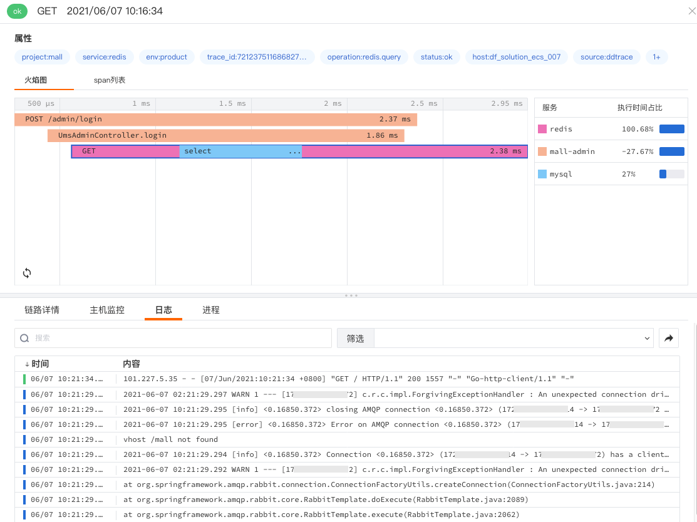

# 应用性能监测关联日志
---

## 简介

“观测云”支持用户访问监测关联日志，通过在日志中注入`span_id`、`trace_id`、`env`、`service`、`version`来关联应用性能监测，关联后，在应用性能监测中可查看请求所在关联的特定日志。

## 配置关联日志

在配置关联日志之前，需要先 [安装DataKit](https://www.yuque.com/dataflux/datakit/datakit-install) 。安装完DataKit以后，开启DDtrace，配置链路的`env`、`service`、`version`等参数用来关联日志，同时在应用代码中注入日志参数`span_id`、`trace_id`、`env`、`service`、`version`和应用性能参数关联。更多内容配置可查看文档 [DDtrace](https://www.yuque.com/dataflux/datakit/ddtrace) 。

---

观测云是一款面向开发、运维、测试及业务团队的实时数据监测平台，能够统一满足云、云原生、应用及业务上的监测需求，快速实现系统可观测。**立即前往观测云，开启一站式可观测之旅：**[www.guance.com](https://www.guance.com)

