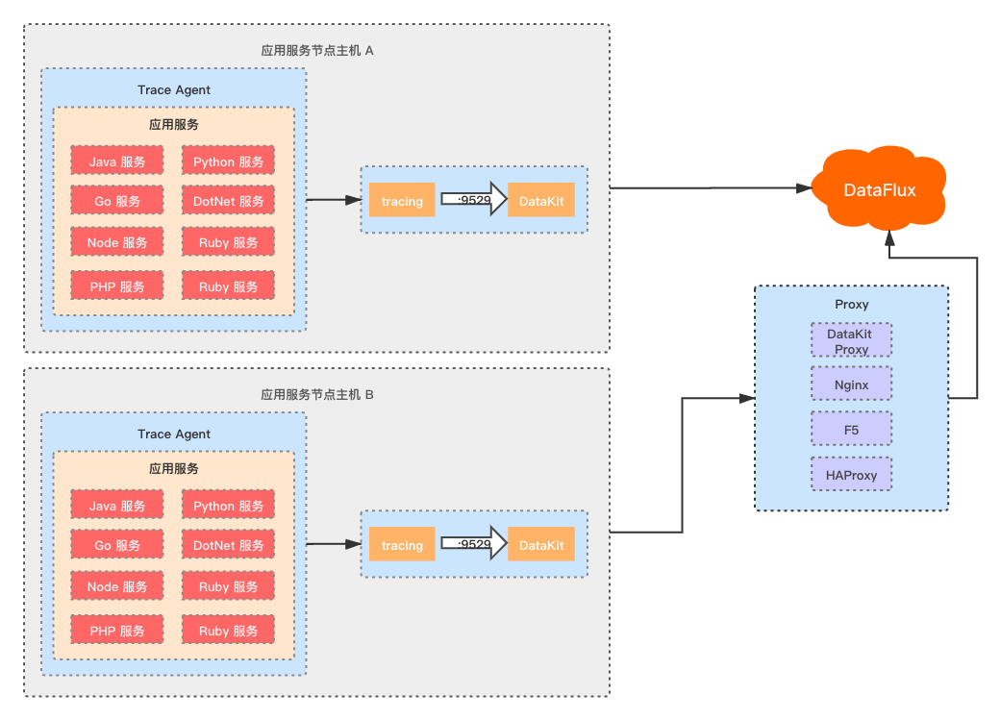

# 数据采集
---

## 简介

观测云的链路数据采集目前支持使用  Opentracing 协议的采集器。在 DataKit 中开启链路数据接收服务后，通过完成采集器在代码中的埋点，DataKit 将自动完成数据的格式转换和采集，最终上报到观测云中心。

**部署架构如下：**

最佳部署方案是将 DataKit 部署在每一台应用服务器中，通过服务所在主机的 DataKit 后将数据打到观测云中心，能更好的对应用服务的服务器主机指标、应用日志、syslog、应用服务链路数据等数据汇聚，进行各项数据的关联分析。
## 数据采集

完成链路数据采集，你需要登录观测云控制台，进入「集成」页面，输入搜索“应用性能监测”，即可查看所有链路数据采集的相关采集器，打开采集器的配置说明文档，按照文档中的步骤进行配置即可。

## 字段说明

DataKit 会根据采集器的不同将上报的数据转换为 “观测云” 链路数据的格式保留标签和指标。具体字段可参考下面的说明。

| 字段名 | 说明 |
| --- | --- |
| host | 主机名 |
| source | 链路的来源，如果是通过 Zipkin 采集的则该值为 `zipkin`，如果是 Jaeger 采集的该值为 `jaeger`，依次类推 |
| service | 服务的名称，建议用户通过该标签指定产生该链路数据的业务系统的名称 |
| parent_id | 当前 `span` 的上一个 `span`的 ID |
| operation | 当前 `span` 操作名，也可理解为 span 名称 |
| span_id | 当前 `span` 的唯一 ID |
| trace_id | 表示当前链路的唯一 ID |
| span_type | span 的类型，目前支持 2 个值：`entry` 和 `local`，`entry` span 表示该 span 的调用的是服务的入口，即该服务的对其他服务提供调用请求的端点，大部分 span 应该都是 entry span。只有 span 是 `entry` 类型的调用才是一个独立的请求。 `local` span 表示该 span 和远程调用没有任何关系，只是程序内部的函数调用，例如一个普通的 Java 方法，默认值 `entry` |
| endpoint | 请求的目标地址，客户端用于访问目标服务的网络地址(但不一定是 IP + 端口)，例如 `127.0.0.1:8080` ,默认：`null` |
| message | JSONString，链路转换之前的采集的原始数据 |
| duration | int，当前链路 span的持续时间，**微秒为单位** |
| status | 链路状态，info：提示，warning：警告，error：错误，critical：严重，ok：成功 |
| env | 链路的所属环境，比如可用dev表示开发环境，prod表示生产环境，用户可自定义 |
