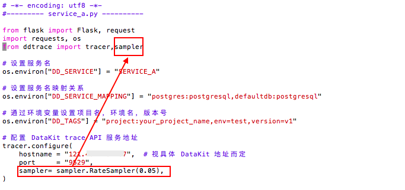
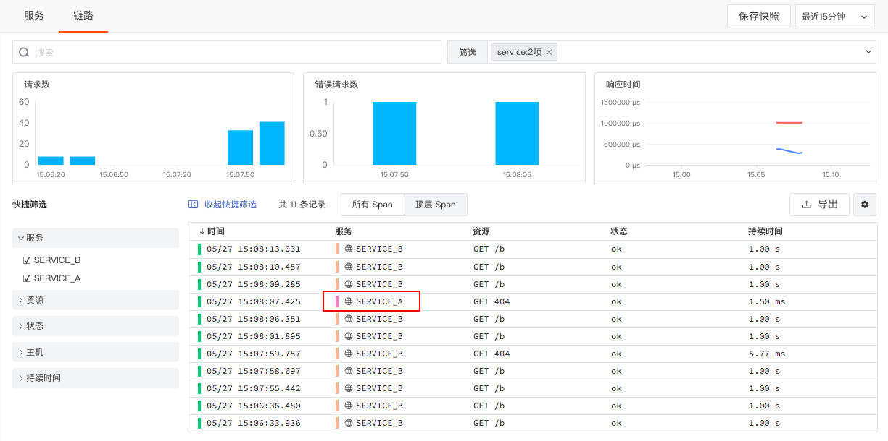

# 如何配置应用性能监测采样
---

## 简介

“观测云” 的「应用性能监测」功能支持对ddtrace等符合 Opentracing 协议的采集器所采集的链路数据进行分析和管理。默认情况下，按照全量的方式采集应用性能数据，即每次调用都会产生数据，若不加以限制，采集到的数据量大，会占用过多的数据存储。你可以通过设置采样的方式采集应用性能数据，节约数据存储量，降低成本费用。

下面将以[ddtrace采集器](https://www.yuque.com/dataflux/datakit/ddtrace)为例，介绍如何收集5％的应用性能数据。
## 采样设置

在开始采集应用性能数据之前，需要先根据不同的语言配置ddtrace。下面以Python中常用的 Webserver Flask 应用为例，介绍如何采样应用性能数据。示例中会创建 `SERVICE_A` 和 `SERVICE_B` 提供HTTP 服务。

1.安装ddtrace运行环境

```
pip install ddtrace
```

2.安装flask包，创建 `SERVICE_A` 和 `SERVICE_B`

可参考文档 [Python Flask完整示例](https://www.yuque.com/dataflux/datakit/ddtrace-python) 。

3.配置采样

**注意：为了区分和查看效果，为**`**SERVICE_A**`** 配置采样5%， **`**SERVICE_B**`** 按照默认采集。**



除了以上的方式以外，还可以直接通过修改 `ddtrace.conf` 的采样率，更多配置内容可参考 [ddtrace采集器](https://www.yuque.com/dataflux/datakit/ddtrace#c59ce95c)。

4.启动并调用`SERVICE_A` 和 `SERVICE_B` ，在“观测云”工作空间查看效果

可以看到`SERVICE_A` 的数据明显少于 `SERVICE_B` ，这是因为设置采样后，初始化会随机生成一个0-100之间的随机数，当这个随机数小于你设置的采集率时，那么会上报当前应用性能的相关数据，否则就不会上报。




---

观测云是一款面向开发、运维、测试及业务团队的实时数据监测平台，能够统一满足云、云原生、应用及业务上的监测需求，快速实现系统可观测。**立即前往观测云，开启一站式可观测之旅：**[www.guance.com](https://www.guance.com)

