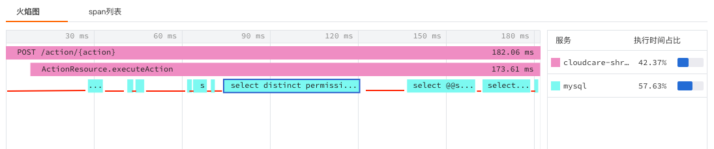
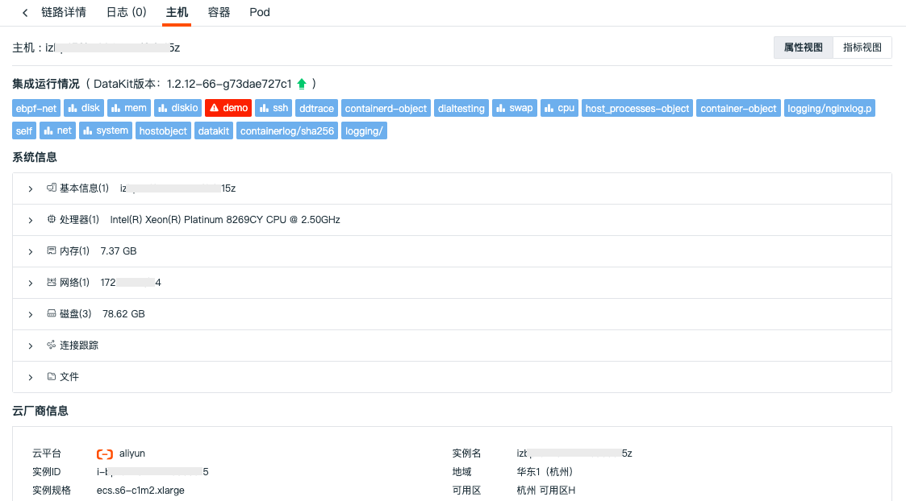
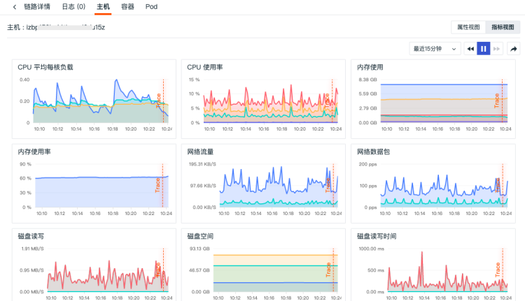
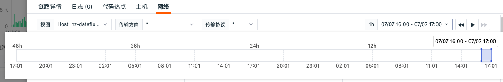

# 链路查看器
---

## 简介

在观测云控制台，您可以在「应用性能监测」的「链路」，查看全部链路数据。您可以搜索、筛选、导出链路数据，查看链路详情并通过火焰图、span列表等对链路性能进行全量分析，无论是同步还是异步的调用，都能够清晰追踪每一个链路性能的数据细节。

## 链路查询和分析

### 链路统计

在链路查看器，支持查看所选时间范围内链路不同状态的“请求数”、“错误请求数”、“响应时间”。

- 请求数/错误请求数：根据所选时间范围划分为 60 个时间点，用柱状图统计展示链路的“请求数”以及“错误请求数”。

- 响应时间：根据所选时间范围划分为 60 个时间点，用折线图统计展示四个响应指标，分别为“每秒平均响应时间”、“P75响应时间”、“P90响应时间”以及“P99响应时间”

### 链路列表

观测云提供三种链路查看列表，分别为“所有 Span”、“所有顶层 Span”和“所有 Trace”。span 表示给定时间段内分布式系统中的逻辑工作单元，多个 span 会构成一条链路轨迹（trace）。

- 所有 Span：显示当前所选时间范围内，所有采集到 Span 数据
- 服务顶层 Span：筛选显示当前所选时间范围内，首次进入的所有 Span 数据
- 所有 Trace：筛选显示当前所选时间范围内，所有包含初始顶层 Span 的 Trace 数据

### 时间控件

观测云查看器默认展示最近 15 分钟的数据，通过右上角的「时间控件」，您可以选择数据展示的时间范围。更多详情可参考文档 [时间控件说明](../getting-started/necessary-for-beginners/explorer-search.md#time) 。

### 搜索与筛选

在查看器搜索栏，支持关键字搜索、通配符搜索、关联搜索、JSON 搜索等多种搜索方式，支持通过 `标签/属性` 进行值的筛选，包括正向筛选、反向筛选、模糊匹配、反向模糊匹配、存在和不存在等多种筛选方式。

注意：当您切换查看「服务」或「链路」查看器时，观测云默认为您保留当前的筛选条件（包括：环境、版本）和时间范围。

更多搜索与筛选可参考文档 [查看器的搜索和筛选](../getting-started/necessary-for-beginners/explorer-search.md) 。

### 快捷筛选

在查看器快捷筛选，支持编辑“快捷筛选”，添加新的筛选字段。添加完成后，可以选择其字段值进行快捷筛选。

**注意：**

- 快捷筛选的「持续时间」默认进度条最小值、最大值为链路数据列表里最小和最大的持续时间
- 支持拖动进度条调整最大/最小值，输入框中的值同步变化
- 支持手动输入最大/最小值，"按回车键"或"点击输入框外"进行过滤搜索
- 输入不规范时输入框变红，不进行搜索，正确格式：纯“数字”或“数字+ns/μs/ms/s/min”
- 若没有输入单位进行搜索，默认直接在输入的数字后面填入"s"然后进行过滤搜索
- 若手动输入单位，则直接进行搜索

更多快捷筛选可参考文档 [快捷筛选](../getting-started/necessary-for-beginners/explorer-search.md#quick-filter) 。

### 自定义显示列

在链路查看器，默认查看“时间”、“链路ID”、“服务”、“资源”以及“持续时间”，可通过「显示列」自定义添加、编辑、删除、拖动显示列。当鼠标悬停查看器显示列上时，点击「设置」按钮，支持对显示列进行升序、降序、向左移动列、向右移动列、向左添加列、向右添加列、替换列、添加到快捷筛选、添加到分组、移除列等操作。更多自定义显示列可参考文档 [显示列说明](../getting-started/necessary-for-beginners/explorer-search.md#columns) 。

### 链路数据导出

在链路查看器，您可以先筛选出想要的链路数据导出后进行查看和分析，支持导出到 CSV 文件或者场景仪表板和笔记。

## 链路详情

在链路查看器，您可以通过点击任意链路查看对应的链路详情，包括当前链路发生的时间、持续时间、http 方法、http url 、http 状态码、TraceId、火焰图、Span列表、服务调用关系以及关联的日志、主机、指标、网络等等。

### 火焰图

火焰图可清晰展示整条链路中每个 span 的流转和执行时间。你可以在火焰图右侧查看对应的服务列表及响应时间。点击火焰图的 span ，在「链路详情」可查看对应的Json内容，支持鼠标滚轴缩放查看具体 span 信息。

=== "火焰图链路说明"

    
    
    从上图的火焰图可以看出，此次调用链路包含了两个服务，分别为cloudcare和mysql，链路从发起cloudcare服务的POST请求开始，然后执行`ActionResource.executeAction`，最后执行mysql语句，在执行`ActionResource.executeAction`的整个过程中，多次执行mysql语句。cloudcare和mysql的执行时间计算方式分别为：
    
    - cloudcare服务的执行时间 = D1+D2+D3+D4+D5+D6+D7+D8+D9+D10+D11
    - mysql服务的执行时间 = span2+span3+......+span11
    
    
    
    具体执行的语句和执行时间详情可以参考span列表。

=== "执行时间占比计算说明"

    火焰图中的服务执行时间占比是指这一次调用链路各个服务占总时间的比率。以下图为例，此次调用链路包含了两个服务，分别为cloudcare和mysql，执行时间占比分别为42.37%和57.63%。cloudcare服务有2个span，mysql服务有10个span。
    
    - mysql服务执行时间占比计算方式：所有span执行时间相加／当前调用链路总时长。
    
    计算方式说明：下图中mysql服务总共有10个span数量，可以点击每一个span来获取当前span的执行时间，从图中可以看出，该span的执行时间为5.08ms，然后以同样的方式，获取剩余9个span的执行时间并相加。
    
    
    
    - cloudcare服务执行时间占比计算方式：(当前调用链路总时长-mysql服务执行时间)/当前调用链路总时长
    
    计算方式说明：下图中cloudcare服务贯穿在当前整个调用链路中，除了mysql服务的执行时间，剩余的时间即为cloudcare服务的执行时间（见标红线部分的执行时间）。执行时间占比也可以直接通过span列表来查看每条span的执行时间和执行时间占比。
    
    

=== "异步调用"

    在火焰图中，无论服务是同步还是异步的调用，都能够清晰追踪每一个链路性能的数据细节。如通过火焰图可以清晰查看哪几条请求是异步进行的，从什么时候开始、什么时候结束以及总共花了多少时间。
    
    

### span列表

展示该条链路中所有的 span 列表及其总的 span 数量，包括“资源名”、“ span 数量” 、“持续时间”、“执行时间”以及“执行时间占比”。支持搜索 span，点击任一 span，在「链路详情」可查看对应的 JSON 内容，切换到火焰图同步展示 span。若有错误，在 span 前显示错误提示。

### 服务调用关系

服务调用关系用来查看各个服务之间的调用关系，支持通过搜索筛选查看相关服务调用关系。

### 快捷操作说明 {#icon}

- 全屏查看/恢复默认大小：您可以点击链路详情右上角全屏查看图标，横向展开查看链路火焰图；点击恢复默认大小图标，即可恢复详情页；
- 展开/收起小地图：您可以点击链路详情左侧展开/收起小地图图标，通过在小地图上选择区间、拖拽、滚动来快捷查看火焰图；
- 查看全局 Trace ：您可以点击链路详情左侧查看全局 Trace 图标，在火焰图查看全局链路；
- 双击 Span ：在火焰图中间放大展示该 Span，您可以快速定位查看其上下文关联 Span ；
- 点击服务名称：高亮展示对应 Span，再次点击服务名称，恢复默认全选 Span ，您可以通过点击服务名称，快速筛选查看服务对应的 Span。

### 扩展属性

在链路详情页，你可以在「扩展属性」查看当前链路的相关字段属性，点击字段可通过“筛选字段值”、“反向筛选字段值”、“添加到显示列”和“复制”进行快速筛选查看。

- “筛选字段值”，即添加该字段至查看器，查看与该字段相关的全部数据
- “反向筛选字段值”，即添加该字段至查看器，查看除了该字段以外的其他数据
- “添加到显示列”，即添加该字段到查看器列表进行查看
- “复制”，即复制该字段至剪贴板 

现在需要筛选的字段，点击“筛选字段值”，即可在链路查看器筛选查看该字段相关的链路列表。

### 关联分析

=== "关联用户访问体验"

    在链路详情页，您可以通过页面上方的「相关view」查看关联（相同trace_id）的真实用户访问体验数据。此功能不仅能够帮助您查看主动式监测的应用性能数据，还能够帮助您快速透视真实用户的访问情况。
    
    注意：查看相关 view 需和用户访问监测具有相同的 `trace_id` 才能查看。
    
    

=== "关联日志"

    在链路详情页，您可以点击火焰图下方的「日志」，基于当前链路关联的主机、链路ID（trace_id）查看关联日志。同时，您可以对日志进行关键字搜索和多标签筛选。若您需要查看更详细的日志内容，您可以点击日志内容跳转到日志详情页面，或点击跳转按钮到日志页打开。
    
    

=== "代码热点"

    当应用程序使用 ddtrace 采集器同时开启了 APM 链路追踪和 Profile 性能追踪数据采集后，观测云提供 Span 级别的关联查看分析。在链路详情页，您可以点击火焰图下方的「代码热点」，查看当前链路关联的代码热点，包括执行耗时、方法以及执行时间占比。
    
    
    
    点击「查看 Profile 详情」，支持跳转到 Profile 详情页查看更多的关联代码，帮助您快速发现和定位问题。
    
    

=== "关联主机"

    在链路详情页，您可以点击火焰图下方的「主机」，查看相关主机（关联字段：host）的指标视图和属性视图。
    
    注意：在链路详情中查看相关主机，需要匹配字段“host”，否则无法在进程详情查看到相关主机的页面。
    
    - 属性视图：帮助您回溯链路产生时主机对象的真实情况，支持查看相关主机**在对应时间内产生的最新的一条对象数据**，包括主机的基本信息、集成运行情况。若开启云主机的采集，还可查看云厂商的信息。
    
    注意：观测云默认保存主机对象最近 48 小时的历史数据。未找到当前链路时间对应的主机历史数据时，你将无法查看关联主机的属性视图。
    
    
    
    - 指标视图：可查看相关主机**在该链路结束前30分钟到链路结束后30分钟内**的性能指标状态，包括相关主机的CPU、内存等性能指标视图。
    
    

=== "关联指标"

    若链路关联字段“service”、“project”，您可以在链路详情查看该字段对应的视图。

=== "关联容器"

    在链路详情页，您可以点击火焰图下方的「容器」，查看相关容器（关联字段：container_name）的属性视图和指标视图。
    
    注意：在链路详情中查看相关容器，需要匹配字段“container_name”，否则无法在链路详情查看到相关容器的页面。
    
    - 属性视图：帮助您回溯链路产生时容器对象的真实情况，支持查看相关容器**在对应时间内产生的最新的一条对象数据**，包括容器的基本信息、属性信息。
    
    - 指标视图：支持查看相关容器**在该链路结束前30分钟到链路结束后30分钟**的性能指标状态，包括容器CPU、内存等性能指标视图。

=== "关联 Pod"

    在链路详情页，您可以点击火焰图下方的「Pod」，查看相关 Pod（关联字段：pod_name）的属性视图和指标视图。
    
    注意：在链路详情中查看相关容器，需要匹配字段“pod_name”，否则无法在链路详情查看到相关 Pod 的页面。
    
    - 属性视图：帮助您回溯链路产生时容器 pod 对象的真实情况，支持查看相关容器 pod **在对应时间内产生的最新的一条对象数据**，包括容器的基本信息、属性信息。
    - 指标视图：支持查看相关容器 pod **在该链路结束前30分钟到链路结束后30分钟**的性能指标状态，包括容器CPU、内存等性能指标视图。

=== "关联网络"

    在链路详情页，您可以点击火焰图下方的「网络」，查看相关视图（包括主机、Pod 和 Deployment）的数据连接情况。
    
    
    
    **匹配字段**
    
    在详情页中查看相关网络，需要匹配对应的关联字段，即在数据采集的时候需要配置对应的字段标签，否则无法在详情页中查看到相关的网络页面。
    
    - 主机：匹配字段“host”，鼠标选中“主机”，支持点击「复制」按钮复制关联字段及其值
    - Pod：匹配字段”pod_name“，鼠标选中“Pod”，支持点击「复制」按钮复制关联字段及其值
    - Deployment：匹配字段”deployment_name“，鼠标选中“Deployment”，支持点击「复制」按钮复制关联字段及其值
    
    注意：
    
    - 若同时配置了主机、Pod、Deployment 的关联字段，进入详情页时优先显示 Pod 网络的数据，其次是 Deplyment 网络的数据；
    - 若未配置 Pod、Deployment 的关联字段，则不显示该网络数据。
    
    **网络 48 小时回放**
    
    在链路网络，支持点击时间控件选择查看 48 小时网络数据回放。
    
    - 时间范围：默认查看该链路前后 30 分钟的数据，若是当前发生的链路，默认查看最近 1 小时的数据；
    - 支持任意拖动时间范围查看对应的网络流量；
    - 拖动后，查询的是历史网络数据；
    - 拖动后，点击「播放」按钮或刷新页面，回到查看「最近 1 小时」的网络数据。
    
    
