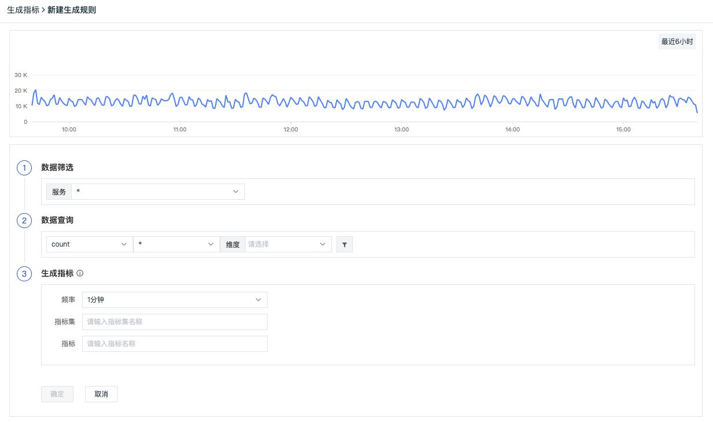
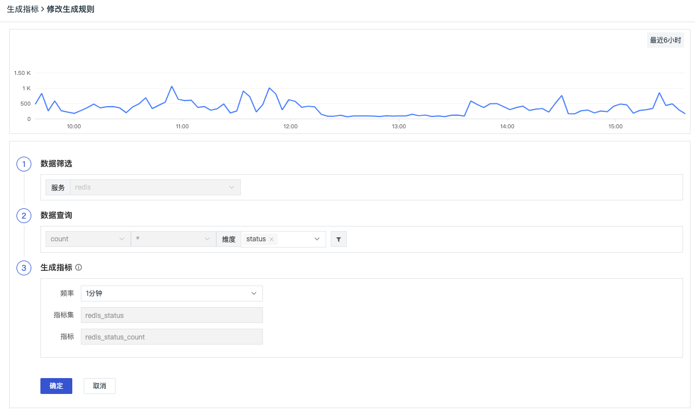
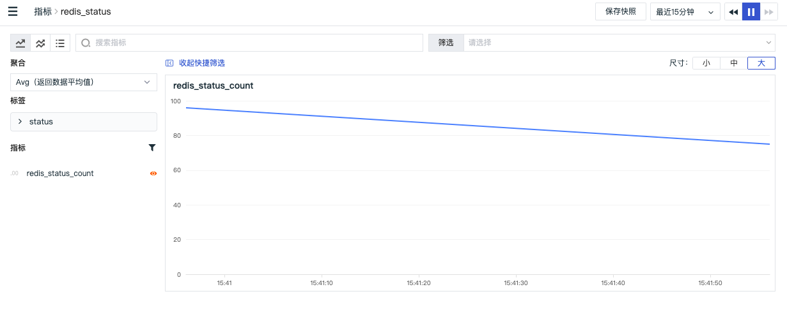

# 生成指标
---

观测云支持基于当前空间内的现有数据生成新的指标数据，以便于您依据需求设计并实现新的技术指标。

### 新建规则

进入「应用性能监测」-「生成指标」页面，点击「新建规则」即可开始创建新的生成指标规则。

**Step 1**: 数据筛选。筛选出当前空间已有的全部/单个服务数据来源，并基于此数据源开始生成新的数据。

- 来源：数据来源，即已开启采集的服务数据来源 。**注意：“ * ”表示为全部数据来源**

**Step 2:** 数据查询。基于选定的数据源，您可以对现有数据添加筛选和聚合表达式，请求产生新的指标结果和数据集合。

- 聚合方法：包含Avg（取平均值）、Min（取最小值）、Max（取最大值）、Count（取数据点数）、p75、p95、p99

| 聚合方法 | 说明 |
| --- | --- |
| count | 统计个数 |
| avg | 统计平均值，需选择聚合的字段 |
| max | 统计最大值，需选择聚合的字段 |
| min | 统计最小值，需选择聚合的字段 |
| P75 | 统计指定字段75%的值，需选择聚合的字段 |
| P95 | 统计指定字段95%的值，需选择聚合的字段 |
| P99 | 统计指定字段99%的值，需选择聚合的字段 |

- 样本指标：设置的数据生成的样本指标，即通过对样本指标的查询和聚合产生新的指标结果
- 维度：按照所选对象进行数据聚合，即对数据请求中的每一个所选对象都生成一个统计值
- 筛选：支持对现有标签数据添加一个/多个筛选过滤条件，并对同一行筛选条件添加“并且“ (and)、“或者”(or)关系

**Step 3:** 生成指标。对生成指标的方式和结果进行设置，包括生成指标的周期、新生成指标的标签名称和指标集名称。

- 频率：生成指标的执行周期，默认1分钟，即每1分钟生成一次新的指标数据；频率所选时间也作为聚合时间，择频率1分钟，那么就是每隔1分钟聚合生成一次指标，每次聚合的时间范围也是1分钟。
- 时间范围：基于所选频率作为时间间隔，图表默认查询为6小时，即6小时内某数据统计展示的效果；当修改【频率】>=1小时，查询时间范围固定为7天。
- 指标集：设置指标存放的指标集的名称
- 指标：设置指标的名称，其中指标名称不允许重复，可添加多个指标

**Step 4:** 完成生成规则的填写后，点击「确定」即可完成生成指标规则并开启数据采集。
所有已添加的规则都将展示在「生成指标」的界面中，用户可进行「编辑」「删除」「启用/禁用」和「查看指标」

### 编辑规则

在「生成指标」页面，您可以查看全部已创建的全部生成指标规则，并对生成指标规则进行「编辑」「删除」「启用/禁用」和「查看指标」

**注意：由于生成指标规则的数据来源、聚合表达式等决定了数据类型，所以部分规则不支持编辑和修改。**

### 启用/禁用规则

在「生成指标」页面，可以对规则状态进行修改。指标生成规则被禁用后，对应的数据将不会写入指标集，待启用后恢复写入。

### 删除规则

在「生成指标」页面，不需要的规则可以删除，规则被“删除”后，指标集不会被删除，但停止数据写入。

### 查看指标

在「生成指标」页面，点击规则右侧的「查看指标」，将为您跳转至「指标」页面，打开对应的指标集。也可以在「指标」或者「指标管理」直接搜索生成的指标集。

注意：生成指标是根据您选择的频率，查询时间范围内的数据聚合生成指标，若期间没数据上报，无法生成指标，无法在「指标」或者「指标管理」中查询或者搜索。

