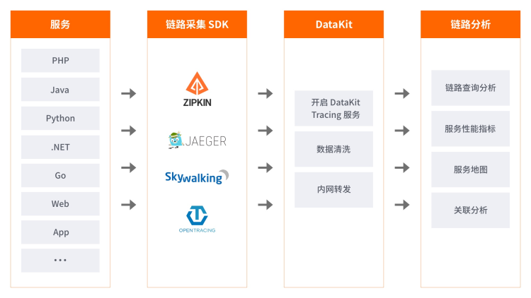

# 应用性能监测
---

## 简介

“观测云” 支持使用 Opentracing 协议的采集器，从而实现对分布式架构的应用进行端到端的链路分析，满足微服务架构的应用监控的需求。

## 架构图

首先在 DataKit 中开启链路数据接收服务，然后通过在业务系统中集成 Zipkin 或 Jaeger 或 Skywalking等开源链路数据采集的 SDK，将数据上报的 DataKit 的链路追踪服务的 Endpoint，DataKit 会将数据自动清洗为 “观测云” 本身的链路数据格式，最终上报到  “观测云” 中心，在 “观测云” 的控制台进行链路分析和查看服务相关性能指标。

## 主要功能

- 链路查询和分析：支持对链路进行全文检测和多标签筛选、通过火焰图和执行时间对链路性能进行全量分析
- 链路性能指标分析：自动统计服务的关键性能指标
- 拓扑图：自动发现服务直接的调用关系
- 关联分析：基于标签关联查询相关的指标、事件、日志、进程数据，快速定位异常原因

---

观测云是一款面向开发、运维、测试及业务团队的实时数据监测平台，能够统一满足云、云原生、应用及业务上的监测需求，快速实现系统可观测。**立即前往观测云，开启一站式可观测之旅：**[www.guance.com](https://www.guance.com)

