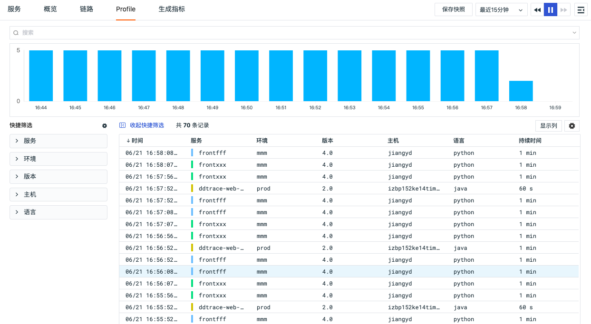
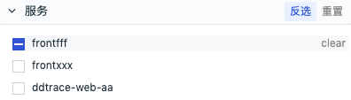
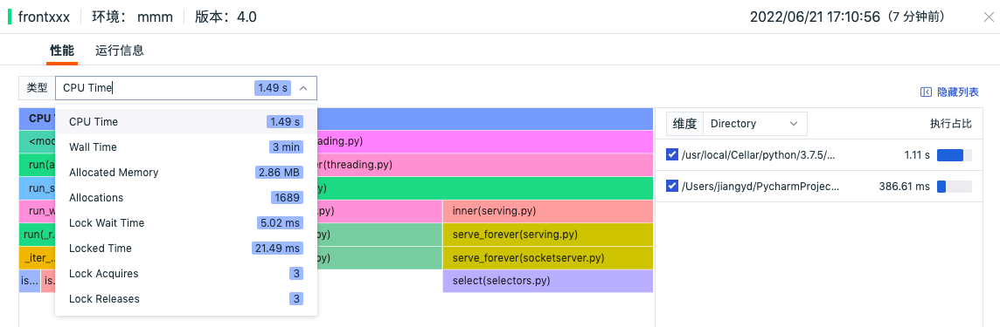
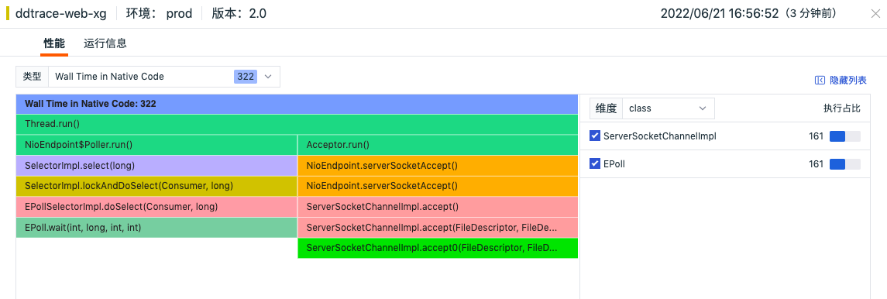
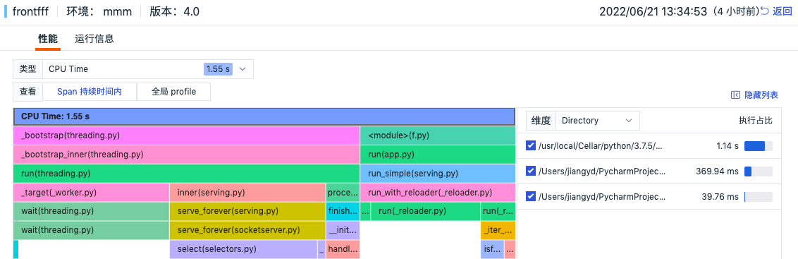
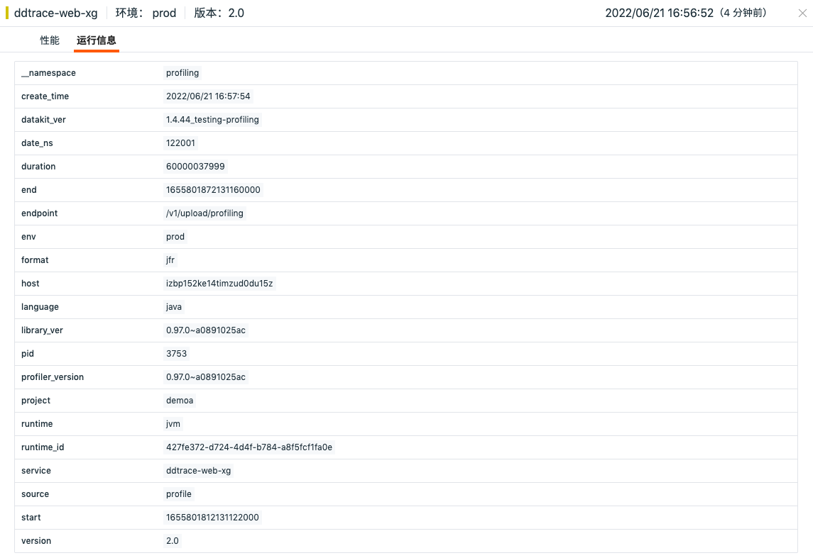
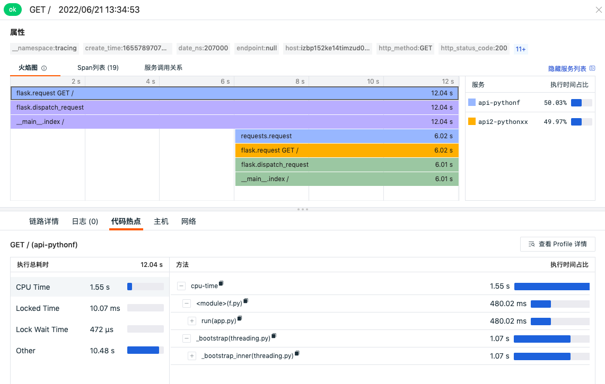

# Profile
---

## 简介

Profile 支持采集使用 Java / Python 等不同语言环境下应用程序运行过程中的动态性能数据，帮助用户查看 CPU、内存、IO 的性能问题。

## 查看器数据分析

采集 profile 数据需要先 [安装 DataKit](../datakit/datakit-install.md) ，并配置 [ddtrace 采集器](../integrations/ddtrace.md)，配置完成后，DataKit 会将采集到的 profile 数据上传到您的观测云工作空间，您可以通过 Profile 实时数据查看器了解您的程序代码性能。

注意：Profile 数据默认保存 7 天。

### 搜索和筛选

点击「应用性能监测」-「Profile」可查看对应的链路列表，观测云支持通过选择时间范围、搜索关键字，筛选等方式查询和分析 profile 。

- 时间范围：通过右上角的时间筛选组件，您可以筛选链路数据展示的时间范围
- 搜索：通过列表上方的搜索栏，您可以基于字段、文本进行关键词搜索、字段筛选、关联搜索
   - 支持基于关键字模糊匹配相关字段
   - 支持多个关键字搜索，使用空格或者逗号隔开即可，如 " abc AND cba / abc OR cba" 形式，回车后支持关联搜索，输入的关键词越多，数据匹配的范围将越精准
   - 支持基于标签精确搜索，如“abc：123”形式，
   - 在搜索中选择wildcard查询支持基于变量进行模糊查询

### 快捷筛选

您可以在 Profile 左侧快捷筛选菜单，勾选快捷筛选的字段快速筛选数据，支持自定义添加筛选字段，支持通过“反选”进行快捷筛选，支持通过“重置”快速清除快捷筛选条件。

- 自定义添加筛选字段

- 反选/重置

### 自定义显示列

列表中展示的“发生时间”、“服务名”、“环境”、“版本”、“主机”、“语言”以及“持续时间”，可通过「显示列」自定义添加、编辑、删除显示列，支持通过关键字搜索显示列，支持自定义显示列作为预设字段，后续通过 Pipeline 切割字段并上报数据后可直接显示上报的数据。

### 数据导出

在「Profile」中，您可以先筛选出想要的数据导出后进行查看和分析，支持导出到 CSV 文件、仪表板和笔记。

## Profile 性能分析

点击 Profile 列表可查看对应的性能详情，包含属性标签、性能火焰图以及运行信息。

### 性能类型

- Python

| 分类              | 说明                                                         |
| ----------------- | ------------------------------------------------------------ |
| CPU Time          | 每个方法在 CPU 上的运行时间。                                |
| Wall Time         | 每个方法的花费耗时，其中包含在 CPU 上运行的时间，等待 I/O 的时间以及函数运行时发生的其他任何事情所花费的时间。 |
| Heap Live Size    | 仍在使用中的堆内存数量。                                     |
| Allocated Memory  | 每个方法分配的堆内存数量，包括后来被释放的分配。             |
| Allocations       | 每个方法进行的堆分配数量，包括后来被释放的分配。             |
| Thrown Exceptions | 每个方法抛出的异常数。                                       |
| Lock Wait Time    | 每个函数等待锁的时间。                                       |
| Locked Time       | 每个函数保持锁的时间。                                       |
| Lock Acquires     | 每个方法获得锁的次数。                                       |
| Lock Releases     | 每个方法释放锁的次数。                                       |

- Java

| 分类                     | 说明                                                         |
| ------------------------ | ------------------------------------------------------------ |
| CPU Time                 | 每个方法在 CPU 上的运行时间，其中包含服务的 Java 字节码和运行时操作耗时，不包含通过 JVM 调用本地代码耗时。 |
| Wall Time in Native Code | 本地代码的采样次数。当代码在 CPU 上运行、等待 I/O 以及方法运行时发生的任何其他情况，都可能发生采样。其中不包含运行应用代码时涉及到的 Java 字节码调用。 |
| Allocations              | 每个方法进行的堆分配数量，包括后来被释放的分配。             |
| Allocated Memory         | 每个方法分配的堆内存数量，包括后来被释放的分配。             |
| Heap Live Objects        | 每个方法被分配到的存活对象数量。                             |
| Thrown Exceptions        | 每个方法抛出的异常数量。                                     |
| Lock Wait Time           | 每个方法等待锁的时间。                                       |
| Lock Acquires            | 每个方法获得锁的次数。                                       |
| File I/O Time            | 每个方法花在文件读取和写入的时间。                           |
| File I/O Written         | 每个方法写入到文件的数据量统计。                             |
| File I/O Read            | 每个方法从文件中读取的数据量统计。                           |
| Socket I/O Read Time     | 每个方法花在从 socket 中读取的时间。                         |
| Socket I/O Write Time    | 每个方法花在写入 socket 的时间。                             |
| Socket I/O Read          | 每个方法从 socket 读取的数据量统计。                         |
| Socket I/O Written       | 每个方法写到 socket 的数据量统计。                           |
| Synchronization          | 每个方法花在同步上的时间。                                   |

#### 火焰图和维度数据分析

Profile 利用火焰图分析不同类型下代码方法级别的 CPU、内存或 IO 的使用情况，您可以非常直观的了解方法的执行性能和调用情况。同时 Profile 提供基于方法、库、线程等维度情况下的执行数据分析查看，更直观的显示执行占比较大的一些方法，更快的定位性能问题。

### 运行信息

在 Profile 详情页，点击查看「运行信息」，可以查看对应编程语言运行时的一些信息以及标签属性。支持将标签信息添加到查看器列表做筛选使用，支持复制标签内容进行查询搜索。

## 链路关联 Profile

当应用程序使用 ddtrace 采集器同时开启了 APM 链路追踪和 Profile 性能追踪数据采集后，观测云提供 Span 级别的关联查看分析。在应用性能监测的链路详情页，选中火焰图的 Span ，获取对应时间段的代码热点信息，直接查看该段时间内的代码方法调用列表和 Wall Time 的执行耗时和占比信息。方法列表支持递归查看方法调用的先后顺序以及执行时间情况。

点击「查看 Profile 详情」可跳转到对应 Profile 详情页查看具体的性能数据。

