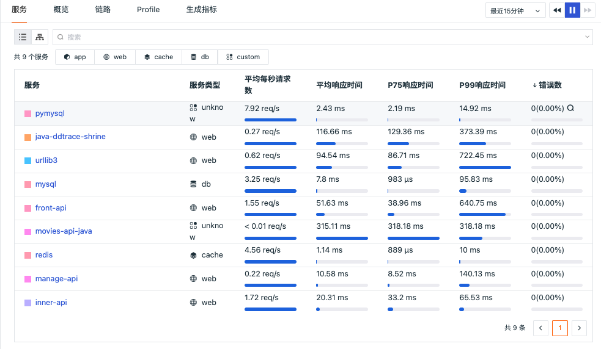
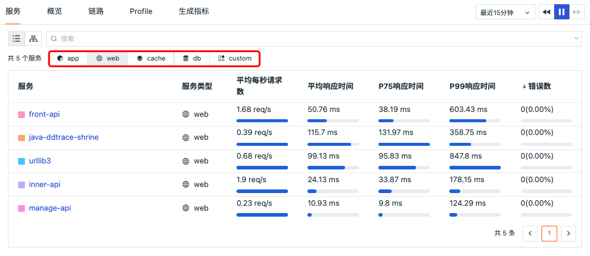
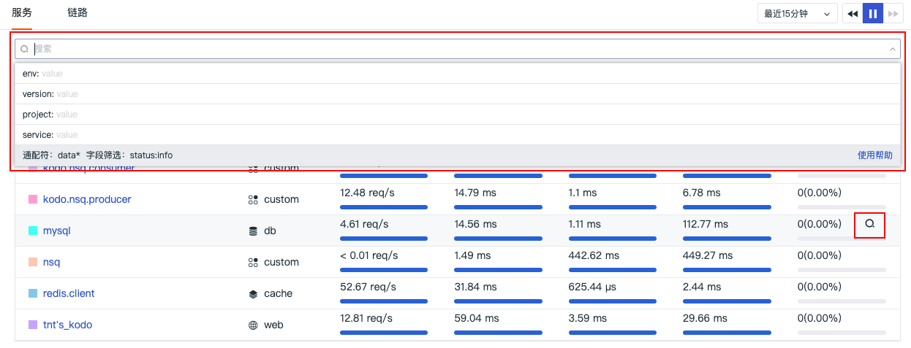
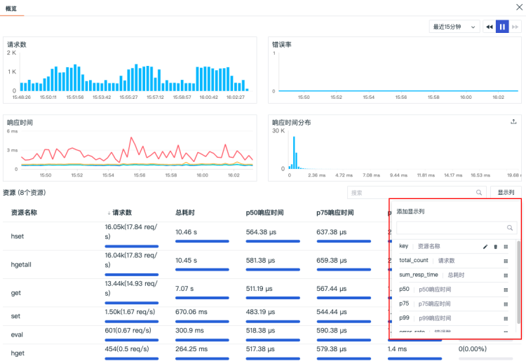
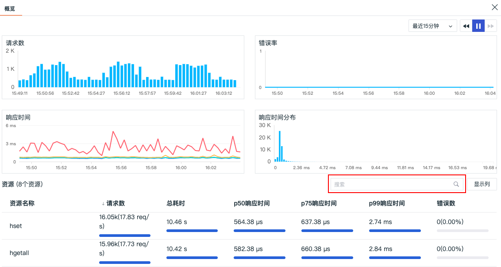
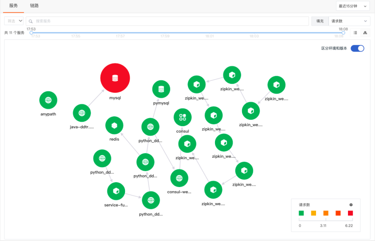
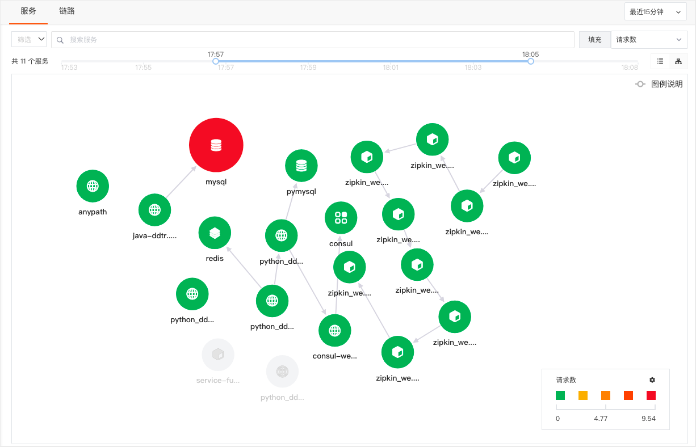
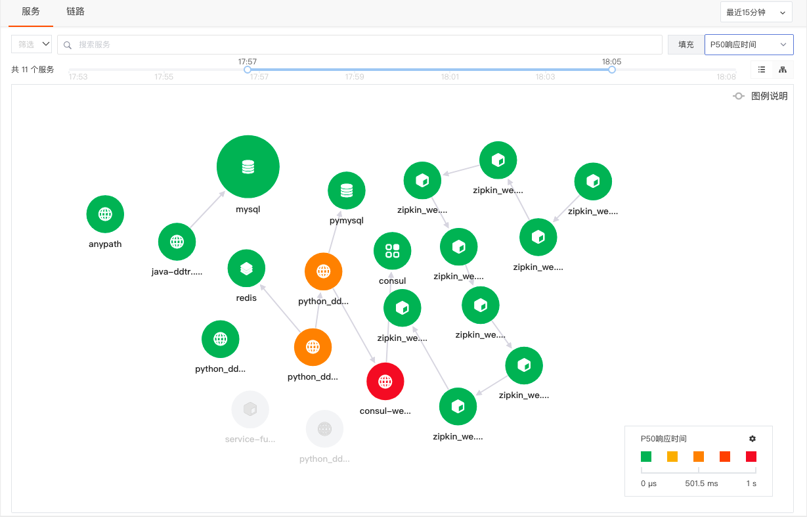

# 服务
---

## 简介

链路数据采集到观测云后，您可以通过观测云控制台查看已经采集的所有链路服务及其关键性能指标。

## 服务列表和关键性能指标

登录观测云控制台后，点击 「应用性能监测」的「服务」列表，即可查看时间范围内的所有服务列表及其对应的关键性能指标。链路追踪服务列表的对应的关键性能指标包括“平均每秒请求数”、“平均响应时间”、“P75响应时间”、“P95响应时间”和“错误数”，默认按照“错误数”倒序排序，支持点击关键性能指标名称调整排序显示。

## 分类筛选

在服务列表中，“观测云”支持您通过点击服务类型图标进行分类筛选，再次点击即可恢复全部查看。

### 数据查询

在服务列表中，观测云支持您通过搜索关键字，筛选等方式查询服务数据。

- 您可以快速基于文本数据的分词搜索匹配相关服务数据
- 您可以快速通过基于「env」、「version」、「project」和「service」等的一个或多个标签对链路服务进行字段筛选
- 使用“鼠标悬停”至「错误数」，点击 “搜索” 图标即可跳转至「链路」页，查看该服务在当前选定的时间范围内，相同筛选条件下 ，数据状态 "status" 为“error” 的链路数据。

**注意：当您切换查看「服务」或「链路」查看器时，“观测云”默认为您保留当前的筛选条件和时间范围。**

### 服务详情

在服务列表，点击单个「服务」即可侧滑出该服务请求的调用详情，您不仅可以通过实时图表查看该服务的请求数、错误数、响应时间等，还可以搜索查看该服务所包含的资源性能指标，点击服务的资源名称可直接跳转到「链路」查看对应的资源的链路情况。

- 通过在资源列表中添加/删除性能指标显示列，您可以自定义资源列表的显示。

- 通过「搜索」，您可以完成该服务下基于文本数据的分词搜索。

注意：搜索输入的文本内容需要区分大小写。

## 链路服务关系图

在「应用性能监测」的「服务」列表中，支持切换列表至「拓扑图」模式查看各个服务之间的调用关系。支持基于服务（service）和服务环境版本（service+env+version）两种维度绘制链路拓扑图，开启“区分环境和版本”后，将按照不同的环境版本绘制服务拓扑图。比如说金丝雀发布，通过开启环境和版本，即可查看不同环境版本下的服务调用情况。

在服务拓扑图，将鼠标悬浮在服务节点处时，您可以查看该服务的“请求数”、“P50响应时间”、“P75响应时间”、“P99响应时间”和“错误数”。支持通过不同的性能指标进行筛选显示，并可自定义链路服务性能指标颜色区间。

### 时间轴

支持按照时间轴选取时间范围，在时间范围内对应的节点小图标颜色对应显示。

### 高亮显示

选择服务后对应服务高亮显示，其他服务及连接线变灰，同时可查看服务的请求数、错误率等信息。

### 节点尺寸

节点大小共有3种尺寸，对服务每秒请求数的“最大值”和“最小值”进行三等分，得出的三个区间对应 3 种图形尺寸。

- Min=最小值
- Max=最大值

**注意：若每秒请求数<0.01，则直接显示为<0.01，但实际⚪的尺寸大小要以真实数据为准，这里只作显示（举例：查询出来的最大值为0.009，最小值为0.0003，都小于0.01，则显示为Min<0.01，Max<0.01，但真实的尺寸大小还是以0.009和0.0003计算）**

### 切换填充项

支持在填充项切换查看“请求数”、“P50响应时间”、“P75响应时间”、“P99响应时间”和“错误数”对应的拓扑图

### 缩略图

支持拓扑图放大缩小，放大状态可在左下角查看小缩略图。

### 服务详情

点击服务「图标」会侧滑显示链路服务概览页面，可查看请求数、错误数、响应时间、响应时间分布等图表分析，还可搜索查看服务所包含的资源性能指标，添加更多的性能指标显示列，点击服务的资源名称可直接跳转到「链路」查看对应的资源的链路情况。

---

观测云是一款面向开发、运维、测试及业务团队的实时数据监测平台，能够统一满足云、云原生、应用及业务上的监测需求，快速实现系统可观测。**立即前往观测云，开启一站式可观测之旅：**[www.guance.com](https://www.guance.com)

