# iOS 可观测最佳实践

---

## 前置条件

### 账号注册

前往官方网站 [https://www.dataflux.cn/](https://www.dataflux.cn/) 注册账号，使用已注册的账号/密码登录。

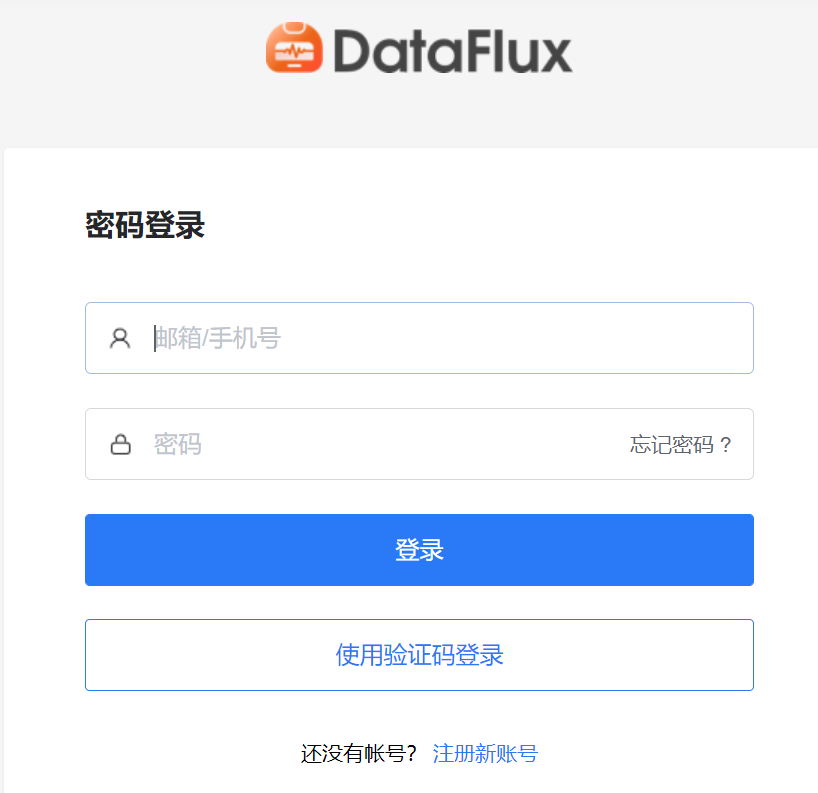

### 安装 Datakit

#### 获取命令

点击 [**集成**] 模块，右上角 [**快速获取 DataKit 安装命令**]，根据您的操作系统和系统类型选择合适的安装命令。

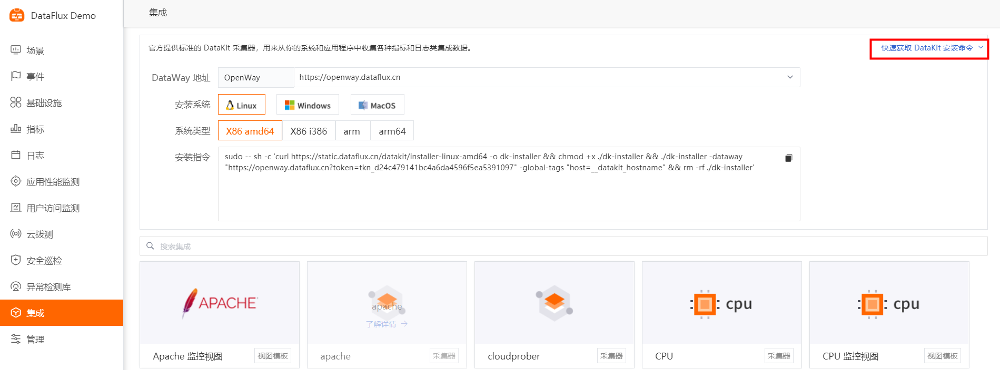

#### 执行安装

复制 Datakit 安装命令在需要被监控的服务器上直接运行。

- 安装目录 /usr/local/datakit/
- 日志目录 /var/log/datakit/
- 主配置文件 /usr/local/datakit/conf.d/datakit.conf
- 插件配置目录 /usr/local/datakit/conf.d/

Datakit 安装完成后，已经默认开启 Linux 主机常用插件，可以在DF——基础设施——内置视图查看。

| 采集器名称 | 说明 |
| --- | --- |
| cpu | 采集主机的 CPU 使用情况 |
| disk | 采集磁盘占用情况 |
| diskio | 采集主机的磁盘 IO 情况 |
| mem | 采集主机的内存使用情况 |
| swap | 采集 Swap 内存使用情况 |
| system | 采集主机操作系统负载 |
| net | 采集主机网络流量情况 |
| host_process | 采集主机上常驻（存活 10min 以上）进程列表 |
| hostobject | 采集主机基础信息（如操作系统信息、硬件信息等） |
| docker | 采集主机上可能的容器对象以及容器日志 |

点击 [**基础设施**] 模块，查看所有已安装 Datakit 的主机列表以及基础信息，如主机名，CPU，内存等。


点击 [**主机名**] 可以查看该主机的详细系统信息，集成运行情况 (该主机所有已安装的插件)，内置视图(主机)。

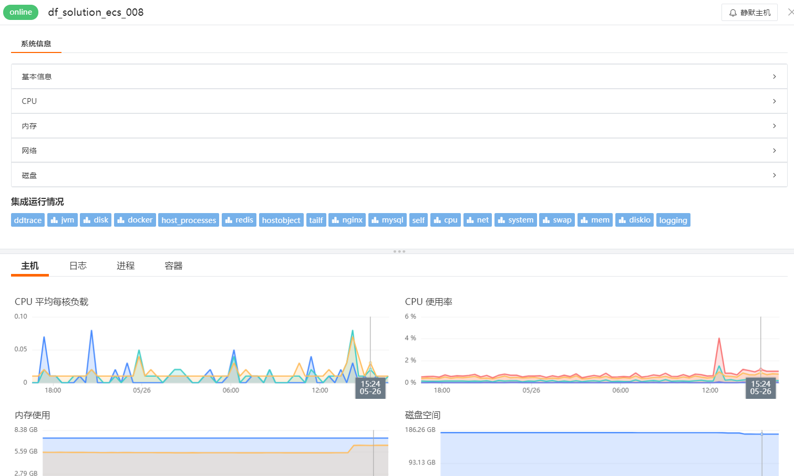

点击 [**集成运行情况**] 任意插件名称 [**查看监控视图**] 可以看到该插件的内置视图。

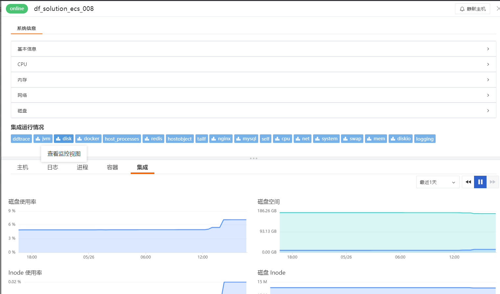

### 创建一个iOS应用

登录 DataFlux 控制台，进入「应用监测」页面，点击右上角「新建应用」，在新窗口输入「应用名称」，点击「创建」，即可开始配置。

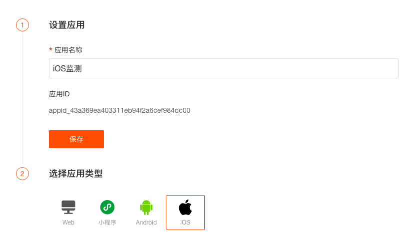

## 应用采集数据属性说明

### 数据类型

DataFlux 的用户访问监测包括六种数据类型。

| **类型** | **描述** |
| --- | --- |
| session | 用户会话信息记录，当前会话中，将会基于会话维度用户页面、资源、操作、错误、长任务相关访问数据。 |
| view | 每次用户访问移动端应用程序的页面时，都会生成一个查看记录。当用户停留在同一页面上时，资源，长任务，错误和操作记录将通过 view_id 属性链接到相关的 RUM 视图。 |
| resource | 用户访问页面时，加载的资源信息记录。 |
| error | 移动应用程序发出的异常或崩溃。 |
| long_task | 对于应用程序中任何阻塞主线程超过指定持续时间阈值的任务，都会生成一个长任务事件。 |
| action | 记录移动应用程序中的用户活动（应用程序启动，点击，滑动，后退等）。每个动作都附加有唯一的 action_id。 |

### 默认属性

默认属性为全局属性，用户访问监测的场景构建和事件告警都可以通过下面的默认属性进行查询。

#### SDK属性

| **字段** | **类型** | **描述** |
| --- | --- | --- |
| sdk_name | string | 采集器名称，固定名称：df_ios_rum_sdk |
| sdk_version | string | 采集器版本信息 |

#### 应用属性

| 字段 | 类型 | 描述 |
| --- | --- | --- |
| app_id | string | 必填，用户访问应用唯一ID标识，在DataFlux控制台上面创建应用监控时自动生成。 |
| env | string | 必填，环境字段。属性值：prod/gray/pre/common/local。其中<br />prod：线上环境<br />gray：灰度环境<br />pre：预发布环境<br />common：日常环境<br />local：本地环境 |
| version | string | 必填，版本号。 |

#### 用户 & 会话属性

| **字段** | **类型** | **描述** |
| --- | --- | --- |
| userid | string | 未登录用户使用 cookie 作为 userid，登录用户使用应用后台生成的用户 id。 |
| session_id | string | 会话 id。 |
| session_type | string | 会话类型。参考值：user &#124; synthetics<br />user 表示是 RUM 功能产生的数据；<br />synthetics 表示是 headless 拨测产生的数据。 |
| is_signin | boolean | 是否是注册用户，属性值：True / False。 |

#### 设备 & 分辨率属性

| **字段** | **类型** | **描述** |
| --- | --- | --- |
| device | string | 移动设备厂商 |
| model | string | 移动设备型号 |
| device_uuid | string | 移动设备唯一id |
| os | string | 操作系统信息 |
| os_version | string | 操作系统版本 |
| os_version_major | string | 操作系统主要版本 |
| screen_size | string | 屏幕分辨率 |

#### 地理 & 网络属性

| **字段** | **类型** | **描述** |
| --- | --- | --- |
| ip | string | 用户访问IP地址 |
| isp | string | 运营商 |
| network_type | string | 网络连接类型，属性值参考：<br />wifi &#124; 2g &#124; 3g &#124; 4g &#124; 5g &#124; unknown（未知网络）&#124; unreachable（网络不可用） |
| country | string | 国家 |
| country_iso_code | string | 国家 iso_code |
| province | string | 省 |
| city | string | 城市 |

#### View 属性

| **字段** | **类型** | **描述** |
| --- | --- | --- |
| view_id | string | 每次访问页面时产生的唯一ID |
| is_active | boolean | 判断用户是否还在活跃状态，参考值: true &#124; false |
| view_referrer | string | 页面来源，页面的父级 |
| view_name | string | 页面名称 |

#### Action 属性

| **字段** | **类型** | **描述** |
| --- | --- | --- |
| action_id | string | 用户页面操作时产生的唯一ID |
| action_name | string | 操作名称 |

### 用户属性

除了默认属性以外，还可以通过用户属性构建场景和配置事件告警。用户属性是非全局属性，通过用户属性，可以跟踪用户访问应用的整个过程，定位和发现用户受影响的访问情况，监控用户访问性能。

### 其他数据类型属性

#### Session 

##### 统计指标

| **字段** | **类型** | **描述** |
| --- | --- | --- |
| time_spent | number(ns) | 当前会话持续时长 |
| session_view_count | number | 当前会话关联 view_id 个数 |
| session_error_count | number | 当前会话产生错误个数 |
| session_resource_count | number | 当前会话加载资源个数 |
| session_action_count | number | 当前会话用户操作次数 |
| session_long_task_count | number | 当前会话产生长任务次数 |

##### 属性

| 字段 | 类型 | 描述 |
| --- | --- | --- |
| session_id | string | 会话id（后台停留30s以上，会生成一个新的 session_id） |
| session_type | string | 会话类型。参考值：user &#124; test<br />user 表示是 RUM 功能产生的数据；<br />test 表示是 headless 拨测产生的数据。 |
| session_referrer | string | 会话来源。一般是记录来源的页面地址。 |
| session_first_view_id | string | 当前会话的第一个页面的 view_id |
| session_first_view_name | string | 当前会话的第一个页面的 URL |
| session_last_view_id | string | 当前会话的最后一个访问页面的 view_id |
| session_last_view_name | string | 当前会话的最后一个页面的 URL |


#### View 

##### 指标

| 字段 | 类型 | 描述 |
| --- | --- | --- |
| loading_time | number（ns） | 页面加载时间 |
| time_spent | number（ns） | 页面停留时间 |

##### 统计指标

| **字段** | **类型** | **描述** |
| --- | --- | --- |
| view_error_count | number | 每次页面加载时发生的错误次数 |
| view_resource_count | number | 每次页面加载时请求的资源个数 |
| view_long_task_count | number | 每次页面加载时产生的长任务个数 |
| view_action_count | number | 页面查看过程中操作的次数 |


#### Resource

##### 指标

| **字段** | **类型** | **描述** |
| --- | --- | --- |
| resource_size | number | 资源大小，默认单位：byte |
| resource_dns | number（ns） | 资源加载 DNS 解析时间<br />计算方式：domainLookupEnd - domainLookupStart |
| resource_tcp | number（ns） | 资源加载 TCP 连接时间<br />计算方式：connectEnd - connectStart |
| resource_ssl | number（ns） | 资源加载 SS L连接时间<br />计算方式：connectEnd - secureConnectStart |
| resource_ttfb | number（ns） | 资源加载请求响应时间<br />计算方式：responseStart - requestStart |
| resource_trans | number（ns） | 资源加载内容传输时间<br />计算方式：responseEnd - responseStart |
| resource_first_byte | number（ns） | 资源加载首包时间<br />计算方式：responseStart - domainLookupStart |
| duration | number（ns） | 资源加载时间<br />计算方式：duration(responseEnd-startTime) |

##### 属性

| **字段** | **类型** | **描述** |
| --- | --- | --- |
| resource_url | string | 资源 URL |
| resource_url_host | string | 资源 URL 域名部分 |
| resource_url_path | string | 资源 URL path部分 |
| resource_url_query | string | 资源 URL query部分 |
| resource_url_path_group | string | 资源 URL path分组 |
| resource_type | string | 资源的类别 |
| resource_method | string | 资源请求方式 |
| resource_status | string | 资源请求返回的状态值 |
| resource_status_group | string | 资源请求返回的状态分组值 |


#### Error

##### 属性

| **字段** | **类型** | **描述** |
| --- | --- | --- |
| error_message | string | 错误信息 |
| error_stack | string | 错误堆栈 |
| error_source | string | 错误来源，参考值：logger &#124; network |
| error_type | string | 错误类型<br />logger error type: java_crash &#124; native_crash &#124; abort &#124; ios_crash<br />network error type： |
| error_situation | string | 错误发生的时机，参考值：startup (启动时)和 run (运行时) |

**type=network时，新增以下Network Error属性。**

| **字段** | **类型** | **描述** |
| --- | --- | --- |
| resource_status | string | 资源请求返回的状态值 |
| resource_url | string | 资源 URL |
| resource_url_host | string | 资源 URL 域名部分 |
| resource_url_path | string | 资源 URL path 部分 |
| resource_url_path_group | string | 资源 URL path 分组 |
| resource_method | string | 资源请求方式 |


#### Long Task

##### 指标

| **字段** | **类型** | **描述** |
| --- | --- | --- |
| duration | number（ns） | 卡顿时长 |
| long_task_message | string | 卡顿信息 |
| long_task_stack | string | 卡顿堆栈 |


#### Action

##### 指标

| **字段** | **类型** | **描述** |
| --- | --- | --- |
| duration | number（ns） | 页面操作花费时间 |

##### 统计指标

| **字段** | **类型** | **描述** |
| --- | --- | --- |
| action_long_task_count | number | 操作关联长任务次数 |
| action_resource_count | number | 操作关联资源请求次数 |
| action_error_count | number | 操作关联的错误次数 |

## 应用集成

### 集成方式

#### 方式一：CocoaPods 集成（推荐）

> 版本说明 

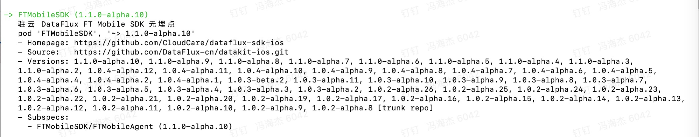

1. 配置 `Podfile` 文件。

```objectivec
target 'yourProjectName' do

# Pods for your project
 pod 'FTMobileSDK', '~> 1.1.0-alpha.10'
    
end

```

在 `Podfile` 目录下执行 `pod install` 安装 SDK


#### 方式二：手动集成（直接下载 SDK）

1. 从 [GitHub](https://github.com/DataFlux-cn/datakit-ios) 获取 SDK 的源代码。
2. 将 **FTMobileSDK** 整个文件夹导入项目。

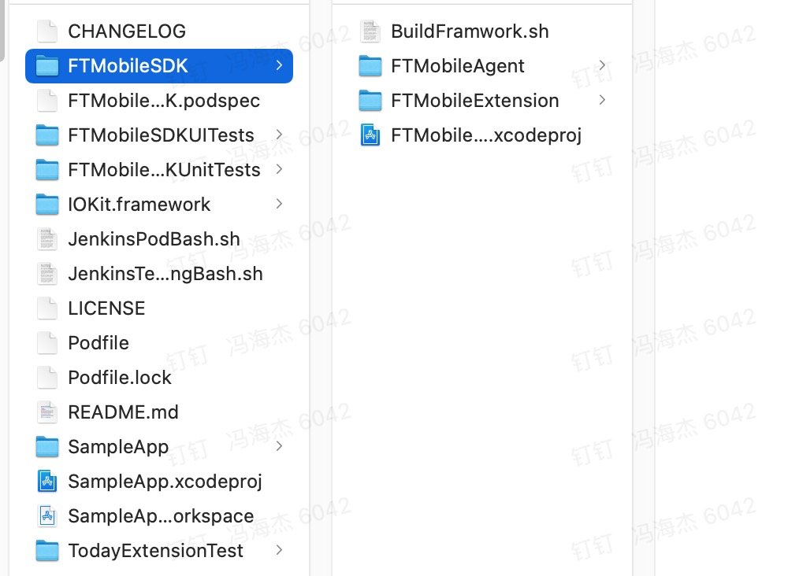

勾选 `Copy items id needed` 

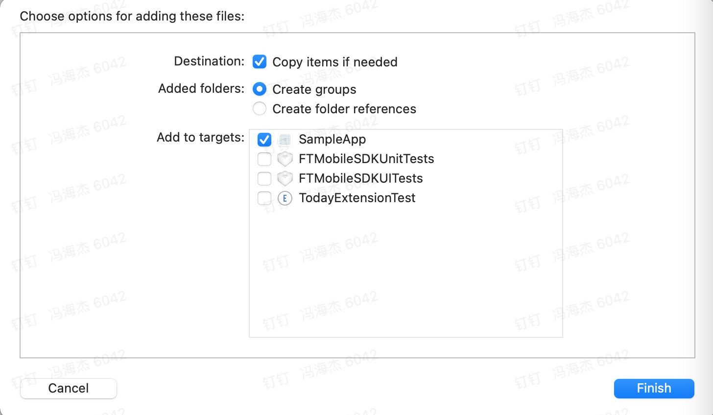

3. 添加依赖库：项目设置 `Build Phase` -> `Link Binary With Libraries` 添加：`UIKit` 、 `Foundation` 、`libz.tb`。

### 初始化并调用SDK

### 添加头文件

请将 `#import "FTMobileAgent.h"` 添加到 `AppDelegate.m` 引用头文件的位置。

### 添加初始化代码

示例：

```objectivec
 #import <FTMobileAgent/FTMobileAgent.h>
-(BOOL)application:(UIApplication *)application didFinishLaunchingWithOptions:(NSDictionary *)launchOptions{
     // SDK FTMobileConfig 设置
    FTMobileConfig *config = [[FTMobileConfig alloc]initWithMetricsUrl:@"Your App metricsUrl"];
    config.monitorInfoType = FTMonitorInfoTypeAll;
     //启动 SDK
    [FTMobileAgent startWithConfigOptions:config];
    return YES;
}
```

#### metricsUrl 数据上报地址：

出于安全考虑，DataKit 的 HTTP 服务默认绑定在 localhost:9529 上，如果希望从外部访问，需编辑 ` /usr/local/datakit/conf.d/datakit.conf ` 中的 `http_listen` 字段，将其改成 `0.0.0.0:9529` 或其它网卡、端口。<br />举例：比如我公网 ip 是1.1.1.1 我先到配置中改0.0.0.0，app 中 metricsUrl 地址为 [http://1.1.1.1:9529](http://1.1.1.1:9529)

### FTMobileConfig 

#### 可配置参数

| **字段** | **类型** | **说明** | **必须** |
| --- | --- | --- | --- |
| metricsUrl | NSString | 数据上报地址 | 是 |
| appid | NSString | DataFlux rum 应用唯一ID标识，在 DataFlux 控制台上面创建监控时自动生成。 | 否（开启RUM 必选） |
| samplerate | int | RUM 采样采集率 | 否（默认100） |
| enableSDKDebugLog | BOOL | 设置是否允许打印日志 | 否（默认NO） |
| monitorInfoType | NS_OPTIONS | 采集数据 | 否 |
| env | NS_ENUM | 环境 | 否  （默认FTEnvProd） |
| enableTrackAppCrash | BOOL | 设置是否需要采集崩溃日志 | 否（默认NO） |
| enableTrackAppANR | BOOL | 采集 ANR 卡顿无响应事件 | 否（默认NO） |
| enableTrackAppFreeze | BOOL | 采集 UI 卡顿事件 | 否（默认NO） |
| serviceName | NSString | 设置日志所属业务或服务的名称 | 否（默认dataflux sdk） |
| traceConsoleLog | BOOL | 设置是否需要采集控制台日志 | 否（默认NO） |
| enableTraceUserAction | BOOL | 设置是否追踪用户操作 | 否（默认NO） |
| networkTrace | BOOL | 设置网络请求信息采集 | 否（默认NO） |
| networkTraceType | NS_ENUM | 设置网络请求信息采集时 使用链路追踪类型 | 否（默认Zipkin） |

#### 配置 app_id 开启 RUM

1. 设置 appid

- appid : **dataflux rum** 应用唯一 ID 标识。
- appid 获取：[获取 appid 方法](#fd7e6e12)。

> **注意**： 设置 `appid` 后，RUM 才能开启。

2.  RUM 设置采集率  

```objectivec
/**
 * 采样配置，属性值：0或者100，100则表示百分百采集，不做数据样本压缩。默认：100
 */
 @property (nonatomic, assign) int samplerate;
```

> **注意**： 开启 `RUM` 后，日志中将不采集 Crash 信息，Crash 信息会采集到 `RUM`中。

3.  RUM 设置是否追踪用户操作 

```objectivec
/**
 * 设置是否追踪用户操作，目前支持应用启动和点击操作
 */
@property (nonatomic, assign) BOOL enableTraceUserAction;
```

#### 设置日志相关

- source 日志来源

```objectivec
/**
 * 日志的来源 默认为：ft_mobile_sdk_ios
 */
 @property (nonatomic, copy) NSString *source;
```

- serviceName  日志所属业务或服务的名称

```objectivec
/**
 * 设置日志所属业务或服务的名称
 */
 @property (nonatomic, copy) NSString *serviceName;
```

-  traceConsoleLog 采集控制台日志<br />一般情况下， 因为 NSLog 的输出会消耗系统资源，而且输出的数据也可能会暴露出 App 里的保密数据， 所以在发布正式版时会把这些输出全部屏蔽掉。此时开启采集控制台日志，也并不能抓取到工程里打印的日志。建议使用 [日志写入接口](#CfkBy) 来上传想查看的日志。 

```objectivec
/**
 *设置是否需要采集控制台日志 默认为NO
 */
 @property (nonatomic, assign) BOOL traceConsoleLog;
```

#### 设置网络链路追踪

- networkTrace 设置网络追踪，开启网络请求信息采集

```objectivec
/**
 * 设置网络请求信息采集 默认为NO
 */
 @property (nonatomic, assign) BOOL networkTrace;
```

- networkTraceType 设置网络请求信息采集时 使用链路追踪类型

```objectivec
/**
 *  设置网络请求信息采集时 使用链路追踪类型 type 默认为 Zipkin 
 *  FTNetworkTrackTypeZipkin 、FTNetworkTrackTypeJaeger 
 */
 @property (nonatomic, assign) FTNetworkTrackType networkTraceType;
  
/**
 *  开启网络请求信息采集 并设置链路追踪类型 type 默认为 Zipkin
 *  @param  type   链路追踪类型 默认为 Zipkin
 */
-(void)networkTraceWithTraceType:(FTNetworkTrackType)type;
```

#### 开启崩溃 Crash 采集

enableTrackAppCrash 采集崩溃日志 （[崩溃分析](#C1xVm)）

```objectivec
/**
 *设置是否需要采集崩溃日志 默认为NO
 */
 @property (nonatomic, assign) BOOL enableTrackAppCrash;
```

> **注意**： 开启 **RUM** 后，日志中将不采集 Crash 信息，Crash 信息会采集到 **RUM** 中。


#### SDK 内部 DebugLog 打印

在 **debug** 环境下，设置 `FTMobileConfig` 的 `enableSDKDebugLog` 属性。

```objectivec
config.enableSDKDebugLog = YES; //打印日志
```

#### 设置 X-Datakit-UUID

`X-Datakit-UUID` 是 SDK 初始化生成的 UUID, 应用清理缓存后(包括应用删除)，会重新生成。<br />`FTMobileConfig` 配置中，开发者可以强制更改。更改方法：

```objectivec
[config setXDataKitUUID:@"YOUR UUID"];
```

#### 设置 env 环境

```objectivec
typedef NS_ENUM(NSInteger, FTEnv) {
    FTEnvProd         = 0, //线上环境
    FTEnvGray,             //灰度环境
    FTEnvPre,              //预发布环境
    FTEnvCommon,           //日常环境
    FTEnvLocal,            //本地环境
};

@property (nonatomic, assign) FTEnv env;
```

#### 采集数据配置

配置 `FTMobileConfig` 的 `FTMonitorInfoType` 属性。可采集的类型如下：

```objectivec
/**
 *
 * @constant
 *  FTMonitorInfoTypeBattery  - 电池电量
 *  FTMonitorInfoTypeMemory   - 内存总量、内存使用率
 *  FTMonitorInfoTypeCpu      - CPU使用率
 */
typedef NS_OPTIONS(NSUInteger, FTMonitorInfoType) {
    FTMonitorInfoTypeAll          = 0xFFFFFFFF,
    FTMonitorInfoTypeBattery      = 1 << 1,
    FTMonitorInfoTypeMemory       = 1 << 2,
    FTMonitorInfoTypeCpu          = 1 << 3,
};
```

#### 设置 UI 卡顿、ANR 事件采集

- enableTrackAppUIBlock 采集UI卡顿事件

```objectivec
/**
 * 默认为NO
 * 设置是否需要采集卡顿
 */
 @property (nonatomic, assign) BOOL enableTrackAppFreeze;
```

- enableTrackAppANR  采集ANR卡顿无响应事件

```objectivec
/**
 * 默认为NO
 * 设置是否需要采集卡顿无响应事件
 */
 @property (nonatomic, assign) BOOL enableTrackAppANR;
```

采集的数据会上传到 **RUM** 与日志中。

### 主动上报日志方法

**上传机制** : 将数据存储到数据库中，等待时机进行上传。数据库存储量限制在 5000 条，如果网络异常等原因导致数据堆积，存储 5000 条后，会丢弃新传入的数据。

- 上传日志方法

```objectivec
typedef NS_ENUM(NSInteger, FTStatus) {
    FTStatusInfo         = 0,
    FTStatusWarning,
    FTStatusError,
    FTStatusCritical,
    FTStatusOk,
};
/**
 * 日志上报
 * @param content  日志内容，可为json字符串
 * @param status   事件等级和状态，info：提示，warning：警告，error：错误，critical：严重，ok：恢复，默认：info

 */
-(void)logging:(NSString *)content status:(FTStatus)status;
```

- 方法使用示例

```objectivec
[[FTMobileAgent sharedInstance] logging:@"TestLoggingBackground" status:FTStatusInfo];
```

### 用户的绑定与注销

#### 用户绑定

```objectivec
/**
 * 绑定用户信息
 * @param Id       用户Id
 */
- (void)bindUserWithUserID:(NSString *)Id;
```

#### 用户注销

```objectivec
/**
 * 注销当前用户
 */
- (void)logout;
```

#### 方法使用示例

```objectivec
//登录后 绑定用户信息
[[FTMobileAgent sharedInstance] bindUserWithUserID:userId];
```

```objectivec
//登出后 注销当前用户
[[FTMobileAgent sharedInstance] logout];
```

### 常见问题

#### 关于崩溃日志分析

在开发时的 **Debug** 和 **Release** 模式下， **Crash** 时捕获的线程回溯是被符号化的。<br />而发布包没带符号表，异常线程的关键回溯，会显示镜像的名字，不会转化为有效的代码符号，获取到的 **crash log** 中的相关信息都是 16 进制的内存地址，并不能定位崩溃的代码，所以需要将 16 进制的内存地址解析为对应的类及方法。

##### 利用命令行工具解析 **Crash**

需要的文件：

1. 需要从 **DataFlux** 下载 **SDK** 采集上传的崩溃日志。下载后将后缀改为 **.crash**。
2. 需要 **App** 打包时产生的 **dSYM** 文件，必须使用当前应用打包的电脑所生成的 **dSYM** 文件，其他电脑生成的文件可能会导致分析不准确的问题，因此每次发包后建议根据应用的 **版本号** 或 **dSYM** 文件的 **UUID** 来对应保存 **dSYM** 文件。以备解析时，根据后台日志 tag 中的 `application_UUID` 对应的 **UUID** 来找到对应 **dSYM** 文件。
3. 需要使用 **symbolicatecrash**，**Xcode** 自带的崩溃分析工具，使用这个工具可以更精确的定位崩溃所在的位置，将0x开头的地址替换为响应的代码和具体行数。

> 查找 **symbolicatecrash** 方法<br />终端输入<br />`find /Applications/Xcode.app -name symbolicatecrash -type f`


> /Applications/Xcode.app/Contents/SharedFrameworks/DVTFoundation.framework/Versions/A/Resources/symbolicatecrash

进行解析：

1.  将 **symbolicatecrash** 与 **.crash** 和 **.app.dSYM** 放在同一文件夹中 
2.  开启命令行工具，进入文件夹 
3.  使用命令解析 **Crash** 文件，*号指的是具体的文件名  

```
./symbolicatecrash ./*.crash ./*.app.dSYM > symbol.crash
```

4.  解析完成后会生成一个新的 **.Crash** 文件，这个文件中就是崩溃详细信息。 

#### CocoaPods安装

##### 1:pod install 出错，如下图

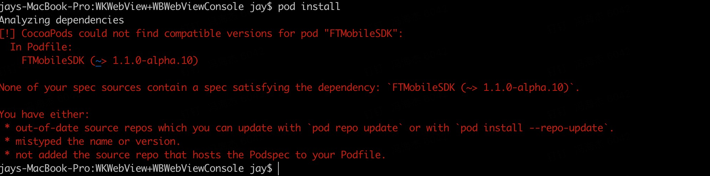

解决方案：请使用` pod update` 命令

##### 2:pod update 出错，如下图

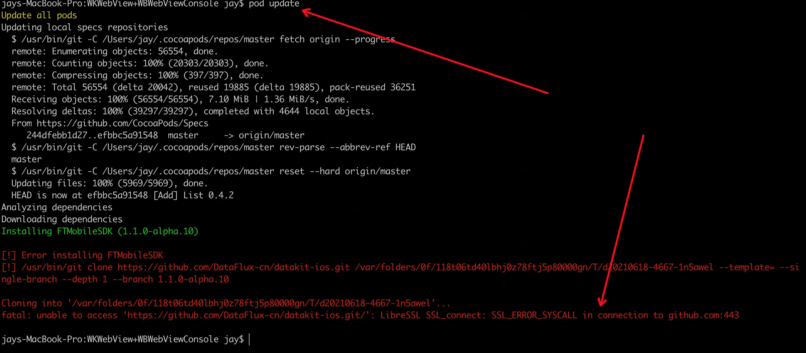

解决方案： github 链接问题，加个 vpn，或者使用` pod update` 命令 再次尝试

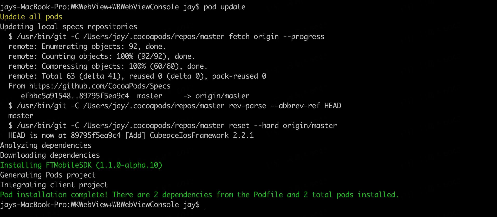


