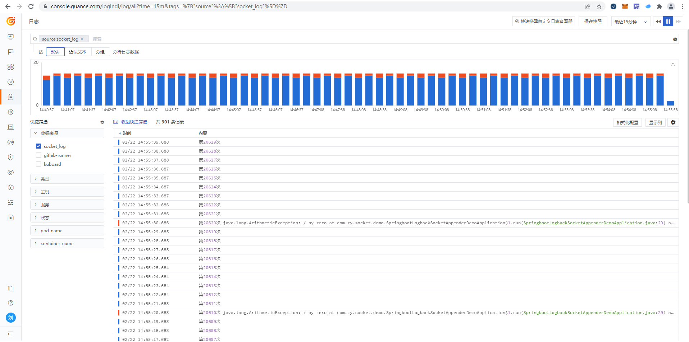
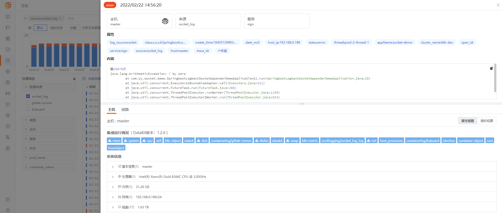

# K8s日志采集之logback socket最佳实践

---

## 应用场景介绍

Logback日志输出除了常用的file和stdout外，还可以进行socket（TCP）输出，基于socket日志上报最大的优势在于降低了存储费用，程序生成的日志在本地进行一部分内存缓冲继而上报到采集端。同样datakit也支持socket日志采集。本文主要介绍基于K8s下springboot应用将日志通过logback socket方式推送至观测云平台进行观测。

## 前置条件

1. 您需要先创建一个[观测云账号](https://www.guance.com/)。
1. springboot应用。
1. docker-harbor。
1. k8s集群。

## 安装部署

### K8s下Datakit 安装配置

Kubernetes 下 Datakit 安装参照文档 [Kubernetes 应用的 RUM-APM-LOG 联动分析](../k8s-rum-apm-log)。

#### 配置日志采集文件logging-socket-demo.conf 

接收日志，需要开启 log socket，开启一个9541端口，并配置pipeline解析。

```toml
       [[inputs.logging]]
         ## required
         #  logfiles = [
         #    "/var/log/syslog",
         #    "/var/log/message",
         #  ]
           # only two protocols are supported:TCP and UDP
           sockets = [
                  "tcp://0.0.0.0:9541",
           #      "udp://0.0.0.0:9531",
           ]
           ## glob filteer
           ignore = [""]
 
           ## your logging source, if it's empty, use 'default'
           source = "socket_log"
 
           ## add service tag, if it's empty, use $source.
           service = "socket_service"
 
           ## grok pipeline script name
           pipeline = "logback_socket_pipeline.p"
 
           ## optional status:
           ##   "emerg","alert","critical","error","warning","info","debug","OK"
           ignore_status = []
 
           ## optional encodings:
           ##    "utf-8", "utf-16le", "utf-16le", "gbk", "gb18030" or ""
           character_encoding = ""

           ## The pattern should be a regexp. Note the use of '''this regexp'''
           ## regexp link: [https://golang.org/pkg/regexp/syntax/#hdr-Syntax](https://golang.org/pkg/regexp/syntax/#hdr-Syntax)
           # multiline_match = '''^\S'''
 
           ## removes ANSI escape codes from text strings
           remove_ansi_escape_codes = false
 
           [inputs.logging.tags]
             service = "socket-demo"
```

#### pipeline解析日志

 logback_socket_pipeline.p 用于解析socket日志格式，便于您在观测云平台查看使用。全文如下：

```bash
        #------------------------------------   警告   -------------------------------------**
        # 不要修改本文件，如果要更新，请拷贝至其它文件，最好以某种前缀区分，避免重启后被覆盖**
        #-----------------------------------------------------------------------------------        **
        # access log**
        json(_,msg,"message")**
        json(_,class,"class")**
        json(_,appName,"service")**
        json(_,thread,"thread")**
        json(_,severity,"status")**
        json(_,trace,"trace_id")**
        json(_,span,"span_id")**
        json(_,`@timestamp`,"time")**
        default_time(time)**
```

#### datakit.yaml 全文
配置如下，需要将token修改成您自己的token。

```yaml
apiVersion: v1
kind: Namespace
metadata:
  name: datakit
---
apiVersion: rbac.authorization.k8s.io/v1
kind: ClusterRole
metadata:
  name: datakit
rules:
- apiGroups:
  - rbac.authorization.k8s.io
  resources:
  - clusterroles
  verbs:
  - get
  - list
  - watch
- apiGroups:
  - ""
  resources:
  - nodes
  - nodes/proxy
  - namespaces
  - pods
  - pods/log
  - events
  - services
  - endpoints
  - ingresses
  verbs:
  - get
  - list
  - watch
- apiGroups:
  - apps
  resources:
  - deployments
  - daemonsets
  - statefulsets
  - replicasets
  verbs:
  - get
  - list
  - watch
- apiGroups:
  - batch
  resources:
  - jobs
  - cronjobs
  verbs:
  - get
  - list
  - watch
- apiGroups:
  - metrics.k8s.io
  resources:
  - pods
  - nodes
  verbs:
  - get
  - list
- nonResourceURLs: ["/metrics"]
  verbs: ["get"]

---

apiVersion: v1
kind: ServiceAccount
metadata:
  name: datakit
  namespace: datakit

---

apiVersion: v1
kind: Service
metadata:
  name: datakit-service
  namespace: datakit
spec:
  selector:
    app: daemonset-datakit
  ports:
    - protocol: TCP
      port: 9529
      targetPort: 9529

---

apiVersion: rbac.authorization.k8s.io/v1
kind: ClusterRoleBinding
metadata:
  name: datakit
roleRef:
  apiGroup: rbac.authorization.k8s.io
  kind: ClusterRole
  name: datakit
subjects:
- kind: ServiceAccount
  name: datakit
  namespace: datakit

---

apiVersion: apps/v1
kind: DaemonSet
metadata:
  labels:
    app: daemonset-datakit
  name: datakit
  namespace: datakit
spec:
  revisionHistoryLimit: 10
  selector:
    matchLabels:
      app: daemonset-datakit
  template:
    metadata:
      labels:
        app: daemonset-datakit
      annotations:
        datakit/logs: |
          [
            {
              "disable": true
            }
          ]
    spec:
      hostNetwork: true
      dnsPolicy: ClusterFirstWithHostNet
      containers:
      - env:
        - name: HOST_IP
          valueFrom:
            fieldRef:
              apiVersion: v1
              fieldPath: status.hostIP
        - name: NODE_NAME
          valueFrom:
            fieldRef:
              apiVersion: v1
              fieldPath: spec.nodeName
        - name: ENV_DATAWAY
          value: https://openway.guance.com?token=<you token>
        - name: ENV_GLOBAL_TAGS
          value: host=__datakit_hostname,host_ip=__datakit_ip,cluster_name=k8s-dev
        - name: ENV_DEFAULT_ENABLED_INPUTS
          value: cpu,disk,diskio,mem,swap,system,hostobject,net,host_processes,container,statsd,ddtrace
        - name: ENV_ENABLE_ELECTION
          value: enable
        - name: ENV_HTTP_LISTEN
          value: 0.0.0.0:9529
        - name: ENV_LOG_LEVEL
          value: info
        image: pubrepo.jiagouyun.com/datakit/datakit:1.2.6
        imagePullPolicy: IfNotPresent
        name: datakit
        ports:
        - containerPort: 9529
          hostPort: 9529
          name: port
          protocol: TCP
        securityContext:
          privileged: true
        volumeMounts:
        - mountPath: /var/run/docker.sock
          name: docker-socket
          readOnly: true
        - mountPath: /usr/local/datakit/conf.d/container/container.conf
          name: datakit-conf
          subPath: container.conf
        #- mountPath: /usr/local/datakit/conf.d/log/logging.conf
        #  name: datakit-conf
        #  subPath: logging.conf
        - mountPath: /usr/local/datakit/pipeline/demo_system.p
          name: datakit-conf
          subPath: log_demo_system.p
        - mountPath: /usr/local/datakit/conf.d/log/logging-socket-demo.conf
          name: datakit-conf
          subPath: logging-socket-demo.conf
        - mountPath: /usr/local/datakit/pipeline/logback_socket_pipeline.p
          name: datakit-conf
          subPath: logback_socket_pipeline.p       
        - mountPath: /host/proc
          name: proc
          readOnly: true
        - mountPath: /host/dev
          name: dev
          readOnly: true
        - mountPath: /host/sys
          name: sys
          readOnly: true
        - mountPath: /rootfs
          name: rootfs
        - mountPath: /sys/kernel/debug
          name: debugfs
        workingDir: /usr/local/datakit
      hostIPC: true
      hostPID: true
      restartPolicy: Always
      serviceAccount: datakit
      serviceAccountName: datakit
      volumes:
      - configMap:
          name: datakit-conf
        name: datakit-conf
      - hostPath:
          path: /var/run/docker.sock
        name: docker-socket
      - hostPath:
          path: /proc
          type: ""
        name: proc
      - hostPath:
          path: /dev
          type: ""
        name: dev
      - hostPath:
          path: /sys
          type: ""
        name: sys
      - hostPath:
          path: /
          type: ""
        name: rootfs
      - hostPath:
          path: /sys/kernel/debug
          type: ""
        name: debugfs
  updateStrategy:
    rollingUpdate:
      maxUnavailable: 1
    type: RollingUpdate
---
apiVersion: v1
kind: ConfigMap
metadata:
  name: datakit-conf
  namespace: datakit
data:
    #### container
    container.conf: |-  
      [inputs.container]
        docker_endpoint = "unix:///var/run/docker.sock"
        containerd_address = "/var/run/containerd/containerd.sock"

        enable_container_metric = true
        enable_k8s_metric = true
        enable_pod_metric = true

        ## Containers logs to include and exclude, default collect all containers. Globs accepted.
        container_include_log = []
        container_exclude_log = ["image:pubrepo.jiagouyun.com/datakit/logfwd*", "image:pubrepo.jiagouyun.com/datakit/datakit*"]

        exclude_pause_container = true

        ## Removes ANSI escape codes from text strings
        logging_remove_ansi_escape_codes = false

        kubernetes_url = "https://kubernetes.default:443"

        ## Authorization level:
        ##   bearer_token -> bearer_token_string -> TLS
        ## Use bearer token for authorization. ('bearer_token' takes priority)
        ## linux at:   /run/secrets/kubernetes.io/serviceaccount/token
        ## windows at: C:\var\run\secrets\kubernetes.io\serviceaccount\token
        bearer_token = "/run/secrets/kubernetes.io/serviceaccount/token"
        # bearer_token_string = "<your-token-string>"

        [inputs.container.tags]
          # some_tag = "some_value"
          # more_tag = "some_other_value"

          
    #### logging
    logging.conf: |-
        [[inputs.logging]]
          ## required
          logfiles = [
            "/rootfs/var/log/k8s/ruoyi-system/info.log",
            "/rootfs/var/log/k8s/ruoyi-system/error.log",
          ]

          ## glob filteer
          ignore = [""]

          ## your logging source, if it's empty, use 'default'
          source = "k8s-demo-system1"

          ## add service tag, if it's empty, use $source.
          service = "k8s-demo-system1"

          ## grok pipeline script path
          pipeline = "demo_system.p"

          ## optional status:
          ##   "emerg","alert","critical","error","warning","info","debug","OK"
          ignore_status = []

          ## optional encodings:
          ##    "utf-8", "utf-16le", "utf-16le", "gbk", "gb18030" or ""
          character_encoding = ""

          ## The pattern should be a regexp. Note the use of '''this regexp'''
          ## regexp link: https://golang.org/pkg/regexp/syntax/#hdr-Syntax
          multiline_match = '''^\d{4}-\d{2}-\d{2}'''

          [inputs.logging.tags]
          # some_tag = "some_value"
          # more_tag = "some_other_value"
          

          
    #### system-log
    log_demo_system.p: |-
        #日志样式
        #2021-06-25 14:27:51.952 [http-nio-9201-exec-7] INFO  c.r.s.c.SysUserController - [list,70] ruoyi-08-system 5430221015886118174 6503455222153372731 - 查询用户

        grok(_, "%{TIMESTAMP_ISO8601:time} %{NOTSPACE:thread_name} %{LOGLEVEL:status}%{SPACE}%{NOTSPACE:class_name} - \\[%{NOTSPACE:method_name},%{NUMBER:line}\\] - %{DATA:service_name} %{DATA:trace_id} %{DATA:span_id} - %{GREEDYDATA:msg}")

        default_time(time,"Asia/Shanghai")
        
        
    logback_socket_pipeline.p: |-
        #------------------------------------   警告   -------------------------------------
        # 不要修改本文件，如果要更新，请拷贝至其它文件，最好以某种前缀区分，避免重启后被覆盖
        #-----------------------------------------------------------------------------------        
        # access log
        json(_,msg,"message")
        json(_,class,"class")
        json(_,appName,"service")
        json(_,thread,"thread")
        json(_,severity,"status")
        json(_,trace,"trace_id")
        json(_,span,"span_id")
        json(_,`@timestamp`,"time")
        default_time(time)
    
    logging-socket-demo.conf: |-
        [[inputs.logging]]
          ## required
        #  logfiles = [
        #    "/var/log/syslog",
        #    "/var/log/message",
        #  ]
          # only two protocols are supported:TCP and UDP
          sockets = [
                 "tcp://0.0.0.0:9541",
          #      "udp://0.0.0.0:9531",
          ]
          ## glob filteer
          ignore = [""]

          ## your logging source, if it's empty, use 'default'
          source = "socket_log"

          ## add service tag, if it's empty, use $source.
          service = "socket_service"

          ## grok pipeline script name
          pipeline = "logback_socket_pipeline.p"

          ## optional status:
          ##   "emerg","alert","critical","error","warning","info","debug","OK"
          ignore_status = []

          ## optional encodings:
          ##    "utf-8", "utf-16le", "utf-16le", "gbk", "gb18030" or ""
          character_encoding = ""

          ## The pattern should be a regexp. Note the use of '''this regexp'''
          ## regexp link: https://golang.org/pkg/regexp/syntax/#hdr-Syntax
          # multiline_match = '''^\S'''

          ## removes ANSI escape codes from text strings
          remove_ansi_escape_codes = false

          [inputs.logging.tags]
            service = "sign"
```

#### 部署

```bash
 kubectl apply -f datakit.yaml
```
查看部署情况

```
 [root@master ~]# kubectl get pods -n datakit
 NAME            READY   STATUS    RESTARTS   AGE
 datakit-pf4sp   1/1     Running   0          22h
 datakit-tj9zq   1/1     Running   0          22h
```

### Springboot 应用

基于Springboot应用，操作如下步骤：

#### 新增pom依赖

```xml
<dependency>
   <groupId>net.logstash.logback</groupId>
   <artifactId>logstash-logback-encoder</artifactId>
   <version>4.9</version>
</dependency> 
```
#### logback socket 配置

```xml
<!-- 对日志进行了json序列化处理，dk支持文本格式的日志，可以通过socket直接推送过去-->
    <appender name="socket" class="net.logstash.logback.appender.LogstashTcpSocketAppender">
        <!-- datakit host: logsocket_port -->
        <destination>${dkSocketHost}:${dkSocketPort}</destination>
        <!-- 日志输出编码 -->
        <encoder class="net.logstash.logback.encoder.LoggingEventCompositeJsonEncoder">
            <providers>
                <timestamp>
                    <timeZone>UTC+8</timeZone>
                </timestamp>
                <pattern>
                        <pattern>
                            {
                            "severity": "%level",
                            "appName": "${logName:-}",
                            "trace": "%X{dd.trace_id:-}",
                            "span": "%X{dd.span_id:-}",
                            "pid": "${PID:-}",
                            "thread": "%thread",
                            "class": "%logger{40}",
                            "msg": "%message\n%exception"
                            }
                        </pattern>
                </pattern>
            </providers>
        </encoder>
    </appender>

<root level="info">
    <!-- socket appender -->
    <appender-ref ref="socket" />
</root>
```

#### logback-spring.xml 全文

```xml
<?xml version="1.0" encoding="UTF-8"?>
<configuration scan="true" scanPeriod="30 seconds">
    <!-- 部分参数需要来源于properties文件 -->
    <springProperty scope="context" name="logName" source="spring.application.name" defaultValue="localhost.log"/>
    <springProperty scope="context" name="dkSocketHost" source="datakit.socket.host" />
    <springProperty scope="context" name="dkSocketPort" source="datakit.socket.port" />
    <!-- 配置后可以动态修改日志级别-->
    <jmxConfigurator />
    <property name="log.pattern" value="%d{yyyy-MM-dd HH:mm:ss.SSS} [%thread] %-5level %logger{20} - [%method,%line] %X{dd.service} %X{dd.trace_id} %X{dd.span_id} - %msg%n" />

    <!-- %m输出的信息,%p日志级别,%t线程名,%d日期,%c类的全名,,,, -->
    <appender name="STDOUT" class="ch.qos.logback.core.ConsoleAppender">
        <encoder>
            <pattern>${log.pattern}</pattern>
            <charset>UTF-8</charset>
        </encoder>
    </appender>

    <appender name="FILE" class="ch.qos.logback.core.rolling.RollingFileAppender">
        <file>logs/${logName}/${logName}.log</file>    <!-- 使用方法 -->
        <append>true</append>
        <rollingPolicy class="ch.qos.logback.core.rolling.SizeAndTimeBasedRollingPolicy">
            <fileNamePattern>logs/${logName}/${logName}-%d{yyyy-MM-dd}.log.%i</fileNamePattern>
            <maxFileSize>64MB</maxFileSize>
            <maxHistory>30</maxHistory>
            <totalSizeCap>1GB</totalSizeCap>
        </rollingPolicy>
        <encoder>
            <pattern>${log.pattern}</pattern>
            <charset>UTF-8</charset>
        </encoder>
    </appender>

    <!-- 对日志进行了json序列化处理，dk支持文本格式的日志，可以通过socket直接推送过去-->
    <appender name="socket" class="net.logstash.logback.appender.LogstashTcpSocketAppender">
        <!-- datakit host: logsocket_port -->
        <destination>${dkSocketHost}:${dkSocketPort}</destination>
        <!-- 日志输出编码 -->
        <encoder class="net.logstash.logback.encoder.LoggingEventCompositeJsonEncoder">
            <providers>
                <timestamp>
                    <timeZone>UTC+8</timeZone>
                </timestamp>
                <pattern>
                        <pattern>
                            {
                            "severity": "%level",
                            "appName": "${logName:-}",
                            "trace": "%X{dd.trace_id:-}",
                            "span": "%X{dd.span_id:-}",
                            "pid": "${PID:-}",
                            "thread": "%thread",
                            "class": "%logger{40}",
                            "msg": "%message\n%exception"
                            }
                        </pattern>
                </pattern>
            </providers>
        </encoder>
    </appender>


    <!-- 只打印error级别的内容 -->
    <logger name="com.netflix" level="ERROR" />
    <logger name="net.sf.json" level="ERROR" />
    <logger name="org.springframework" level="ERROR" />
    <logger name="springfox" level="ERROR" />

    <!-- sql 打印 配置-->
    <logger name="com.github.pagehelper.mapper" level="DEBUG" />
    <logger name="org.apache.ibatis" level="DEBUG" />

    <root level="info">
        <appender-ref ref="STDOUT" />
        <appender-ref ref="FILE" />
        <appender-ref ref="socket" />
    </root>
</configuration>
```

_ps:可以根据实际应用情况进行调整。_

#### application.properties

```bash
datakit.socket.host=192.168.11.12
datakit.socket.port=9542
server.port=8080
spring.application.name=socket-demo
```

#### Dockfile

```bash
FROM openjdk:8u292
RUN /bin/cp /usr/share/zoneinfo/Asia/Shanghai /etc/localtime
RUN echo 'Asia/Shanghai' >/etc/timezone

ENV jar springboot-logback-socket-appender-demo.jar
ENV workdir /data/app/
RUN mkdir -p ${workdir}
COPY ${jar} ${workdir}
WORKDIR ${workdir}

ENTRYPOINT ["sh", "-ec", "exec java ${JAVA_OPTS}   -jar ${jar} ${PARAMS}  2>&1 > /dev/null"]
```

#### Docker镜像发布

将 jar copy 到当前目录，打包镜像

```bash
docker build -t registry.cn-shenzhen.aliyuncs.com/lr_715377484/springboot-logback-socket-appender-demo:v1 .
```

推送到docker-hub，这里我推送到了阿里云hub仓库。

```bash
docker push registry.cn-shenzhen.aliyuncs.com/lr_715377484/springboot-logback-socket-appender-demo:v1
```

#### 部署

编写springboot-logback-socket-appender-demo-deployment.yaml文件，需要修改参数：
DATAKIT_SOCKET_PORT：datakit 日志socket 端口。
dd-java-agent 为 datadog 的 Java-agent，用于 trace，如果不需要的话，可以移除相关配置。
全文内容如下：

```yaml
apiVersion: v1
kind: Service
metadata:
  name: logback-socket-service
  labels:
    app: logback-socket-service
spec:
  selector:
    app: logback-socket-service
  ports:
    - protocol: TCP
      port: 8080
      nodePort: 32100
      targetPort: 8080
  type: NodePort
---
apiVersion: apps/v1
kind: Deployment
metadata:
  name: logback-socket-service
  labels:
    app: logback-socket-service
spec:
  replicas: 1
  selector:
    matchLabels:
      app: logback-socket-service
  template:
    metadata:
      labels:
        app: logback-socket-service
    spec:
      nodeName: master
      containers:      
      - env:
        - name: POD_NAME
          valueFrom:
            fieldRef:
              fieldPath: metadata.name
        - name: DATAKIT_SOCKET_PORT
          value: "9541"
        - name: JAVA_OPTS
          value: |-
            -javaagent:/usr/dd-java-agent/agent/dd-java-agent.jar -Ddd.service=demo-k8s-logback-socket  -Ddd.tags=container_host:$(PODE_NAME) -Ddd.service.mapping=mysql:mysql-k8s,redis:redisk8s -Ddd.env=dev -Ddd.agent.port=9529
        - name: PARAMS
          value: "--datakit.socket.host=$(DD_AGENT_HOST) --datakit.socket.port=$(DATAKIT_SOCKET_PORT)"
        - name: DD_AGENT_HOST
          valueFrom:
            fieldRef:
              apiVersion: v1
              fieldPath: status.hostIP
        name: logback-socket-service
        image: registry.cn-shenzhen.aliyuncs.com/lr_715377484/springboot-logback-socket-appender-demo:v1
        #command: ["sh","-c"]
        ports:
        - containerPort: 8080
          protocol: TCP
        volumeMounts:
        - name: ddagent
          mountPath: /usr/dd-java-agent/agent
        resources:
          limits: 
            memory: 512Mi
          requests:
            memory: 256Mi
      initContainers:
      - command:
        - sh
        - -c
        - set -ex;mkdir -p /ddtrace/agent;cp -r /usr/dd-java-agent/agent/* /ddtrace/agent;
        image: pubrepo.jiagouyun.com/datakit/dk-sidecar:1.0
        imagePullPolicy: Always
        name: ddtrace-agent-sidecar
        volumeMounts:
        - mountPath: /ddtrace/agent
          name: ddagent
      restartPolicy: Always
      volumes:
      - name: ddagent
        emptyDir: {}       
```

发布应用

```bash
kubectl apply -f springboot-logback-socket-appender-demo-deployment.yaml
```

查看应用状态

```bash
[root@master logback-socket]# kubectl get pods  -l app=logback-socket-service
NAME                                      READY   STATUS    RESTARTS   AGE
logback-socket-service-74bd778fcf-cqcn9   1/1     Running   0          5h41m
```

## 观测云查看日志

日志查看器



日志明细



## 相关最佳实践

[Kubernetes 应用的 RUM-APM-LOG 联动分析](../k8s-rum-apm-log)

[观测云日志采集分析最佳实践](../logs)

[Pod 日志采集最佳实践](../pod-log)


