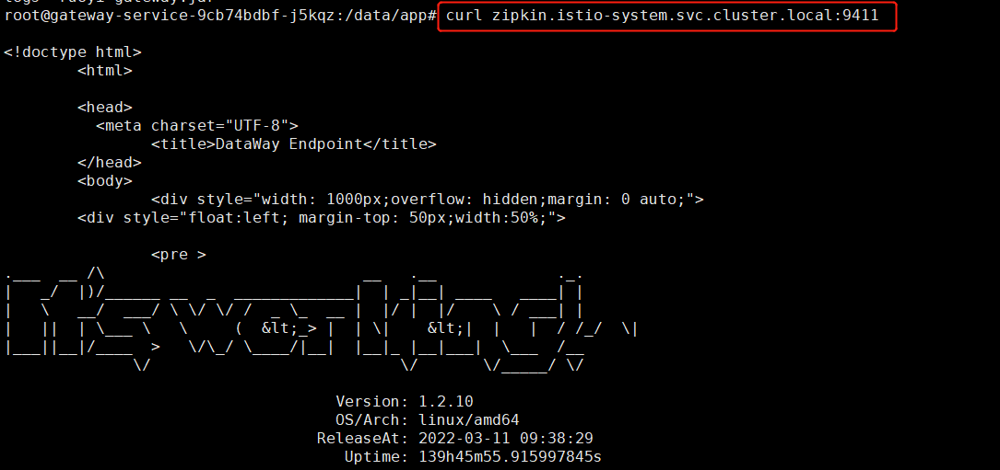

# Kubernetes 集群使用 ExternalName 映射 DataKit 服务

---

## 简介

在 Kubernetes 集群中，以 DaemonSet 方式部署 DataKit 后，如果存在部署的某一应用，以前是推送链路数据到 istio-system 名称空间的 zipkin 服务，端口是 9411，即访问地址是 `zipkin.istio-system.svc.cluster.local:9411`。

若不想更改推送地址怎么办呢？这时就需要用到了 Kubernetes 的 ExternalName 服务类型，通过以下两步转换，应用就可以与 DataKit 打通：

- 首先，定义一个 ClusterIP 的服务类型，把 9529 端口转成 9411。

- 其次，使用 ExternalName 的服务，将 ClusterIP 的服务映射成 DNS 的名称。

### 1 定义 ClusterIP 的服务

```yaml
apiVersion: v1
kind: Service
metadata:
  name: datakit-service-ext
  namespace: datakit
spec:
  selector:
    app: daemonset-datakit
  ports:
    - protocol: TCP
      port: 9411
      targetPort: 9529
```

部署完成后，集群内部的容器就可以使用 `datakit-service-ext.datakit.svc.cluster.local:9411` 来访问 DataKit 的 9529 端口。

### 2 定义 ExternalName 的服务 

```yaml
apiVersion: v1
kind: Service
metadata:
  name: zipkin
  namespace: istio-system
spec:
  type: ExternalName
  externalName: datakit-service-ext.datakit.svc.cluster.local
```

部署完成后，在集群内部的容器中，就可以使用 `zipkin.istio-system.svc.cluster.local:9411` 推送数据到  DataKit 了。


