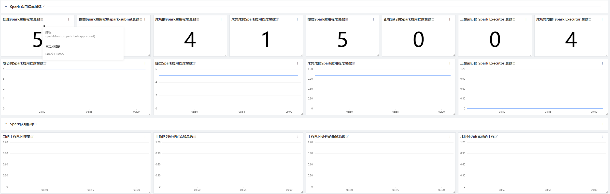
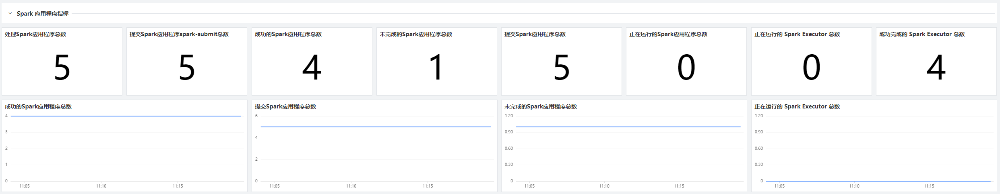
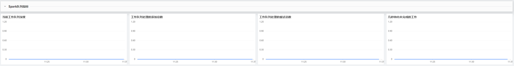
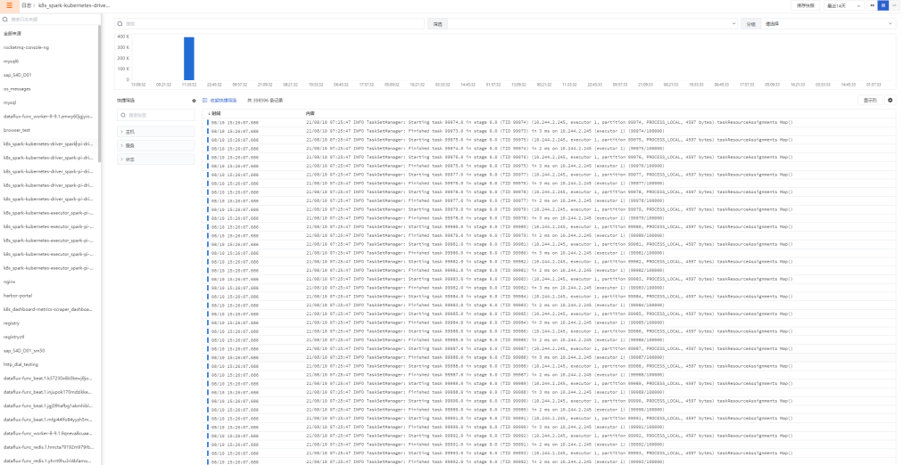
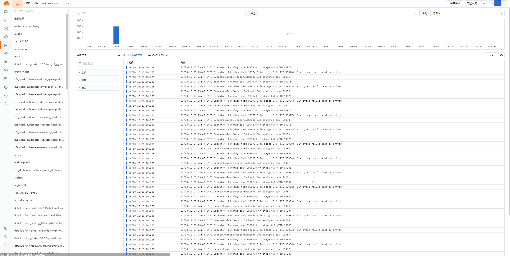

# 简介
对 Spark on k8s operator 进行观测可以帮助我们掌控 spark 的任务运行状态和 spark 的队列状态，如果有异常的情况可以及时的进行排查保障计算任务的运行：

- Spark 应用程序指标
- Spark 队列指标
# 场景视图

## 视图模板
请您在新建视图时导入此模板<br />[operator.json](https://www.yuque.com/attachments/yuque/0/2021/json/21511854/1629721309291-db51708e-f76b-499c-a051-c823ade49d2b.json?_lake_card=%7B%22src%22%3A%22https%3A%2F%2Fwww.yuque.com%2Fattachments%2Fyuque%2F0%2F2021%2Fjson%2F21511854%2F1629721309291-db51708e-f76b-499c-a051-c823ade49d2b.json%22%2C%22name%22%3A%22operator.json%22%2C%22size%22%3A29839%2C%22type%22%3A%22application%2Fjson%22%2C%22ext%22%3A%22json%22%2C%22status%22%3A%22done%22%2C%22uid%22%3A%221629680575826-0%22%2C%22progress%22%3A%7B%22percent%22%3A99%7D%2C%22percent%22%3A0%2C%22refSrc%22%3A%22https%3A%2F%2Fwww.yuque.com%2Fattachments%2Fyuque%2F0%2F2021%2Fjson%2F21511854%2F1629680575682-13aaafaa-f2d1-4646-9699-5641e11c5036.json%22%2C%22id%22%3A%22L9rUF%22%2C%22card%22%3A%22file%22%7D)
# 前置条件
已安装 DataKit ([DataKit安装文档](https://www.yuque.com/dataflux/datakit/datakit-install))<br />已安装 K8s 并且已经开启 K8s 指标采集 ([K8s 最佳实践](https://www.yuque.com/dataflux/bp/k8s-rum-apm-log))<br />在 k8s 集群安装部署 spark-operator 时开启 `enable.metrics` 选项进行可观测指标收集参考命令如下：
```
helm upgrade my-release spark-operator/spark-operator --namespace spark-operator --create-namespace --set webhook.enable=true --set image.repository="docker.io/pacher/spark-operator" --set image.tag="v1beta2-1.2.3-3.1.1" --set enable.metrics=true --set metrics.port=10254 --set metrics.endpoint=/metrics --set metrics.prefix=sparkMonitor

```

# 配置
## 配置 prom Exporter
在您 datakit-default.yaml 存放目录中更改 datakit-default.yaml 文件添加`inputs.prom`并且完成目录挂载后对指标收集，yaml 文件完整内容如下：
```
apiVersion: v1
kind: Namespace
metadata:
  name: datakit
---
apiVersion: rbac.authorization.k8s.io/v1
kind: ClusterRole
metadata:
  name: datakit
rules:
- apiGroups:
  - ""
  resources:
  - nodes
  - nodes/proxy
  - namespaces
  - pods
  - services
  - endpoints
  - persistentvolumes
  - persistentvolumeclaims
  - ingresses
  verbs:
  - get
  - list
  - watch
- apiGroups:
  - apps
  resources:
  - deployments
  - daemonsets
  - statefulsets
  - replicasets
  verbs:
  - get
  - list
  - watch
- apiGroups:
  - extensions
  resources:
  - ingresses
  verbs:
  - get
  - list
  - watch
- apiGroups:
  - batch
  resources:
  - jobs
  - cronjobs
  verbs:
  - get
  - list
  - watch
- nonResourceURLs: ["/metrics"]
  verbs: ["get"]

---

apiVersion: v1
kind: ServiceAccount
metadata:
  name: datakit
  namespace: datakit

---

apiVersion: rbac.authorization.k8s.io/v1
kind: ClusterRoleBinding
metadata:
  name: datakit
roleRef:
  apiGroup: rbac.authorization.k8s.io
  kind: ClusterRole
  name: datakit
subjects:
- kind: ServiceAccount
  name: datakit
  namespace: datakit

---

apiVersion: apps/v1
kind: DaemonSet
metadata:
  labels:
    app: daemonset-datakit
  name: datakit
  namespace: datakit
spec:
  revisionHistoryLimit: 10
  selector:
    matchLabels:
      app: daemonset-datakit
  template:
    metadata:
      labels:
        app: daemonset-datakit
    spec:
      hostNetwork: true
      dnsPolicy: ClusterFirstWithHostNet
      containers:
      - env:
        - name: HOST_IP
          valueFrom:
            fieldRef:
              apiVersion: v1
              fieldPath: status.hostIP
        - name: NODE_NAME
          valueFrom:
            fieldRef:
              apiVersion: v1
              fieldPath: spec.nodeName
        - name: ENV_DATAWAY
          value: https://openway.dataflux.cn?token=tkn_9a49a7e9343c432eb0b99a297401c3bb
        - name: ENV_GLOBAL_TAGS
          value: host=__datakit_hostname,host_ip=__datakit_ip
        - name: ENV_ENABLE_INPUTS
          value: cpu,disk,diskio,mem,swap,system,hostobject,net,host_processes,kubernetes,container,statsd,ddtrace
        - name: ENV_ENABLE_ELECTION
          value: enable
        - name: ENV_HTTP_LISTEN
          value: 0.0.0.0:9529
        - name: ENV_LOG_LEVEL
          value: info
        image: pubrepo.jiagouyun.com/datakit/datakit:1.1.8-rc0
        imagePullPolicy: Always
        name: datakit
        ports:
        - containerPort: 9529
          hostPort: 9529
          name: port
          protocol: TCP
        securityContext:
          privileged: true
        volumeMounts:
        - mountPath: /var/run/docker.sock
          name: docker-socket
          readOnly: true
        - mountPath: /usr/local/datakit/conf.d/container/container.conf
          name: datakit-conf
          subPath: container.conf
        - mountPath: /usr/local/datakit/conf.d/kubernetes/kubernetes.conf
          name: datakit-conf
          subPath: kubernetes.conf    
        - mountPath: /usr/local/datakit/conf.d/prom/prom.conf
          name: datakit-conf
          subPath: spark_prom.conf
        - mountPath: /host/proc
          name: proc
          readOnly: true
        - mountPath: /host/dev
          name: dev
          readOnly: true
        - mountPath: /host/sys
          name: sys
          readOnly: true
        - mountPath: /rootfs
          name: rootfs
        workingDir: /usr/local/datakit
      hostIPC: true
      hostNetwork: true
      hostPID: true
      restartPolicy: Always
      serviceAccount: datakit
      serviceAccountName: datakit
      terminationGracePeriodSeconds: 30
      volumes:
      - configMap:
          name: datakit-conf
        name: datakit-conf
      - hostPath:
          path: /var/run/docker.sock
        name: docker-socket
      - hostPath:
          path: /proc
          type: ""
        name: proc
      - hostPath:
          path: /dev
          type: ""
        name: dev
      - hostPath:
          path: /sys
          type: ""
        name: sys
      - hostPath:
          path: /
          type: ""
        name: rootfs
  updateStrategy:
    rollingUpdate:
      maxUnavailable: 1
    type: RollingUpdate
---
apiVersion: v1
kind: ConfigMap
metadata:
  name: datakit-conf
  namespace: datakit
data:
    #### container
    container.conf: |-
      [inputs.container]
        endpoint = "unix:///var/run/docker.sock"

        enable_metric = true
        enable_object = true
        enable_logging = true

        metric_interval = "10s"

        ## TLS Config
        # tls_ca = "/path/to/ca.pem"
        # tls_cert = "/path/to/cert.pem"
        # tls_key = "/path/to/key.pem"
        ## Use TLS but skip chain & host verification
        # insecure_skip_verify = false

        [inputs.container.kubelet]
          kubelet_url = "http://127.0.0.1:10255"

          ## Use bearer token for authorization. ('bearer_token' takes priority)
          ## If both of these are empty, we'll use the default serviceaccount:
          ## at: /run/secrets/kubernetes.io/serviceaccount/token
          # bearer_token = "/path/to/bearer/token"
          ## OR
          # bearer_token_string = "abc_123"

          ## Optional TLS Config
          # tls_ca = /path/to/ca.pem
          # tls_cert = /path/to/cert.pem
          # tls_key = /path/to/key.pem
          ## Use TLS but skip chain & host verification
          # insecure_skip_verify = false

        #[[inputs.container.logfilter]]
        #  filter_message = [
        #    '''<this-is-message-regexp''',
        #    '''<this-is-another-message-regexp''',
        #  ]
        #  source = "<your-source-name>"
        #  service = "<your-service-name>"
        #  pipeline = "<pipeline.p>"

        [inputs.container.tags]
          # some_tag = "some_value"
          # more_tag = "some_other_value"


    #### kubernetes
    kubernetes.conf: |-
      [[inputs.kubernetes]]
          # required
          interval = "10s"
          ## URL for the Kubernetes API          
          url = "https://kubernetes.default:443"
          ## Use bearer token for authorization. ('bearer_token' takes priority)
          ## at: /run/secrets/kubernetes.io/serviceaccount/token
          bearer_token = "/run/secrets/kubernetes.io/serviceaccount/token"

          ## Set http timeout (default 5 seconds)
          timeout = "5s"

           ## Optional TLS Config
          tls_ca = "/run/secrets/kubernetes.io/serviceaccount/ca.crt"

          ## Use TLS but skip chain & host verification
          insecure_skip_verify = false

          [inputs.kubernetes.tags]
           #tag1 = "val1"
           #tag2 = "valn"
  
    #### spark_prom
    spark_prom.conf: |-
        [[inputs.prom]]
          ## Exporter 地址
          url = "http://8.136.207.182:30254/metrics"

            ## 采集器别名
            source = "spark"

          ## 指标类型过滤, 可选值为 counter, gauge, histogram, summary
          # 默认只采集 counter 和 gauge 类型的指标
          # 如果为空，则不进行过滤
          metric_types = ["counter", "gauge"]

          ## 指标名称过滤
          # 支持正则，可以配置多个，即满足其中之一即可
          # 如果为空，则不进行过滤
          # metric_name_filter = ["cpu"]

          ## 指标集名称前缀
          # 配置此项，可以给指标集名称添加前缀
          measurement_prefix = ""

          ## 指标集名称
          # 默认会将指标名称以下划线"_"进行切割，切割后的第一个字段作为指标集名称，剩下字段作为当前指标名称
          # 如果配置measurement_name, 则不进行指标名称的切割
          # 最终的指标集名称会添加上measurement_prefix前缀
          # measurement_name = "prom"

          ## 采集间隔 "ns", "us" (or "µs"), "ms", "s", "m", "h"
          interval = "10s"

          ## 过滤tags, 可配置多个tag
          # 匹配的tag将被忽略
          # tags_ignore = ["xxxx"]

          ## TLS 配置
          tls_open = false
          # tls_ca = "/tmp/ca.crt"
          # tls_cert = "/tmp/peer.crt"
          # tls_key = "/tmp/peer.key"

          ## 自定义指标集名称
          # 可以将包含前缀prefix的指标归为一类指标集
          # 自定义指标集名称配置优先measurement_name配置项
          #[[inputs.prom.measurements]]
          #  prefix = "cpu_"
          #  name = "cpu"

          # [[inputs.prom.measurements]]
          # prefix = "mem_"
          # name = "mem"

          ## 自定义认证方式，目前仅支持 Bearer Token
          # [inputs.prom.auth]
          # type = "bearer_token"
          # token = "xxxxxxxx"
          # token_file = "/tmp/token"

          ## 自定义Tags
          [inputs.prom.tags]
          # some_tag = "some_value"
          # more_tag = "some_other_value"


```
# 监控指标说明
## 1 Spark 应用程序指标
Spark 应用程序指标可以帮助我们观测 Spark Job 得任务状态和运行状态，方便我们对 spark 任务的运行状态进行观测。


| **指标描述** | **名称** | **度量标准** |
| --- | --- | --- |
| 处理 spark 应用程序总数 | `sparkMonitor.app_count

` | 资源利用率 |
| 提交 Spark 应用程序 spark-submit 总数 | `sparkMonitor.app_submit_count

` | 资源利用率 |
| 成功的 Spark 应用程序总数 | `sparkMonitor.app_success_count` | 资源利用率 |
| 未完成的 Spark 应用程序总数 | `sparkMonitor.app_failure_count` | 资源利用率 |
| 提交 Spark 应用程序总数 | `sparkMonitor.app_submit_count` | 资源利用率 |
| 正在运行的 Spark 应用程序总数 | `sparkMonitor.app_running_count` | 资源利用率 |
| 正在运行的 Spark Executor 总数 | `sparkMonitor.app_executor_running_count` | 资源利用率 |
| 成功完成的 Spark Executor 总数 | `sparkMonitor.app_executor_success_count` | 资源利用率 |


#### 正在运行的 Spark 应用程序总数
密切关注正在运行的 Spark 应用程序总数是很有必要的，当我们业务处于稳定的时候每天每个时间段的在运行的任务数量应该是趋于稳定的，当我们的运维或者开发同学发现运行的任务数有异常波动的时候可以及时的排查问题来确保我们的业务稳定。
#### 正在运行的 Spark Executor 总数
我们应该对 Spark Executor 的数量给予足够的重视，可以根据当前正在运行的 Spark 应用程序总数来估算单个 job 的 executor 数量，或者根据新增的正在运行的 Spark 应用数来查看当前的 executor 数量的变化，单个 job 的执行时间受 executor 的数量影响，当有 spark job 执行时间过长是要及时排查是否只有单个 executor 在处理 job，如果是可以多分配一些资源或者查看 code 是否所有任务都写到了 driver 端了。
#### 未完成的 Spark 应用程序总数
当出现未完成的 Spark 的任务时，或者总数持续上升时，我们要及时的排查集群状态或 operator 状态来保障我们的业务可以平稳运行。
## 2 Spark 队列指标
内存是影响 Linux 性能的主要因素之一，内存资源的充足与否直接影响应用系统的使用性能。


| **指标描述** | **名称** | **度量标准** |
| --- | --- | --- |
| 当前工作队列深度 | `sparkMonitorscheduled.spark_application_controller_depth` | 资源利用率 |
| 工作队列处理的添加总数 | `sparkMonitorscheduled.spark_application_controller_adds` | 资源利用率 |
| 工作队列处理的重试总数 | `sparkMonitorscheduled.spark_application_controller_retries` | 资源利用率 |
| 几秒钟内未完成的工作 | `sparkMonitorscheduled.spark_application_controller_unfinished_work_seconds` | 资源利用率 |

#### 工作队列处理的重试总数
当出现工作队列处理的重试总数增加时，我们要及时关注正在运行的 spark job 可以通过 DataFlux 日志模块查看 job 的运行状态也可以通过自己搭建的 Spark History 组件查看异常重试的 job 信息，及时的解决异常 job 来保障我们的业务平稳运行。
#### 几秒钟内未完成的工作
我们可以关注这个指标来查看我们 spark job 执行的进度，如果这个指标的值出现异常增长那么可能有执行过慢的 job 请及时排查日志或者 code 逻辑来保障业务的正常运行。

# 日志
当提交 spark job 后可以在 dataflux 平台中查看对应 driver pod 和 executor pod 的运行日志方便我们进行问题定位和运行作业观测或者访问自己搭建的 spark history 进行日志查看。


## 结论
在本文中，我们提到了一些最有用的指标，您可以对其进行观测以在运行 spark jo b时及时发现并对问题进行处理。 如果您正在进行 spark 作业，那么监视下面的列表中的指标将使您可以很好地了解和管理作业的运行状况和可用性：

- **正在运行的 Spark 应用程序总数**
- **正在运行的 Spark Executor 总数**
- **未完成的 Spark 应用程序总数**
- **工作队列处理的重试总数**
- **几秒钟内未完成的工作**

 您也可以通过 [DataFlux](http://dataflux.cn)了解更多内容。
