## 基本概述

阿里云产品众多，通常使用阿里云-云监控对阿里云资源和互联网应用进行监控，但是云监控的指标数据有限，更多内容需要通过编写代码的方式才能够获取。观测云使用 DataFlux Func 脚本市场可以非常快速的接入阿里云数据 (阿里云-云监控 API + 阿里云产品 API )，更为丰富的指标数据，为系统稳定、定位问题提供技术支撑。

## 前置条件

1、 服务器 <[安装 Datakit](https://www.yuque.com/dataflux/datakit/datakit-install)>

登录观测云，点击 **集成** - **Datakit**，复制安装命令至服务器运行即可 (其中 token 为该工作空间唯一标识)


2、 服务器 <[安装 Func 携带版](https://www.yuque.com/dataflux/func/quick-start)>

登录观测云，点击 **集成** - **Func**，下载脚本并执行安装命令即可


3、 阿里云 RAM 访问控制账号授权

   1. 登录 RAM 控制台  [https://ram.console.aliyun.com/users](https://ram.console.aliyun.com/users)
   
   1. 新建用户：人员管理 - 用户 - 创建用户

   3. 保存或下载 **AccessKey** **ID** 和 **AccessKey Secret** 的 CSV 文件 (配置文件会用到)
   
   3. 用户授权 (只读访问所有阿里云资源的权限)

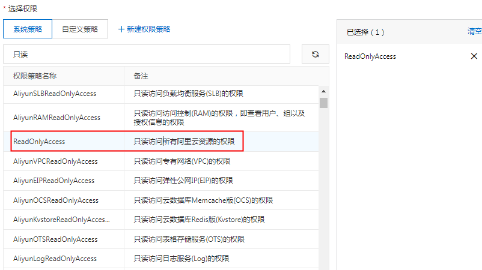
## 安装配置

### 脚本市场

1、 登录 DataFlux Func，地址 http://ip:8088 (默认密码 admin/admin，请自行修改)

2、 开启脚本市场，**管理** - **实验性功能** - **开启脚本市场模块**

3、 依次添加脚本集

   1. 观测云集成 (核心包)
   1. 观测云集成 (阿里云-云监控)
   1. 观测云集成 (阿里云-产品xxx)

_注：在安装「核心包」后，系统会提示安装第三方依赖包 pip，按照正常步骤点击安装即可_

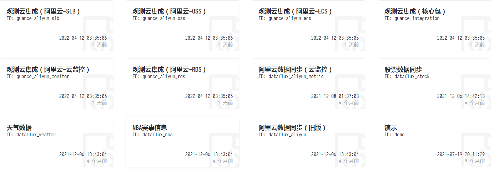

4、 脚本安装完成后，可以在脚本库中看到所有脚本集

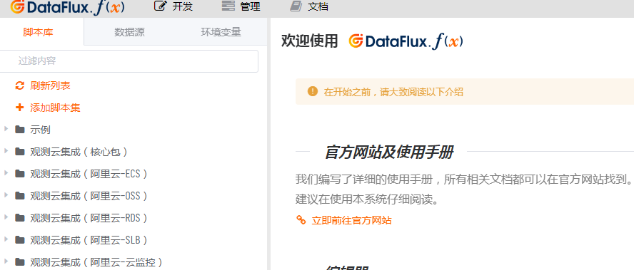

## 编写代码

1、 **开发** - **脚本库** - **添加脚本集**

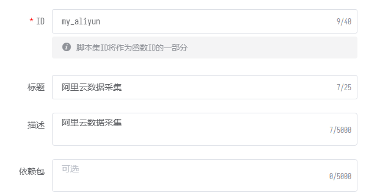

2、 点击该脚本集 - **添加脚本**

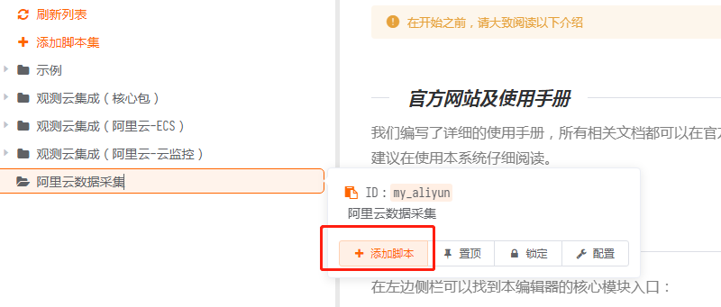

3、 创建 ID 为 main 的脚本

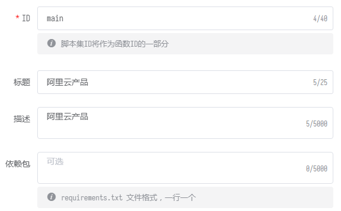

4、 添加数据采集代码 

主要参数说明：

- import guance_aliyun_xxx：引入脚本市场里的脚本集

- ak_id：RAM 访问控制里的 AccessKey ID
- ak_secret：RAM 访问控制里的 AccessKey Secret
- account_name：自定义的账号名称 (最终会作为指标标签 tag，用于筛选)
- regions：阿里云产品对应的地域 (可以填写多个地域)
- namespace：阿里云-云监控官方定义，用于区分产品
- metrics：阿里云-云监控指标 (可以填写 ALL，或者自定义指标)
- collectors：对象采集器 (阿里云产品 API 获取)

_注：阿里云-云监控采集器必须写在末尾 (aliyun_monitor.DataCollector)_

```
from guance_integration__runner import Runner        # 引入启动器
import guance_aliyun_ecs__main as aliyun_ecs         # 引入阿里云ECS采集器
import guance_aliyun_rds__main as aliyun_rds         # 引入阿里云RDS采集器
import guance_aliyun_slb__main as aliyun_slb         # 引入阿里云SLB采集器
import guance_aliyun_oss__main as aliyun_oss         # 引入阿里云OSS采集器
import guance_aliyun_monitor__main as aliyun_monitor # 引入阿里云云监控采集器

# 账号配置
account = {
    'ak_id'     : 'AccessKey ID',
    'ak_secret' : 'AccessKey Secret',
    'extra_tags': {
        'account_name': 'Account Name',
    }
}

# 由于采集数据较多，此处需要为函数指定更大的超时时间（单位秒）
@DFF.API('执行云资产同步', timeout=300)
def run():
    # 采集器配置
    common_aliyun_configs = {
        'regions': [ 'cn-hangzhou','cn-shanghai','cn-beijing' ], # ECS、RDS、SLB、OSS的配置相同
    }
    monitor_collector_configs = {
        'targets': [
            { 'namespace': 'acs_ecs_dashboard', 'metrics': ['cpu_cores','cpu_idle','cpu_system','cpu_user','cpu_wait','disk_readbytes','disk_readiops','disk_writebytes','disk_writeiops','diskusage_avail','diskusage_free','diskusage_total','diskusage_used','diskusage_utilization','fs_inodeutilization','load_15m','load_1m','load_5m','memory_freespace','memory_freeutilization','memory_totalspace','memory_usedspace','memory_usedutilization','net_tcpconnection','networkin_packages','networkin_rate','networkout_packages','networkout_rate'] }, 
            { 'namespace': 'acs_rds_dashboard', 'metrics': 'ALL' },
            { 'namespace': 'acs_slb_dashboard', 'metrics': ['HeathyServerCount','UnhealthyServerCount','NewConnection','ActiveConnection','MaxConnection','Qps','StatusCodeOther','StatusCode2xx','StatusCode3xx','StatusCode4xx','StatusCode5xx','TrafficRXNew','TrafficTXNew','PacketTX','PacketRX','InstanceUpstreamCode5xx','InstanceUpstreamCode4xx','InstanceNewConnection','InstanceActiveConnection','InstanceMaxConnection','InstanceQps','InstanceStatusCodeOther','InstanceStatusCode2xx','InstanceStatusCode3xx','InstanceStatusCode4xx','InstanceStatusCode5xx','InstanceTrafficRX','InstanceTrafficTX','InstancePacketTX','InstancePacketRX'] },
            { 'namespace': 'acs_oss_dashboard', 'metrics': 'ALL' },
        ],
    }

    # 创建采集器
    collectors = [
        aliyun_ecs.DataCollector(account, common_aliyun_configs),
        aliyun_rds.DataCollector(account, common_aliyun_configs),
        aliyun_slb.DataCollector(account, common_aliyun_configs),
        aliyun_oss.DataCollector(account, common_aliyun_configs),
        aliyun_monitor.DataCollector(account, monitor_collector_configs),
    ]

    # 启动执行
    Runner(collectors).run()
```

5、 点击** 保存 **配置并 **发布** (发布后才能添加定时任务)

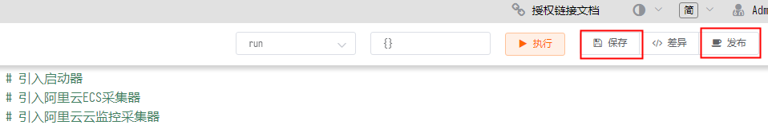
## 定时任务

1、添加自动触发任务，**管理** - **自动触发配置** - **新建任务**


2、自动触发配置，执行函数中添加此脚本，执行频率默认为 **五分钟 */5 * * * ***

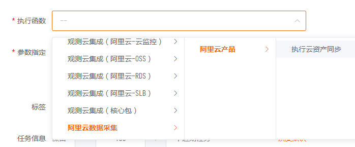

3、数据验证，登录观测云，通过 **指标** 查看数据是否已正常上报

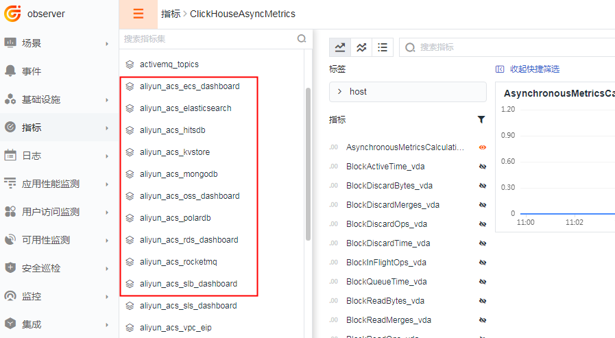

## 场景视图
登录观测云，**场景** - **新建仪表板 **- **内置模板库** - **阿里云产品 xxx，**即可查看对应视图模板

示例为 阿里云 RDS Mysql

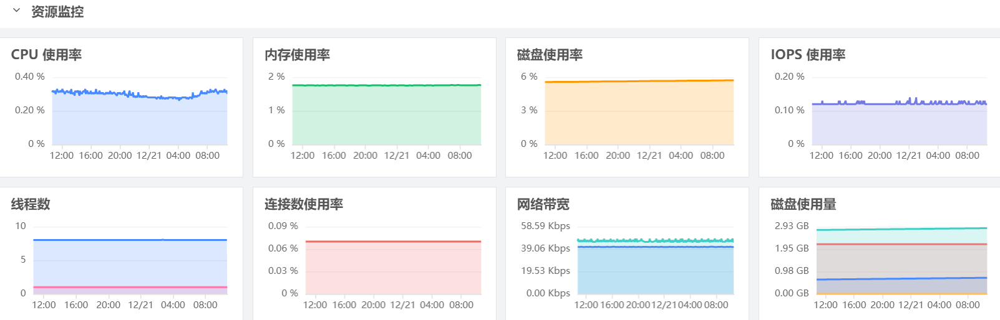

## 监控规则
登录观测云，**监控** - **模板新建** - **阿里云产品 xxx 检测库**，即可添加对应规则模板

示例为 阿里云 RDS Mysql 检测库

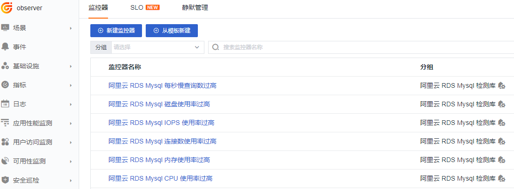

## 进一步阅读

<[阿里云-云监控指标概览](https://help.aliyun.com/document_detail/163515.html)>

<[DataFlux Func 观测云集成简介](https://www.yuque.com/dataflux/func/script-market-guance-integration-intro)>

<[DataFlux Func 阿里云-云监控配置手册](https://www.yuque.com/dataflux/func/script-market-guance-aliyun-monitor)>


