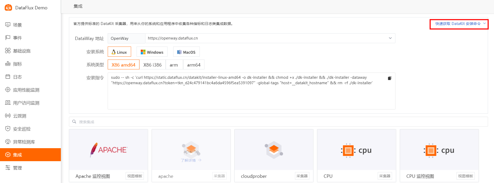
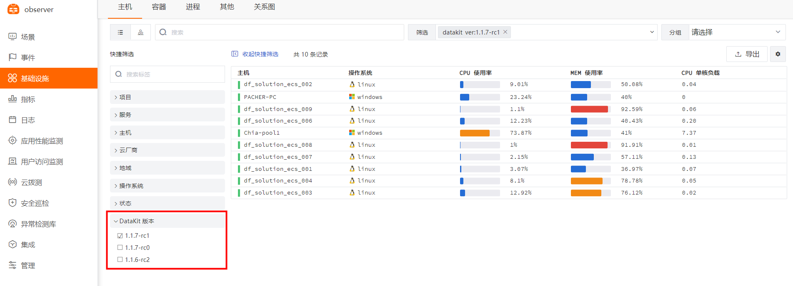

## 环境信息

| 名称 | 环境 |
| --- | --- |
| Centos | 7.6 |
| Ansible | 2.10.4 |
| 主机 IP | 10.200.14.56；10.200.14.57；10.200.14.63   |

**注：只支持linux主机**

## 部署 Ansible

### 安装 Ansible

登录 10.200.14.56 服务器，执行安装命令
```
yum -y install ansible
```

### 配置 Ansible

编辑 ansible 的 hosts 文件 
```
vim /etc/ansible/hosts
```

添加主机列表及用户/密码

```
[all]
10.200.14.56 ansible_ssh_user=root ansible_ssh_pass=xxx 
10.200.14.57 ansible_ssh_user=root ansible_ssh_pass=xxx 
10.200.14.63 ansible_ssh_user=root ansible_ssh_pass=xxx 
```

#### 关闭连接提示

```
sed -i '/host_key_checking/c\host_key_checking = False' /etc/ansible/ansible.cfg
```

####   验证配置

```
ansible all -m ping
```

|  10.200.14.57 &#124; SUCCESS => { "ansible_facts": { "discovered_interpreter_python": "/usr/bin/python" }, "changed": false, "ping": "pong" } <br />10.200.14.56 &#124; SUCCESS => { "ansible_facts": { "discovered_interpreter_python": "/usr/bin/python" }, "changed": false, "ping": "pong" } <br />10.200.14.63 &#124; SUCCESS => { "ansible_facts": { "discovered_interpreter_python": "/usr/bin/python" }, "changed": false, "ping": "pong" }   |
| --- |

## 批量部署

### 配置 PlayBook

#### 获取命令

点击 [**集成**] 模块，右上角 [_快速获取 DataKit 安装命令_]，根据您的操作系统和系统类型选择合适的 [_Datakit 安装命令_]。



#### 新建 yaml 文件

进入 Ansible 目录

```
cd /etc/ansible
```

新建文件

```
vim datakit-install.yaml
```

添加以下内容 (复制之前的 _[Datakit 安装命令]_)

```
- hosts: all
  remote_user: root
  tasks:
   - name: judge datakit is exits
     shell: ls /usr/local/datakit/conf.d
     ignore_errors: True
     register: result
   - name: install datakit
     shell: [Datakit 安装命令]
     when: result.rc != 0

```
#### 执行 yaml 文件

*** 需要服务器能够访问公网 ***

```
ansible-playbook datakit-install.yaml
```

|  PLAY [all] ************************************************************************ ************************************************************************ ************************************************************************ ******************************************* <br />TASK [Gathering Facts] ************************************************************************ ************************************************************************ ************************************************************************ ******************************* <br />ok: [10.200.14.57] <br />ok: [10.200.14.56] <br />ok: [10.200.14.63] <br />PLAY RECAP ************************************************************************ ************************************************************************ ************************************************************************ ******************************************* <br />10.200.14.56 : ok=2 changed=1 unreachable=0 failed=0 skipped=1 rescued=0 ignored=0 <br />10.200.14.57 : ok=3 changed=2 unreachable=0 failed=0 skipped=0 rescued=0 ignored=1 <br />10.200.14.63 : ok=3 changed=2 unreachable=0 failed=0 skipped=0 rescued=0 ignored=1   |
| --- |

#### 验证信息

点击 [**基础设施**] 模块，[_主机]_ 查看所有已安装 DataKit 的主机列表以及基础信息。


## 批量升级

#### 新建 yaml 文件

进入 Ansible 目录

```
cd /etc/ansible
```

新建文件
```
vim datakit-upgrade.yaml
```

添加以下内容
```
- hosts: all
  remote_user: root
  tasks:
   - name: judge datakit is exits
     shell: ls /usr/local/datakit/conf.d
     ignore_errors: True
     register: result
   - name: install datakit
     shell: sudo -- sh -c "curl https://static.dataflux.cn/datakit/installer-linux-amd64 -o dk-installer && chmod +x ./dk-installer && ./dk-installer -upgrade && rm -rf ./dk installer"
     when: result.rc == 0
```

#### 执行 yaml 文件

```
ansible-playbook datakit-upgrade.yaml
```

#### 验证信息

点击 [**基础设施**] 模块，通过快速筛选条件选择最新 [_DataKit 版本_]



## 批量同步

#### 新建 yaml 文件

进入 Ansible 目录

```
cd /etc/ansible
```

新建文件

```
vim datakit-config-upgrade.yaml
```

添加以下内容

```
- hosts: all
  remote_user: root
  tasks:
   - name: judge datakit is exit
     shell: ls /usr/local/datakit/conf.d
     ignore_errors: True
     register: result
   - name: judge /usr/bin/rsync is exits
     shell: ls /usr/bin/rsync
     ignore_errors: True
     register: result
   - name: install rsync
     shell: yum -y install rsync
     when: result.rc != 0
   - name: Synchronize passing in extra rsync options
     synchronize:
       src: /usr/local/datakit/conf.d/
       dest: /usr/local/datakit/conf.d/
       rsync_opts:
        - "--exclude=datakit.conf"
       checksum: true
     register: res
   - debug: var=res.stdout_lines
   - debug: var=res.changed
   - name: reload datakit
     shell: systemctl restart datakit
     when: res.changed == true
```

#### 执行 yaml 文件

```
ansible-playbook datakit-config-upgrade.yaml
```

#### 验证信息

所有主机都会应用相同的 DataKit 配置 (conf.d 目录)， 如果遇到个定制服务器配置，可以使用 DataKit 白名单功能。  
