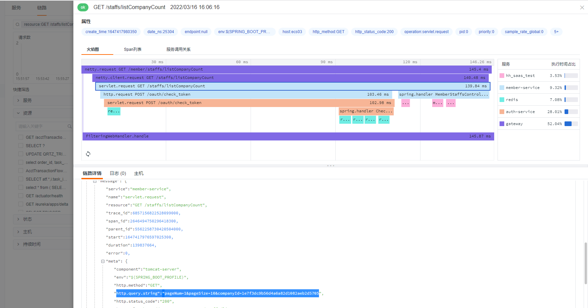
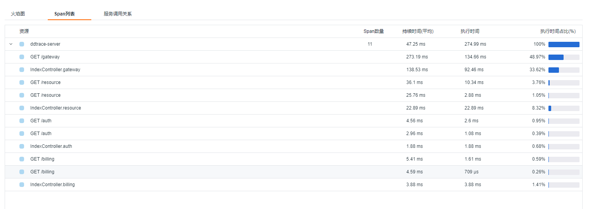
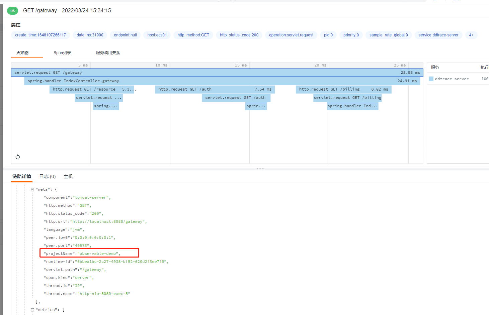
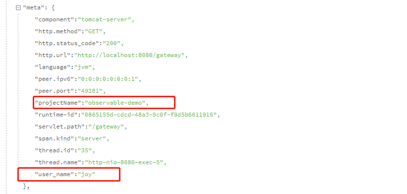
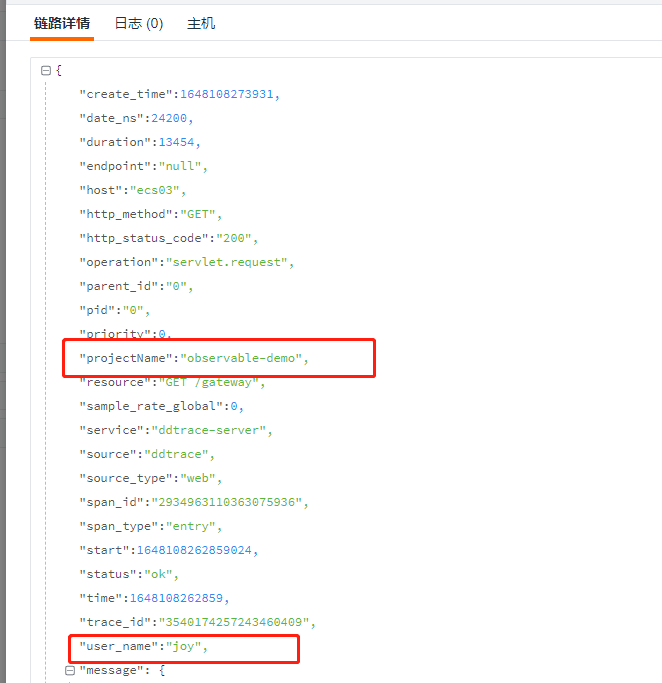
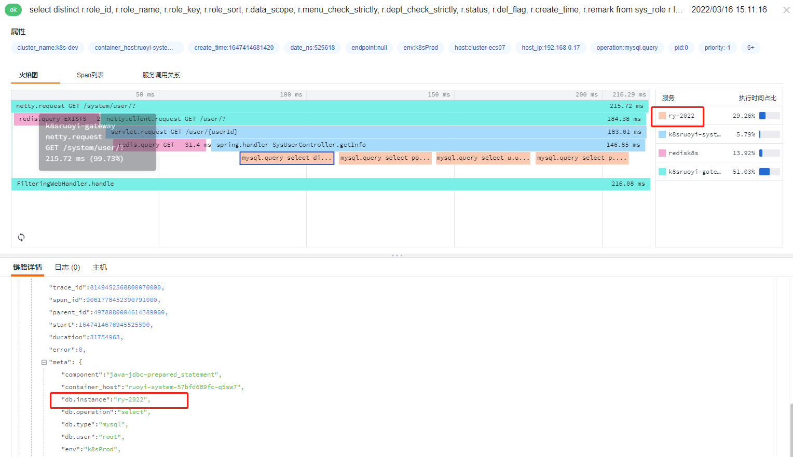

# ddtrace 高级用法

---

[ddtrace java 文档 ](https://docs.datadoghq.com/tracing/setup_overview/setup/java/)

当前案例使用 ddtrace 版本`0.78.3`和 `0.97.0`（最新版本）进行测试


## 准备 Shell

```shell
java -javaagent:D:/ddtrace/dd-java-agent-0.97.0.jar \
-Ddd.service=ddtrace-server \
-Ddd.agent.port=9529 \
-jar springboot-ddtrace-server.jar
```

## 开启 query 参数

开启 query 参数，可以更直观方便的让用户看到当前请求携带了哪些参数，更直观的还原客户真实操作流程，但 query 开启参数只能采集到 url 上的参数，request Body 里面的参数目前尚不支持。默认为 false，表示为默认不开启。

> -Ddd.http.server.tag.query-string=TRUE



## 配置远程采集链接

`dd.agent.host` 默认值是`localhost`，所以默认推送的是本地的 DataKit ，如果想推送远程 DataKit ，则需要配置 `dd.agent.host`。

>  -Ddd.agent.host=192.168.91.11


## 类或方法注入 Trace

ddtrace 支持给方法注入 Trace ，默认情况下，ddtrace 会对所有的 API 接口动态注入 Trace，如果想对非 API 类（方法）——一些重要的类和方法需要重点标记，可以通过 `dd.trace.methods`参数配置。

> **Environment Variable**: DD_TRACE_METHODS<br />**Default**: null<br />**Example**: package.ClassName[method1,method2,...];AnonymousClass$1[call];package.ClassName[*]<br />List of class/interface and methods to trace. Similar to adding @Trace, but without changing code. **Note:** The wildcard method support ([*]) does not accommodate constructors, getters, setters, synthetic, toString, equals, hashcode, or finalizer method calls

如对`com.zy.observable.ddtrace.service.TestService` 类的`getDemo`方法需要添加 Trace。

> -Ddd.trace.methods="com.zy.observable.ddtrace.service.TestService[getDemo]"

部分代码所示：

```java
    @Autowired
    private TestService testService;

    @GetMapping("/gateway")
    @ResponseBody
    public String gateway(String tag) {
        String userId = "user-" + System.currentTimeMillis();
        MDC.put(ConstantsUtils.MDC_USER_ID, userId);
        logger.info("this is tag");
        sleep();
        testService.getDemo();
        httpTemplate.getForEntity(apiUrl + "/resource", String.class).getBody();
        httpTemplate.getForEntity(apiUrl + "/auth", String.class).getBody();
        if (client) {
            httpTemplate.getForEntity("http://"+extraHost+":8081/client", String.class).getBody();
        }
        return httpTemplate.getForEntity(apiUrl + "/billing?tag=" + tag, String.class).getBody();
    }
```

未添加`dd.trace.methods`参数，上报 11 个 span ，效果如下：



## 忽略 Trace（实测无效）

通过配置`dd.trace.classes.exclude`可以忽略我们不愿意上报的 trace 数据，在实际生产环境中，比如注册中心的心跳。

> **Environment Variable**: DD_TRACE_CLASSES_EXCLUDE<br />**Default**: null<br />**Example**: package.ClassName,package.ClassName$Nested,package.Foo*,package.other.*<br />A list of fully qualified classes (that may end with a wildcard to denote a prefix) which will be ignored (not modified) by the tracer. Must use the jvm internal representation for names (eg package.ClassName$Nested and not package.ClassName.Nested)

忽略 `IndexController`产生的 trace，配置入下：

> -Ddd.trace.classes.exclude="com.zy.observable.ddtrace.controller.IndexController"

然而并没有达到既定的效果。

## 两种添加 Tag 方式

ddtrace 提供两种添加 tag 方式，效果一样。但还是推荐使用 dd.tags 方式

### dd.trace.span.tags

将 `projectName:observable-demo` 添加到每个 span 的示例：

> -Ddd.trace.span.tags=projectName:observable-demo 



### dd.tags

> -Ddd.tags=user_name:joy



两种方式都能生成 tag，效果一样，都会在`meta`里面展示数据。

如果确实想要把 `dd.tags`标记的 tag 作为观测云的 标签 ，则需要在 ddtrace.conf 配置 `customer_tags`

```yaml
    [[inputs.ddtrace]]
      endpoints = ["/v0.3/traces", "/v0.4/traces", "/v0.5/traces"]
      customer_tags = ["projectName","user_name"]
```

效果如图<br />

> 注意：如果自定义tag 包含了 [tag 关键字](https://www.yuque.com/dataflux/datakit/ddtrace#6393771b)，则会当成标签显示。

## 显示数据库实例名称

显示数据库的名称，默认显示数据库的类型，如需要显示数据库名称，将值设置成`TRUE`

> -Ddd.trace.db.client.split-by-instance=TRUE

以上 demo 并没有加载数据库，所以想要达到这个效果，可以选择一个引入数据库的应用添加参数 `dd.trace.db.client.split-by-instance=TRUE`

效果图：



demo 源码地址 [https://github.com/lrwh/observable-demo/tree/main/springboot-ddtrace-server](https://github.com/lrwh/observable-demo/tree/main/springboot-ddtrace-server)
