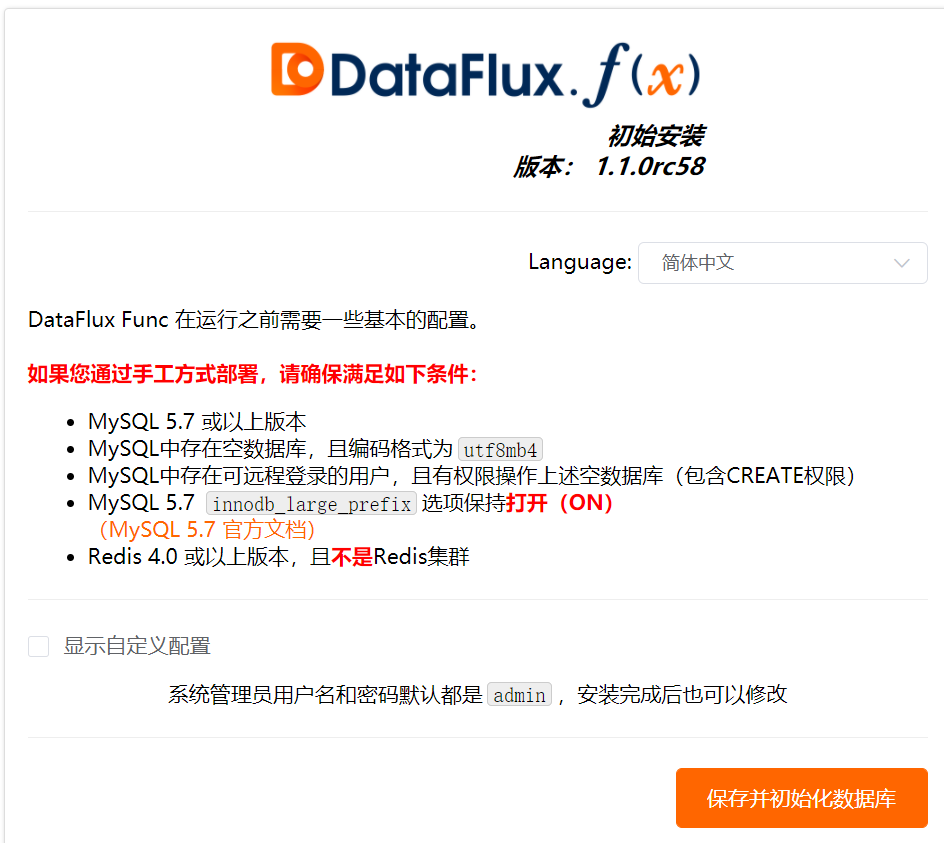

## 前置条件

### 安装 Datakit

1、 点击 [**集成**] 模块， [_Datakit_]，根据您的操作系统和系统类型选择合适的安装命令。


2、 复制 Datakit 安装命令在需要被监控的服务器上直接运行。

- 安装目录 /usr/local/datakit/

- 日志目录 /var/log/datakit/

- 主配置文件 /usr/local/datakit/conf.d/datakit.conf

- 插件配置目录 /usr/local/datakit/conf.d/

### 安装 Function

1、 点击 [**集成**] 模块， [_Funciton_]，下载安装包并执行安装命令


2、 安装完成后，使用浏览器访问 http://服务器IP地址:8088 进行初始化操作界面



3、 使用默认用户名/密码 admin 登录系统


### RAM 访问控制

1、 登录 RAM 控制台  [https://ram.console.aliyun.com/users](https://ram.console.aliyun.com/users)

2、 新建用户：人员管理 - 用户 - 创建用户


3、 保存或下载 AccessKey ID 和 AccessKey Secret 的 CSV 文件 (配置文件会用到)

4、 用户授权 (管理对象存储服务(OSS)权限)


## 脚本开发

### 日志备份 OSS

1、 管理 - 实验性功能 - 开启 PIP 工具模块


2、 安装阿里云 SDK 依赖包 (oss2)


3、 新建脚本集，添加脚本


4、 编写代码，需要填入 AccessKey ID，AccessKey Secret，Bucket Name，Filename

参考文档

- <[对象 OSS 简单上传](https://help.aliyun.com/document_detail/88426.html)>

- <[Function 开发手册 - DataKit.Query](https://function.dataflux.cn/#/read?q=development-guide.md)>

```
import time
import json
import oss2

@DFF.API('Run DQL via DataKit')
def run_dql_via_datakit():
    datakit = DFF.SRC('datakit')
    # 使用time_range参数，限制最近10分钟数据
    time_range = [
        int(time.time() - 600) * 1000,
        int(time.time()) * 1000,
    ]
    # dql 查询语句
    status_code, result = datakit.query(dql='L::`apache`', time_range=time_range, raw=True)
    result = (json.dumps(result, indent=2))
    # 配置 oss 信息
    auth = oss2.Auth('AccessKey ID', 'AccessKey Secret')
    bucket = oss2.Bucket(auth, 'https://oss-cn-hangzhou.aliyuncs.com', 'Bucket Name')
    file = bucket.put_object('Filename.txt', result)
```

5、 登录 OSS 控制台查看文件
 
 
