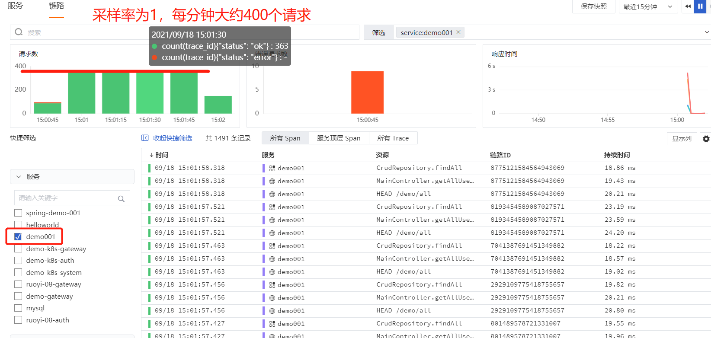
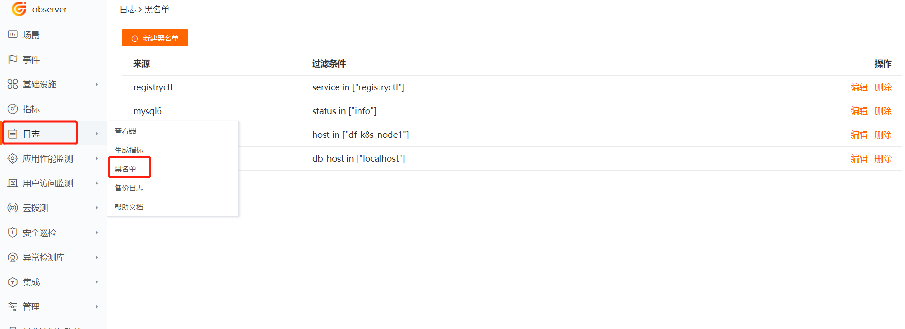
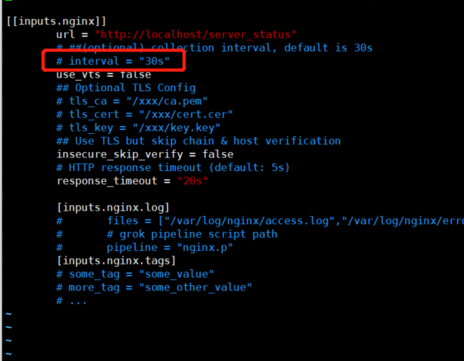
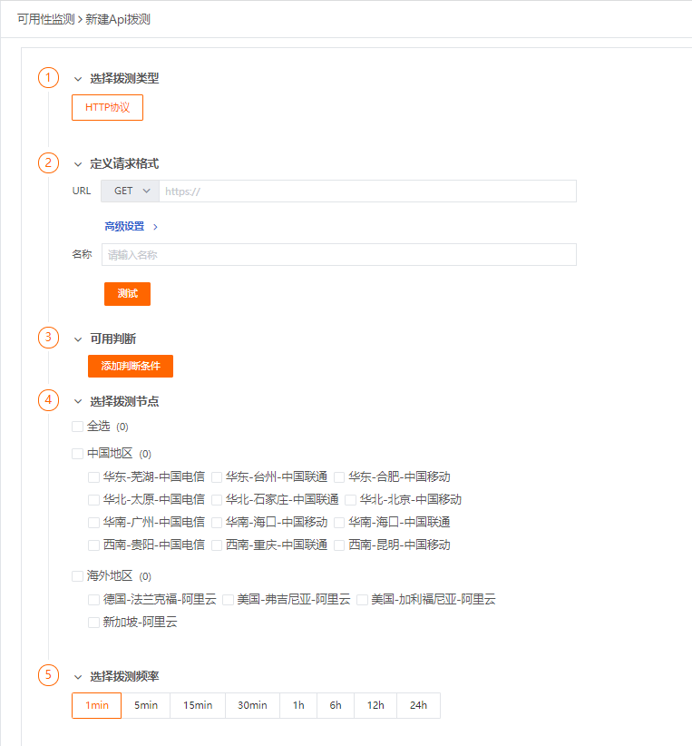

# 观测云-数据采样最佳实践

---

## 概述         

自从可观测性概念普及并火起来以后，越来越多的IT从业者对整个IT系统的可观测有了更全方位的了解，当然，当一个系统从指标到链路，再到日志、各种tag，如果相关的所有数据全部进行采集并批量上传，将会产生一些不必要的问题，例如：

1、无效数据过多，有效数据容易被无效数据淹没，问题排查难

2、数据过多，导致存储成本急速飙升

3、数据查询耗时长，或者查询导致组件crash，带来更多的运维成本

4、数据采集频率过高，网络IO被占用

……

面对上述种种情况，通过采样、降低频次、过滤等手段就显得很有必要了，不仅可以降低运维、硬件成本，还可以提高数据利用的效率。观测云本质上默认会进行全量的数据采集，同时也已在数据采集的agent上内置了上述多种降低数据采集频率的办法，具体操作请看以下内容：

## APM（ddtrace接入方式）

### 方式：采样

**采样支持语言（当前）：java、php、ruby**

注释：默认所有APM数据均是全量（1代表全量），如需设置，需要将rate的参数由1改为0-1之间的小数，建议合理区间在0.4-0.8之间，这样的比例，在保证样本数据的有效性前提下，能节省1/4到1/2的成本。

#### java

[[部署方式详见集成文档](/integrations/middleware/jvm/)]

启动脚本添加参数：Ddd.trace.sample.rate=1

举例（采样率0.5）：

```
## 原启动脚本：
 nohup java -jar xxx.jar &
 
## 添加ddtrace后的启动脚本
 nohup java -javaagent:/usr/local/datakit/data/dd-java-agent.jar -Ddd.service.name=demo001 -Ddd.agent.port=9529 -jar springmysqldemo.jar & 


## 添加ddtrace启动参数后（添加采样相关参数）的脚本：
 nohup java -javaagent:/usr/local/datakit/data/dd-java-agent.jar -Ddd.service.name=demo001 -Ddd.agent.port=9529 -Ddd.trace.sample.rate=0.5 -jar springmysqldemo.jar &
 
```

#### PHP

[[部署方式详见集成文档](/integrations/middleware/php-fpm/)]

环境变量添加参数：DD_SAMPLING_RATE=1



## RUM

### 方式：采样

#### web页面

在rum-js添加的地方，添加`sampleRate: 90`，举例如下（同步载入方式）：

```
<script src="https://static.guance.com/browser-sdk/v2/dataflux-rum.js" type="text/javascript"></script>
<script>
  window.DATAFLUX_RUM &&
    window.DATAFLUX_RUM.init({
      applicationId: 'appid_48617201757b4dcc86f3e3291dfa7e4b',
      datakitOrigin: '<DATAKIT ORIGIN>', // 协议（包括：//），域名（或IP地址）[和端口号]
      sampleRate: 5,
      //  env: 'production',
      //  version: '1.0.0',
    })
</script>
```

**注意：设置采样后，初始化会随机生成一个0-100之间的随机数，当这个随机数小于你设置的采集率时，那么会上报当前用户访问的相关数据，否则就不会上报。**

**图示：采样率由100调整为5。**


## 日志

### 方式：过滤

“观测云”支持通过设置日志黑名单的方式过滤掉符合条件的日志，即配置日志黑名单以后，符合条件的日志数据不再上报到“观测云” 工作空间，帮助用户节约日志数据存储费用。

注意：此处的配置并不会以下发的方式下发给datakit，此处配置的生效是由datakit主动get请求中心的配置文件，然后读取配置文件并在本地执行过滤动作。

**新建黑名单**

在 “观测云” 工作空间，点击「日志」-「黑名单」-「新建黑名单」，选择「日志来源」，添加一条或多条日志筛选过滤规则，点击确定即默认开启该日志过滤规则。您可以通过「日志黑名单」，查看全部日志过滤规则。



注意：日志过滤筛选条件为“**and（并且）**”的关系，即同时符合过滤筛选条件的日志数据，将不会被上报到工作空间。

## 指标

### 方式：降低采集频率

所有的指标采集器（datakit中的具体inputs），均可在配置文件中配置采集频率采集间隔（interval），具体可根据需求进行自定义调整，编辑并保存之后，重启datakit即可生效。

注意：配置采样间隔建议结合系统的重要程度来判定，核心系统建议频率高一些，边缘系统可以设置低一些。

指标采集采样频率变更后，单位时间内上传的指标数量就会改变，如果采集频率降低，那上传的指标数量就会减少，最终降低费用。



## 可用性监测

### 方式：降低监测频率

利用可用性检测来主动访问关键接口，然后判断接口的可用性及延时情况，可以结合业务重要程度，合理设置检测频率。

**注释：当前拨测的数据存储类型为日志，当您拨测节点选择的比较多，频率也比较高时，会产生比较多的日志，相应就会产生一定的费用，所以请结合自身需求进行节点城市与频率的选择。**


