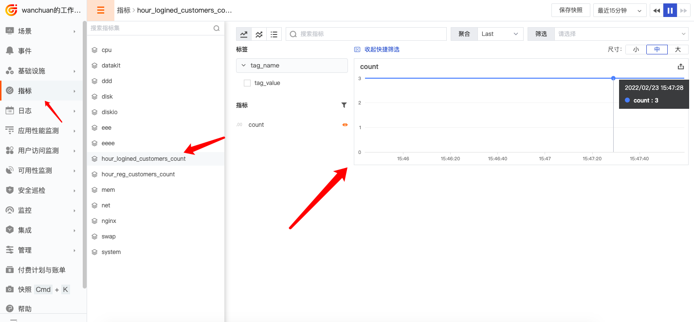

# 快速上手 Pythond 采集器的最佳实践

---


Pythond 是定时触发用户自定义 Python 采集脚本的一整套方案。本文以 “获取每个小时登录的用户数”作为指标上报给中心为例。

## 1.1. 业务演示介绍

业务流程大致如下: 从数据库中采集数据 (Python 脚本) -> pythond 采集器定时触发该脚本上报数据(datakit) -> 从中心可看到指标(web)。

数据库现在有一张表叫 `customers`, 表中有如下字段:

- name: 姓名 (字符串)

- last_logined_time : 登录时间 (时间戳)

建表语句如下:

```sql
create table customers
(
  `id`                BIGINT(20)  not null AUTO_INCREMENT COMMENT '自增 ID',
  `last_logined_time` BIGINT(20)  not null DEFAULT 0      COMMENT '登录时间 (时间戳)',
  `name`              VARCHAR(48) not null DEFAULT ''     COMMENT '姓名',

  primary key(`id`),
  key idx_last_logined_time(last_logined_time)
) ENGINE=InnoDB DEFAULT CHARSET=utf8mb4;
```

往上面的表中插入测试数据:

```sql
INSERT INTO customers (id, last_logined_time, name) VALUES (1, 1645600127, 'zhangsan');
INSERT INTO customers (id, last_logined_time, name) VALUES (2, 1645600127, 'lisi');
INSERT INTO customers (id, last_logined_time, name) VALUES (3, 1645600127, 'wangwu');
```

使用以下 SQL 语句来获取 "获取每个小时登录的用户数":

```sql
select count(1) from customers where last_logined_time>=(unix_timestamp()-3600);
```

把上面的数据以指标形式上报给中心。

下面详细讲述实现上述业务的具体步骤。

## 1.2. 前置条件

### 1.2.1. Python 环境

需要安装 Python，目前 Pythond 采集器处于 alpha 阶段，同时兼容 Python 2.7+ 和 Python 3+。但为了以后的兼容性，**强烈建议使用 Python 3**，毕竟 Python 2 官方已经不作支持了。下面的演示也是使用 Python 3。

### 1.2.2. Python 依赖库

需要安装以下依赖库:

- requests（操作网络，用于上报指标）
- pymysql（操作 MySQL 数据库，用于连接数据库获取业务数据）

安装方法如下:

```shell
# python3
python3 -m pip install requests
python3 -m pip install pymysql
```

上述的安装需要安装 pip，如果你没有，可以参考以下方法(源自: [这里](https://pip.pypa.io/en/stable/installation/)):

```shell
# Linux/MacOS
python3 -m ensurepip --upgrade

# Windows
py -m ensurepip --upgrade
```

## 1.3. 编写用户自定义脚本

需要用户继承 `DataKitFramework` 类，然后对 `run` 方法进行改写。`DataKitFramework` 类源代码文件是 `datakit_framework.py`，路径是 `datakit/python.d/core/datakit_framework.py`。

具体的使用可以参见源代码文件 `datakit/python.d/core/demo.py`。

我们这里根据上述需求，写成如下的 Python 脚本，命名为 `hellopythond.py`:

```python
from datakit_framework import DataKitFramework
import pymysql
import re
import logging

class MysqlConn():
    def __init__(self, logger, config):
        self.logger = logger
        self.config = config
        self.re_errno = re.compile(r'^\((\d+),')

        try:
            self.conn = pymysql.Connect(**self.config)
            self.logger.info("pymysql.Connect() ok, {0}".format(id(self.conn)))
        except Exception as e:
            raise e

    def __del__(self):
        self.close()

    def close(self):
        if self.conn:
            self.logger.info("conn.close() {0}".format(id(self.conn)))
            self.conn.close()


    def execute_query(self, sql_str, sql_params=(), first=True):
        res_list = None
        cur = None
        try:
            cur = self.conn.cursor()
            cur.execute(sql_str, sql_params)
            res_list = cur.fetchall()
        except Exception as e:
            err = str(e)
            self.logger.error('execute_query: {0}'.format(err))
            if first:
                retry = self._deal_with_network_exception(err)
                if retry:
                    return self.execute_query(sql_str, sql_params, False)
        finally:
            if cur is not None:
                cur.close()
        return res_list

    def execute_write(self, sql_str, sql_params=(), first=True):
        cur = None
        n = None
        err = None
        try:
            cur = self.conn.cursor()
            n = cur.execute(sql_str, sql_params)
        except Exception as e:
            err = str(e)
            self.logger.error('execute_query: {0}'.format(err))
            if first:
                retry = self._deal_with_network_exception(err)
                if retry:
                    return self.execute_write(sql_str, sql_params, False)
        finally:
            if cur is not None:
                cur.close()
        return n, err

    def _deal_with_network_exception(self, stre):
        errno_str = self._get_errorno_str(stre)
        if errno_str != '2006' and errno_str != '2013' and errno_str != '0':
            return False
        try:
            self.conn.ping()
        except Exception as e:
            return False
        return True

    def _get_errorno_str(self, stre):
        searchObj = self.re_errno.search(stre)
        if searchObj:
            errno_str = searchObj.group(1)
        else:
            errno_str = '-1'
        return errno_str

    def _is_duplicated(self, stre):
        errno_str = self._get_errorno_str(stre)
        # 1062：字段值重复，入库失败
        # 1169：字段值重复，更新记录失败
        if errno_str == "1062" or errno_str == "1169":
            return True
        return False

class HelloPythond(DataKitFramework):
    __name = 'HelloPythond'
    interval = 10 # 每 10 秒钟采集上报一次。这个根据实际业务进行调节，这里仅作演示。

    # if your datakit ip is 127.0.0.1 and port is 9529, you won't need use this,
    # just comment it.
    # def __init__(self, **kwargs):
    #     super().__init__(ip = '127.0.0.1', port = 9529)

    def run(self):
        config = {
            "host": "172.16.2.203",
            "port": 30080,
            "user": "root",
            "password": "Kx2ADer7",
            "db": "df_core",
            "autocommit": True,
            # "cursorclass": pymysql.cursors.DictCursor,
            "charset": "utf8mb4"
        }

        mysql_conn = MysqlConn(logging.getLogger(''), config)
        query_str = "select count(1) from customers where last_logined_time>=(unix_timestamp()-%s)"
        sql_params = ('3600')
        n = mysql_conn.execute_query(query_str, sql_params)

        data = [
          {
              "measurement": "hour_logined_customers_count", # 指标名称。
              "tags": {
                "tag_name": "tag_value", # 自定义 tag，根据自己想要标记的填写，我这里是随便写的
              },
              "fields": {
                "count": n[0][0], # 指标，这里是每个小时登录的用户数
              },
          },
        ]

        in_data = {
            'M':data,
            'input': "pyfromgit"
        }

        return self.report(in_data) # you must call self.report here
```

## 1.4. 将自定义脚本放入正确的位置

在 Datakit 安装目录的 `python.d` 目录下新建一个文件夹，并命名为 `hellopythond`，这个文件夹名称要与上面编写的类名相同，即为 `hellopythond`。

然后将上面写好的脚本 `hellopythond.py` 放入此文件夹下，即最后的目录结构如下:

```
├── ...
├── datakit
└── python.d
    ├── core
    │   ├── datakit_framework.py
    │   └── demo.py
    └── hellopythond
        └── hellopythond.py
```

上面的 `core` 文件夹是 Pythond 的核心文件夹，不要动。

上面是在没有开启 `gitrepos` 功能的情况下，如果是开启了 `gitrepos` 功能，那么路径结构就是这样的:

```
├── ...
├── datakit
├── python.d
├── gitrepos
│   └── yourproject
│       ├── conf.d
│       ├── pipeline
│       └── python.d
│           └── hellopythond
│               └── hellopythond.py
```

## 1.5. 开启 pythond 配置文件

将 Pythond 配置文件复制出来。在 `conf.d/pythond` 目录下复制 `pythond.conf.sample` 为 `pythond.conf`，然后将配置成如下形式:

```toml
[[inputs.pythond]]

	# Python 采集器名称
	name = 'some-python-inputs'  # required

	# 运行 Python 采集器所需的环境变量
	#envs = ['LD_LIBRARY_PATH=/path/to/lib:$LD_LIBRARY_PATH',]

	# Python 采集器可执行程序路径(尽可能写绝对路径)
	cmd = "python3" # required. python3 is recommended.

	# 用户脚本的相对路径(填写文件夹，填好后该文件夹下一级目录的模块和 py 文件都将得到应用)
	dirs = ["hellopythond"] # 这里填的是文件夹名，即类名
```

## 1.6. 重启 Datakit

```shell
sudo datakit --restart
```

## 1.7. 效果图

如果一切顺利的话，大概 1 分钟内我们就能在中心看到指标图。



## 1.8. 参考文档

- [官方手册: 用 Python 开发自定义采集器](/datakit/ddtrace-python/)

- [官方手册: 通过 Git 管理配置文件](/datakit/git-config-how-to/)
