# CDB
---

## 视图预览
腾讯云 CDB 指标展示，包括资源，Innodb，访问，连接，主从等

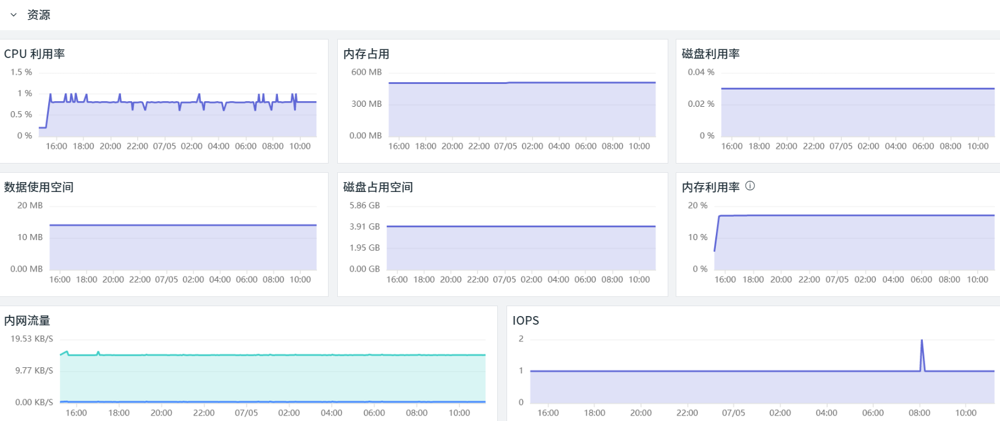
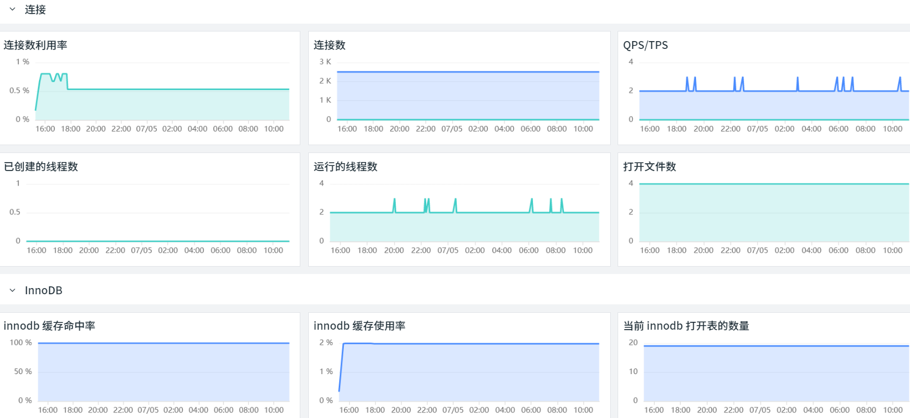
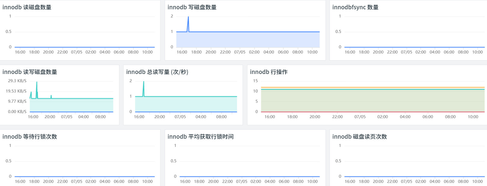

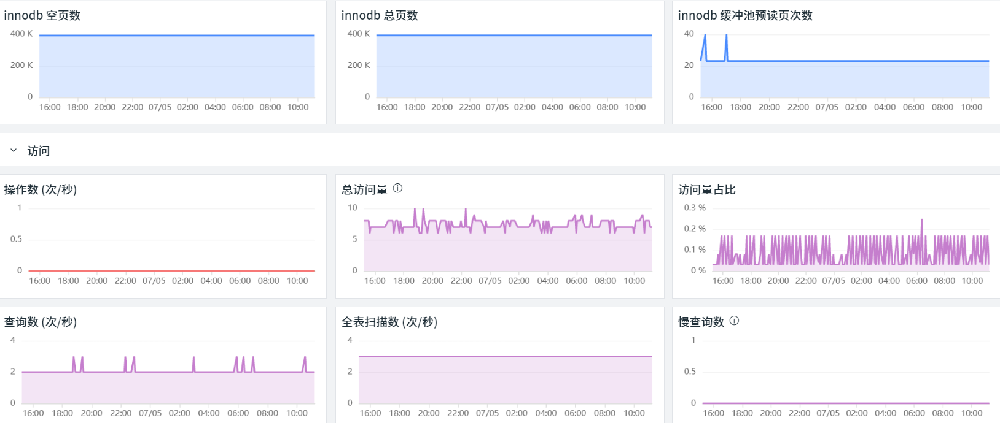
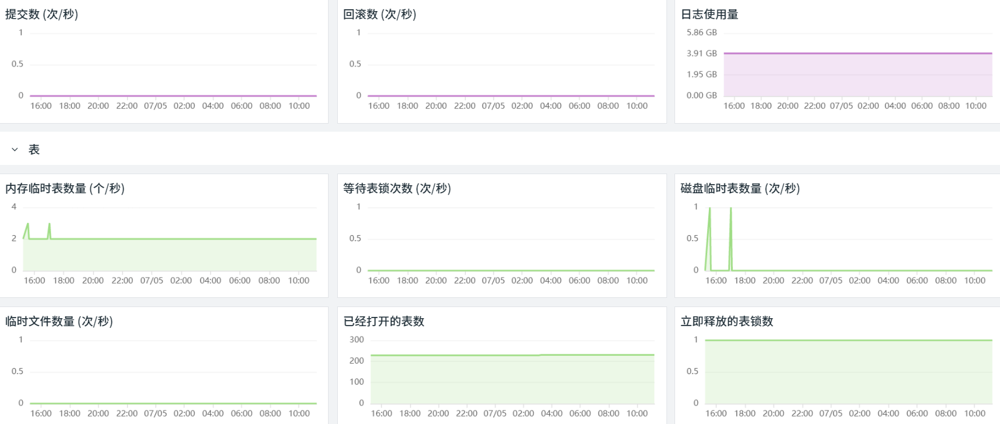
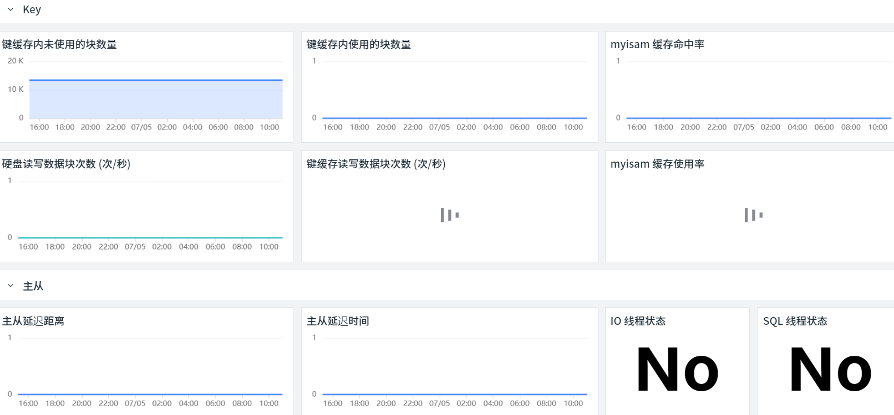

## 版本支持
操作系统支持：Linux / Windows
## 前置条件

- 服务器 <[安装 Datakit](/datakit/datakit-install/)>
- 服务器 <[安装 Func 携带版](/dataflux-func/quick-start/)>
- 腾讯云访问管理进行授权
### 访问授权

1. 登录访问授权控制台 [https://console.cloud.tencent.com/cam](https://console.cloud.tencent.com/cam)  
1. 新建用户：用户 - 用户列表 - 新建用户  
     1. 访问方式：控制台访问 & 编程访问  
     1. 用户权限：ReadOnlyAccess  

  
3. 新建秘钥：选择该用户 - API 秘钥 - 新建秘钥 (**SecretId** 和 **SecretKey** 配置文件会用到)  


## 安装配置
说明：

- 示例 Linux 版本为：CentOS Linux release 7.8.2003 (Core)
- 通过一台服务器采集所有腾讯云 CDB 数据
### 部署实施
#### 脚本市场

1. 登录 Func，地址 http://ip:8088  


2. 开启脚本市场，管理 - 实验性功能 - 开启脚本市场模块  


3. **依次添加 **三个脚本集  
     1. 观测云集成 (核心包)
     1. 观测云集成 (腾讯云-云监控)
     1. 观测云集成 (腾讯云-CDB)  
_注：在安装「核心包」后，系统会提示安装第三方依赖包，按照正常步骤点击安装即可_  
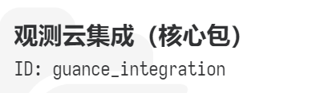  
  
  
4. 脚本安装完成后，可以在脚本库中看到所有脚本集  

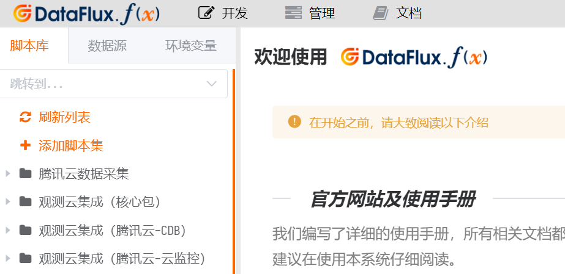
#### 添加脚本

1. 开发 - 脚本库 - 添加脚本集  

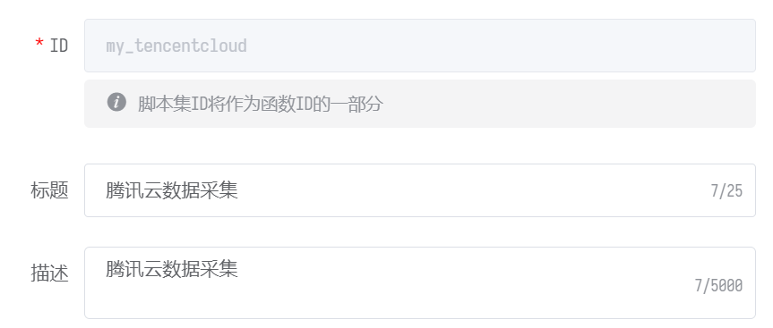  
2. 点击该脚本集 - 添加脚本  
  
3. 创建 ID 为 main 的脚本  
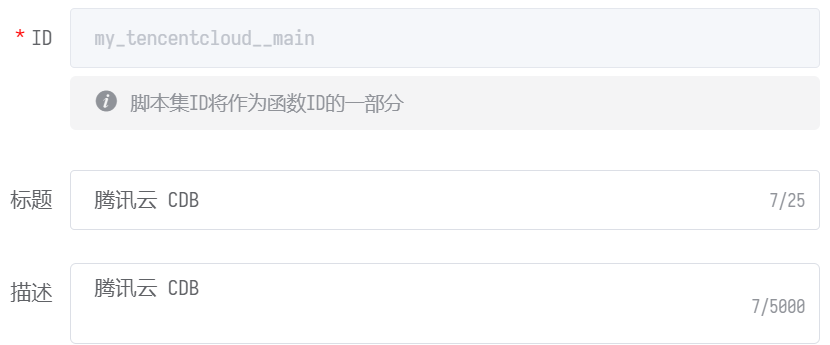  
4. 添加代码 (需要修改账号配置 **SecretId / SecretKey /Account Name / Regions**)  
    - regions 取值可以参考 [**地域列表**](https://cloud.tencent.com/document/api/248/30346)**，**示例：ap-shanghai

``` bash
from guance_integration__runner import Runner
import guance_tencentcloud_cdb__main as tencentcloud_cdb
import guance_tencentcloud_monitor__main as tencentcloud_monitor

# 账号配置
account = {
    'ak_id'     : 'SecretId',
    'ak_secret' : 'SecretKey',
    'extra_tags': {
        'account_name': 'Account Name',
    }
}

@DFF.API('执行云资产同步', timeout=300)
def run():
    regions = ['Regions']

    # 采集器配置
    cdb_configs = {
        'regions': regions,
    }
    monitor_configs = {
        'regions': regions,
        'targets': [
            {
                'namespace': 'QCE/CDB',
                'metrics'  : 'ALL',
            },
        ],
    }
    collectors = [
        tencentcloud_cdb.DataCollector(account, cdb_configs),
        tencentcloud_monitor.DataCollector(account, monitor_configs),
    ]

    # 启动执行
    Runner(collectors).run()
```  
5. **保存 **配置并 **发布**  
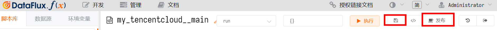  
#### 定时任务

1. 添加自动触发任务，管理 - 自动触发配置 - 新建任务  
  
2. 自动触发配置，执行函数中添加此脚本，执行频率为 **5分钟 */5 * * * ***  
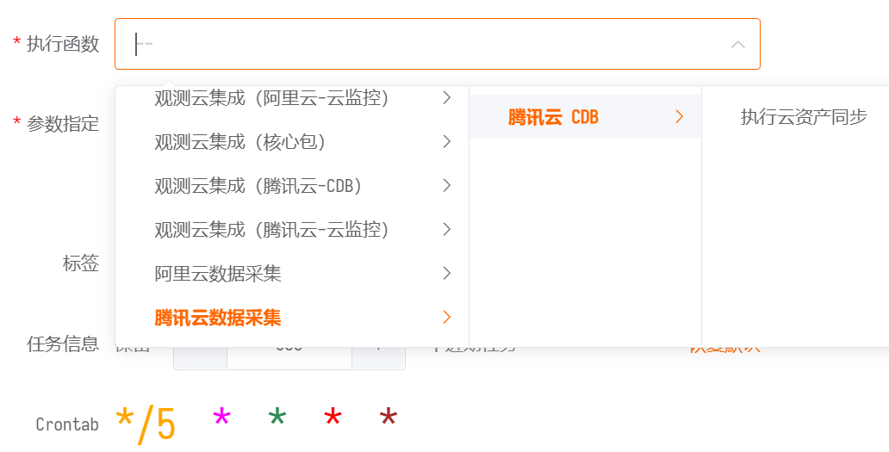  
3. 指标预览  
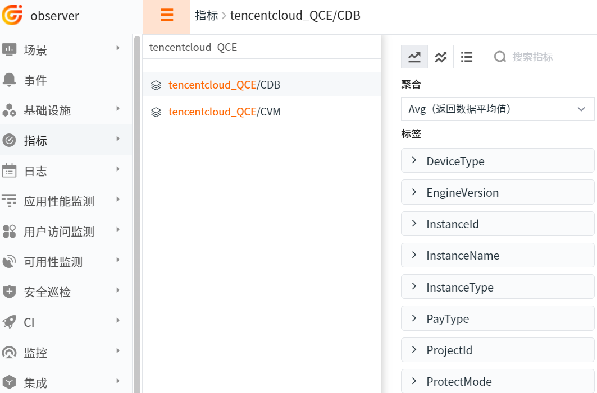  
## 场景视图
场景 - 新建仪表板 - 内置模板库 - 腾讯云 CDB
## 监控规则
监控 - 模板新建 - 腾讯云 CDB 检测库
## 指标详解
[腾讯云 CDB 指标列表](https://cloud.tencent.com/document/product/248/45147)

## 常见问题排查

- 查看日志：Func 日志路径 /usr/local/dataflux-func/data/logs/dataflux-func.log
- 代码调试：编辑模式选择主函数，直接运行 (可以看到脚本输出)

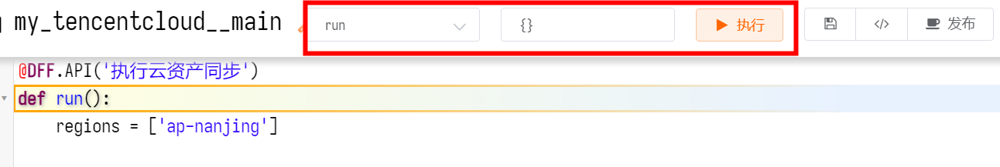

- 连接配置：Func 无法连接 Datakit，请检查数据源配置 (Datakit 需要监听 0.0.0.0)

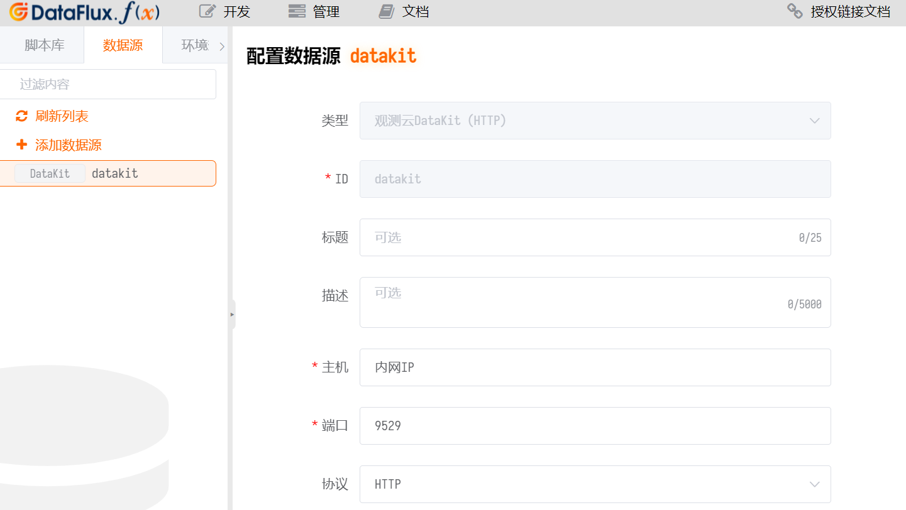
## 进一步阅读
[DataFlux Func 观测云集成简介](/dataflux-func/script-market-guance-integration/)  
[DataFlux Func 腾讯云-云监控配置手册](/dataflux-func/script-market-guance-tencentcloud-monitor/)