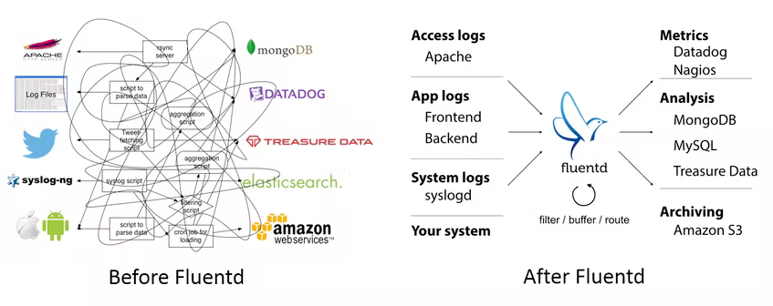
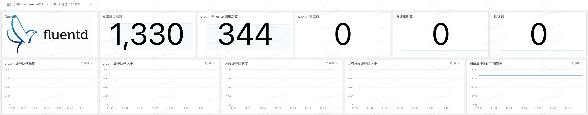

## 为什么要构建统一的日志记录层

我想每个软件工程师都应该是同意日志是最具有分析价值的。日志可以帮助我们更深入了解站点性能、客户行为和无法在暂存服务器上重现的棘手错误。以优雅的方式收集和存储日志会对业务带来巨大的提升。通过构建连接日志源和数据后端的统一层，日志基础设施可以跟上业务的增长；事实上，甚至可以帮助我们更快地从数据中了解更多信息，从而更好的辅助我们业务的快速增长。

Fluentd 是构建这样一个统一的日志记录层的一种解决方案。Fluentd 是这样做的：

## 什么是 Fluentd

Fluentd 是一个开源数据收集器，用于统一日志记录基础设施。与 syslogd 等传统日志工具不同，它具有四个关键属性：

1. **使用 JSON 进行统一日志记录：**Fluentd 会尽可能地将数据结构化为 JSON。这将方便 Fluentd 统一处理日志数据：收集、过滤、缓冲和输出跨多个源和目标的日志。使用 JSON 进行下游数据处理要容易得多，因为它有确定性的数据结构可以访问，而无需强制使用严格的模式。

1. **可插拔架构：** Fluentd 有一个灵活的插件系统，允许社区扩展其功能。500 多个社区贡献的插件可以获取几十种数据源并且支持数十种数据源类型的数据输出，根据需要处理数据。通过使用插件，可以帮助我们更好地利用日志。
1. **所需资源少：** 数据采集器应该是轻量级的，以便用户可以在任务繁多的机器上轻量地运行。Fluentd 是结合 C 和 Ruby 编写的，仅需要及少的系统资源。vanilla 实例在 30-40MB 内存上运行，可以处理 13,000 个事件/秒/core。
1. **内置可靠性：** Fluentd 的数据丢失永远不会发生。Fluentd 支持基于内存和文件的缓冲，以防止节点间数据丢失。Fluentd 还支持强大的故障转移，并且可以设置为高可用性。

## 用观测云观测 Fluentd

那么，Fluentd 是如何与观测云集成的呢？

### 观测云作为 Fluentd 的输出

我们通过更改配置可以将 <[Fluentd 数据采集](https://www.yuque.com/dataflux/integrations/qodsy1)> 的数据直接上报至观测云平台进行可视化分析，从而减少对后端存储分析集群的依赖，通过更科学的手段来提升我们的业务。

### 使用观测云观测 Fluentd

Fluentd 的设计本身是保证高可用的，并配有自己的监控程序守护程序。目前许多用户都使用 Fluentd 作为其数据流的关键组件，也就是说我们不要让任何中间件不受监控。如果出现任何问题，都要立即通知其负责的工程师。观测云通过接入 Fluentd RESTApi 的方式将 <[Fluentd 集成](https://www.yuque.com/dataflux/integrations/fluentd)> 观测起来，以便可以在每次输出的基础上监控其性能。

## 可视化的观测 Fluentd

## 开始观测 Fluentd

Fluentd 是一种多功能工具，可用于收集应用程序和服务器日志以用于各种目的，可以使用这些工具将数据发送到各种后端系统。通过观测云与 Fluentd 的集成，可以全面了解 Fluentd 工作流的工作状态，更是可以通过观测云集成中的 200+ 技术栈的集成来是我们的应用系统更加健壮。 [<Fluentd 集成>](https://www.yuque.com/dataflux/integrations/fluentd)

