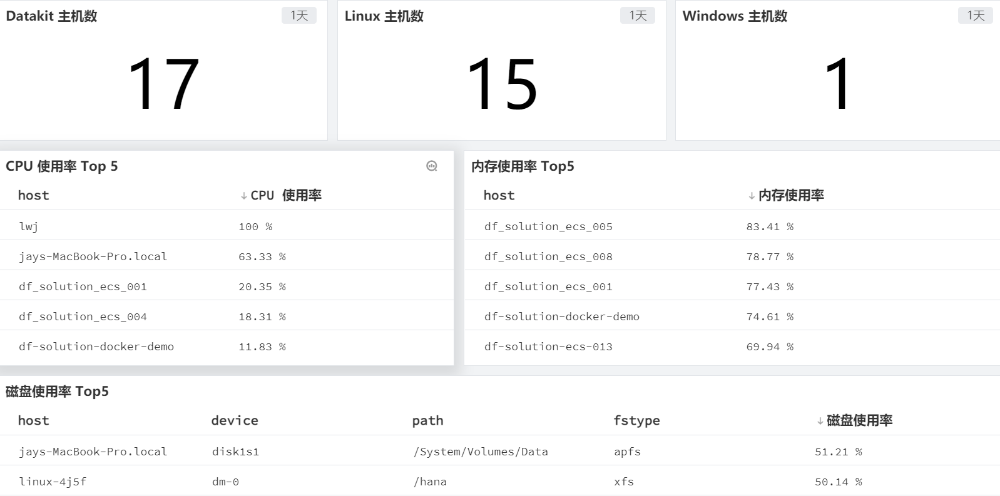

## 前置条件

前往官方网站 [ 观测云](https://www.guance.com) 注册账号，使用已注册的账号/密码登录。

## 安装 DataKit

说明：主机包含 物理机，虚拟机，云主机，都需要安装 DataKit

### Linux

点击 [**集成**] 模块， [_Datakit_]，复制 Linux 操作系统安装命令。


#### 安装目录

- 安装目录 /usr/local/datakit/

- 日志目录 /var/log/datakit/
- 主配置文件 /usr/local/datakit/conf.d/datakit.conf
- 插件配置目录 /usr/local/datakit/conf.d/

### Windows

点击 [**集成**] 模块， [_Datakit_]，复制 Windows 操作系统安装命令 (Powershell)。


#### 安装目录

- 安装目录 C:\Program Files\datakit

- 日志目录 C:\Program Files\datakit\log
- 主配置文件 C:\Program Files\datakit\datakit.conf
- 插件配置目录 C:\Program Files\datakit\conf.d

## 安装部署

### 默认插件

Datakit 安装完成后，已经默认开启主机常用插件，可以在**内置视图**查看。

| 采集器名称 | 说明 |
| --- | --- |
| cpu | 采集主机的 CPU 使用情况 |
| disk | 采集磁盘占用情况 |
| diskio | 采集主机的磁盘 IO 情况 |
| mem | 采集主机的内存使用情况 |
| swap | 采集 Swap 内存使用情况 |
| system | 采集主机操作系统负载 |
| net | 采集主机网络流量情况 |
| host_process | 采集主机上常驻（存活 10min 以上）进程列表 |
| hostobject | 采集主机基础信息（如操作系统信息、硬件信息等） |
| docker | 采集主机上可能的容器对象以及容器日志 |

### 开启进程插件

说明：进程插件比较消耗时间线，默认不开启，无法看到场景内进程视图

进程插件配置路径 vi /usr/local/datakit/conf.d/host/host_processes.conf

```
[[inputs.host_processes]]
 min_run_time = "5m"
 open_metric = true
```

## 内置视图

点击 [**基础设施**] 模块，查看所有已安装 Datakit 的主机列表以及基础信息，如主机名，CPU，内存等。


## 添加场景

### 创建场景

点击 [**场景**] 模块，新建场景


查看 [_主机监控场景_]，可以通过 [_主机名_] 进行筛选。



## 添加检测库

### 默认检测库

点击 [**异常检测库**] 模块，可以看到默认已经配置 [_主机检测库_]，可以根据实际情况添加异常检测规则。


## 指标详情

### CPU

#### 指标列表

| 指标 | 描述 | 数据类型 | 单位 |
| --- | --- | --- | --- |
| core_temperature | CPU core temperature | float | °C |
| usage_guest | % CPU spent running a virtual CPU for guest operating systems. | float | % |
| usage_guest_nice | % CPU spent running a niced guest(virtual CPU for guest operating systems). | float | % |
| usage_idle | % CPU in the idle task. | float | % |
| usage_iowait | % CPU waiting for I/O to complete. | float | % |
| usage_irq | % CPU servicing hardware interrupts. | float | % |
| usage_nice | % CPU in user mode with low priority (nice). | float | % |
| usage_softirq | % CPU servicing soft interrupts. | float | % |
| usage_steal | % CPU spent in other operating systems when running in a virtualized environment. | float | % |
| usage_system | % CPU in system mode. | float | % |
| usage_total | % CPU in total active usage, as well as (100 - usage_idle). | float | % |
| usage_user | % CPU in user mode. | float | % |

#### 指标详解

- 系统 CPU 使用率就是除了空闲时间外的其他时间占总 CPU 时间的百分比。

- 系统 CPU 使用率，不仅包括进程用户态的内核态的运行，还包括中断处理、等待 I/O 以及内核线程等。所以当你发现系统 CPU 使用率很高的时候，不一定能找到相应的高 CPU 使用率的进程。
- 中断是指 CPU 执行程序时，由于发生了某种随机的事件 (硬中断或软中断)，引起 CPU 暂时中断正在运行的程序，转去执行一段特殊的服务程序 (称为中断服务程序或中断处理程序)，以处理该事件，该事件处理完后又返回被中断的程序继续执行。

#### 故障排查

- IOwait 高可能导致负载高，存在频繁写入或 I/O 瓶颈，结合 I/O 状态指标查看。

- 核心态 CPU 高，应该优先排查内核线程和系统调用情况。
- 系统 CPU 在满负荷运行时，可参考下列分布：用户态：65%～70%；核心态：30%～35%；空闲率：0%～5%

### 内存

#### 指标列表

| 指标 | 描述 | 数据类型 | 单位 |
| --- | --- | --- | --- |
| active | Memory that has been used more recently and usually not reclaimed unless absolutely necessary. (Darwin, Linux) | int | Byte |
| available | Amount of available memory | int | Byte |
| available_percent | Available memory percent | float | % |
| buffered | buffered (Linux) | int | Byte |
| cached | In-memory cache for files read from the disk. (Linux) | int | Byte |
| commit_limit | This is the total amount of memory currently available to be allocated on the system. (Linux) | int | Byte |
| committed_as | The amount of memory presently allocated on the system. (Linux) | int | Byte |
| dirty | Memory which is waiting to get written back to the disk. (Linux) | int | Byte |
| free | Amount of free memory(Darwin, Linux) | int | Byte |
| high_free | Amount of free highmem. (Linux) | int | Byte |
| high_total | Total amount of highmem. (Linux) | int | Byte |
| huge_page_total | The size of the pool of huge pages. (Linux) | int | count |
| huge_pages_free | The number of huge pages in the pool that are not yet allocated. (Linux) | int | count |
| huge_pages_size | The size of huge pages. (Linux) | int | Byte |
| inactive | Memory which has been less recently used.  It is more eligible to be reclaimed for other purposes. (Darwin, Linux) | int | Byte |
| low_free | Amount of free lowmem. (Linux) | int | Byte |
| low_total | Total amount of lowmem. (Linux) | int | Byte |
| mapped | Files which have been mapped into memory, such as libraries. (Linux) | int | Byte |
| page_tables | Amount of memory dedicated to the lowest level of page tables. (Linux) | int | Byte |
| shared | Amount of shared memory (Linux) | int | Byte |
| slab | In-kernel data structures cache. (Linux) | int | Byte |
| sreclaimable | Part of Slab, that might be reclaimed, such as caches. (Linux) | int | Byte |
| sunreclaim | Part of Slab, that cannot be reclaimed on memory pressure. (Linux) | int | Byte |
| swap_cached | Memory that once was swapped out, is swapped back in but still also is in the swap file. (Linux) | int | Byte |
| swap_free | Amount of swap space that is currently unused. (Linux) | int | Byte |
| swap_total | Total amount of swap space available. (Linux) | int | Byte |
| total | Total amount of memory | int | Byte |
| used | Amount of used memory | int | Byte |
| used_percent | Used memory percent | float | % |
| vmalloc_chunk | Largest contiguous block of vmalloc area which is free. (Linux) | int | Byte |
| vmalloc_total | Total size of vmalloc memory area. (Linux) | int | Byte |
| vmalloc_used | Amount of vmalloc area which is used. (Linux) | int | Byte |
| wired | wired (Darwin) | int | Byte |
| write_back | Memory which is actively being written back to the disk. (Linux) | int | Byte |
| write_back_tmp | Memory used by FUSE for temporary writeback buffers. (Linux) | int | Byte |

#### 指标详解

- Buffers (缓冲) 是内核缓冲区用到的内存，对应的是 /proc/meminfo 中的 Buffers 值。它对原始磁盘块的临时存储，也就是用来缓存磁盘的数据，通常不会太大。这样内核可以把分散的写集中起来统一写入，减少对磁盘写入操作。

- Cache (缓存) 是内核页缓存和 Slab 用到的内存，对应的是 /proc/meminfo 中的 Cached 与 SReclaimable 之和。它是从磁盘读取文件的页缓存，也就是用来缓存从文件读取的数据。这样，下次访问文件数据时直接通过内存，而减少对磁盘的读取操作。

#### 故障排查

- OOM (内存溢出) 主机上的内存可能会被耗尽，并且内核将无法回收足够的内存用于运行新的程序，为了保存系统的其余部分，内核会调用 OOM killer 杀掉一些进程，以释放内存，可以从系统日志文件 messages 中查看。

### 磁盘

#### 指标列表

| 指标 | 描述 | 数据类型 | 单位 |
| --- | --- | --- | --- |
| free | Free disk size in bytes | int | Byte |
| inodes_free | Free inodes | int | count |
| inodes_total | Total inodes | int | count |
| inodes_used | Used inodes | int | count |
| total | Total disk size in bytes | int | Byte |
| used | Used disk size in bytes | int | Byte |
| used_percent | Used disk size in percent | float | % |

#### 指标详解

- 索引节点，简称 Inode，用来记录文件的元数据，比如 inode 编号、文件大小、访问权限、修改日期等。索引节点和文件一一对应，它跟文件内容一样，都会被持久化存储到磁盘，索引节点也会占用磁盘空间。
#### 故障排查

- 磁盘空间充足，但是无法写入数据，可以查看 Inode 使用率 (一般由于小文件过多导致)。

### IO

#### 指标列表

| 指标 | 描述 | 数据类型 | 单位 |
| --- | --- | --- | --- |
| io_time | time spent doing I/Os | int | msec |
| iops_in_progress | I/Os currently in progress | int | count |
| merged_reads | reads merged | int | count |
| merged_writes | writes merged | int | count |
| read_bytes | read bytes | int | Byte |
| read_bytes/sec | read bytes per second | int | B/s |
| read_time | time spent reading | int | msec |
| reads | reads completed successfully | int | count |
| weighted_io_time | weighted time spent doing I/Os | int | msec |
| write_bytes | write bytes | int | Byte |
| write_bytes/sec | write bytes per second | int | B/s |
| write_time | time spent writing | int | msec |
| writes | writes completed | int | count |

#### 指标详解

- 读写流量是指每秒 I/O 的请求大小，也就是传输速率。

- 读写响应时间是指 I/O 从发出到收到响应的时间间隔。
- IOPS (Input/Output Per Second)，I/O 每秒的请求次数。

#### 故障排查

- 在数据库等大量小文件随机读写比较多的场景中，IOPS 更能反映系统性能；而在多媒体等顺序读写比较多的场景中读写流量才更能反映系统性能。
### 网络

#### 指标列表

| 指标 | 描述 | 数据类型 | 单位 |
| --- | --- | --- | --- |
| bytes_recv | The number of bytes received by the interface. | int | Byte |
| bytes_recv/sec | The number of bytes received by the interface per second. | int | B/s |
| bytes_sent | The number of bytes sent by the interface . | int | Byte |
| bytes_sent/sec | The number of bytes sent by the interface per second. | int | B/s |
| drop_in | The number of received packets dropped by the interface. | int | count |
| drop_out | The number of transmitted packets dropped by the interface. | int | count |
| err_in | The number of receive errors detected by the interface. | int | count |
| err_out | The number of transmit errors detected by the interface. | int | count |
| packets_recv | The number of packets received by the interface. | int | count |
| packets_recv/sec | The number of packets received by the interface per second. | int | count |
| packets_sent | The number of packets sent by the interface. | int | count |
| packets_sent/sec | The number of packets sent by the interface per second. | int | count |
| tcp_activeopens | It means the TCP layer sends a SYN, and come into the SYN-SENT state. | int | count |
| tcp_attemptfails | The number of times TCP connections have made a direct transition to the CLOSED state from either the SYN-SENT state or the SYN-RCVD state, plus the number of times TCP connections have made a direct transition to the LISTEN state from the SYN-RCVD state. | int | count |
| tcp_currestab | The number of TCP connections for which the current state is either ESTABLISHED or CLOSE-WAIT. | int | count |
| tcp_estabresets | The number of times TCP connections have made a direct transition to the CLOSED state from either the ESTABLISHED state or the CLOSE-WAIT state. | int | count |
| tcp_incsumerrors | The number of incoming TCP segments in checksum error | int | count |
| tcp_inerrs | The number of incoming TCP segments in error | int | count |
| tcp_insegs | The number of packets received by the TCP layer. | int | count |
| tcp_insegs/sec | The number of packets received by the TCP layer per second. | int | count |
| tcp_maxconn | The limit on the total number of TCP connections the entity can support. | int | count |
| tcp_outrsts | The number of TCP segments sent containing the RST flag. | int | count |
| tcp_outsegs | The number of packets sent by the TCP layer. | int | count |
| tcp_outsegs/sec | The number of packets sent by the TCP layer per second. | int | count |
| tcp_passiveopens | It means the TCP layer receives a SYN, replies a SYN+ACK, come into the SYN-RCVD state. | int | count |
| tcp_retranssegs | The total number of segments retransmitted - that is, the number of TCP segments transmitted containing one or more previously transmittedoctets. | int | count |
| tcp_rtoalgorithm | The algorithm used to determine the timeout value used for retransmitting unacknowledged octets. | int | count |
| tcp_rtomax | The maximum value permitted by a TCP implementation for the retransmission timeout, measured in milliseconds. | int | msec |
| tcp_rtomin | The minimum value permitted by a TCP implementation for the retransmission timeout, measured in milliseconds. | int | msec |
| udp_ignoredmulti | IgnoredMulti | int | count |
| udp_incsumerrors | The number of incoming UDP datagrams in checksum error | int | count |
| udp_indatagrams | The number of UDP datagrams delivered to UDP users. | int | count |
| udp_indatagrams/sec | The number of UDP datagrams delivered to UDP users per second. | int | count |
| udp_inerrors | The number of packet receive errors | int | count |
| udp_noports | The number of packets to unknown port received. | int | count |
| udp_outdatagrams | The number of UDP datagrams sent from this entity. | int | count |
| udp_outdatagrams/sec | The number of UDP datagrams sent from this entity per second. | int | count |
| udp_rcvbuferrors | The number of receive buffer errors. | int | count |
| udp_sndbuferrors | The number of send buffer errors. | int | count |

#### 指标详解

- 网络流量是指当前两个网络端点之间的数据传输率，通常以 b/s 或 B/s 为单位。

- 网络包传输速率 (Packet Per Second)，用来评估网络的转发能力，比如硬件交换机，通常可以达到线性转发 (即 pps 可以达到接近理论的最大值)。而基于 Linux 服务器的转发，则容易受到网络包大小的影响。

### 交换分区

#### 指标列表

| 指标 | 描述 | 数据类型 | 单位 |
| --- | --- | --- | --- |
| free | Host swap memory total | int | Byte |
| in | Moving data from swap space to main memory of the machine | int | Byte |
| out | Moving main memory contents to swap disk when main memory space fills up | int | Byte |
| total | Host swap memory free | int | Byte |
| used | Host swap memory used | int | Byte |
| used_percent | Host swap memory percentage used | float | % |

#### 指标详解

- Swap 分区在系统的物理内存不够用的时候，把硬盘中的一部分空间释放出来，以供当前运行的程序使用。

### 系统

#### 指标列表

| 指标 | 描述 | 数据类型 | 单位 |
| --- | --- | --- | --- |
| load1 | CPU load average over the last 1 minute | float | - |
| load15 | CPU load average over the last 15 minutes | float | - |
| load15_per_core | CPU load average over the last 15 minutes per core | float | - |
| load1_per_core | CPU load average over the last 1 minute per core | float | - |
| load5 | CPU load average over the last 5 minutes | float | - |
| load5_per_core | CPU load average over the last 5 minutes per core | float | - |
| n_cpus | number of CPUs | int | count |
| n_users | number of users | int | count |
| uptime | system uptime | int | second |

#### 指标详解

- 系统 CPU 平均负载是指单位时间内系统处于 可运行状态 和 不可中断状态 的平均进程数，也就是平均活跃进程数。它和 CPU 使用率并没有直接关系。

- 可运行状态是指正在使用 CPU 或者 正在等待 CPU 的进程，也就是我们常用 ps 命令可以看到的，处于 R 状态 (Running 或 Runnable) 的进程。
- 不可中断状态是指正处于内核态关键流程中的进程，并且这些流程是不可打断的，比如最常见的等待硬件设备 I/O 响应，在 ps 命令中看到的是 D 状态 (Uninterruptible Sleep) 的进程。

#### 故障排查

- CPU 平均负载高，可能是 CPU 密集型应用进程导致。

- I/O 密集型应用可能导致平均负载高但是 CPU 使用率不高。
- 一般来说单核 CPU 平均负载 <2 时，系统性能良好；当 >5 时，那么就表明这个主机存在严重的性能问题。

### 进程

#### 指标列表

| 指标 | 描述 | 数据类型 | 单位 |
| --- | --- | --- | --- |
| cmdline | 进程的命令行参数 | string | - |
| cpu_usage | cpu 使用占比（%*100），进程自启动以来所占 CPU 百分比，该值相对会比较稳定（跟 top 的瞬时百分比不同） | float | % |
| mem_used_percent | mem 使用占比（%*100） | float | % |
| message | 进程详细信息 | string | - |
| open_files | open_files 个数(仅支持linux) | int | count |
| rss | Resident Set Size （常驻内存大小） | int | Byte |
| start_time | 进程启动时间 | int | msec |
| state_zombie | 是否是僵尸进程 | bool | - |
| threads | 线程数 | int | count |
| work_directory | 工作目录(仅支持 linux) | string | - |

#### 指标详解

- 僵尸进程是当子进程比父进程先结束，而父进程又没有回收子进程，释放子进程占用的资源，此时子进程将成为一个僵尸进程。如果父进程先退出 ，子进程被 init 接管，子进程退出后 init 会回收其占用的相关资源。
