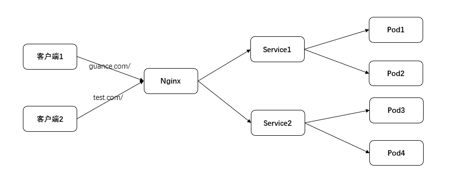
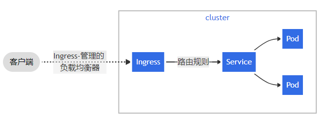
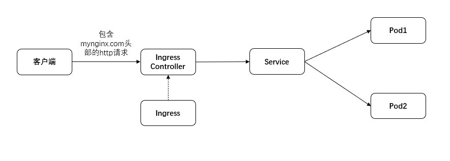
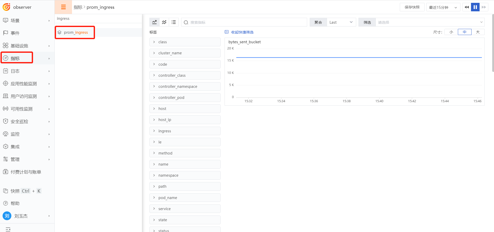

# Nginx Ingress 可观测最佳实践
---

## 简介

Kubernetes  提供了四层代理用来访问部署在 Pod 中的应用，这种具有四层代理的  Service ，Kubernetes  提供了四种访问方式：

1. ClusterIP：供集群内的其它应用访问，外部无法访问。

2.  NodePort：所有节点上开放指定端口，外部可以通过IP+端口访问服务，如果没有指定 NodePort 的端口，默认会随机分配一个30000–32767的端口。

3. LoadBalancer：在 NodePort 基础上，使用云服务商提供的负载均衡器，把流量转发到服务中。

3. ExternalName：通过返回 CNAME 和它的值，可以将服务映射到 externalName 字段的内容。


上述的四种方式都不能满足通过域名来访问集群中的应用，为了通过域名访问部署在  Kubernetes 中的应用，最简单的方式就是在集群中部署一个七层代理 Nginx  ，通过域名来转发到对应的 Service 。如果有新的部署时，就需要更新一下 Nginx  的配置。为了达到更新配置时其它应用无感知， Ingress 出现了。




Ingress 可以把 http 和 https 的请求转发到 Kubernetes 集群内部的服务上，最终访问 Service 后端的Pod。可以将  Ingress  配置为 Service 提供外部可访问的 URL、负载均衡流量、提供基于域名的虚拟主机。




Ingress 包含两大组件 Ingress  Controller和 Ingress ，常用的 Ingress 有traefik  Ingress 和 Nginx    Ingress ，本文以 Nginx    Ingress 为例。 Ingress  Controller 通过与 Kubernetes 的 api 进行交互，动态感知 Kubernetes 集群中 Ingress 服务规则的变化，然后读取这些规则，并按照 Ingress 的规则，转发到 Kubernetes 集群中对应的 Service 上。 Ingress 就是配置这些规则，规则写明了哪个域名对应 Kubernetes 集群中的哪个 Service ，然后根据 Ingress  Controller中 Nginx  配置的模板，生成一段对应的 Nginx  配置， Ingress  Controller再动态加载这些配置，并把这些配置写入 Ingress  Controller 的 Pod 里面运行的 Nginx  服务里，然后reload 一下，使配置生效。

对于部署了 Ingress 的 Kubernetes 集群，我们对 Ingress  Controller的 CPU 使用、内存占用、配置文件加载、转发成功率等资源的观测变得非常有必要了。


** Ingress 工作原理：**

1. 客户端发起[http://myNginx.com](http://mynginx.com)请求。

1. 客户端的 DNS 服务器返回 Ingress 控制器的 IP。
1. 客户端向 Ingress 控制器发送http请求，并在 Host 头中指定[myNginx.com](http://mynginx.com)。
1. 控制器接收到请求后，从头部确定客户端尝试访问哪个服务，通过与该服务关联的 endpoint 对象查看到 pod的 IP。
1. 客户端的请求被转发给具体的 pod 执行。



## 前置条件

### 安装 Kubernetes 

```
https://kubernetes.io/docs/setup/production-environment/tools/
```

### 安装 Datakit

登录[观测云](https://console.guance.com/)，【集成】->【Datakit】-> 【Kubernetes】。

### 部署 Ingress  

生产环境推荐使用 DaemonSet 方式部署 Ingress ，并设置 hosetNetwork 为 true，让 Nginx  直接使用宿主机的网络，然后通过云厂商提供的负载均衡访问 Ingress 。

#### 1 下载 deploy.yaml

```
wget https://raw.githubusercontent.com/kubernetes/ingress-nginx/controller-v1.1.1/deploy/static/provider/baremetal/deploy.yaml
```

#### 2 编辑 deploy.yaml

##### 2.1 替换镜像

使用下面的镜像替换 deploy.yaml 文件中使用的镜像

```
registry.cn-hangzhou.aliyuncs.com/google_containers/nginx-ingress-controller:v1.1.1
registry.cn-hangzhou.aliyuncs.com/google_containers/kube-webhook-certgen:v1.1.1
```

##### 2.2 修改 Deployment 资源文件

找到kind: Deployment部分，修改如下内容：

```
kind: DaemonSet  #修改 

... 

      hostNetwork: true                   #新增
      dnsPolicy: ClusterFirstWithHostNet  #修改
```

```
kubectl apply -f deploy.yaml
```

## 指标采集

### 开启 Input

观测云接入 Ingress 指标数据，需要 datakit 开启 prom 插件，在 prom 插件配置中指定 exporter 的 url，在 Kubernetes 集群中采集 Ingress  Controller指标，推荐使用 annotations 增加注解的方式。打开部署 Ingress 的deploy.yaml 文件，找到上步中修改的 DaemonSet 部分 ，增加 annotations。

```
      annotations:
        datakit/prom.instances: |
          [[inputs.prom]]
            url = "http://$IP:10254/metrics"
            source = "prom-ingress"
            metric_types = ["counter", "gauge", "histogram"]
            # metric_name_filter = ["cpu"]
            # measurement_prefix = ""
            measurement_name = "prom_ingress"
            interval = "10s"
            # tags_ignore = ["xxxx"]
            [[inputs.prom.measurements]]
              prefix = "nginx_ingress_controller_"
              name = "prom_ingress"
            [inputs.prom.tags]
            namespace = "$NAMESPACE"
            pod_name = "$PODNAME"
            
```


参数说明

- url:   Exporter URLs，多个url用逗号分割，示例["[http://127.0.0.1:9100/metrics",](http://127.0.0.1:9100/metrics",) "[http://127.0.0.1:9200/metrics"]](http://127.0.0.1:9200/metrics"])

- source:  采集器别名
- metric_types:  指标类型，可选值是 counter,  gauge,  histogram, summary
- measurement_name:  指标集名称
- interval: 采集频率
- inputs.prom.measurements: 指标集为 prefix 的前缀归为 name 的指标集

annotations中支持如下几个通配符：

- `$IP`：通配 Pod 的内网 IP

- `$NAMESPACE`：Pod Namespace
- `$PODNAME`：Pod Name


### 重启 Ingress  Controller
        
```
kubectl delete -f deploy.yaml
kubectl apply -f deploy.yaml
```
### 演示案例

编写 Nginx  的部署文件  nginx-deployment.yaml。

```
apiVersion: apps/v1
kind: Deployment
metadata:
  name: nginx-deployment
spec:
  selector:
    matchLabels:
      app: backend
  replicas: 1
  template:
    metadata:
      labels:
        app: backend
    spec:
      # nodeName: df-k8s-node2
      containers:
      - name: nginx
        image: nginx:latest
        resources:
          limits:
            memory: "128Mi"
            cpu: "128m"
        ports:
        - containerPort: 80
        
---

apiVersion: v1
kind: Service
metadata:
  name: nginx-service
spec:
  selector:
    app: backend
  ports:
  - port: 80
    targetPort: 80      
```
编写对应的 nginx-ingress .yaml，根据这个规则，如果域名是mynginx .com则转发到 Nginx  - Service 这个 Service 。
```
apiVersion: networking.k8s.io/v1
kind: Ingress
metadata:
  name: nodeport-ingress
  namespace: default  
spec:
  rules:
  - host: mynginx.com
    http:
      paths:
      - pathType: Prefix
        path: /
        backend:
          service:
            name: nginx-service
            port:
              number: 80

```

部署示例

```
kubectl apply -f  nginx-deployment.yaml
kubectl apply -f  nginx-ingress.yaml
```

测试请求，其中8.136.204.98是 Kubernetes 集群中部署了 Ingress 的节点ip，mynginx.com是 nginx-ingress .yaml中对应的host。

```
curl -v http://8.136.204.98 -H 'host: mynginx.com'
```

### 查看指标数据

 登录[观测云](https://console.guance.com/)，【指标】-> 找到 prom_ Ingress 指标，其中 prom_ Ingress 是 annotations 中measurement_name 参数的值。


## 观测 Ingress 

###  Ingress  监控视图

登录[观测云](https://console.guance.com/)，【场景】->【新建仪表板】，在内置模板库中搜索 **Nginx    Ingress  Controller** ，点击搜索到的模板库，仪表板名称输入 **Nginx    Ingress  Controller** ，点击【确定】。

Ingress 性能指标展示： Ingress  Controller 的平均 cpu 使用率、平均内存使用、网络请求/响应合计、 Ingress  Config 的加载次数、 Ingress  Config 上次加载结果、 Ingress 的转发成功率等。


