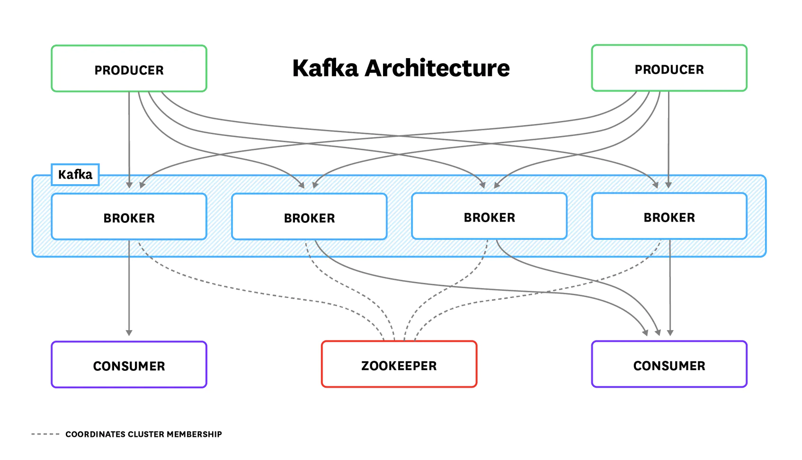
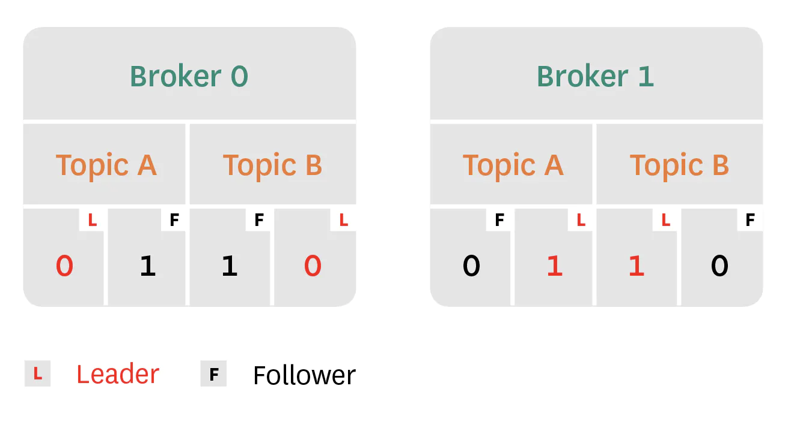
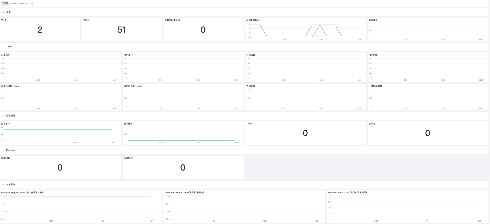
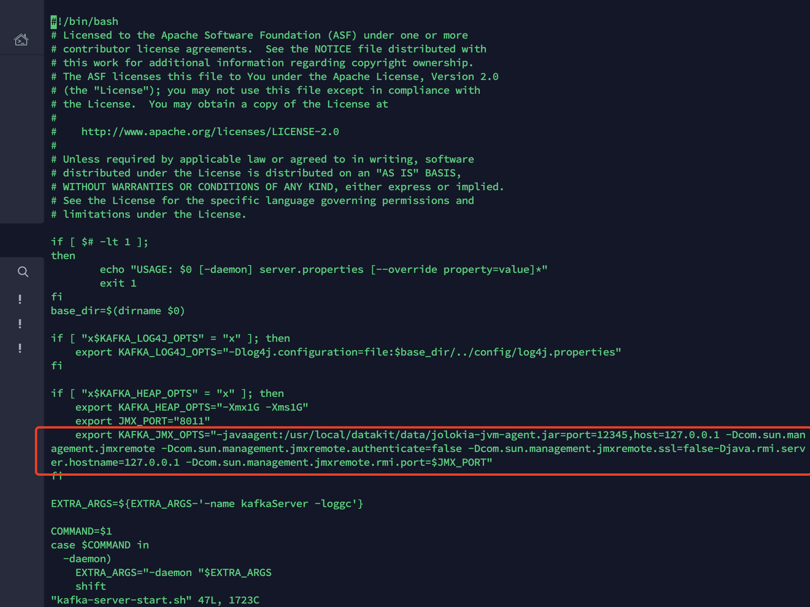
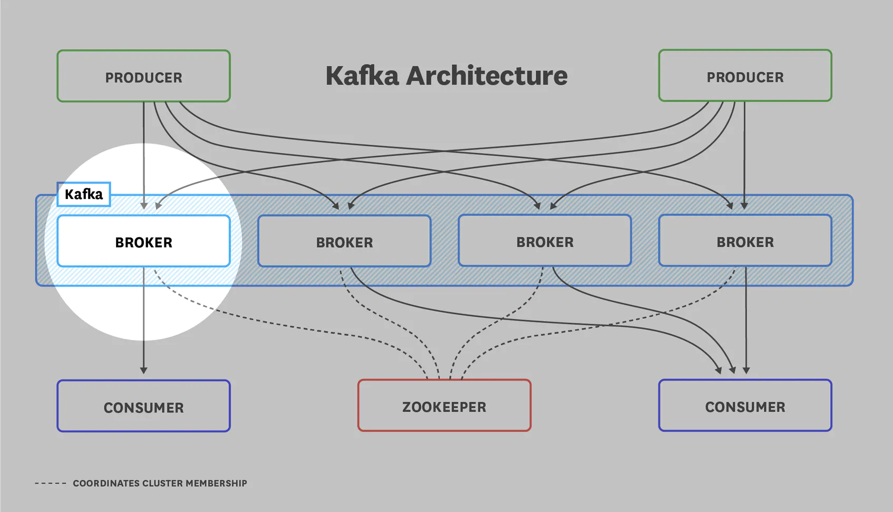
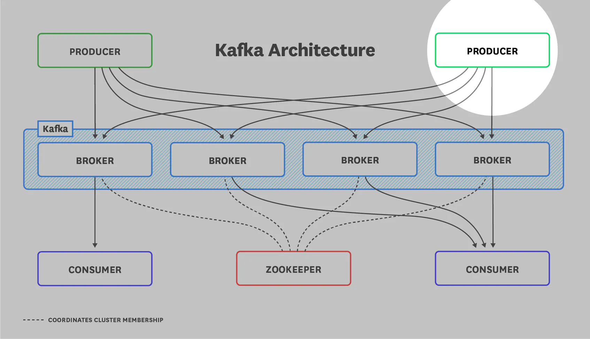
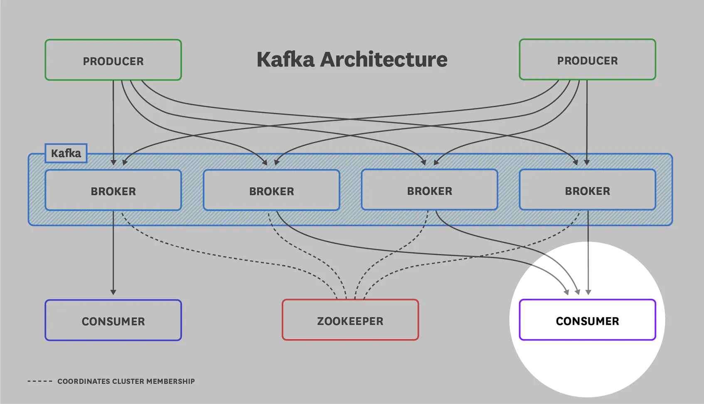
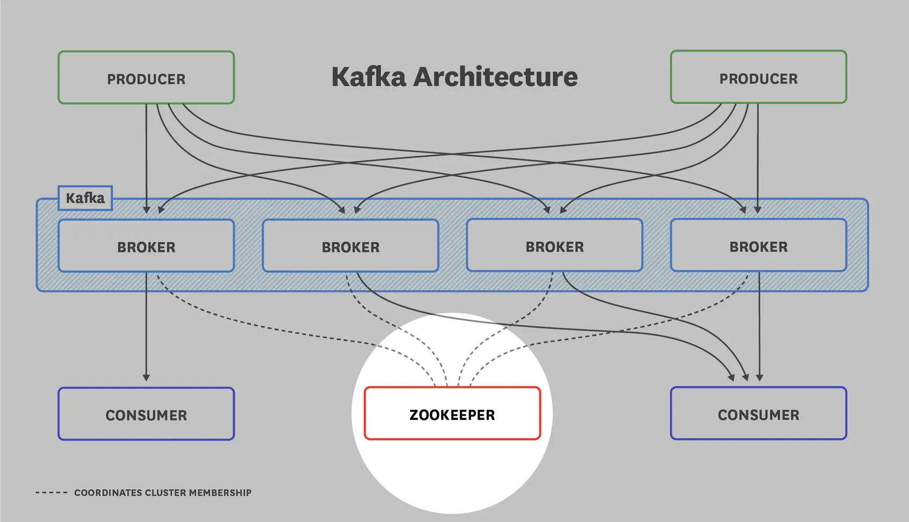

# Kafka可观测最佳实践
---

## 什么是Kafka

Kafka 是由 LinkedIn 开发的分布式，分区，复制日志服务，于 2011 年开源。基本上，它是可扩展的发布/订阅消息队列，被构造为分布式事务日志。 它的创建是为了提供“一个统一的平台来处理大公司可能具有的所有实时数据馈送”。
 
Kafka 与其他排队系统（例如 RabbitMQ，ActiveMQ 或 Redis 的发布/订阅）之间存在一些关键区别：

1. 如上所述，Kafka 从根本上说是一种复制日志服务。

1. 它不使用 AMQP 或任何其他预先存在的协议进行通信。 相反，它使用基于 TCP 的自定义二进制协议。
1. 即使在小型集群中，它也非常快。
1. 它具有强大的排序语义和持久性保证。

Kafka 已被许多组织使用，包括 LinkedIn，Pinterest，Twitter 和 Datadog。 最新版本是 2.4.1 版。

## 架构概述

在开始之前，了解 Kafka 部署的一般体系结构很重要。 每个部署都包含以下所示的组件：



Kafka brokers 充当生产者应用程序（以消息形式（也称为记录）发送数据）与接收这些消息的消费者应用程序之间的中介。 生产者将消息批量发送到 Kafka 代理，以通过减少请求数来最大程度地减少网络开销。  Brokers 存储这些消息，以供消费者按自己的需求拉取。

消息由描述消息的元数据组成、消息有效载荷和可选的任意标题（自 0.11.0 版开始）。 Kafka 中的消息将按照代理接收到的顺序写入日志，并且该消息是不可变的，其中读取是唯一允许的操作。



Kafka 将消息组织成 topic，这些 topic 存储相关消息，并且消费者订阅他们所需的 topic。 topic 本身分为多个分区，并将分区分配给 brokers。 因此，topic 可以在 brokers 级别上强制进行数据分片。 分区数量越多，topic 可以支持的并发使用者越多。

首次设置 Kafka 时，应注意为每个 topic 分配足够数量的分区，并在 brokers 之间公平地划分分区。 首次部署 Kafka 时，这样做可以最大程度地减少日后的麻烦。 

Kafka 的复制功能通过有选择地将每个分区保留在多个 brokers 上来提供高可用性。 在复制的分区中，Kafka 将消息仅写入一个副本（分区 leader）。 其他副本是 follower，从 follower 那里获取消息的副本。 消费者可以从 Kafka 2.4 版开始，从分区 leader 或 follower 那里阅读。 （在旧版本中，使用者只能从分区 leader 读取。）这种体系结构将请求负载分布在整个副本组中。

此外，如果当前 leader 下线，则任何 follower 都有资格充当分区 leader，前提是该 follower 被识别为 **in-sync replica**（ISR）。 如果 Kafka 已成功获取并确认发送给分区 leader 的每条消息，则认为 follower 是同步的。 如果 leader 下线，Kafka 将从 ISR 中选出新的领导者。 但是，如果代理配置为允许 **unclean leader election**（即其 unclean.leader.election.enable 值为 true），则它可能会选择不同步的 leader。

最后但并非最不重要的一点是，如果没有 ZooKeeper，就不会完成 Kafka 的部署。 ZooKeeper 是将所有东西粘合在一起的粘合剂，它负责：

- 选举控制器（管理分区负责人的 Kafka 经纪人）

- 记录集群成员

- 维护主题配置

- 应用您设置的任何配额以限制生产者和消费者的吞吐量

## 场景视图


## Kafka 采集相关配置

### 前置条件

[安装 Datakit](https://www.yuque.com/dataflux/datakit/datakit-install)

### 监控指标采集

#### 配置 kafka-Server 启动脚本

进入您安装 kafka 的目录找到 `kafka-server-start.sh` 插入 `jolokia` 配置进行数据采集工作。示例如下：



>   export KAFKA_JMX_OPTS="-javaagent:/usr/local/datakit/data/jolokia-jvm-agent.jar=port=12345,host=127.0.0.1 -Dcom.sun.management.jmxremote -Dcom.sun.management.jmxremote.authenticate=false -Dcom.sun.management.jmxremote.ssl=false-Djava.rmi.server.hostname=127.0.0.1 -Dcom.sun.management.jmxremote.rmi.port=$JMX_PORT"
>
> port=12345 是你得 jolokia 的数据上报端口，请在下面配置采集器的步骤进行正确配置

#### 需改采集器配置
进入 DataKit 安装目录下的 `conf.d/kafka` 目录，复制 `kafka.conf.sample` 并命名为 `kafka.conf`。示例如下：
```yaml
[[inputs.kafka]]
# default_tag_prefix      = ""
# default_field_prefix    = ""
# default_field_separator = "."

# username = ""
# password = ""
# response_timeout = "5s"

## Optional TLS config
# tls_ca   = "/var/private/ca.pem"
# tls_cert = "/var/private/client.pem"
# tls_key  = "/var/private/client-key.pem"
# insecure_skip_verify = false

## Monitor Intreval
# interval   = "60s"

# Add agents URLs to query
urls = ["http://localhost:12345/jolokia"]

## Add metrics to read
[[inputs.kafka.metric]]
  name         = "kafka_controller"
  mbean        = "kafka.controller:name=*,type=*"
  field_prefix = "#1."

[[inputs.kafka.metric]]
  name         = "kafka_replica_manager"
  mbean        = "kafka.server:name=*,type=ReplicaManager"
  field_prefix = "#1."

[[inputs.kafka.metric]]
  name         = "kafka_purgatory"
  mbean        = "kafka.server:delayedOperation=*,name=*,type=DelayedOperationPurgatory"
  field_prefix = "#1."
  field_name   = "#2"

[[inputs.kafka.metric]]
  name     = "kafka_client"
  mbean    = "kafka.server:client-id=*,type=*"
  tag_keys = ["client-id", "type"]

[[inputs.kafka.metric]]
  name         = "kafka_request"
  mbean        = "kafka.network:name=*,request=*,type=RequestMetrics"
  field_prefix = "#1."
  tag_keys     = ["request"]

[[inputs.kafka.metric]]
  name         = "kafka_topics"
  mbean        = "kafka.server:name=*,type=BrokerTopicMetrics"
  field_prefix = "#1."

[[inputs.kafka.metric]]
  name         = "kafka_topic"
  mbean        = "kafka.server:name=*,topic=*,type=BrokerTopicMetrics"
  field_prefix = "#1."
  tag_keys     = ["topic"]

[[inputs.kafka.metric]]
  name       = "kafka_partition"
  mbean      = "kafka.log:name=*,partition=*,topic=*,type=Log"
  field_name = "#1"
  tag_keys   = ["topic", "partition"]

[[inputs.kafka.metric]]
  name       = "kafka_partition"
  mbean      = "kafka.cluster:name=UnderReplicated,partition=*,topic=*,type=Partition"
  field_name = "UnderReplicatedPartitions"
  tag_keys   = ["topic", "partition"]

#[inputs.kafka.log]
#  files = []
## grok pipeline script path
#  pipeline = "kafka.p"

#[inputs.kafka.tags]
#  a = "b"
```
## 监控 Kafka 的关键指标
运转正常的 Kafka 群集可以处理大量数据。 监视您的Kafka部署的运行状况以保持依赖该应用程序的可靠性能非常重要。

Kafka 指标可以分为三类：

- **Kafka 服务器 (broker) 指标**

- **生产者指标**
- **消费者指标**

由于 Kafka 依赖 ZooKeeper 维护状态，因此监视 ZooKeeper 也很重要。

## Broker 指标

由于所有消息都必须通过 Kafka broker 才能被使用，因此，对在 broker 群集中出现的问题进行监视和警报至关重要。 Broker 指标可以分为三类：

- Kafka-emitted 指标

- Host-level 指标
- JVM 垃圾收集指标



### Kafka-emitted 指标

| Name | MBean name | 描述 | Metric Type |
| --- | --- | --- | --- |
| Under Replicated Partitions | kafka.server:type=ReplicaManager,name=UnderReplicatedPartitions | 未复制的分区数 | Resource: Availability |
| IsrShrinksPerSec/IsrExpandsPerSec | kafka.server:type=ReplicaManager,name=IsrShrinksPerSec kafka.server:type=ReplicaManager,name=IsrExpandsPerSec | 同步副本（ISR）池缩小/扩展的速率 | Resource: Availability |
| ActiveControllerCount | kafka.controller:type=KafkaController,name=ActiveControllerCount | 集群中活动控制器的数量 | Resource: Error |
| OfflinePartitionsCount | kafka.controller:type=KafkaController,name=OfflinePartitionsCount | 离线分区数 | Resource: Availability |
| LeaderElectionRateAndTimeMs | kafka.controller:type=ControllerStats,name=LeaderElectionRateAndTimeMs | leader 选举率和 latency | Other |
| UncleanLeaderElectionsPerSec | kafka.controller:type=ControllerStats,name=UncleanLeaderElectionsPerSec | 每秒“unclean”的选举次数 | Resource: Error |
| TotalTimeMs | kafka.network:type=RequestMetrics,name=TotalTimeMs,request={Produce&#124;FetchConsumer&#124;FetchFollower} | 满足指定请求（生产/提取）的总时间（以毫秒为单位） | Work: Performance |
| PurgatorySize | kafka.server:type=DelayedOperationPurgatory,name=PurgatorySize,delayedOperation={Produce&#124;Fetch} | 在生产者 Purgatory 队列中等待的请求数/在提Purgatory 队列中等待的请求数 | Other |
| BytesInPerSec/BytesOutPerSec | kafka.server:type=BrokerTopicMetrics,name={BytesInPerSec&#124;BytesOutPerSec} | 总计传入/传出字节率 | Work: Throughput |
| RequestsPerSecond | kafka.network:type=RequestMetrics,name=RequestsPerSec,request={Produce&#124;FetchConsumer&#124;FetchFollower},version={0&#124;1&#124;2&#124;3&#124;…} | 每秒（生产者&#124;消费者&#124; follower）请求数 | Work: Throughput |

#### 观测指标：UnderReplicatedPartitions

在运行状况良好的群集中，同步副本（ISR）的数量应完全等于副本的总数。 如果分区副本与 leader 之间的距离太远，则从ISR池中删除了 follower 分区，您应该看到`IsrShrinksPerSec`相应增加。 如果代理不可用，则`UnderReplicatedPartitions`的值将急剧增加。 由于 Kafka 的高可用性保证无法得到复制，因此，如果该指标值在较长时间内超过零，则肯定可以进行调查。

#### 观测指标：IsrShrinksPerSec / IsrExpandsPerSec

特定分区的同步副本（ISR）的数量应保持相当的静态，除非您正在扩展brokers集群或删除分区。 为了维持高可用性，运行状况良好的 Kafka 群集需要最少数量的 ISR 进行故障转移。 如果某个副本在一段时间内未联系 leader，则可以将其从 ISR 池中删除（可使用`copy.socket.timeout.ms`参数进行配置）。 您应该调查这些指标值的任何波动，以及`IsrShrinksPerSec`的任何增加，此后不久都不会相应增加`IsrExpandsPerSec`。

#### 告警指标：ActiveControllerCount

在 Kafka 集群中启动的第一个节点将自动成为控制器，并且只能有一个。 Kafka 集群中的控制器负责维护分区 leader 列表，并协调 leader 过渡（如果分区 leader 不可用）。 如果有必要更换控制器，ZooKeeper 将从 broker 服务器池中随机选择一个新控制器。 所有 brokers 中 ActiveControllerCount 的总和应始终等于 1，并且您应警告持续时间超过一秒的任何其他值。

#### 告警指标：OfflinePartitionsCount（仅控制器）

此度量标准报告没有活动 leader 的分区数。 由于所有读取和写入操作仅在分区引导程序上执行，因此您应针对此指标警告非零值，以防止服务中断。 没有活动 leader 的任何分区将完全无法访问，并且该分区的使用者和生产者都将被阻止，直到有 leader 可用为止。

#### 值得关注的指标：LeaderElectionRateAndTimeMs

当分区 leader 去世时，将触发新 leader 的选举。 如果分区 leader 无法维持其与 ZooKeeper 的会话，则被视为“死亡”。 与 ZooKeeper 的 Zab 不同，Kafka 没有采用多数同意算法来选举 leader。 相反，Kafka 的仲裁由特定分区的所有同步 in-sync（ISR）的集合组成。 如果 in-sync 追赶到 leader，则 in-sync 被认为是同步的，这意味着 ISR 中的任何副本都可以被提升为 leader。

`LeaderElectionRateAndTimeMs`报告 leader 选举的速率（每秒）和群集中没有 leader 的总时间（以毫秒为单位）。 尽管不如`UncleanLeaderElectionsPerSec`差，但您仍需要关注此指标。 如上所述，当与当前 leader 失去联系时会触发 leader 选举，这可能会转化为 offline broker。

#### 告警指标：UncleanLeaderElectionsPerSec

当 Kafka brokers 中没有合格的分区 leader 时，就会发生 unclean 的 leader 选举。 通常，当作为分区 leader 的代理脱机时，将从该分区的 ISR 集中选举出新的 leader。 默认情况下，在 Kafka 版本 0.11 及更高版本中，unclean leader 选举是禁用的，这意味着如果没有任何 ISR 选出新的 leader，则该分区将脱机。 如果将 Kafka配置为允许进行 unclean leader 选举，则会从不同步的副本中选择一个 leader，并且在丢失前任 leader 之前未同步的任何消息都将永远丢失。 从本质上讲，unclean leader 选举牺牲了可用性的一致性。 您应该对此指标发出警报，因为它表示数据丢失。

#### 观测指标：TotalTimeMs

`TotalTimeMs`度量标准系列衡量服务请求（包括生产请求，获取消费者请求或获取跟随者请求）所花费的总时间：

- produce：生产者发出的发送数据的请求

- fetch-consumer：消费者请求获取新数据
- fetch-follower：来自作为分区跟随者的代理的请求以获取新数据

`TotalTimeMs`度量本身是四个指标的总和：

- queue：在请求队列中等待所花费的时间

- local：领导者处理所花费的时间
- remote：等待关注者响应所花费的时间（仅当时`requests.required.acks=-1`）
- response：发送回复的时间

在正常情况下，该值应该是相当静态的，并且波动最小。 如果看到异常行为，则可能需要检查各个队列，本地，远程和响应值，以查明导致速度下降的确切请求段。

#### 观测指标：PurgatorySize

请求 purgatory 队列用作生产和获取等待满足的请求的临时暂挂笔。每种类型的请求都有其自己的参数，以确定是否将其添加到 purgatory 队列中：

- 提取：如果没有足够的数据（`fetch.min.bytes`在使用者上）满足请求（直到使用者指定的时间）`fetch.wait.max.ms`或有足够的数据可用，则将提取请求添加到 purgatory 队列中

- 产生：如果`request.required.acks=-1`，所有产生请求将最终变为 purgatory，直到分区负责人收到所有follower的确认为止。

留意 purgatory 的大小有助于确定潜伏期的根本原因。例如，如果 purgatory 队列中获取请求的数量相应增加，则可以很容易地解释消费者获取时间的增加。

#### 观测指标：BytesInPerSec / BytesOutPerSec

通常，磁盘吞吐量往往是 Kafka 性能的主要瓶颈。 但是，这并不是说网络永远不会成为瓶颈。 如果您要跨数据中心发送消息，topic 数量众多，或者副本正在赶上 leader，则网络吞吐量可能会影响 Kafka 的性能。 跟踪 broker 上的网络吞吐量可为您提供有关潜在瓶颈可能位于何处的更多信息，并可为诸如是否应启用消息的端到端压缩之类的决策提供信息。

#### 观测指标：RequestsPerSec

您应该观测生产者，消费者和 followers 的请求率，以确保您的 Kafka 部署有效地进行通信。 您可以期望 Kafka 的请求率会随着生产者发送更多流量或您的部署扩展而增加，从而增加需要提取消息的消费者或 followers。 但是，如果 RequestsPerSec 仍然很高，则应考虑增加生产者，消费者或 brokers 的大小。 这可以通过减少请求数量来提高 Kafka 部署的吞吐量，从而减少不必要的网络开销。

### 主机级broker指标

| 指标名称 | 描述 | Metric type |
| --- | --- | --- |
| Page cache reads ratio | 从页面缓存读取与从磁盘读取的比率 | Resource: Saturation |
| Disk usage | 当前消耗的磁盘空间与可用磁盘空间 | Resource: Utilization |
| CPU usage | CPU 使用率 | Resource: Utilization |
| Network bytes sent/received | 网络输入/输出 | Resource: Utilization |

#### 观测指标: Page cache read ratio

Kafka 从一开始就被设计为利用内核的页面缓存，以提供可靠的（磁盘支持的）和高性能的（内存中的）消息管道。 页面高速缓存读取率类似于数据库中的高速缓存命中率，该值越高表示读取速度越快，因此性能也越好。 如果副本追上了 leader（如产生新的代理时），则该指标将短暂下降，但是如果您的页面缓存读取率保持在 80％ 以下，则可以从配置其他代理中受益。

#### 告警指标: Disk usage

由于 Kafka 将所有数据持久保存到磁盘，因此有必要监视 Kafka 可用的可用磁盘空间量。 如果 Kafka 的磁盘已满，则它将失败。因此，重要的是要跟踪磁盘随时间的增长，并设置警报以在适当的时间通知管理员，直到磁盘空间用完为止。

#### 观测指标: CPU usage

尽管 Kafka 的主要瓶颈通常是内存，及时密切关注其 CPU 使用率也无济于事。 即使在启用 GZIP 压缩的用例中，CPU 也很少是导致性能问题的根源。 因此，如果您确实看到 CPU 使用率猛增，则值得进行调查。

#### 网络字节发送/接收

如果您正在监控 Kafka 的字节输入/输出指标，那么您将了解 Kafka 的原理。 要全面了解主机上的网络使用情况，您需要监视主机级别的网络吞吐量，尤其是在您的 Kafka 代理托管其他网络服务的情况下。 网络使用率过高可能是性能下降的征兆-如果您看到网络使用率过高，则与 TCP 重传和丢包错误相关联可以帮助确定性能问题是否与网络有关。

### JVM垃圾收集指标

因为 Kafka 是用 Scala 编写的，并且在 Java 虚拟机（JVM）中运行，所以它依赖 Java 垃圾回收进程释放内存。 Kafka 集群中的活动越多，垃圾收集运行的频率就越高。

任何熟悉 Java 应用程序的人都知道，垃圾回收会带来很高的性能成本。 由于垃圾回收而导致的长时间停顿最明显的效果是废弃的 ZooKeeper 会话增加（由于会话超时）。

垃圾收集的类型取决于是否要收集年轻的一代（新对象）或旧的一代（长期存在的对象）。

如果在垃圾回收期间看到过多的暂停，则可以考虑升级JDK版本或垃圾回收器（或延长`zookeeper.session.timeout.ms`的超时时间）。 此外，您可以调整 Java 运行时以最大程度地减少垃圾回收。

| JMX 属性 | MBean名称 | 描述 | 类型 |
| --- | --- | --- | --- |
| CollectionCount | java.lang:type=GarbageCollector,name=G1 (Young&#124;Old) Generation | JVM 执行的新旧垃圾回收进程总数 | Other |
| CollectionTime | java.lang:type=GarbageCollector,name=G1 (Young&#124;Old) Generation | JVM 执行旧的或旧的垃圾收集进程所花费的总时间（以毫秒为单位） | Other |

#### 观测指标: Young generation garbage collection time

年轻代垃圾收集相对经常发生。这是一种 stop-the-world 垃圾收集，意思是在它执行时，所有应用程序线程都会暂停。这个指标的任何显著增加都会显著影响 Kafka 的性能。

#### 观测指标: Old generation garbage collection count/time

老代垃圾收集释放老代堆中未使用的内存。这是低暂停垃圾收集，这意味着虽然它会暂时停止应用程序线程，但它只是间歇性地这样做。如果这个过程需要几秒钟才能完成，或者发生的频率越来越高，那么您的集群可能没有足够的内存来有效地运行。

## Kafka生产者指标

Kafka 生产者是独立的过程，将消息推送到代理主题进行消费。 如果生产者失败，消费者将没有新的消息。 以下是一些最有用的生产者指标，可以用来监视这些指标以确保稳定的传入数据流。



| JMX 属性 | MBean 名称 | 描述 | Metric type |
| --- | --- | --- | --- |
| compression-rate-avg | kafka.producer:type=producer-metrics,client-id=([-.w]+) | 已发送批次的平均压缩率 | Work: Other |
| response-rate | kafka.producer:type=producer-metrics,client-id=([-.w]+) | 每秒收到的平均响应数 | Work: Throughput |
| request-rate | kafka.producer:type=producer-metrics,client-id=([-.w]+) | 每秒发送的平均请求数 | Work: Throughput |
| request-latency-avg | kafka.producer:type=producer-metrics,client-id=([-.w]+) | 平均请求等待时间（以毫秒为单位） | Work: Throughput |
| outgoing-byte-rate | kafka.producer:type=producer-metrics,client-id=([-.w]+) | 每秒平均传出/传入字节数 | Work: Throughput |
| io-wait-time-ns-avg | kafka.producer:type=producer-metrics,client-id=([-.w]+) | I / O 线程等待套接字所花费的平均时间长度（以 ns 为单位） | Work: Throughput |
| batch-size-avg | kafka.producer:type=producer-metrics,client-id=([-.w]+) | 每个分区每个请求发送的平均字节数 | Work: Throughput |

#### 观测指标: Compression rate

此度量标准反映了生产者发送给 broker 的数据批次中的数据压缩率。 较高的压缩率表示较高的效率。 如果该指标下降，则可能表明数据形状存在问题，或者流氓生产者正在发送未压缩的数据。

#### 观测指标: Response rate

对于生产者，响应率表示从 brokers 那里收到的响应率。 收到数据后，brokers对生产者做出响应。 根据您的配置，“接收到”可能具有以下三种含义之一：

- 邮件已收到，但未提交（`request.required.acks == 0`）

- leader 已将消息写入磁盘（`request.required.acks == 1`）
- leader 已从所有副本收到确认已将数据写入磁盘（`request.required.acks == all`）

在收到所需数量的确认之前，生产者数据不可用于消费。

如果您看到较低的响应率，则可能有许多因素在起作用。 一个不错的起点是检查 broker 上的`request.required.acks`配置指令。 为`request.required.acks`选择正确的值完全取决于用例，这取决于您是否要为了一致性而牺牲可用性。

#### 观测指标: Request rate

请求速率是生产者将数据发送给 brokers 的速率。 当然，根据使用情况，构成正常请求率的因素将有很大的不同。 密切注意高峰和下降对确保持续的服务可用性至关重要。 如果未启用速率限制，则在流量激增的情况下，broker 可能会难以抓取，因为它们难以处理快速流入的数据。

#### 观测指标: Request latency average

平均请求等待时间是对从调用`KafkaProducer.send()`到生产者收到来自 broker 的响应之间的时间量的度量。

生产者不一定要在创建每条消息后就立即发送它们。生产者的 linger.ms 值确定在发送消息批之前它将等待的最长时间，这有可能允许它累积大量消息，然后再在单个请求中发送它们。 linger.ms 的默认值为 0 ms；默认值为 0 ms。将此值设置为较高的值可以增加延迟，但同时也可以帮助提高吞吐量，因为生产者将能够发送多个消息而不会增加每个消息的网络开销。如果您增加 linger.ms 以提高 Kafka 部署的吞吐量，则应监控请求延迟，以确保其不会超出可接受的限制。

由于延迟与吞吐量密切相关，值得一提的是，在生产者配置中修改 batch.size 可以显着提高吞吐量。确定最佳的批处理大小在很大程度上取决于用例，但是一般的经验法则是，如果您有可用的内存，则应增加批处理大小。请记住，您配置的批次大小是一个上限。请注意，小批量涉及更多的网络往返，这可能会降低吞吐量。

#### 观测指标: Outgoing byte rate

与 Kafka brokers 一样，您将需要监视生产者网络的吞吐量。 观察一段时间内的流量对于确定是否需要更改网络基础结构至关重要。 监视生产者网络流量将有助于通知有关基础结构更改的决策，并为了解生产者的生产率提供一个窗口，并确定过量流量的来源。

#### 观测指标: I/O wait time

生产者通常执行以下两项操作之一：等待数据，然后发送数据。 如果生产者产生的数据量超出其发送能力，那么他们最终将等待网络资源。 但是，如果生产者不受速率的限制或带宽的最大化，则瓶颈将变得更加难以识别。 因为磁盘访问通常是所有处理任务中最慢的部分，所以检查生产者的 I / O 等待时间是一个很好的起点。 请记住，I / O 等待时间表示CPU空闲时执行 I / O 的时间百分比。 如果您看到等待时间过多，则意味着您的生产者无法足够快地获取他们需要的数据。 如果您将传统硬盘驱动器用于存储后端，则可能需要考虑使用 SSD。

#### 观测指标: Batch size

为了更有效地使用网络资源，Kafka 生产者尝试在发送消息之前将消息分组。 生产者将等待累积由`batch.size`定义的数据量（默认为 16 KB），但它的等待时间不会超过 linger.ms 的值（默认为 0 毫秒）。 如果生产者发送的批次大小始终小于配置的 batch.size，则浪费您的生产者花费时间的所有时间都在等待从未到达的其他数据。 如果批量大小的值小于配置的 batch.size，请考虑减少 linger.ms 设置。

## Kafka消费者指标



| JMX 属性 | MBean 名称 | 描述 | Metric type |
| --- | --- | --- | --- |
| records-lag | kafka.consumer:type=consumer-fetch-manager-metrics,client-id=([-.w]+),topic=([-.w]+),partition=([-.w]+) | 消费者在此分区上落后于生产者的消息数 | Work: Performance |
| records-lag-max | kafka.consumer:type=consumer-fetch-manager-metrics,client-id=([-.w]+),topic=([-.w]+),partition=([-.w]+)<br />kafka.consumer:type=consumer-fetch-manager-metrics,client-id=([-.w]+) | 对于该客户端上的特定分区或所有分区，使用者最大的消息消耗方落后于生产方 | Work: Performance |
| bytes-consumed-rate | kafka.consumer:type=consumer-fetch-manager-metrics,client-id=([-.w]+),topic=([-.w]+)<br />kafka.consumer:type=consumer-fetch-manager-metrics,client-id=([-.w]+) | 特定主题或所有主题每秒平均消耗的字节数。 | Work: Throughput |
| records-consumed-rate | kafka.consumer:type=consumer-fetch-manager-metrics,client-id=([-.w]+),topic=([-.w]+)<br />kafka.consumer:type=consumer-fetch-manager-metrics,client-id=([-.w]+) | 特定主题或所有主题每秒平均消耗的记录数 | Work: Throughput |
| fetch-rate | kafka.consumer:type=consumer-fetch-manager-metrics,client_id=([-.w]+) | 使用者每秒获取的请求数 | Work: Throughput |

#### 观测指标: Records lag/Records lag max

记录滞后是消费者当前的日志偏移量和生产者的当前日志偏移量之间的计算差。 记录滞后最大值是记录滞后的最大观察值。 这些指标值的重要性完全取决于您的消费者在做什么。 如果您的使用者将旧邮件备份到长期存储中，则可以期望记录滞后会很大。 但是，如果您的使用者正在处理实时数据，则始终较高的滞后值可能表示使用者过载，在这种情况下，配置更多使用者和将主题划分到更多分区中都可以帮助提高吞吐量并减少滞后。

#### 观测指标: bytes consumed rate

与生产者和经纪人一样，您将需要监视您的消费者网络吞吐量。 例如，记录消耗率（records-consumed-rate）的突然下降可能表示使用者失败，但是如果其网络吞吐量（bytes-consumed-rate）保持恒定，它仍然是健康的——只是消耗更少、更大的消息。随着时间的推移，在其他指标的背景下观察流量，对于诊断异常网络使用是很重要的。

#### 观测指标: records consumed rate

每条 Kafka 消息都是一条数据记录。 每秒消耗的记录速率可能与消耗的字节速率没有很强的相关性，因为消息的大小可能是可变的。 根据您的生产者和工作负载，在典型的部署中，您应该期望这个数字保持相当稳定。 通过随着时间的推移监控此指标，您可以发现数据消耗的趋势并创建可以发出警报的基线。

#### 观测指标: fetch rate

消费者的获取率可以很好地反映消费者的整体健康状况。 接近零值的获取率可能表明消费者存在问题。 在健康的消费者中，最小提取率通常不为零，因此如果您看到此值下降，则可能是消费者消费消息失败的迹象。

## 为什么要监控ZooKeeper

ZooKeeper 在 Kafka 部署中扮演着重要的角色。 它负责维护有关 Kafka 代理和主题的信息，应用配额来管理通过部署的流量速率，并存储有关副本的信息，以便 Kafka 可以在部署状态发生变化时选举分区 Leader。 ZooKeeper 是 Kafka 部署的关键组件，ZooKeeper 中断将使 Kafka 停止运行。 要运行可靠的 Kafka 集群，您应该在称为集成的高可用性配置中部署 ZooKeeper。 但是，无论您运行的是集成还是单个 ZooKeeper 主机，监控 ZooKeeper 都是维护健康的 Kafka 集群的关键。



## Zookeeper监控指标

ZooKeeper 通过 MBean、使用 “the four-letter words"的命令行界面以及 AdminServer 提供的 HTTP 端点公开指标。

| 名称 | 描述 | 指标类型 | 可用性 |
| --- | --- | --- | --- |
| outstanding_requests | 排队的请求数 | 资源：饱和度 | Four-letter words,<br />AdminServer，JMX |
| avg_latency | 响应客户端请求所花费的时间（以毫秒为单位） | 工作：吞吐量 | Four-letter words,<br />AdminServer，JMX |
| num_alive_connections | 连接到ZooKeeper的客户端数量 | 资源：可用性 | Four-letter words,<br />AdminServer，JMX |
| followers | 活跃followers数量 | 资源：可用性 | Four-letter words,<br />AdminServer |
| pending_syncs | followers未完成的同步处理次数 | 其他 | Four-letter words,<br />AdminServer，JMX |
| open_file_descriptor_count | 正在使用的文件描述符数量 | 资源利用率 | Four-letter words,<br />AdminServer |

#### 观测指标: Outstanding requests
客户端提交请求的速度可能比 ZooKeeper 处理它们的速度更快。 如果您有大量客户端，几乎可以确定这种情况偶尔会发生。 为了防止由于排队请求而耗尽所有可用内存，ZooKeeper 将在达到其队列限制时限制客户端——这在 ZooKeeper 的 `zookeeper.globalOutstandingLimit` 设置中定义（默认为 1,000）。 如果请求等待一段时间才能得到服务，您将在报告的平均延迟中看到相关性。 跟踪未完成的请求和延迟可以让您更清楚地了解性能下降背后的原因。
#### 观测指标: Average latency
平均请求延迟是 ZooKeeper 响应请求所需的平均时间（以毫秒为单位）。 ZooKeeper 在将事务写入其事务日志之前不会响应请求。 如果 ZooKeeper 整体的性能下降，您可以将平均延迟与未完成的请求和待处理的同步相关联，以深入了解导致速度下降的原因。
#### 观测指标: Number of alive connections
ZooKeeper 通过 `num_alive_connections` 指标报告连接到它的客户端数量。 这表示所有连接，包括与非 ZooKeeper 节点的连接。 在大多数环境中，这个数字应该保持相当稳定——通常，消费者、生产者、Brokers 和 ZooKeeper 节点的数量应该保持相对稳定。 您应该注意此值的意外下降； 由于 Kafka 使用 ZooKeeper 来协调工作，因此与 ZooKeeper 的连接丢失可能会产生许多不同的影响，具体取决于断开连接的客户端。
#### 观测指标: Followers (leader only)
followers 的数量应该等于 ZooKeeper 集合的总大小减一。 （leader 不包括在 followers 计数中）。 您应该对该值的任何更改发出警报，因为您的集合的大小应该仅因用户干预而更改（例如，管理员停用一个节点）。
#### 观测指标: Pending syncs (leader only)
事务日志是 ZooKeeper 中性能最关键的部分。 ZooKeeper 必须在返回响应之前将事务同步到磁盘，因此大量挂起的同步将导致延迟增加。 在长时间未完成的同步之后，性能无疑会受到影响，因为 ZooKeeper 在执行同步之前无法为请求提供服务。 您应该考虑在 `pending_syncs` 值大于 10 时发出警报。
#### 观测指标: Open file descriptor count
ZooKeeper 在文件系统上维护状态，每个 `znode` 对应磁盘上的一个子目录。 Linux 具有有限数量的可用文件描述符。 这是可配置的，因此您应该将此指标与系统配置的限制进行比较，并根据需要增加限制。
### ZooKeeper系统指标
除了 ZooKeeper 本身发出的指标之外，还值得监视一些主机级别的 ZooKeeper 指标。

| 名称 | 描述 | 指标类型 |
| --- | --- | --- |
| Bytes sent/received | ZooKeeper 主机发送/接收的字节数 | 资源利用率 |
| Usable memory | ZooKeeper 可用的未使用内存量 | 资源利用率 |
| Swap usage | ZooKeeper 使用的交换空间量 | 资源：饱和度 |
| Disk latency | 从磁盘请求数据和返回数据之间的时间延迟 | 资源：饱和度 |

#### 观测指标: Bytes sent/received
在具有许多消费者和分区的大规模部署中，ZooKeeper 可能成为瓶颈，因为它记录和传达集群的变化状态。 跟踪一段时间内发送和接收的字节数有助于诊断性能问题。 如果 ZooKeeper 集合中的流量增加，您应该配置更多节点以容纳更高的流量。
#### 观测指标: Usable memory
ZooKeeper 应该完全驻留在 RAM 中，如果它必须分页到磁盘，将会受到很大影响。 因此，跟踪可用内存量对于确保 ZooKeeper 以最佳方式执行是必要的。 请记住，因为 ZooKeeper 用于存储状态，所以整个集群都会感觉到 ZooKeeper 性能的下降。 配置为 ZooKeeper 节点的机器应该有足够的内存缓冲区来处理负载激增。
#### 观测指标: Swap usage
如果 ZooKeeper 内存不足，swap 内存使用量上升，这将导致它变慢。 您应该对任何交换使用情况发出警报，以便您可以配置更多内存。
#### 观测指标: Disk latency
尽管 ZooKeeper 应该驻留在 RAM 中，但它仍然利用文件系统来定期对其当前状态进行快照并维护所有事务的日志。 鉴于 ZooKeeper 必须在更新发生之前将事务写入非易失性存储，这使得磁盘访问成为潜在的瓶颈。 磁盘延迟的峰值会导致与 ZooKeeper 通信的所有主机的服务质量下降，因此除了为您的整体配备 SSD 之外，您还应该密切关注磁盘延迟。
## 监控您的Kafka部署
在本文中，我们探讨了许多关键指标，您应该监控这些指标以掌握Kafka群集的运行状况和性能。

作为消息队列，Kafka 永远不会在真空中运行。最终，您将认识到与您自己的Kafka群集及其用户特别相关的其他更专业的指标。我们将向您展示如何使用 [DataFlux](https://console.dataflux.cn/insight/scen_445c945772b845bd81b751c894ff31eb?dashboard_id=dsbd_75d15ec105a14566beacc2fcdabfc951&node_id=node_f5c06a7c689f45e8a71402e5735e9b30&viewType=chart&time=15m&variable=%7B%22host%22%3A%22df-solution-ecs-011%22%7D) 收集对您重要的 Kafka 指标以及跟踪和日志，以便您可以完全了解 Kafka 集群的运行状况。

