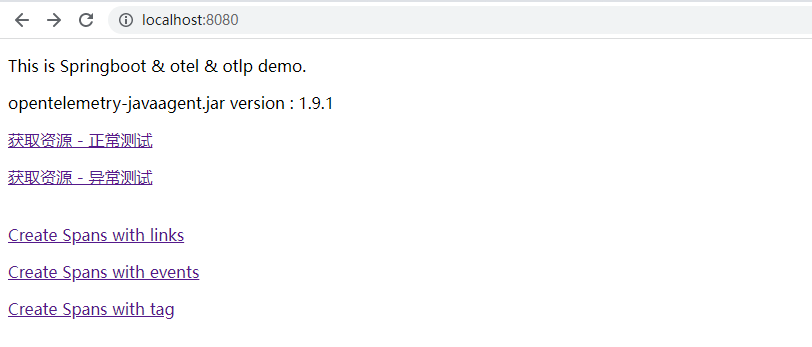
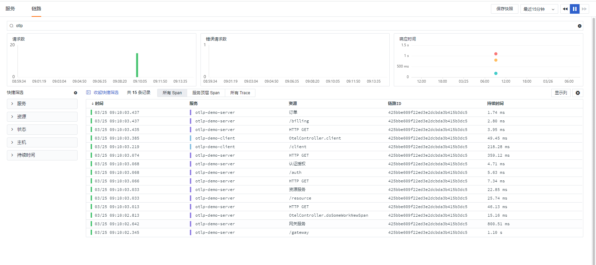

# OpenTelemetry 链路数据接入最佳实践
--- 

## OpenTelemetry 简介
OTEL 是 OpenTelemetry 的简称， 是 CNCF 的一个可观测性项目，旨在提供可观测性领域的标准化方案，解决观测数据的数据模型、采集、处理、导出等的标准化问题，提供与三方 vendor 无关的服务。

OpenTelemetry 是一组标准和工具的集合，旨在管理观测类数据，如 Traces、Metrics、Logs 等 (未来可能有新的观测类数据类型出现)。目前已经是业内的标准。

## OTLP 简介
OTLP（全称 OpenTelemetry Protocol ）是 OpenTelemetry 原生的遥测信号传递协议，虽然在 OpenTelemetry 的项目中组件支持了Zipkin v2或Jaeger Thrift的协议格式的实现，但是都是以第三方贡献库的形式提供的。只有 OTLP 是 OpenTelemetry 官方原生支持的格式。OTLP 的数据模型定义是基于 ProtoBuf 完成的，如果你需要实现一套可以收集 OTLP 遥测数据的后端服务，那就需要了解里面的内容，对应可以参考代码仓库：opentelemetry-proto（[https://github.com/open-telemetry/opentelemetry-proto](https://github.com/open-telemetry/opentelemetry-proto)）

DataKit 只需开启 OpenTelemetry Input，即可采集 OpenTelemetry Agent上报来的链路数据。当前最佳实践以两个 Springboot 应用间互相调用，采用 OTLP exporter (span, metric, and log exporters) 作为链路，将数据输出到 DataKit ，完成服务间可观测。
## 前置条件
### 安装 DataKit

- <[安装 DataKit](https://www.yuque.com/dataflux/datakit/datakit-install)>

- DataKit 接入版本 >=1.2.12

## 数据接入

### 开启 Input

1. 开启 OpenTelemetry 插件，复制 Sample 文件
```shell
cd /usr/local/datakit/conf.d/opentelemetry
cp opentelemetry.conf.sample opentelemetry.conf
```

2. 修改 opentelemetry.conf
```shell
[[inputs.opentelemetry]]
  ## 在创建'trace',Span','resource'时，会加入很多标签，这些标签最终都会出现在'Span'中
  ## 当您不希望这些标签太多造成网络上不必要的流量损失时，可选择忽略掉这些标签
  ## 支持正则表达，注意:将所有的'.'替换成'_'
  ## When creating 'trace', 'span' and 'resource', many labels will be added, and these labels will eventually appear in all 'spans'
  ## When you don't want too many labels to cause unnecessary traffic loss on the network, you can choose to ignore these labels
  ## Support regular expression. Note!!!: all '.' Replace with '_'
  # ignore_attribute_keys = ["os_*","process_*"]

  ## Keep rare tracing resources list switch.
  ## If some resources are rare enough(not presend in 1 hour), those resource will always send
  ## to data center and do not consider samplers and filters.
  # keep_rare_resource = false

  ## Ignore tracing resources map like service:[resources...].
  ## The service name is the full service name in current application.
  ## The resource list is regular expressions uses to block resource names.
  # [inputs.opentelemetry.close_resource]
    # service1 = ["resource1", "resource2", ...]
    # service2 = ["resource1", "resource2", ...]
    # ...

  ## Sampler config uses to set global sampling strategy.
  ## priority uses to set tracing data propagation level, the valid values are -1, 0, 1
  ##   -1: always reject any tracing data send to datakit
  ##    0: accept tracing data and calculate with sampling_rate
  ##    1: always send to data center and do not consider sampling_rate
  ## sampling_rate used to set global sampling rate
  # [inputs.opentelemetry.sampler]
    # priority = 0
    # sampling_rate = 1.0

  # [inputs.opentelemetry.tags]
    # key1 = "value1"
    # key2 = "value2"
    # ...

  [inputs.opentelemetry.expectedHeaders]
    ## 如有header配置 则请求中必须要携带 否则返回状态码500
	## 可作为安全检测使用,必须全部小写
	# ex_version = xxx
	# ex_name = xxx
	# ...

  ## grpc
  [inputs.opentelemetry.grpc]
  ## trace for grpc
  trace_enable = true

  ## metric for grpc
  metric_enable = true

  ## grpc listen addr
  # addr = "127.0.0.1:4317"
  addr = "0.0.0.0:4317"

  ## http
  [inputs.opentelemetry.http]
  ## if enable=true
  ## http path (do not edit):
  ##	trace : /otel/v1/trace
  ##	metric: /otel/v1/metric
  ## use as : http://127.0.0.1:9529/otel/v11/trace . Method = POST
  enable = false
  ## return to client status_ok_code :200/202
  http_status_ok = 200

```
参数说明

- trace_enable：true 		#开启grpc trace
- metric_enable： true 	    #开启grpc metric
- addr: 0.0.0.0:4317 		    #开启端口

3. 重启 DataKit
```shell
datakit --restart
```

## Java 链路数据接入

### OpenTelemetry Java Agent

#### 下载

- [opentelemetry-javaagent.jar](https://github.com/open-telemetry/opentelemetry-java-instrumentation/releases/download/v1.9.1/opentelemetry-javaagent.jar) 下载

#### OTLP exporter 参数介绍

| **System property** | **Environment variable** | **Description** |
| --- | --- | --- |
| otel.traces.exporter=otlp (default) | OTEL_TRACES_EXPORTER=otlp | Select the OpenTelemetry exporter for tracing (default) |
| otel.metrics.exporter=otlp | OTEL_METRICS_EXPORTER=otlp | Select the OpenTelemetry exporter for metrics |
| otel.logs.exporter=otlp | OTEL_LOGS_EXPORTER=otlp | Select the OpenTelemetry exporter for logs |

更多参数，请参照[ opentelemetry-java 官方文档](https://github.com/open-telemetry/opentelemetry-java/blob/main/sdk-extensions/autoconfigure/README.md#otlp-exporter-both-span-and-metric-exporters)。

### 启动 Java 应用

本示例部署 2 个微服务，server 和 client 。应用源码：[https://github.com/lrwh/observable-demo](https://github.com/lrwh/observable-demo)
```shell
java -javaagent:D:/code_zy/observable-demo/opentelemetry-javaagent/opentelemetry-javaagent.jar -Dotel.traces.exporter=otlp \
-Dotel.exporter.otlp.endpoint=http://192.168.91.11:4317 \
-Dotel.resource.attributes=service.name=otlp-demo-server \
-Dotel.metrics.exporter=none \
-jar springboot-opentelemetry-otlp-server.jar --trace.exporter.host=192.168.91.11 --trace.exporter.port=4317 --client=true
```

```shell
java -javaagent:D:/code_zy/observable-demo/opentelemetry-javaagent/opentelemetry-javaagent.jar -Dotel.traces.exporter=otlp \
-Dotel.exporter.otlp.endpoint=http://192.168.91.11:4317 \
-Dotel.resource.attributes=service.name=otlp-demo-client \
-Dotel.metrics.exporter=none \
-jar springboot-opentelemetry-otlp-client.jar
```

otel.exporter.otlp.endpoint ：  otlp grpc 接收地址。

otel.resource.attributes：配置参数，两个服务分别指定 service.name 为 otlp-demo-server 和 otlp-demo-client。

otel.metrics.exporter：配置 Metric Exporter ,当前案例为 none （不需要做 metric 输出，如果需要的话，可以去掉当前参数或者指定 Exporter 接收地址，默认值为  otel.exporter.otlp.endpoint 的 value）。

### 链路数据
应用启动后，访问应用 http://localhost:8080，点击任意标签产生链路信息。



链路记录




