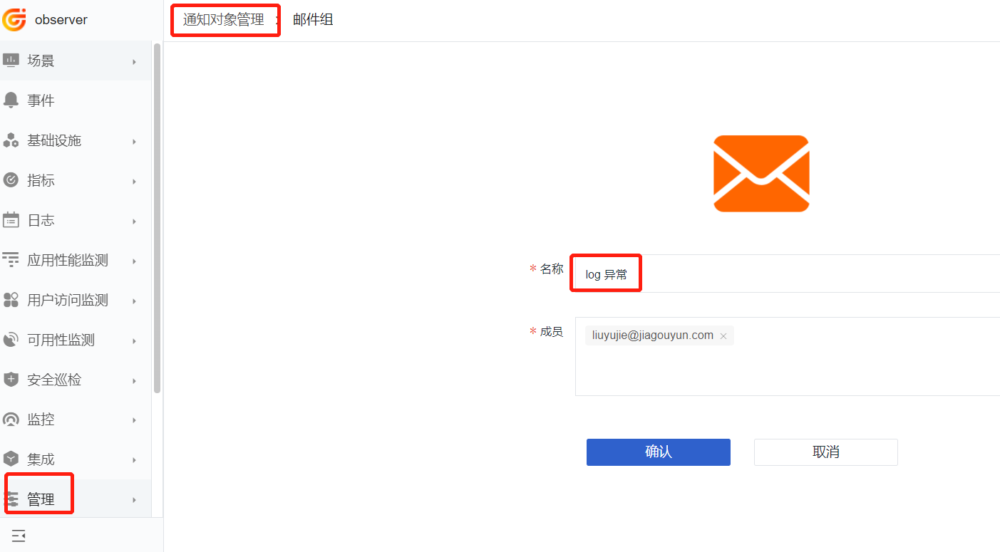
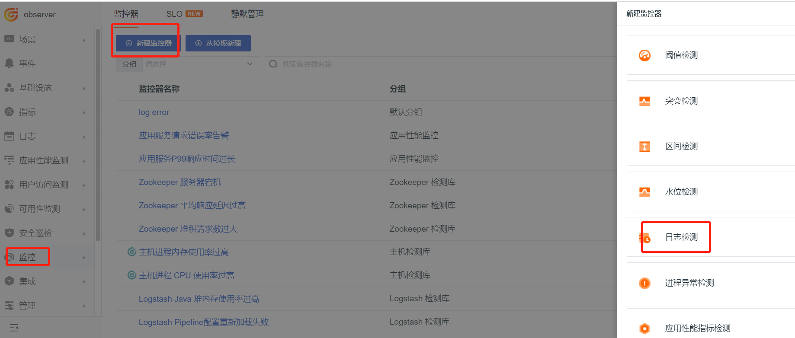
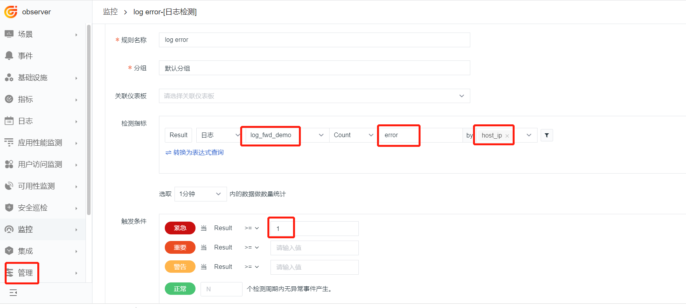
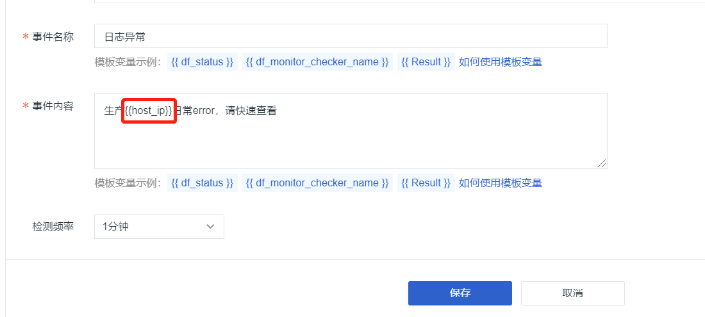
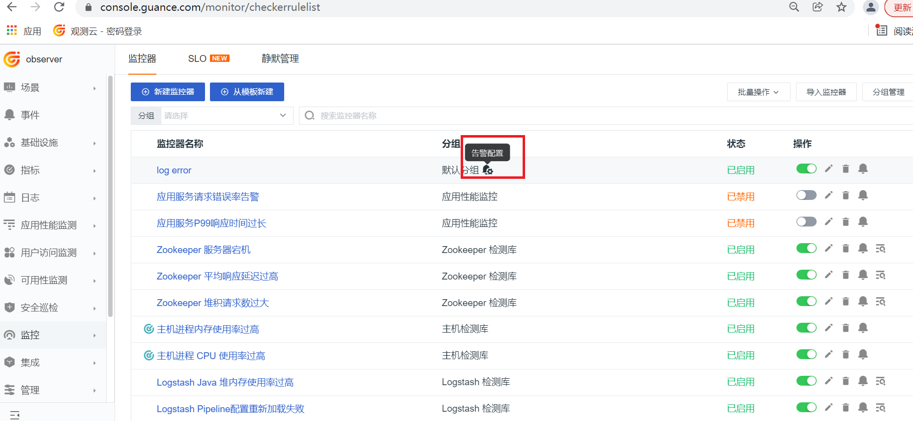
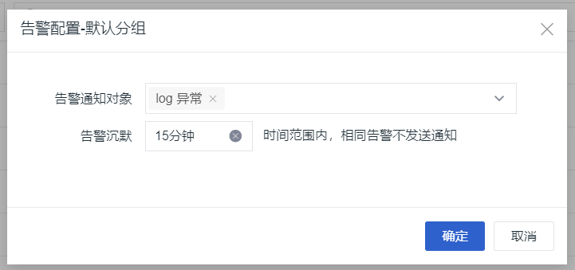
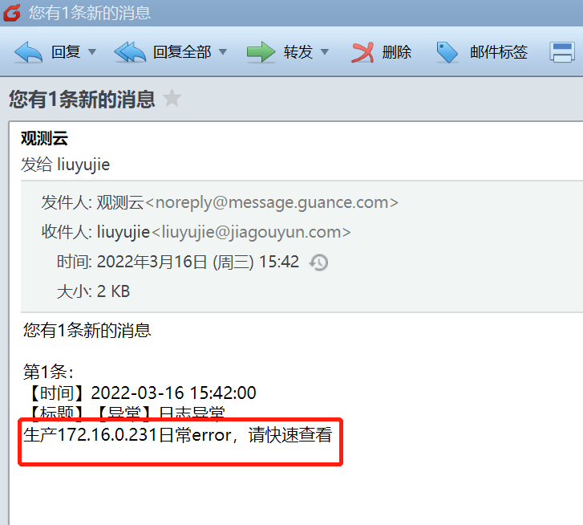

# 简介
        对于企业的应用系统来说，日志的地位非常重要，特别是在 Kubernetes 环境，日志采集就更复杂，因此 DataKit 对日志采集提供了非常强劲的支持，支持多种环境、多种技术栈。接下来就对 DataKit 日志采集的使用方式做详细说明。

# 前置条件
        登录 [观测云](https://console.guance.com/)，【集成】->【Datakit】-> 【Kubernetes】，请按照指引在 Kubernetes 集群中安装 DataKit ，其中部署使用的 datakit.yaml 文件，在接下来的操作中会使用到。

# DataKit 高级配置
## 1 设置日志级别
        DataKit 默认日志级别是 Info，如果需要把日志级别调整为 Debug，请在 datakit.yaml 中增加环境变量。
```
        - name: ENV_LOG_LEVEL
          value: debug

```

## 2 设置日志输出方式 
        DataKit 默认会把日志输出到 /var/log/datakit/gin.log 和  /var/log/datakit/log，如果不想在容器中生成日志文件，请在 datakit.yaml 中增加环境变量。
```
    - name: ENV_LOG
      value: stdout
    - name: ENV_GIN_LOG
      value: stdout     
```
        DataKit 产生的日志可以通过 kubectl 命令加 POD 名称查看日志。
```
kubectl logs datakit-2fnrz -n datakit # 
```
『**注意**』：ENV_LOG_LEVEL 设置成 debug 后，会产生大量日志，此时不建议再把 ENV_LOG 设置成 stdout。
# 日志采集
## 1 stdout 采集 
### 1.1 stdout 日志全采集
        DataKit 可以采集输出到 stdout 的容器日志，使用 datakit.yaml 部署 DataKit 后默认已经开启了 container 采集器。

```
        - name: ENV_DEFAULT_ENABLED_INPUTS
          value: cpu,disk,diskio,mem,swap,system,hostobject,net,host_processes,container
```
        此时会在 DataKit 容器中生成 /usr/local/datakit/conf.d/container/container.conf 配置文件，默认配置是采集除了 pubrepo.jiagouyun.com/datakit/logfwd 开头的镜像外的所有 stdout 日志。
```
  container_include_log = []  # 相当于image:*
  container_exclude_log = ["image:pubrepo.jiagouyun.com/datakit/logfwd*"]

```
### 1.2 自定义 stdout 日志采集
        为了更好的区分日志来源，增加 tag及 指定日志切割 pipeline 文件，这是就需要使用自定义方式了。即在部署的 yaml 文件中增加 annotations。

```
apiVersion: apps/v1
kind: Deployment
metadata:
  name: log-demo-service
  labels:
    app: log-demo-service
spec:
  replicas: 1
  selector:
    matchLabels:
      app: log-demo-service
  template:
    metadata:
      labels:
        app: log-demo-service
      annotations:
        # 增加如下部分
        datakit/logs: |
          [
            {
              "source": "pod-logging-testing-demo",
              "service": "pod-logging-testing-demo",
              "pipeline": "pod-logging-demo.p",
              "multiline_match": "^\\d{4}-\\d{2}-\\d{2}"
            }
          ]
          

```
Annotations 参数说明

- source:  数据来源
- service:  tag标记
- pipeline:  pipeline 脚本名
- ignore_status: 
- multiline_match: 正则表达式匹配一行日志，如示例中以日期(比如2021-11-26)开始的为一行日志，下行中如果不是此日期开始则认为此行日志是上条日志一部分
- remove_ansi_escape_codes: 是否删除 ANSI 转义码，例如标准输出的文本颜色等
### 1.3 不采集容器的 stdout 日志
        开启了容器采集器，会自动采集容器输出到 stdout 的日志，对于不想采集的日志，有以下几种方式。
#### 1.3.1 关闭 POD 的 stdout 日志采集
        在部署应用的 yaml 文件中增加 annotations，把 disable 设置成 true。
```
apiVersion: apps/v1
kind: Deployment
metadata:

...

spec:
  ...
  template:
    metadata:      
      annotations:
        ## 增加下面内容
        datakit/logs: |
          [
            {
              "disable": true  
            }
          ]
```
#### 1.3.2 标准输出重定向 
        如果开启了 stdout 日志收集，容器的日志也输出到 stdout，两者都不想做修改的情况下，可以修改启动命令，让标准输出重定向。

```
java ${JAVA_OPTS}   -jar ${jar} ${PARAMS}  2>&1 > /dev/null
```

#### 1.3.3 container 采集器的过滤功能
        如果想更方便的控制 stdout 日志的采集，建议重写 container.conf 文件，即使用 ConfigMap 定义 container.conf，修改 container_include_log 和 container_exclude_log 的值，再挂载到 datakit 中。在 datakit.yaml修改如下：
```
---
apiVersion: v1
kind: ConfigMap
metadata:
  name: datakit-conf
  namespace: datakit
data:
    #### container
    container.conf: |-           
      [inputs.container]
        endpoint = "unix:///var/run/docker.sock"

        ## Containers metrics to include and exclude, default not collect. Globs accepted.
        container_include_metric = []
        container_exclude_metric = ["image:*"]

        ## Containers logs to include and exclude, default collect all containers. Globs accepted.
        container_include_log = ["image:*"]  
        container_exclude_log = ["image:pubrepo.jiagouyun.com/datakit/logfwd*"]

        exclude_pause_container = true

        ## Removes ANSI escape codes from text strings
        logging_remove_ansi_escape_codes = false
        ## Maximum length of logging, default 32766 bytes.
        max_logging_length = 32766

        kubernetes_url = "https://kubernetes.default:443"

        ## Authorization level:
        ##   bearer_token -> bearer_token_string -> TLS
        ## Use bearer token for authorization. ('bearer_token' takes priority)
        ## linux at:   /run/secrets/kubernetes.io/serviceaccount/token
        ## windows at: C:\var\run\secrets\kubernetes.io\serviceaccount\token
        bearer_token = "/run/secrets/kubernetes.io/serviceaccount/token"
        # bearer_token_string = "<your-token-string>"

        [inputs.container.tags]
          # some_tag = "some_value"
          # more_tag = "some_other_value"
```
```
        volumeMounts:
        - mountPath: /usr/local/datakit/conf.d/container/container.conf
          name: datakit-conf
          subPath: container.conf
```

- `container_include` 和 `container_exclude` 必须以 `image` 开头，格式为 `"image:<glob规则>"`，表示 glob 规则是针对容器 image 生效
- [Glob 规则](https://en.wikipedia.org/wiki/Glob_(programming))是一种轻量级的正则表达式，支持 `*` `?` 等基本匹配单元

   <br />        比如只想采集镜像名包含  log-order，且镜像名不包含 log-pay，可以做如下配置。
```
        container_include_log = ["image:*log-order*"]
        container_exclude_log = ["image:*log-pay*"]

```

                <br />『**注意**』：如果某一 POD 开启了采集 stdout 日志，请不要在使用 logfwd 或者 socket 日志采集，否则日志会被重复收集。

## 2 logfwd 采集
        这是一种使用 Sidecar 模式的日志采集方式， 即利用同一个 POD 内的容器共享存储，让 logfwd 以 Sidecar 的模式读取业务容器的日志文件，然后发送给 DataKit。具体使用，请参考 [Pod 日志采集最佳实践](https://www.yuque.com/dataflux/bp/pod-log) 方案二。
## 3 socket 采集
        DataKit 开通 Socket 端口比如 9542，日志会被推送到这个端口，Java 的 log4j、logback 支持日志推送。下面以 SpringBoot 集成 Logback 为例来实现 socket 日志采集。
###  3.1 添加 Appender
        在 logback-spring.xml 文件中增加 socket Appender。
```
<?xml version="1.0" encoding="UTF-8"?>

<configuration scan="true" scanPeriod="60 seconds" debug="false">
    <springProperty scope="context" name="dkSocketHost" source="datakit.socket.host" />
    <springProperty scope="context" name="dkSocketPort" source="datakit.socket.port" />
    <contextName>logback</contextName>

    <!-- 日志根目录 -->
    <property name="log.path" value="./logs"/>
    <!-- 日志输出格式 -->
    <property name="log.pattern" value="%d{yyyy-MM-dd HH:mm:ss.SSS} [%thread] %-5level %logger{20} - [%method,%line] -  - %msg%n" />

    <!-- 打印日志到控制台 -->
    <appender name="Console" class="ch.qos.logback.core.ConsoleAppender">
        <encoder>
            <pattern>${log.pattern}</pattern>
        </encoder>
    </appender>
    ... 
    <!--下面是增加的 Socket appender--> 
    <appender name="socket" class="net.logstash.logback.appender.LogstashTcpSocketAppender">
        <!-- datakit host: logsocket_port -->
        <destination>${dkSocketHost}:${dkSocketPort}</destination>
        <!-- 日志输出编码 -->
        <encoder class="net.logstash.logback.encoder.LoggingEventCompositeJsonEncoder">
            <providers>
                <timestamp>
                    <timeZone>UTC+8</timeZone>
                </timestamp>
                <pattern>
                    <pattern>
                        {
                        "severity": "%level",
                        "appName": "${logName:-}",
                        "trace": "%X{dd.trace_id:-}",
                        "span": "%X{dd.span_id:-}",
                        "pid": "${PID:-}",
                        "thread": "%thread",
                        "class": "%logger{40}",
                        "msg": "%message\n%exception"
                        }
                    </pattern>
                </pattern>
            </providers>
        </encoder>
    </appender>
    <root level="INFO">
        <appender-ref ref="Console"/>
        <appender-ref ref="file_info"/>
        <appender-ref ref="socket" />
    </root>
</configuration>
```
### 3.2 增加配置
        在 SpringBoot 项目的 application.yml 文件中增加配置。
```
datakit:
  socket:
    host: 120.26.218.200  # 
    port: 9542
```
###  3.3 添加依赖
        在 SpringBoot 项目的 pom.xml 中添加依赖。
```
<dependency>
    <groupId>net.logstash.logback</groupId>
    <artifactId>logstash-logback-encoder</artifactId>
    <version>4.9</version>
</dependency>
```
### 3.4 DataKit 增加 logging-socket.conf 文件 
        在 DataKit 的 datakit.yaml 文件中
```
        volumeMounts:  # 此位置增加下面三行
        - mountPath: /usr/local/datakit/conf.d/log/logging-socket.conf
          name: datakit-conf
          subPath: logging-socket.conf
          
---           
apiVersion: v1
kind: ConfigMap
metadata:
  name: datakit-conf
  namespace: datakit
data:       
    logging-socket.conf: |-
      [[inputs.logging]]
        # only two protocols are supported:TCP and UDP
        sockets = [
          "tcp://0.0.0.0:9542",
        #"udp://0.0.0.0:9531",                  
        ]
        ignore = [""]
        source = "demo-socket-service"
        service = ""
        pipeline = ""
        ignore_status = []
        character_encoding = ""
        # multiline_match = '''^\S'''
        remove_ansi_escape_codes = false

        [inputs.logging.tags]
        # some_tag = "some_value"
        # more_tag = "some_other_value"
```
        关于 Socket 日志采集的更多内容，请参考 [Logback Socket 日志采集最佳实践](https://www.yuque.com/dataflux/bp/k8s-socket)。
## 4 日志文件采集
        Linux 主机安装的 DataKit 采集该主机上的日志的方式是复制 logging.conf 文件，然后再修改 logging.conf 文件中的  logfiles 的值为日志的绝对路径。
```
cd /usr/local/datakit/conf.d/log
cp logging.conf.sample  logging.conf

```
        在 Kubernetes 环境下，需要先把的 Pod 生成的日志目录 /data/app/logs/demo-system 挂载到宿主机上 /var/log/k8s/demo-system，再使用 Daemonset 部署DataKit ，挂载 /var/log/k8s/demo-system  目录，这样datakit 就能采集到宿主机上的 /rootfs/var/log/k8s/demo-system/info.log 日志文件。
```
        volumeMounts:
        - name: app-log
          mountPath: /data/app/logs/demo-system
          
      ...
    
      volumes:   
      - name: app-log
        hostPath:
          path: /var/log/k8s/demo-system
```
```
        volumeMounts:  # 此位置增加下面三行
        - mountPath: /usr/local/datakit/conf.d/log/logging.conf
          name: datakit-conf
          subPath: logging.conf
          
---           
apiVersion: v1
kind: ConfigMap
metadata:
  name: datakit-conf
  namespace: datakit
data:           
    #### logging
    logging.conf: |-
        [[inputs.logging]]
          ## required
          logfiles = [
            "/rootfs/var/log/k8s/demo-system/info.log",
          ]

          ## glob filteer
          ignore = [""]

          ## your logging source, if it's empty, use 'default'
          source = "k8s-demo-system-log"

          ## add service tag, if it's empty, use $source.
          #service = "k8s-demo-system-log"

          ## grok pipeline script path
          pipeline = ""
          ## optional status:
          ##   "emerg","alert","critical","error","warning","info","debug","OK"
          ignore_status = []

          ## optional encodings:
          ##    "utf-8", "utf-16le", "utf-16le", "gbk", "gb18030" or ""
          character_encoding = ""

          ## The pattern should be a regexp. Note the use of '''this regexp'''
          ## regexp link: https://golang.org/pkg/regexp/syntax/#hdr-Syntax
          multiline_match = '''^\d{4}-\d{2}-\d{2}'''

          [inputs.logging.tags]
          # some_tag = "some_value"
          # more_tag = "some_other_value" 
```
『**注意**』：既然使用观测云收集日志，日志已经被持久化了，没必要再把日志落盘到宿主机，所以 Kubernetes 环境下不建议使用这种采集方式。
# Pipeline
        [Pipeline](pipeline) 主要用于切割非结构化的文本数据，或者用于从结构化的文本中（如 JSON）提取部分信息。对日志来说主要是提取日志产生时间、日志级别等信息。这里特别说明 Socket 采集到的日志是 JSON 格式，需要切割后才能在搜索框按关键字搜索。Pipeline 使用详情，请参阅下面的文章。

- [Pod 日志采集最佳实践](https://www.yuque.com/dataflux/bp/pod-log)
- [Logback Socket 日志采集最佳实践](https://www.yuque.com/dataflux/bp/k8s-socket)
- [Kubernetes 应用的RUM-APM-LOG 联动分析](https://www.yuque.com/dataflux/bp/k8s-rum-apm-log)

# 异常检测
        当日志出现异常，对应用影响很大的时候，使用观测云的日志异常检测功能，并配置告警，能及时把异常通知到观测对象，观测云的告警支持邮箱、钉钉、短信、企业微信、飞书等通知方式。下面以邮箱为例介绍一下告警。
## 1 创建通知对象
        登录 [观测云](https://console.guance.com/)，【管理】->【通知对象管理】-> 【新建通知对象】，选择邮件组，输入名称和邮件地址。<br />
	

## 2 新建监控器
         点击【监控】->【新建监控器】-> 【日志监测】。<br />
	
    	 <br />        输入规则名称，检测指标 log_fwd_demo 是采集日志时候配置的 source，后面的 error 是日志包含的内容，host_ip 是日志的标签，在事件内容可以使用 {{host_ip}} 把具体标签的值输出。触发条件填 1，标题和内容会以邮件的方式发送。填完后点击【保存】。<br />
	

	
## 3 配置告警
         在【监控器】界面，点击刚才创建的监控器，点击【告警配置】。<br />
	
    	 <br />        告警通知对象选择第一步中创建的邮件组，选择告警沉默时间，点击【确定】。<br />
	
## 4 触发告警
        应用触发 error 日志，这时会收到通知邮件。<br />
	
