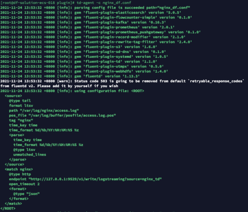
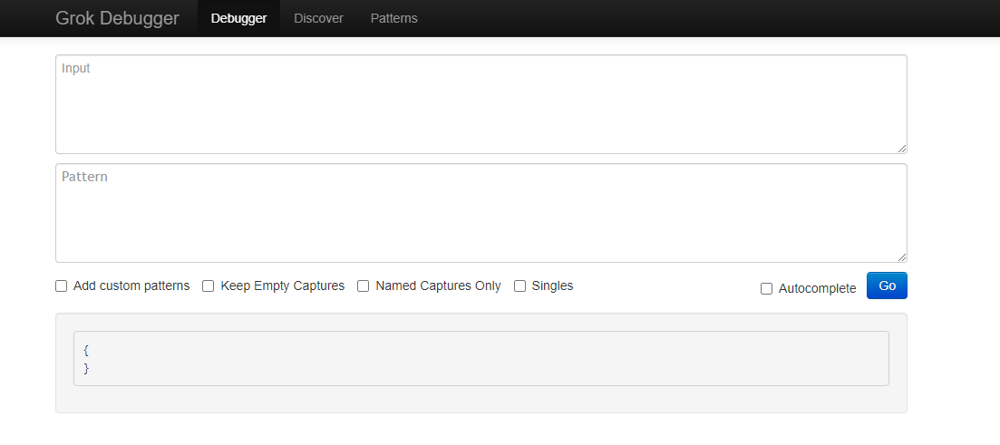
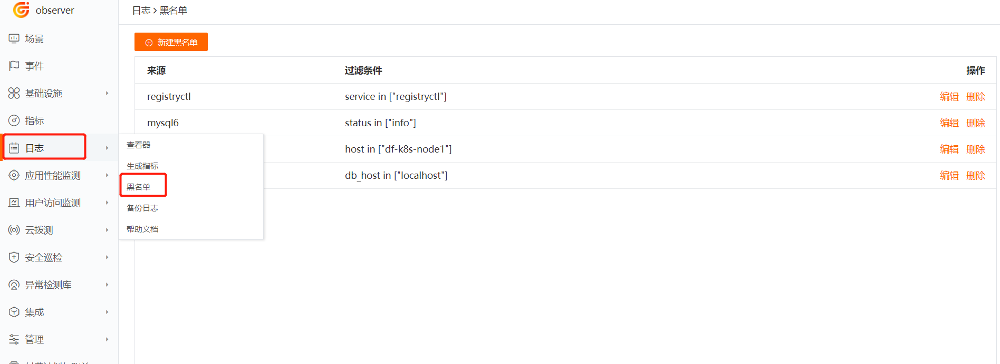
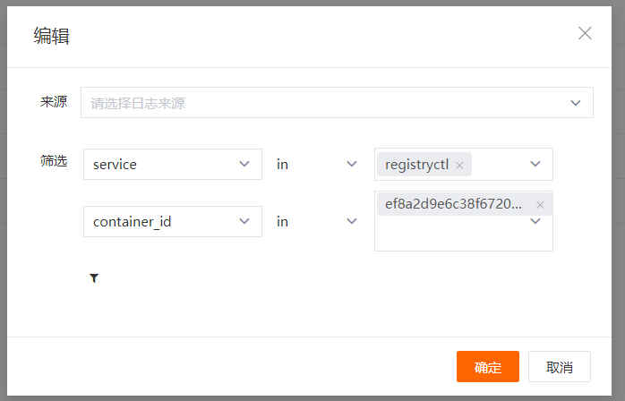

# 观测云日志采集分析最佳实践

---

## 日志采集

首先，什么是日志？日志是程序产生的，遵循一定格式（通常包含时间戳）的文本数据。<br />通常日志由服务器生成，输出到不同的文件中，一般会有系统日志、应用日志、安全日志。这些日志分散地存储在不同的机器上。当系统发生故障时，工程师就需要登录到各个服务器上，使用 grep / sed / awk 等 Linux 脚本工具去日志里查找故障原因。在没有日志系统的情况下，首先需要定位处理请求的服务器，如果这台服务器部署了多个实例，则需要去每个应用实例的日志目录下去找日志文件。每个应用实例还会设置日志滚动策略（如：每天生成一个文件或日志文件达到某给定大小后生成一个文件），还有日志压缩归档策略等。<br />这样一系列流程下来，对于我们排查故障以及及时找到故障原因，造成了比较大的麻烦。因此，如果我们能把这些日志集中管理，并提供集中检索功能，不仅可以提供高诊断效率，同时对系统情况有个全面的理解，避免事后救火的被动。<br />所以，日志数据在以下几个方面具有非常重要的作用：

- 数据查找：通过检索日志信息，定位相应的 Bug，找出解决方案；
- 服务诊断：通过对日志信息进行统计、分析，了解服务器的负荷和服务运行状态；
- 数据分析：可以做进一步的数据分析。

### 采集文件日志

本文以 Nginx 日志采集为例，进入 DataKit 安装目录下的 `conf.d/log` 目录，复制 `logging.conf.sample` 并命名为 `logging.conf`。示例如下：

```yaml
[[inputs.logging]]
  # 日志文件列表，可以指定绝对路径，支持使用 glob 规则进行批量指定
  # 推荐使用绝对路径
  logfiles = [
    "/var/log/nginx/access.log",                         
    "/var/log/nginx/error.log",                      
  ]
  
  # 文件路径过滤，使用 glob 规则，符合任意一条过滤条件将不会对该文件进行采集
  ignore = [""]
  
  # 数据来源，如果为空，则默认使用 'default'
  source = ""
  
  # 新增标记tag，如果为空，则默认使用 $source
  service = ""
  
  # pipeline 脚本路径，如果为空将使用 $source.p，如果 $source.p 不存在将不使用 pipeline
  pipeline = "nginx.p"
  
  # 过滤对应 status:
  #   `emerg`,`alert`,`critical`,`error`,`warning`,`info`,`debug`,`OK`
  ignore_status = []
  
  # 选择编码，如果编码有误会导致数据无法查看。默认为空即可:
  #    `utf-8`, `utf-16le`, `utf-16le`, `gbk`, `gb18030` or ""
  character_encoding = ""
  
  ## 设置正则表达式，例如 ^\d{4}-\d{2}-\d{2} 行首匹配 YYYY-MM-DD 时间格式
  ## 符合此正则匹配的数据，将被认定为有效数据，否则会累积追加到上一条有效数据的末尾
  ## 使用3个单引号 '''this-regexp''' 避免转义
  ## 正则表达式链接：https://golang.org/pkg/regexp/syntax/#hdr-Syntax
  # multiline_match = '''^\S'''

  ## 是否删除 ANSI 转义码，例如标准输出的文本颜色等
  remove_ansi_escape_codes = false
  
  # 自定义 tags
  [inputs.logging.tags]
   app = oa
```

自定义 tags 配置为自定义标签，可以填写任意 key-value 值
●配置完成后，所有指标都会带有 app = oa 的标签，可以进行快速查询
●相关文档 < [DataFlux Tag 应用最佳实践](./guance-skill/tag.md)> 
重启 Datakit

```bash
systemctl restart datakit
```

#### 采集多行日志

通过识别多行日志的第一行特征，即可判定某行日志是不是一条新的日志。如果不符合这个特征，我们即认为当前行日志只是前一条多行日志的追加。
举个例子，一般情况下，日志都是顶格写的，但有些日志文本不是顶格写的，比如程序崩溃时的调用栈日志，那么，对于这种日志文本，就是多行日志。在 DataKit 中，我们通过正则表达式来识别多行日志特征，正则匹配上的日志行，就是一条新的日志的开始，后续所有不匹配的日志行，都认为是这条新日志的追加，直到遇到另一行匹配正则的新日志为止。
如下开启多行日志采集需在 `logging.conf` 中，修改如下配置：

```yaml
match = '''这里填写具体的正则表达式''' # 注意，这里的正则俩边，建议分别加上三个「英文单引号」
```

> 日志采集器中使用的正则表达式风格[参考](https://golang.org/pkg/regexp/syntax/#hdr-Syntax)

这里以一段 Python 日志作为示例：

```
2020-10-23 06:41:56,688 INFO demo.py 1.0
2020-10-23 06:54:20,164 ERROR /usr/local/lib/python3.6/dist-packages/flask/app.py Exception on /0 [GET]
Traceback (most recent call last):
  File "/usr/local/lib/python3.6/dist-packages/flask/app.py", line 2447, in wsgi_app
    response = self.full_dispatch_request()
ZeroDivisionError: division by zero
2020-10-23 06:41:56,688 INFO demo.py 5.0
```

Match 配置为 ^\d{4}-\d{2}-\d{2}.*（意即匹配形如 2020-10-23 这样的行首）

#### 日志特殊字节码过滤

日志可能会包含一些不可读的字节码（比如终端输出的颜色等），可以在 `logging.conf` 中将 `remove_ansi_escape_codes` 设置为 `true` 对其删除过滤。
> 开启此功能将略微增加处理耗时

#### 采集远程日志文件

Linux 系统可通过 [NFS 方式](https://linuxize.com/post/how-to-mount-an-nfs-share-in-linux/)，将日志所在主机的文件路径，挂载到安装了 DataKit 的主机下，Logging 采集器配置对应日志路径即可完成采集。

### 采集流式日志

本文以采集 Fluentd 日志为例
> 示例 Fluentd 版本为：td-agent-4.2.x , 各个不同版本配置可能存在差异。

#### DataKit 配置

在采集流式日志时 DataKit 会启动一个 HTTP Server，接收日志文本数据，上报到观测云。HTTP URL 固定为：`/v1/write/logstreaming`，即 `http://Datakit_IP:PORT/v1/write/logstreaming`
> 注：如果 DataKit 以 daemonset 方式部署在 Kubernetes 中，可以使用 Service 方式访问，地址为 `http://datakit-service.datakit:9529`

进入 DataKit 安装目录下的 `conf.d/log` 目录，复制 `logstreaming.conf.sample` 并命名为 `logstreaming.conf`。示例如下：

```yaml
[inputs.logstreaming]
  ignore_url_tags = true
```

重启 DataKit

```bash
systemctl restart datakit
```

##### 参数支持

Logstreaming 支持在 HTTP URL 中添加参数，对日志数据进行操作。参数列表如下：

- `type`：数据格式，目前只支持 `influxdb`。 
   - 当 type 为 inflxudb 时（`/v1/write/logstreaming?type=influxdb`），说明数据本身就是行协议格式（默认 precision 是 s），将只添加内置 Tags，不再做其他操作
   - 当此值为空时，会对数据做分行和 pipeline 等处理
- `source`：标识数据来源，即行协议的 measurement。例如 nginx 或者 redis（`/v1/write/logstreaming?source=nginx`） 
   - 当 `type` 是 `influxdb` 时，此值无效
   - 默认为 `default`
- `service`：添加 service 标签字段，例如（`/v1/write/logstreaming?service=nginx_service`） 
   - 默认为 source 参数值。
- `pipeline`：指定数据需要使用的 pipeline 名称，例如 `nginx.p`（`/v1/write/logstreaming?pipeline=nginx.p`）

#### Fluentd 配置

以 Fluentd 采集 Nginx 日志并转发至上级 Server 端的 Plugin 配置为例，我们不想直接发送到 Server 端进行处理，想直接处理好并发送给 DataKit 上报至观测云平台进行分析。

```yaml
##pc端日志收集
<source>
  @type tail
  format ltsv
  path /var/log/nginx/access.log
  pos_file /var/log/buffer/posfile/access.log.pos
  tag nginx
  time_key time
  time_format %d/%b/%Y:%H:%M:%S %z
</source>
 
## 收集的数据由tcp协议转发到多个server的49875端口

<match nginx>
 type forward
  <server>
   name es01
   host es01
   port 49875
   weight 60
  </server>
  <server>
   name es02
   host es02
   port 49875
   weight 60
  </server>
</match>
```
对 Match 的 Output 做修改将类型指定成 Http 类型并且将 Endpoint 指向开启了 Logstreaming 的 DataKit 地址即可完成采集

```yaml
##pc端日志收集
<source>
  @type tail
  format ltsv
  path /var/log/nginx/access.log
  pos_file /var/log/buffer/posfile/access.log.pos
  tag nginx
  time_key time
  time_format %d/%b/%Y:%H:%M:%S %z
</source>
 
##收集的数据由http协议转发至本地 DataKit

## nginx output

<match nginx>
  @type http
  endpoint http://127.0.0.1:9529/v1/write/logstreaming?source=nginx_td&pipeline=nginx.p
  open_timeout 2
  <format>
    @type json
  </format>
</match>
```

修改配置之后重启 td-agent ，完成数据上报



**可以通过** [DQL](https://www.yuque.com/dataflux/doc/fsnd2r) **验证上报的数据：**
```bash
dql > L::nginx_td LIMIT 1
-----------------[ r1.nginx_td.s1 ]-----------------
    __docid 'L_c6et7vk5jjqulpr6osa0'
create_time 1637733374609
    date_ns 96184
       host 'df-solution-ecs-018'
    message '{"120.253.192.179 - - [24/Nov/2021":"13:55:10 +0800] \"GET / HTTP/1.1\" 304 0 \"-\" \"Mozilla/5.0 (Macintosh; Intel Mac OS X 10_15_7) AppleWebKit/537.36 (KHTML, like Gecko) Chrome/96.0.4664.45 Safari/537.36\" \"-\""}'
     source 'nginx_td'
       time 2021-11-24 13:56:06 +0800 CST
---------
1 rows, 1 series, cost 2ms
```

## 日志解析（ Pipeline ）

一般系统或服务生成的日志都是一大长串。每个字段之间用空格隔开。一般在获取日志的时候都是整个一串获取，如果把日志中每个字段代表的意思分割开来在进行分析这样呈现出来的数据更加清晰，也更方便用来可视化。<br />Pipeline 是观测云用于文本数据处理的重要组件，它的主要作用就是将文本格式的字符串，转换成为具体的结构化的数据，配合 Grok 正则表达式使用。

### Grok 模式分类

DataKit 中 grok 模式可以分为两类：全局模式与局部模式，`pattern` 目录下的模式文件都是全局模式，所有 Pipeline 脚本都可使用，而在 Pipeline 脚本中通过 `add_pattern()` 函数新增的模式属于局部模式，只针对当前 Pipeline 脚本有效。<br />当 DataKit 内置模式不能满足所有用户需求，用户可以自行在 Pipeline 目录中增加模式文件来扩充。若自定义模式是全局级别，则需在 `pattern` 目录中新建一个文件并把模式添加进去，不要在已有内置模式文件中添加或修改，因为 DataKit 启动过程会把内置模式文件覆盖掉。

#### 添加局部模式

grok 本质是预定义一些正则表达式来进行文本匹配提取，并且给预定义的正则表达式进行命名，方便使用与嵌套引用扩展出无数个新模式。比如 DataKit 有 3 个如下内置模式：

```python
_second (?:(?:[0-5]?[0-9]|60)(?:[:.,][0-9]+)?)    #匹配秒数，_second为模式名
_minute (?:[0-5][0-9])                            #匹配分钟数，_minute为模式名
_hour (?:2[0123]|[01]?[0-9])                      #匹配年份，_hour为模式名
```

基于上面三个内置模式，可以扩展出自己内置模式且命名为 `time`:

```python
# 把 time 加到 pattern 目录下文件中，此模式为全局模式，任何地方都能引用 time
time ([^0-9]?)%{hour:hour}:%{minute:minute}(?::%{second:second})([^0-9]?)

# 也可以通过 add_pattern() 添加到 pipeline 文件中，则此模式变为局部模式，只有当前 pipeline 脚本能使用 time
add_pattern(time, "([^0-9]?)%{HOUR:hour}:%{MINUTE:minute}(?::%{SECOND:second})([^0-9]?)")

# 通过 grok 提取原始输入中的时间字段。假定输入为 12:30:59，则提取到 {"hour": 12, "minute": 30, "second": 59}
grok(_, %{time})
```

> 注意：
> - 相同模式名以脚本级优先（即局部模式覆盖全局模式）
> - pipeline 脚本中，`add_pattern()` 需在 `grok()` 函数前面调用，否则会导致第一条数据提取失败。

### 配置 Nginx 日志解析
#### 编写 pipeline 文件
在 `<datakit安装目录>/pipeline` 目录下编写 Pipeline 文件，文件名为 `nginx.p`。
```bash
add_pattern("date2", "%{YEAR}[./]%{MONTHNUM}[./]%{MONTHDAY} %{TIME}")

grok(_, "%{IPORHOST:client_ip} %{NOTSPACE:http_ident} %{NOTSPACE:http_auth} \\[%{HTTPDATE:time}\\] \"%{DATA:http_method} %{GREEDYDATA:http_url} HTTP/%{NUMBER:http_version}\" %{INT:status_code} %{INT:bytes}")

# access log
add_pattern("access_common", "%{IPORHOST:client_ip} %{NOTSPACE:http_ident} %{NOTSPACE:http_auth} \\[%{HTTPDATE:time}\\] \"%{DATA:http_method} %{GREEDYDATA:http_url} HTTP/%{NUMBER:http_version}\" %{INT:status_code} %{INT:bytes}")
grok(_, '%{access_common} "%{NOTSPACE:referrer}" "%{GREEDYDATA:agent}')
user_agent(agent)

# error log
grok(_, "%{date2:time} \\[%{LOGLEVEL:status}\\] %{GREEDYDATA:msg}, client: %{IPORHOST:client_ip}, server: %{IPORHOST:server}, request: \"%{DATA:http_method} %{GREEDYDATA:http_url} HTTP/%{NUMBER:http_version}\", (upstream: \"%{GREEDYDATA:upstream}\", )?host: \"%{IPORHOST:ip_or_host}\"")
grok(_, "%{date2:time} \\[%{LOGLEVEL:status}\\] %{GREEDYDATA:msg}, client: %{IPORHOST:client_ip}, server: %{IPORHOST:server}, request: \"%{GREEDYDATA:http_method} %{GREEDYDATA:http_url} HTTP/%{NUMBER:http_version}\", host: \"%{IPORHOST:ip_or_host}\"")
grok(_,"%{date2:time} \\[%{LOGLEVEL:status}\\] %{GREEDYDATA:msg}")

group_in(status, ["warn", "notice"], "warning")
group_in(status, ["error", "crit", "alert", "emerg"], "error")

cast(status_code, "int")
cast(bytes, "int")

group_between(status_code, [200,299], "OK", status)
group_between(status_code, [300,399], "notice", status)
group_between(status_code, [400,499], "warning", status)
group_between(status_code, [500,599], "error", status)


nullif(http_ident, "-")
nullif(http_auth, "-")
nullif(upstream, "")
default_time(time)
```

> 注意，切割过程中，需避免[可能出现的跟 tag key 重名的问题(Pipeline 字段命名注意事项)](https://www.yuque.com/dataflux/datakit/datakit-pl-how-to#5cf855c0)

#### 调试 Pipeline 文件

由于 Grok Pattern 数量繁多，人工匹配较为麻烦。DataKit 提供了交互式的命令行工具 `grokq`（Grok Query）：

```shell
datakit --grokq
grokq > Mon Jan 25 19:41:17 CST 2021   # 此处输入你希望匹配的文本
        2 %{DATESTAMP_OTHER: ?}        # 工具会给出对应对的建议，越靠前匹配月精确（权重也越大）。前面的数字表明权重。
        0 %{GREEDYDATA: ?}

grokq > 2021-01-25T18:37:22.016+0800
        4 %{TIMESTAMP_ISO8601: ?}      # 此处的 ? 表示你需要用一个字段来命名匹配到的文本
        0 %{NOTSPACE: ?}
        0 %{PROG: ?}
        0 %{SYSLOGPROG: ?}
        0 %{GREEDYDATA: ?}             # 像 GREEDYDATA 这种范围很广的 pattern，权重都较低
                                       # 权重越高，匹配的精确度越大

grokq > Q                              # Q 或 exit 退出
Bye!
```

在借助 DataKit 提供的命令行工具 `grokq` 编写好了 Pipeline 文件之后，指定 Pipeline 脚本名称（--pl，Pipeline 脚本必须放在 <DataKit 安装目录>/pipeline 目录下），输入一段文本（--txt）即可判断提取是否成功

```shell
#提取成功示例
datakit --pl nginx.p --txt '172.17.0.1 - - [06/Jan/2017:16:16:37 +0000] "GET /datadoghq/company?test=var1%20Pl HTTP/1.1" 401 612 "http://www.perdu.com/" "Mozilla/5.0 (X11; Linux x86_64) AppleWebKit/537.36 (KHTML, like Gecko) Chrome/55.0.2883.87 Safari/537.36" "-"'
Extracted data(cost: 5.279203ms):  # 表示切割成功
{
  "agent": "Mozilla/5.0 (X11; Linux x86_64) AppleWebKit/537.36 (KHTML, like Gecko) Chrome/55.0.2883.87 Safari/537.36\" \"-\"",
  "browser": "Chrome",
  "browserVer": "55.0.2883.87",
  "bytes": 612,
  "client_ip": "172.17.0.1",
  "engine": "AppleWebKit",
  "engineVer": "537.36",
  "http_method": "GET",
  "http_url": "/datadoghq/company?test=var1%20Pl",
  "http_version": "1.1",
  "isBot": false,
  "isMobile": false,
  "message": "172.17.0.1 - - [06/Jan/2017:16:16:37 +0000] \"GET /datadoghq/company?test=var1%20Pl HTTP/1.1\" 401 612 \"http://www.perdu.com/\" \"Mozilla/5.0 (X11; Linux x86_64) AppleWebKit/537.36 (KHTML, like Gecko) Chrome/55.0.2883.87 Safari/537.36\" \"-\"",
  "os": "Linux x86_64",
  "referrer": "http://www.perdu.com/",
  "status": "warning",
  "status_code": 401,
  "time": 1483719397000000000,
  "ua": "X11"
}

# 提取失败示例
datakit --pl nginx.p --txt '172.17.0.1 - - [06/Jan/2017:16:16:37 +0000] "GET /datadoghq/company?test=var1%20Pl HTTP/1.1" 401 612 "http://www.perdu.com/" "Mozilla/5.0 (X11; Linux x86_64) AppleWebKit/537.36 (KHTML, like Gecko) Chrome/55.0.2883.87 Safari/537.36" "-"'
No data extracted from pipeline
```

#### 配置采集器应用 Pipeline 脚本

##### 文本日志采集配置 Pipeline 脚本

以采集 Nginx 日志为例，在 Logging 采集器中，配置字段 Pipeline 即可，注意，这里配置的是 Pipeline 的脚本名称，而不是路径。所有这里引用的 Pipeline 脚本，必须存放在 <DataKit 安装目录/pipeline> 目录下：

```yaml
[inputs.logging]]
  # 日志文件列表，可以指定绝对路径，支持使用 glob 规则进行批量指定
  # 推荐使用绝对路径
  logfiles = [
    "/var/log/nginx/access.log",                         
    "/var/log/nginx/error.log",                      
  ]
  
  # 文件路径过滤，使用 glob 规则，符合任意一条过滤条件将不会对该文件进行采集
  ignore = [""]
  
  # 数据来源，如果为空，则默认使用 'default'
  source = ""
  
  # 新增标记tag，如果为空，则默认使用 $source
  service = ""
  
  # pipeline 脚本路径，如果为空将使用 $source.p，如果 $source.p 不存在将不使用 pipeline
  pipeline = "nginx.p"
  
  # 过滤对应 status:
  #   `emerg`,`alert`,`critical`,`error`,`warning`,`info`,`debug`,`OK`
  ignore_status = []
  
  # 选择编码，如果编码有误会导致数据无法查看。默认为空即可:
  #    `utf-8`, `utf-16le`, `utf-16le`, `gbk`, `gb18030` or ""
  character_encoding = ""
  
  ## 设置正则表达式，例如 ^\d{4}-\d{2}-\d{2} 行首匹配 YYYY-MM-DD 时间格式
  ## 符合此正则匹配的数据，将被认定为有效数据，否则会累积追加到上一条有效数据的末尾
  ## 使用3个单引号 '''this-regexp''' 避免转义
  ## 正则表达式链接：https://golang.org/pkg/regexp/syntax/#hdr-Syntax
  # multiline_match = '''^\S'''

  ## 是否删除 ANSI 转义码，例如标准输出的文本颜色等
  remove_ansi_escape_codes = false
  
  # 自定义 tags
  [inputs.logging.tags]
   app = oa
```

重启 Datakit，即可切割对应的日志。

```shell
systemctl restart datakit
```

##### 采集流式日志配置 Pipeline 脚本

以采集 Fluentd 日志为例，对 Match 的 Output 做修改将类型指定成 Http 类型并且将 Endpoint 指向开启了 Logstreaming 的 DataKit 地址并配置 Pipeline 脚本名称即可完成采集。

```yaml
##pc端日志收集
<source>
  @type tail
  format ltsv
  path /var/log/nginx/access.log
  pos_file /var/log/buffer/posfile/access.log.pos
  tag nginx
  time_key time
  time_format %d/%b/%Y:%H:%M:%S %z
</source>
 
##收集的数据由http协议转发至本地 DataKit
## nginx output
<match nginx>
  @type http
  endpoint http://127.0.0.1:9529/v1/write/logstreaming?source=nginx_td&pipeline=nginx.p
  open_timeout 2
  <format>
    @type json
  </format>
</match>
```
修改配置之后重启 td-agent ，完成数据上报

## 日志采集性能优化

### 为什么我的 Pipeline 跑起来非常的慢

性能这个问题通常都是要被拿出来讨论的，用户通常会发现使用了 Grok 表达式之后，Pipeline 处理日志的速度变得很慢。Grok 模式是基于正则表达式的，可能我们编写 Pipeline 的时候使用的 Grok 变量涵盖的场景过多导致，也可能我们做了逐行的全量匹配导致处理速度过慢等等。

### 请留意匹配了两次的表达式
我们看到过非常多的 Grok 模式在处理同一个网关发出的多种应用日志时候所出现的问题，例如 Syslog。想象一下这样一个场景，我们使用了 `"common_header: payload" ` 这种日志格式来记录了三种应用日志
```
Application 1: '8.8.8.8 process-name[666]: a b 1 2 a lot of text at the end'
Application 2: '8.8.8.8 process-name[667]: a 1 2 3 a lot of text near the end;4'
Application 3: '8.8.8.8 process-name[421]: a completely different format | 1111'
```
通常我们会在一个 Pipeline 里面就把三种日志都处理掉
```
grok(_ , "%{IPORHOST:clientip} %{DATA:process_name}\[%{NUMBER:process_id}\]: %{WORD:word_1} %{WORD:word_2} %{NUMBER:number_1} %{NUMBER:number_2} %{DATA:data}")
grok(_ , "%{IPORHOST:clientip} %{DATA:process_name}\[%{NUMBER:process_id}\]: %{WORD:word_1} %{NUMBER:number_1} %{NUMBER:number_2} %{NUMBER:number_3} %{DATA:data};%{NUMBER:number_4}")
grok(_ , "%{IPORHOST:clientip} %{DATA:process_name}\[%{NUMBER:process_id}\]: %{DATA:data} | %{NUMBER:number}")
```
但是值得留意的是即使你的日志是能正常匹配的，Grok 还是会按照顺序许匹配送进来的日志，当碰到第一个匹配成功的日志就 Break 掉这个循环。这就要我们自己去判断一下，怎么放是最合适的了，不然的话会一个一个往下进行尝试，毕竟是多种不同的格式。一种常用的优化方案是使用分层匹配来对这个 Pipeline 进行优化
```
add_pattern("message", "%{IPORHOST:clientip} %{DATA:process_name}\[%{NUMBER:process_id}\]: %{GREEDYDATA:message}")

grok(_, "%{message} %{WORD:word_1} %{WORD:word_2} %{NUMBER:number_1} %{NUMBER:number_2} %{GREEDYDATA:data}")
grok(_, "%{message} %{WORD:word_1} %{NUMBER:number_1} %{NUMBER:number_2} %{NUMBER:number_3} %{DATA:data};%{NUMBER:number_4}")
grok(_, "%{message} %{DATA:data} | %{NUMBER:number}")

```

### 请留意高性能开销的 Grok 表达式

我们来看一下下面这样一条 Nginx 日志

```
172.17.0.1 - - [06/Jan/2017:16:16:37 +0000] "GET /datadoghq/company?test=var1%20Pl HTTP/1.1" 401 612 "http://www.perdu.com/" "Mozilla/5.0 (X11; Linux x86_64) AppleWebKit/537.36 (KHTML, like Gecko) Chrome/55.0.2883.87 Safari/537.36" "-"
```
我们通常会在一个 Pipeline 使用灵活的 Grok 表达式对其进行处理
```
grok(_, "%{IPORHOST:client_ip} %{NOTSPACE:http_ident} %{NOTSPACE:http_auth} \\[%{HTTPDATE:time}\\] \"%{DATA:http_method} %{GREEDYDATA:http_url} HTTP/%{NUMBER:http_version}\" %{INT:status_code} %{INT:bytes}")

cast(status_code, "int")
cast(bytes, "int")
```

这里 `%{IPORHOST:client_ip}  --> 172.17.0.1` 的性能开销就很大，因为 Grok 底层是转变为正则表达式，越是涵盖场景多的 Grok 表达式，其性能可能越差，让我们一起看一下 `%{IPORHOST:client_ip}` 的底层的复杂的正则表达式

```
IPORHOST (?:%{IP}|%{HOSTNAME})
HOSTNAME \b(?:[0-9A-Za-z][0-9A-Za-z-]{0,62})(?:\.(?:[0-9A-Za-z][0-9A-Za-z-]{0,62}))*(\.?|\b)
IP (?:%{IPV6}|%{IPV4})
IPV6 ((([0-9A-Fa-f]{1,4}:){7}([0-9A-Fa-f]{1,4}|:))|(([0-9A-Fa-f]{1,4}:){6}(:[0-9A-Fa-f]{1,4}|((25[0-5]|2[0-4]\d|1\d\d|[1-9]?\d)(\.(25[0-5]|2[0-4]\d|1\d\d|[1-9]?\d)){3})|:))|(([0-9A-Fa-f]{1,4}:){5}(((:[0-9A-Fa-f]{1,4}){1,2})|:((25[0-5]|2[0-4]\d|1\d\d|[1-9]?\d)(\.(25[0-5]|2[0-4]\d|1\d\d|[1-9]?\d)){3})|:))|(([0-9A-Fa-f]{1,4}:){4}(((:[0-9A-Fa-f]{1,4}){1,3})|((:[0-9A-Fa-f]{1,4})?:((25[0-5]|2[0-4]\d|1\d\d|[1-9]?\d)(\.(25[0-5]|2[0-4]\d|1\d\d|[1-9]?\d)){3}))|:))|(([0-9A-Fa-f]{1,4}:){3}(((:[0-9A-Fa-f]{1,4}){1,4})|((:[0-9A-Fa-f]{1,4}){0,2}:((25[0-5]|2[0-4]\d|1\d\d|[1-9]?\d)(\.(25[0-5]|2[0-4]\d|1\d\d|[1-9]?\d)){3}))|:))|(([0-9A-Fa-f]{1,4}:){2}(((:[0-9A-Fa-f]{1,4}){1,5})|((:[0-9A-Fa-f]{1,4}){0,3}:((25[0-5]|2[0-4]\d|1\d\d|[1-9]?\d)(\.(25[0-5]|2[0-4]\d|1\d\d|[1-9]?\d)){3}))|:))|(([0-9A-Fa-f]{1,4}:){1}(((:[0-9A-Fa-f]{1,4}){1,6})|((:[0-9A-Fa-f]{1,4}){0,4}:((25[0-5]|2[0-4]\d|1\d\d|[1-9]?\d)(\.(25[0-5]|2[0-4]\d|1\d\d|[1-9]?\d)){3}))|:))|(:(((:[0-9A-Fa-f]{1,4}){1,7})|((:[0-9A-Fa-f]{1,4}){0,5}:((25[0-5]|2[0-4]\d|1\d\d|[1-9]?\d)(\.(25[0-5]|2[0-4]\d|1\d\d|[1-9]?\d)){3}))|:)))(%.+)?
IPV4 (?<![0-9])(?:(?:[0-1]?[0-9]{1,2}|2[0-4][0-9]|25[0-5])[.](?:[0-1]?[0-9]{1,2}|2[0-4][0-9]|25[0-5])[.](?:[0-1]?[0-9]{1,2}|2[0-4][0-9]|25[0-5])[.](?:[0-1]?[0-9]{1,2}|2[0-4][0-9]|25[0-5]))(?![0-9])
```

我们可以看到短短一行的 Grok 表达式可以包含这么多复杂的正则表达式，由此可见当我们需要处理日志量十分庞大的时候我们使用这么复杂的 Grok 表达式时多么的影响性能，那我们怎么来对其优化呢

```
grok(_, "%{NOTSPACE:client_ip} %{NOTSPACE:http_ident} %{NOTSPACE:http_auth} \\[%{HTTPDATE:time}\\] \"%{DATA:http_method} %{GREEDYDATA:http_url} HTTP/%{NUMBER:http_version}\" %{INT:status_code} %{INT:bytes}")

cast(status_code, "int")
cast(bytes, "int")

default_time(time)
```

注重性能，尽量使用 `%{NOTSPACE:}` ，由于grok底层是转变为正则表达式，越是涵盖场景多的 Grok 表达式其性能可能越差，反倒是如  `%{NOTSPACE:}` (非空格) 这种匹配极其简单的变量，其性能很高，所以在划词时如果能确定数据为非空格，且与数据紧挨着的就是空白符，那么就果断选择 `%{NOTSPACE:}` 来提高我们 Pipeline 的 性能。

### 更好的利用工具来编写 Pipeline

#### DataKit - 交互式命令行工具 grokq

由于 Grok Pattern 数量繁多，人工匹配较为麻烦。DataKit 提供了交互式的命令行工具 `grokq`（Grok Query）：

```shell
datakit --grokq
grokq > Mon Jan 25 19:41:17 CST 2021   # 此处输入你希望匹配的文本
        2 %{DATESTAMP_OTHER: ?}        # 工具会给出对应对的建议，越靠前匹配月精确（权重也越大）。前面的数字表明权重。
        0 %{GREEDYDATA: ?}

grokq > 2021-01-25T18:37:22.016+0800
        4 %{TIMESTAMP_ISO8601: ?}      # 此处的 ? 表示你需要用一个字段来命名匹配到的文本
        0 %{NOTSPACE: ?}
        0 %{PROG: ?}
        0 %{SYSLOGPROG: ?}
        0 %{GREEDYDATA: ?}             # 像 GREEDYDATA 这种范围很广的 pattern，权重都较低
                                       # 权重越高，匹配的精确度越大

grokq > Q                              # Q 或 exit 退出
Bye!
```

#### DataKit -  Pipeline 脚本测试

在借助 DataKit 提供的命令行工具 `grokq` 编写好了 Pipeline 文件之后，指定 Pipeline 脚本名称（--pl，Pipeline 脚本必须放在 <DataKit 安装目录>/pipeline 目录下），输入一段文本（--txt）即可判断提取是否成功

```
#提取成功示例
datakit --pl nginx.p --txt '172.17.0.1 - - [06/Jan/2017:16:16:37 +0000] "GET /datadoghq/company?test=var1%20Pl HTTP/1.1" 401 612 "http://www.perdu.com/" "Mozilla/5.0 (X11; Linux x86_64) AppleWebKit/537.36 (KHTML, like Gecko) Chrome/55.0.2883.87 Safari/537.36" "-"'
Extracted data(cost: 5.279203ms):  # 表示切割成功
{
  "agent": "Mozilla/5.0 (X11; Linux x86_64) AppleWebKit/537.36 (KHTML, like Gecko) Chrome/55.0.2883.87 Safari/537.36\" \"-\"",
  "browser": "Chrome",
  "browserVer": "55.0.2883.87",
  "bytes": 612,
  "client_ip": "172.17.0.1",
  "engine": "AppleWebKit",
  "engineVer": "537.36",
  "http_method": "GET",
  "http_url": "/datadoghq/company?test=var1%20Pl",
  "http_version": "1.1",
  "isBot": false,
  "isMobile": false,
  "message": "172.17.0.1 - - [06/Jan/2017:16:16:37 +0000] \"GET /datadoghq/company?test=var1%20Pl HTTP/1.1\" 401 612 \"http://www.perdu.com/\" \"Mozilla/5.0 (X11; Linux x86_64) AppleWebKit/537.36 (KHTML, like Gecko) Chrome/55.0.2883.87 Safari/537.36\" \"-\"",
  "os": "Linux x86_64",
  "referrer": "http://www.perdu.com/",
  "status": "warning",
  "status_code": 401,
  "time": 1483719397000000000,
  "ua": "X11"
}

# 提取失败示例
datakit --pl nginx.p --txt '172.17.0.1 - - [06/Jan/2017:16:16:37 +0000] "GET /datadoghq/company?test=var1%20Pl HTTP/1.1" 401 612 "http://www.perdu.com/" "Mozilla/5.0 (X11; Linux x86_64) AppleWebKit/537.36 (KHTML, like Gecko) Chrome/55.0.2883.87 Safari/537.36" "-"'
No data extracted from pipeline
```

#### 在线 Grok Debug

利用 [GrokDebug 网站](http://grokdebug.herokuapp.com/)进行 Grok 调试<br />



## 日志采集成本优化

### 通过观测云产品侧进行成本优化

“观测云”支持通过设置日志黑名单的方式过滤掉符合条件的日志，即配置日志黑名单以后，符合条件的日志数据不再上报到“观测云” 工作空间，帮助用户节约日志数据存储费用。
> 注意：此处的配置并不会以下发的方式下发给 DataKit，此处配置的生效是由 DataKit 主动 Get 请求中心的配置文件，然后读取配置文件并在本地执行过滤动作。

#### 新建日志黑名单

在 “观测云” 工作空间，点击「日志」-「黑名单」-「新建黑名单」，选择「日志来源」，添加一条或多条日志筛选过滤规则，点击确定即默认开启该日志过滤规则。您可以通过「日志黑名单」，查看全部日志过滤规则。<br />
<br />

<br />注意：日志过滤筛选条件为“**and（并且）**”的关系，即同时符合过滤筛选条件的日志数据，将不会被上报到工作空间。

### 采集流式日志前置成本优化

以采集 Fluentd 日志为例，可以在`<match> </match>`中进行日志聚合来对日志进行压缩，或者在`<match> </match>`使用中来进行事件的过滤只将错误或告警日志上报至观测云来降低使用成本。

## 更多内容
[文本数据处理（ Pipeline ）](https://www.yuque.com/dataflux/datakit/pipeline#d29b7088)<br />[调试 Pipeline](https://www.yuque.com/dataflux/datakit/datakit-pl-how-to)<br />[日志](https://www.yuque.com/dataflux/datakit/logging)<br />[第三方日志接入](https://www.yuque.com/dataflux/datakit/logstreaming)
