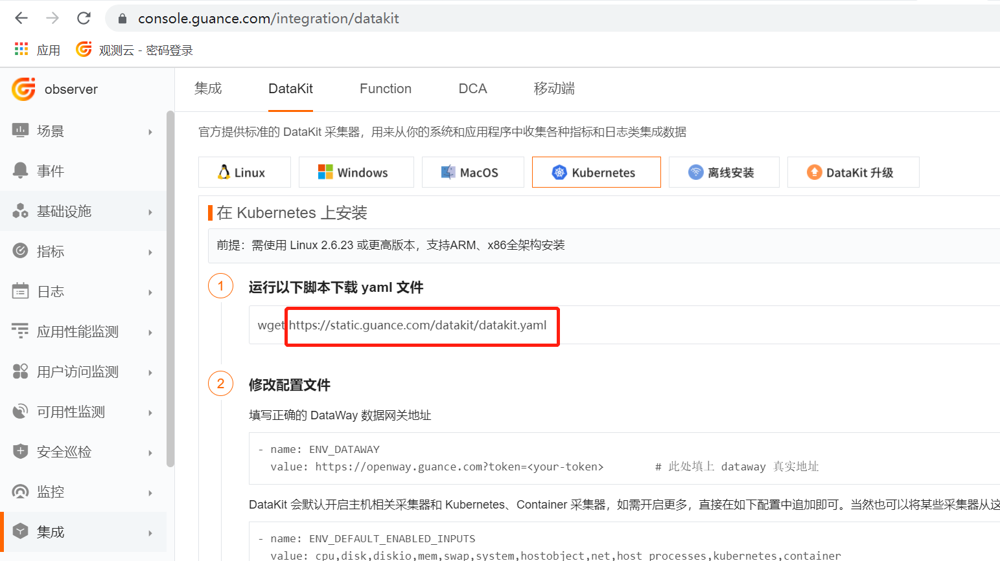
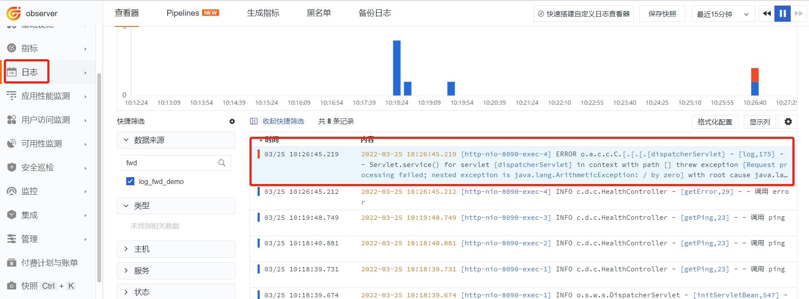
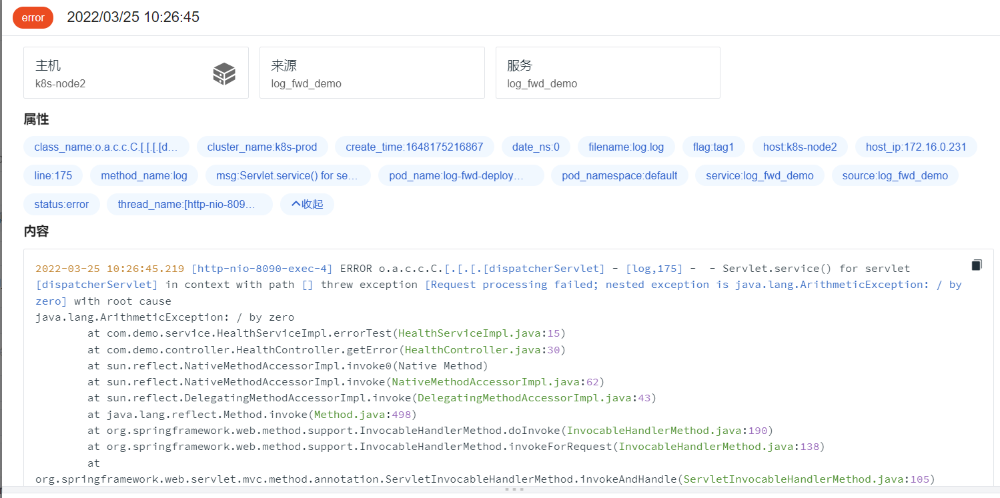
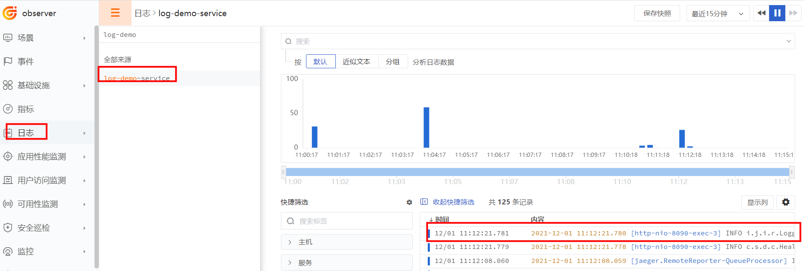

# Pod 日志采集最佳实践

---

## Pod 日志采集

### 采集方案

使用容器化部署微服务时，微服务运行在容器中。Pod 是由一个或一组紧耦合的容器组成，是 Kubernetes 中最小的调度单元，针对 Pod 中日志，本文列举了通过 DataKit 收集日志的三种方案。
### 方案一

DataKit 开通 Logfwd 采集器，Logfwd 以 Sidecar 模式收集业务容器日志。

#### 1 开通 Logfwd 采集器

如果 Kubernetes 未集成 DataKit ，请登录[观测云](https://console.guance.com/)，【集成】->【Datakit】->【Kubernetes】，使用datakit.yaml 文件集成 DataKit 。<br />


下面修改 datakit.yaml文件，把 logfwdserver.conf 文件挂载到 DataKit 的 /usr/local/datakit/conf.d/log/ 目录。<br />在 datakit.yaml 中增加如下配置：

```bash
---
apiVersion: v1
kind: ConfigMap
metadata:
  name: datakit-conf
  namespace: datakit
data:
    #### logfwdserver
    logfwdserver.conf: |-
      [inputs.logfwdserver]
        ## logfwd 接收端监听地址和端口
        address = "0.0.0.0:9531"

        [inputs.logfwdserver.tags]
        # some_tag = "some_value"
        # more_tag = "some_other_value"
```
在 Daemonset 资源中增加：

```bash
        - mountPath: /usr/local/datakit/conf.d/log/logfwdserver.conf
          name: datakit-conf
          subPath: logfwdserver.conf 
```

#### 2 挂载 Pipeline

修改 datakit.yaml 文件，把 pod-logging-demo.p 文件挂载到 DataKit 的 /usr/local/datakit/pipeline/ 目录。<br />在 ConfigMap 资源中增加：

```bash
    pod-logging-demo.p: |-
        #日志样式
        #2021-12-01 10:41:06.015 [http-nio-8090-exec-2] INFO  c.s.d.c.HealthController - [getPing,19] -  - 调用 ping接口
        grok(_, "%{TIMESTAMP_ISO8601:time} %{NOTSPACE:thread_name} %{LOGLEVEL:status}%{SPACE}%{NOTSPACE:class_name} - \\[%{NOTSPACE:method_name},%{NUMBER:line}\\] -  - %{GREEDYDATA:msg}")


        default_time(time,"Asia/Shanghai")
```
在Daemonset资源中增加：

```bash
        - mountPath: /usr/local/datakit/pipeline/pod-logging-demo.p
          name: datakit-conf
          subPath: pod-logging-demo.p
```

【注意】如果不需要使用 Pipeline 做日志切割，此步骤可忽略。

#### 3 重启 Datakit

```bash
kubectl delete -f datakit.yaml
kubectl apply -f datakit.yaml
```

#### 4 Logfwd side采集日志

把 Logfwd 镜像和业务镜像部署在同一个 Pod 中，下面以 log-demo-service:v1 作为业务镜像，生成 /data/app/logs/log.log 日志文件，使用logfwd以共享存储的方式读取日志文件，把日志传给 Datakit。使用 pod-logging-demo.p切割日志，使用日期做多行匹配。

```bash
apiVersion: apps/v1
kind: Deployment
metadata:
  name: log-fwd-deployment
spec:
  replicas: 1
  selector:
    matchLabels:
      app: log-fwd-pod
  template:
    metadata:
      labels:
        app: log-fwd-pod
      annotations:          
    spec:
      nodeName: k8s-node2
      containers:
      - name: log-fwd-container
        image: 172.16.0.238/df-demo/log-demo-service:v2
        ports:
        - containerPort: 8090
          protocol: TCP
        volumeMounts:
        - mountPath: /data/app/logs
          name: varlog 
      - name: logfwd
        image: pubrepo.jiagouyun.com/datakit/logfwd:1.2.12
        env:
        - name: LOGFWD_DATAKIT_HOST
          valueFrom:
            fieldRef:
              apiVersion: v1
              fieldPath: status.hostIP
        - name: LOGFWD_DATAKIT_PORT
          value: "9531"
        - name: LOGFWD_ANNOTATION_DATAKIT_LOGS
          valueFrom:
            fieldRef:
              apiVersion: v1
              fieldPath: metadata.annotations['datakit/logs']
        - name: LOGFWD_POD_NAME
          valueFrom:
            fieldRef:
              apiVersion: v1
              fieldPath: metadata.name
        - name: LOGFWD_POD_NAMESPACE
          valueFrom:
            fieldRef:
              apiVersion: v1
              fieldPath: metadata.namespace  
        volumeMounts:
        - mountPath: /var/log
          name: varlog 
        - mountPath: /opt/logfwd/config
          name: logfwd-config
          subPath: config          
      restartPolicy: Always
      volumes:
      - name: varlog
        emptyDir: {} 
      - configMap:
          name: logfwd-conf
        name: logfwd-config 
---        
apiVersion: v1
kind: ConfigMap
metadata:
  name: logfwd-conf
data:
  config: |
    [
        {            
            "loggings": [
                {
                    "logfiles": ["/var/log/log.log"],
                    "source": "log_fwd_demo",                    
                    "pipeline": "pod-logging-demo.p",
                    "multiline_match": "^\\d{4}-\\d{2}-\\d{2}",
                    "tags": {
                        "flag": "tag1"
                    }
                }
            ]
        }
    ]
```
logfwd-conf 参数说明

- logfiles:  日志文件列表。
- ignore:  文件路径过滤，使用 glob 规则，符合任意一条过滤条件将不会对该文件进行采集。
- source:   数据来源。
- service:  新增标记tag，如果为空，则默认使用 $source。
- pipeline:  使用pipeline时，定义脚本路径。
- character_encoding:  选择编码。
- multiline_match:  多行匹配。
- remove_ansi_escape_codes:  是否删除 ANSI 转义码，例如标准输出的文本颜色等，值为 true 或 false。
- tags：以 key 和 value 的方式定义标签，非必填项。

环境变量说明

- LOGFWD_DATAKIT_HOST:  DataKit 地址。
- LOGFWD_DATAKIT_PORT:  Logfwd 端口
```bash
kubectl apply -f log-fwd-deployment.yaml
```
#### 5 查看日志
登录观测云->【日志】，数据源搜索log_fwd_demo。<br />



### 方案二
        DataKit 默认采集 Pod 中输出到 Stdout 中的日志。为了对日志格式进行特殊处理，通常会在部署 Pod 的Deployment 控制器的yaml文件中增加 Annotations。下面以 Springboot 的微服务项目做的一个日志采集示例，jar包是log-springboot-demo-1.0-SNAPSHOT.jar，日志使用 Logback。具体步骤如下：
#### 1 编写logback-spring.xml
```bash
<?xml version="1.0" encoding="UTF-8"?>

<configuration scan="true" scanPeriod="60 seconds" debug="false">
    <contextName>logback</contextName>

    <!-- 日志根目录 -->
    <property name="log.root.dir" value="./logs"/>
    <!-- 日志输出格式 -->
    <property name="log.pattern" value="%d{yyyy-MM-dd HH:mm:ss.SSS} [%thread] %-5level %logger{20} - [%method,%line] -  - %msg%n" />

    <!-- 打印日志到控制台 -->
    <appender name="Console" class="ch.qos.logback.core.ConsoleAppender">        
        <encoder>
            <pattern>${log.pattern}</pattern>
        </encoder>
    </appender>

    <root level="INFO">
        <appender-ref ref="Console"/>
    </root>
</configuration>

```
#### 2 制作镜像
Dockerfile 如下：
```
FROM openjdk:8u292

RUN /bin/cp /usr/share/zoneinfo/Asia/Shanghai /etc/localtime
RUN echo 'Asia/Shanghai' >/etc/timezone
ENV jar log-springboot-demo-1.0-SNAPSHOT.jar

ENV workdir /data/app/
RUN mkdir -p ${workdir}
WORKDIR ${workdir}
ENTRYPOINT ["sh", "-ec", "exec java ${JAVA_OPTS} -jar ${jar} "]
```
制作镜像并上传到harbor仓库：
```
 docker build -t <your-harbor>/log-demo-service:v1  .
 docker push <your-harbor>/log-demo-service:v1
```

#### 3 编写 pod-log-service.yaml 文件

```
apiVersion: v1
kind: Service
metadata:
  name: log-demo-service
  labels:
    app: log-demo-service
spec:
  selector:
    app: log-demo-service
  ports:
    - protocol: TCP
      port: 8090
      nodePort: 30053
      targetPort: 8090
  type: NodePort
---
apiVersion: apps/v1
kind: Deployment
metadata:
  name: log-demo-service
  labels:
    app: log-demo-service
spec:
  replicas: 1
  selector:
    matchLabels:
      app: log-demo-service
  template:
    metadata:
      labels:
        app: log-demo-service
      annotations:
        datakit/logs: |
          [
            {
              "source": "pod-logging-testing-demo",
              "service": "pod-logging-testing-demo",
              "pipeline": "pod-logging-demo.p",
              "multiline_match": "^\\d{4}-\\d{2}-\\d{2}"
            }
          ]


    spec:
      containers:
      - env:
        - name: POD_NAME
          valueFrom:
            fieldRef:
              fieldPath: metadata.name
        name: log-service
        image: <your-harbor>/log-demo-service:v1
        ports:
        - containerPort: 8090
          protocol: TCP

      restartPolicy: Always
      volumes:
      - name: ddagent
        emptyDir: {}  

```
Annotations 参数说明

- source:  数据来源
- service:  tag标记
- pipeline:  pipeline 脚本路径
- ignore_status: 
- multiline_match: 正则表达式匹配一行日志，如示例中以日期(比如2021-11-26)开始的为一行日志，下行中如果不是此日期开始则认为此行日志是上条日志一部分
- remove_ansi_escape_codes: 是否删除 ANSI 转义码，例如标准输出的文本颜色等

#### 4 配置 Pipeline

datakit-default.yaml 文件的 ConfigMap 资源中增加 pod-logging-demo.p 部分
```
apiVersion: v1
kind: ConfigMap
metadata:
  name: datakit-conf
  namespace: datakit
data:
    pod-logging-demo.p: |-
        #日志样式
        #2021-12-01 10:41:06.015 [http-nio-8090-exec-2] INFO  c.s.d.c.HealthController - [getPing,19] -  - 调用 ping接口
        grok(_, "%{TIMESTAMP_ISO8601:time} %{NOTSPACE:thread_name} %{LOGLEVEL:status}%{SPACE}%{NOTSPACE:class_name} - \\[%{NOTSPACE:method_name},%{NUMBER:line}\\] -  - %{GREEDYDATA:msg}")

        default_time(time)
```
把 Pod-logging-demo.p 挂载到 DataKit 中
```
        - mountPath: /usr/local/datakit/pipeline/pod-logging-demo.p
          name: datakit-conf
          subPath: pod-logging-demo.p
```
#### 5 查看日志
执行如下命令部署 Pod :
```
kuectl apply -f pod-log-service.yaml
```
访问微服务:
```
curl localhost:30053/ping
```
登录[观测云](https://console.guance.com/) [日志]模块，输入 log-demo-service ，成功查看到日志。<br />



### 方案三
        Pod 挂载 Volume ，使用卷类型是 hostPath ，把日志文件挂载到宿主机上，再使用 Daemonset 部署DataKit ，同样挂载 hostPath 类型的 Volume ，这样datakit就能采集到 Pod 中的日志文件。
