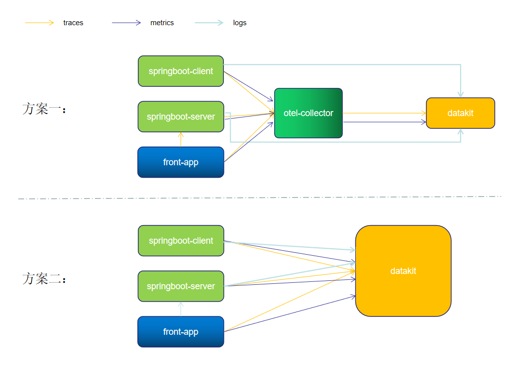
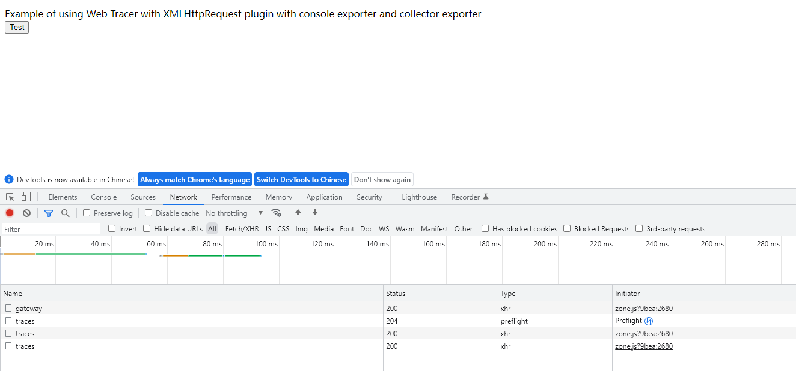
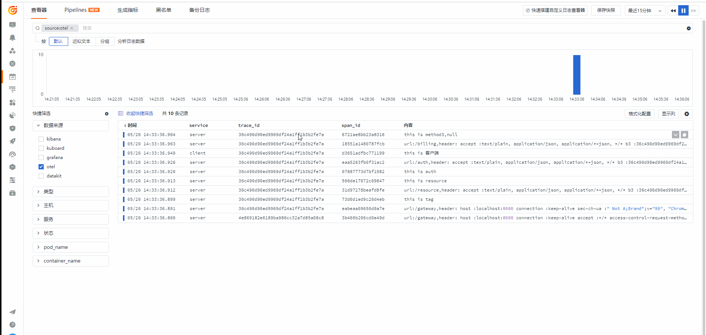
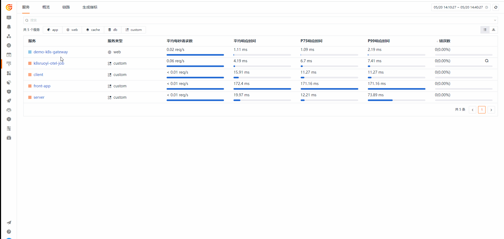
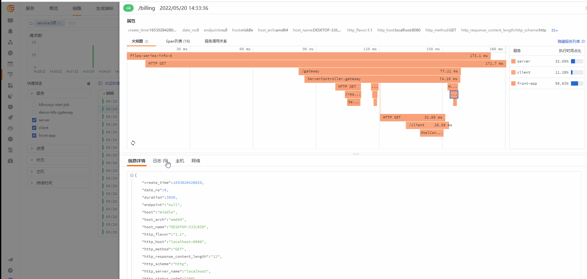
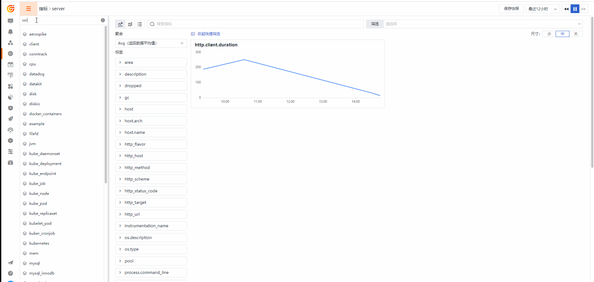
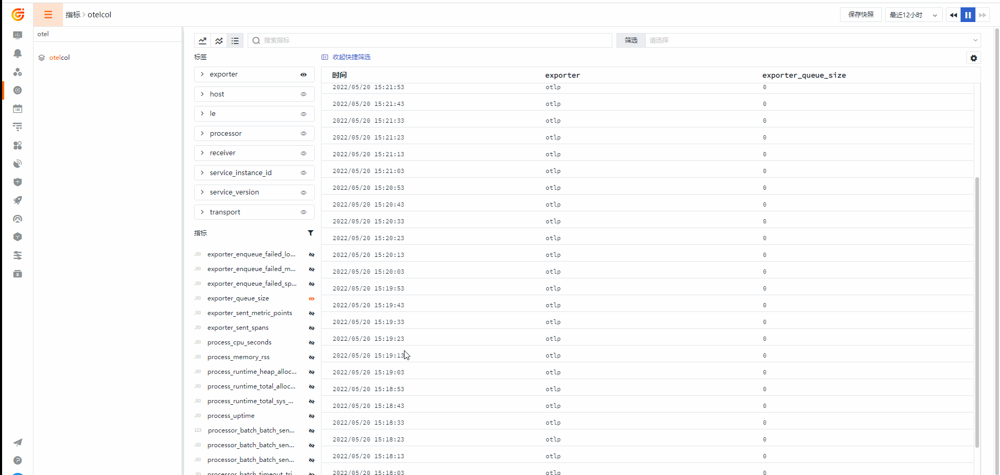
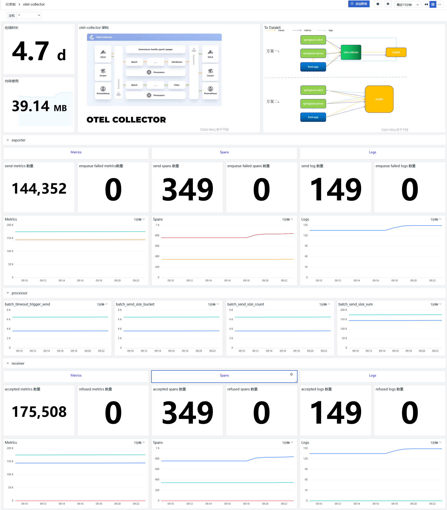

前面两篇我们分别演示并介绍了如何基于 OpenTelemetry 进行可观测。

[OpenTelemetry to Jeager 、Grafana、ELK](./opentelemetry-elk.md)

作为经典的可观测架构，将不同类型的数据存储在不同的平台，比如log 存放在ELK，trace 存放在 Jaeger这类的APM，metric 保存在 prometheus 并通过grafana进行视图展示。

[OpenTelemetry to Grafana](./opentelemetry-grafana.md) 

Grafana Tempo和 Loki 结合，能够让我们直观的看到日志链路情况，但 Loki 的特性也决定了它并不能为大型生产系统提供很好的日志处理分析能力。日志链路也只是可观测的一部分，仅仅是通过日志链路查询并不能解决大部分问题，特别是在微服务云原生架构时代，问题的多样性需要我们从多方面结合分析。如用户访问卡顿，不一定是程序问题，也有可能是当前系统网络、cpu等其他综合因素导致。在用户多云情况下，Grafana 不能有效的支撑其业务发展。

[观测云](https://www.guance.com)

是一个集指标数据、日志数据、APM 、RUM、基础设施、容器、中间件、网络性能等多种数据统一收集管理平台。使用观测云可以为我们全方位观测应用，而不仅仅是日志链路之间的观测。更多观测云信息请跳转到[产品优势](https://www.yuque.com/dataflux/doc/advantage)阅读。

DataKit 是观测云的前置 gateway, 若要把数据打给观测云, 需要正确的配置 DataKit , 而且利用 DataKit 有以下优势:

1. 主机环境下, 每个主机都有一个 datakit , 数据先打给本地的 datakit , 由 datakit 缓存,预处理,然后上报, 避免了网络抖动的同时,附带了边缘处理能力, 给后台数据处理缓解压力.

2. k8 环境下, 每个 node 都有一个 DataKit 的 daemonset, 通过利用k8s 的 local traffic机制, 让每个 node所在 pod 的数据都先发送本地 node 的 DataKit , 避免网络抖动的同时, 给 apm 数据增加了 pod 和 node 标签, 分布式环境下便于定位.

由于 DataKit 是接收 oltp 协议的, 所以可以绕过 collector 直接打给 DataKit , 也可以把 collector 的 exporter 设置为 oltp(DataKit ) 

## 架构


架构上仍然有两套方案供大家选择。

> datakit 采集日志有多种方式，本次最佳实践主要是通过 socket 方式进行日志收集。springboot 应用主要是通过 Logback-logstash 将日志推送到 datakit。

## 方案一

1、应用 server 和 client 将 metric 、trace 数据通过 otlp-exporter push 到 otel-collector

2、front-app 为前端链路，将链路信息 push 到 otel-collector，并访问应用服务 API

3、otel-collector 对数据进行收集、转换后，将 metric 和 trace 数据通过otlp-exporter 传输到 datakit

4、同时应用 server 和 client 将 logs push 到 datakit。

### Exporter

otel-collector 配置了 1 个 exporter：otlpExporter.

```yaml
  otlp:
    endpoint: "http://192.168.91.11:4319"
    tls:
      insecure: true
    compression: none # 不开启gzip
```

参数说明

> endpoint ："[http://192.168.91.11:4319](http://192.168.91.11:4319)" #当前填写的是datakit opentelemetry 采集器地址，协议为 GRPC。
>
>tls.insecure : true # 关闭tls 安全校验
>
>compression: none # 不开启gzip，默认开启

注意

> 所有的应用都部署在同一个机器上，机器 ip 为 192.168.91.11。如果应用和一些中间件单独分开部署，则注意修改对应的 IP。如果是云服务器，则注意开放相关端口，以免访问失败。


## 方案二

方案二其实是直接用 DataKit 换掉 otel-collector

后端 server 和 client 启动时，修改 `otel.exporter.otlp.endpoint`地址，直接指向 datakit 。

> -Dotel.exporter.otlp.endpoint=http://192.168.91.11:4319

前端改动

```javascript
const otelExporter = new OTLPTraceExporter({
  // optional - url default value is http://localhost:55681/v1/traces
  url: 'http://192.168.91.11:9529/otel/v1/trace',
  headers: {},
});
```

## 安装配置 DataKit

### 安装 DataKit

- <[安装 DataKit](https://www.yuque.com/dataflux/datakit/datakit-install)>

- DataKit 接入版本 >=1.2.12

### 开启 OpenTelemetry 采集器

1. 开启 OpenTelemetry 插件，复制 Sample 文件

```shell
cd /usr/local/datakit/conf.d/opentelemetry
cp opentelemetry.conf.sample opentelemetry.conf
```

2. 修改 opentelemetry.conf

```toml
[[inputs.opentelemetry]]
## 在创建'trace',Span','resource'时，会加入很多标签，这些标签最终都会出现在'Span'中
## 当您不希望这些标签太多造成网络上不必要的流量损失时，可选择忽略掉这些标签
## 支持正则表达，注意:将所有的'.'替换成'_'
## When creating 'trace', 'span' and 'resource', many labels will be added, and these labels will eventually appear in all 'spans'
## When you don't want too many labels to cause unnecessary traffic loss on the network, you can choose to ignore these labels
## Support regular expression. Note!!!: all '.' Replace with '_'
# ignore_attribute_keys = ["os_*","process_*"]

## Keep rare tracing resources list switch.
## If some resources are rare enough(not presend in 1 hour), those resource will always send
## to data center and do not consider samplers and filters.
# keep_rare_resource = false

## Ignore tracing resources map like service:[resources...].
## The service name is the full service name in current application.
## The resource list is regular expressions uses to block resource names.
# [inputs.opentelemetry.close_resource]
# service1 = ["resource1", "resource2", ...]
# service2 = ["resource1", "resource2", ...]
# ...

## Sampler config uses to set global sampling strategy.
## priority uses to set tracing data propagation level, the valid values are -1, 0, 1
##   -1: always reject any tracing data send to datakit
##    0: accept tracing data and calculate with sampling_rate
##    1: always send to data center and do not consider sampling_rate
## sampling_rate used to set global sampling rate
# [inputs.opentelemetry.sampler]
# priority = 0
# sampling_rate = 1.0

# [inputs.opentelemetry.tags]
# key1 = "value1"
# key2 = "value2"
# ...

[inputs.opentelemetry.expectedHeaders]
## 如有header配置 则请求中必须要携带 否则返回状态码500
## 可作为安全检测使用,必须全部小写
# ex_version = xxx
# ex_name = xxx
# ...

## grpc
[inputs.opentelemetry.grpc]
## trace for grpc
trace_enable = true

## metric for grpc
metric_enable = true

## grpc listen addr
# addr = "127.0.0.1:4317"
addr = "0.0.0.0:4319"

## http
[inputs.opentelemetry.http]
## if enable=true
## http path (do not edit):
##	trace : /otel/v1/trace
##	metric: /otel/v1/metric
## use as : http://127.0.0.1:9529/otel/v11/trace . Method = POST
enable = true
## return to client status_ok_code :200/202
http_status_ok = 200

```
[inputs.opentelemetry.grpc] 参数说明

- trace_enable：true 		#开启grpc trace
- metric_enable： true 	    #开启grpc metric
- addr: 0.0.0.0:4319 		    #开启端口

3. 重启 DataKit

```shell
datakit --restart
```

### 开启日志采集

1. 开启 Logging 插件，复制 Sample 文件

```shell
cd /usr/local/datakit/conf.d/log
cp logging.conf.sample logging-socket-4560.conf
```

2. 修改 logging-socket-4560.conf

```toml
[[inputs.logging]]
  ## required
#  logfiles = [
#    "/var/log/syslog",
#    "/var/log/message",
#  ]

  sockets = [
   "tcp://0.0.0.0:4560"
  ]

  ## glob filteer
  ignore = [""]

  ## your logging source, if it's empty, use 'default'
  source = "otel"

  ## add service tag, if it's empty, use $source.
  service = "otel"

  ## grok pipeline script path
  pipeline = "log_socket.p"

  ## optional status:
  ##   "emerg","alert","critical","error","warning","info","debug","OK"
  ignore_status = []

  ## optional encodings:
  ##    "utf-8", "utf-16le", "utf-16le", "gbk", "gb18030" or ""
  character_encoding = ""

  ## The pattern should be a regexp. Note the use of '''this regexp'''
  ## regexp link: https://golang.org/pkg/regexp/syntax/#hdr-Syntax
  # multiline_match = '''^\S'''

  ## removes ANSI escape codes from text strings
  remove_ansi_escape_codes = false

  [inputs.logging.tags]
  # some_tag = "some_value"
  # more_tag = "some_other_value"
```

参数说明

- sockets #配置socket信息
- pipeline： log_socket.p # 日志解析

3. 配置pipeline

> cd pipeline
> vim  log_socket.p

```toml
json(_,message,"message")
json(_,class,"class")
json(_,serverName,"service")
json(_,thread,"thread")
json(_,severity,"status")
json(_,traceId,"trace_id")
json(_,spanId,"span_id")
json(_,`@timestamp`,"time")
set_tag(service)
default_time(time)
```

4. 重启 DataKit

```shell
datakit --restart
```

### 开启指标采集

1. 开启 prom 插件，复制 Sample 文件

```shell
cd /usr/local/datakit/conf.d/prom
cp prom.conf.sample prom-otel.conf
```

2. 修改 prom-otel.conf

```toml
[[inputs.prom]]
  ## Exporter URLs
  urls = ["http://127.0.0.1:8888/metrics"]

  ## 忽略对 url 的请求错误
  ignore_req_err = false

  ## 采集器别名
  source = "prom"

  ## 采集数据输出源
  # 配置此项，可以将采集到的数据写到本地文件而不将数据打到中心
  # 之后可以直接用 datakit --prom-conf /path/to/this/conf 命令对本地保存的指标集进行调试
  # 如果已经将 url 配置为本地文件路径，则 --prom-conf 优先调试 output 路径的数据
  # output = "/abs/path/to/file"

  ## 采集数据大小上限，单位为字节
  # 将数据输出到本地文件时，可以设置采集数据大小上限
  # 如果采集数据的大小超过了此上限，则采集的数据将被丢弃
  # 采集数据大小上限默认设置为32MB
  # max_file_size = 0

  ## 指标类型过滤, 可选值为 counter, gauge, histogram, summary, untyped
  # 默认只采集 counter 和 gauge 类型的指标
  # 如果为空，则不进行过滤
  metric_types = []

  ## 指标名称筛选：符合条件的指标将被保留下来
  # 支持正则，可以配置多个，即满足其中之一即可
  # 如果为空，则不进行筛选，所有指标均保留
  # metric_name_filter = ["cpu"]

  ## 指标集名称前缀
  # 配置此项，可以给指标集名称添加前缀
  measurement_prefix = ""

  ## 指标集名称
  # 默认会将指标名称以下划线"_"进行切割，切割后的第一个字段作为指标集名称，剩下字段作为当前指标名称
  # 如果配置measurement_name, 则不进行指标名称的切割
  # 最终的指标集名称会添加上measurement_prefix前缀
  # measurement_name = "prom"

  ## 采集间隔 "ns", "us" (or "µs"), "ms", "s", "m", "h"
  interval = "10s"

  ## 过滤 tags, 可配置多个tag
  # 匹配的tag将被忽略
  # tags_ignore = ["xxxx"]

  ## TLS 配置
  tls_open = false
  # tls_ca = "/tmp/ca.crt"
  # tls_cert = "/tmp/peer.crt"
  # tls_key = "/tmp/peer.key"

  ## 自定义认证方式，目前仅支持 Bearer Token
  # token 和 token_file: 仅需配置其中一项即可
  # [inputs.prom.auth]
  # type = "bearer_token"
  # token = "xxxxxxxx"
  # token_file = "/tmp/token"

  ## 自定义指标集名称
  # 可以将包含前缀 prefix 的指标归为一类指标集
  # 自定义指标集名称配置优先 measurement_name 配置项
  #[[inputs.prom.measurements]]
  #  prefix = "cpu_"
  #  name = "cpu"

  # [[inputs.prom.measurements]]
  # prefix = "mem_"
  # name = "mem"

  ## 重命名 prom 数据中的 tag key
	[inputs.prom.tags_rename]
		overwrite_exist_tags = false
		[inputs.prom.tags_rename.mapping]
			# tag1 = "new-name-1"
			# tag2 = "new-name-2"
			# tag3 = "new-name-3"

  ## 自定义Tags
  [inputs.prom.tags]
  # some_tag = "some_value"
  # more_tag = "some_other_value"

```

参数说明

- urls #otel-collector 指标url
- metric_types = []： 采集所有的指标

3. 重启 DataKit

```shell
datakit --restart
```

## 安装 OpenTelemetry-Collector

### 源码地址

[https://github.com/lrwh/observable-demo/tree/main/opentelemetry-collector-to-guance](https://github.com/lrwh/observable-demo/tree/main/opentelemetry-collector-to-guance)

### 配置 otel-collector-config.yaml

新增 collecter 配置，配置1个recevier（otlp）、4个exporter(prometheus、zipkin、jaeger 和 elasticsearch。

```yaml
receivers:
  otlp:
    protocols:
      grpc:
      http:
        cors:
          allowed_origins:
            - http://*
            - https://*
exporters:
  otlp:
    endpoint: "http://192.168.91.11:4319"
    tls:
      insecure: true
    compression: none # 不开启gzip

processors:
  batch:

extensions:
  health_check:
  pprof:
    endpoint: :1888
  zpages:
    endpoint: :55679

service:
  extensions: [pprof, zpages, health_check]
  pipelines:
    traces:
      receivers: [otlp]
      processors: [batch]
      exporters: [otlp]
    metrics:
      receivers: [otlp]
      processors: [batch]
      exporters: [otlp]


```

通过 docker-compose 安装 otel-collector

```yaml
version: '3.3'

services:
    # Collector
    otel-collector:
        image: otel/opentelemetry-collector-contrib:0.51.0
        command: ["--config=/etc/otel-collector-config.yaml"]
        volumes:
            - ./otel-collector-config.yaml:/etc/otel-collector-config.yaml
        ports:
            - "1888:1888"   # pprof extension
            - "8888:8888"   # Prometheus metrics exposed by the collector
            - "8889:8889"   # Prometheus exporter metrics
            - "13133:13133" # health_check extension
            - "4350:4317"        # OTLP gRPC receiver
            - "55670:55679" # zpages extension
            - "4318:4318"

```

### 启动容器

```yaml
docker-compose up -d
```

### 查看启动情况

```yaml
docker-compose ps
```


## Springboot 应用接入（APM & Log）

主要是通过 Logstash-logback  提供的 socket 方式将日志上传到 Logstash 上，需要对代码做部分调整。

### 1、项目Maven引用 Logstash-logback

```toml
<dependency>
  <groupId>net.logstash.logback</groupId>
  <artifactId>logstash-logback-encoder</artifactId>
  <version>7.0.1</version>
</dependency>
```

### 2、新增 logback-logstash.xml

```java
<?xml version="1.0" encoding="UTF-8"?>
<configuration scan="true" scanPeriod="30 seconds">
    <!-- 部分参数需要来源于properties文件 -->
    <springProperty scope="context" name="logName" source="spring.application.name" defaultValue="localhost.log"/>
    <!-- 配置后可以动态修改日志级别-->
    <jmxConfigurator />
    <property name="log.pattern" value="%d{HH:mm:ss} [%thread] %-5level %logger{10} [traceId=%X{trace_id} spanId=%X{span_id} userId=%X{user-id}] %msg%n" />

    <springProperty scope="context" name="logstashHost" source="logstash.host" defaultValue="logstash"/>
    <springProperty scope="context" name="logstashPort" source="logstash.port" defaultValue="4560"/>
    <!-- %m输出的信息,%p日志级别,%t线程名,%d日期,%c类的全名,,,, -->
    <appender name="STDOUT" class="ch.qos.logback.core.ConsoleAppender">
        <encoder>
            <pattern>${log.pattern}</pattern>
            <charset>UTF-8</charset>
        </encoder>
    </appender>

    <appender name="FILE" class="ch.qos.logback.core.rolling.RollingFileAppender">
        <file>logs/${logName}/${logName}.log</file>    <!-- 使用方法 -->
        <append>true</append>
        <rollingPolicy class="ch.qos.logback.core.rolling.SizeAndTimeBasedRollingPolicy">
            <fileNamePattern>logs/${logName}/${logName}-%d{yyyy-MM-dd}.log.%i</fileNamePattern>
            <maxFileSize>64MB</maxFileSize>
            <maxHistory>30</maxHistory>
            <totalSizeCap>1GB</totalSizeCap>
        </rollingPolicy>
        <encoder>
            <pattern>${log.pattern}</pattern>
            <charset>UTF-8</charset>
        </encoder>
    </appender>

    <!-- LOGSTASH输出设置 -->
    <appender name="LOGSTASH" class="net.logstash.logback.appender.LogstashTcpSocketAppender">
        <!-- 配置logStash 服务地址 -->
        <destination>${logstashHost}:${logstashPort}</destination>
        <!-- 日志输出编码 -->
        <encoder class="net.logstash.logback.encoder.LoggingEventCompositeJsonEncoder">
            <providers>
                <timestamp>
                    <timeZone>UTC+8</timeZone>
                </timestamp>
                <pattern>
                    <pattern>
                        {
                        "podName":"${podName:-}",
                        "namespace":"${k8sNamespace:-}",
                        "severity": "%level",
                        "serverName": "${logName:-}",
                        "traceId": "%X{trace_id:-}",
                        "spanId": "%X{span_id:-}",
                        "pid": "${PID:-}",
                        "thread": "%thread",
                        "class": "%logger{40}",
                        "message": "%message\n%exception"
                        }
                    </pattern>
                </pattern>
            </providers>
        </encoder>
        <!-- 保活 -->
        <keepAliveDuration>5 minutes</keepAliveDuration>
    </appender>

    <!-- 只打印error级别的内容 -->
    <logger name="net.sf.json" level="ERROR" />
    <logger name="org.springframework" level="ERROR" />

    <root level="info">
        <appender-ref ref="STDOUT"/>
        <appender-ref ref="LOGSTASH"/>
    </root>
</configuration>
```

### 3、新增 application-logstash.yml

```java
logstash:
  host: localhost
  port: 4560
logging:
  config: classpath:logback-logstash.xml
```

### 4、重新打包

```java
mvn clean package -DskipTests
```

### 5、启动服务

```yaml
java -javaagent:opentelemetry-javaagent-1.13.1.jar \
-Dotel.traces.exporter=otlp \
-Dotel.exporter.otlp.endpoint=http://localhost:4350 \
-Dotel.resource.attributes=service.name=server,username=liu \
-Dotel.metrics.exporter=otlp \
-Dotel.propagators=b3 \
-jar springboot-server.jar --client=true \
--spring.profiles.active=logstash \
--logstash.host=192.168.91.11 \
--logstash.port=4560
```
```yaml
java -javaagent:opentelemetry-javaagent-1.13.1.jar \
-Dotel.traces.exporter=otlp \
-Dotel.exporter.otlp.endpoint=http://localhost:4350 \
-Dotel.resource.attributes=service.name=client,username=liu \
-Dotel.metrics.exporter=otlp \
-Dotel.propagators=b3 \
-jar springboot-client.jar \
--spring.profiles.active=logstash \
--logstash.host=localhost \
--logstash.port=4560
```

## JS 接入（RUM）

### 源码地址

[https://github.com/lrwh/observable-demo/tree/main/opentelemetry-js](https://github.com/lrwh/observable-demo/tree/main/opentelemetry-js)

### 配置 OTLPTraceExporter

```javascript
const otelExporter = new OTLPTraceExporter({
  // optional - url default value is http://localhost:55681/v1/traces
  url: 'http://192.168.91.11:4318/v1/traces',
  headers: {},
});
```

此处 url 为 otel-collector 的 otlp 接收地址（ http 协议）。

### 配置server_name

```javascript
const providerWithZone = new WebTracerProvider({
      resource: new Resource({
        [SemanticResourceAttributes.SERVICE_NAME]: 'front-app',
      }),
    }
);
```

### 安装

```toml
npm install
```

### 启动

```toml
npm start
```

默认端口`8090`

## APM 与 RUM 关联

APM 与 RUM 主要通过 header 参数进行关联，为了保持一直，需要配置统一的传播器（`Propagator`），这里RUM 采用的是 `B3`，所以 APM 也需要配置`B3`，只需要在 APM 启动参数加上`-Dotel.propagators=b3`即可。

## APM 与 Log 关联

APM 与 Log 主要是通过在日志埋点 traceId 和 spanId。不同的日志接入方式，埋点有差异。

## 观测云

通过访问前端url产生 trace 信息。



### 日志查看器


### 链路（**应用性能监测**）

### 从链路查看对应的 Log

### 应用Metrics

### Otelcol Metrics


### Otelcol 集成视图


