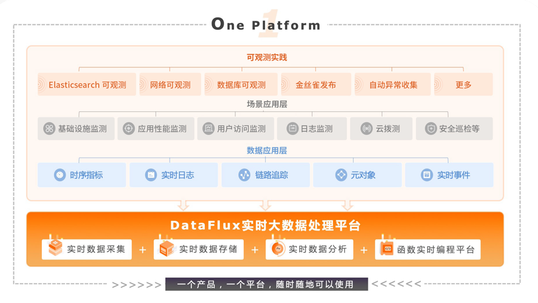

# OpenTelemetry 可观测性

---

## 建设可观测性需要解决的问题
> 1. 链路追踪怎么前后端串联？
>
> 1. 链路追踪关联相应日志和指标？

1、OpenTelemetry 实现了不同语言的SDK，前端链路主要通过`opentelemetry-js` 实现，后端也有相关语言的实现，比如 Java、Go、Python 等，不同语言将各自的 trace 信息统一上报到 opentelemetry-collector（以下简称`otel-collector`）。

2、以 Java 语言为例，opentelemetry-java（以下简称“Agent”）通过`javaagent`方式注入到应用当中，应用产生 trace 信息后，通过设置 MDC 可以把 traceId 和 spanId 作为参数传递给 log，这样 log 在输出的时候便会带上 traceId 和 spanId 。

映射诊断上下文 (MDC) 是
> 一种用于区分来自不同来源的交错日志输出的工具。— [log4j MDC 文档](http://logging.apache.org/log4j/1.2/apidocs/org/apache/log4j/MDC.html)

它包含线程本地上下文信息，稍后将其复制到日志库捕获的每个日志事件中。

OTel Java 代理将有关当前跨度的几条信息注入到每个日志记录事件的 MDC 副本中：

> - `trace_id`- 当前跟踪 id（与 相同`Span.current().getSpanContext().getTraceId()`）；
> - `span_id`- 当前跨度 id（与 相同`Span.current().getSpanContext().getSpanId()`）；
> - `trace_flags`- 当前跟踪标志，根据 W3C 跟踪标志格式（与 相同`Span.current().getSpanContext().getTraceFlags().asHex()`）格式化。

这三条信息可以包含在日志库生成的日志语句中，方法是在模式/格式中指定它们。

提示：对于使用 logback 的 Spring Boot 配置，您可以通过仅覆盖以下内容将 MDC 添加到日志行`logging.pattern.level`：

```properties
logging.pattern.level = trace_id=%mdc{trace_id} span_id=%mdc{span_id} trace_flags=%mdc{trace_flags} %5p
```

这样，解析应用程序日志的任何服务或工具都可以将跟踪/跨度与日志语句相关联。

3、OpenTelemetry 同样也支持指标的收集，通过 otel-collector 将指标输出到对应的exporter，比如 Prometheus，然后通过 Grafana 进行展示。otlpExporter 支持 metric 的输出，metric 和 log 及 trace 的关联可以通过`tag`为`server.name`进行关联。

> OpenTelemetry的初衷是统一数据格式，也就说明了，在很长的一段时间，OpenTelemetry并不打算把精力放在可观测产品上，大家仍然是采用 OpenTelemetry 作为数据中转站或者使用 OpenTelemetry 的数据标准来约束自身的可观测产品。

## OpenTelemetry 进行端到端全链路可观测性建设

以下介绍三种基于 OpenTelemetry 进行端到端全链路可观测性建设：

### [1、基于传统监控的大集合](./opentelemetry-elk.md)

主要是通过 otel-collector 将 log、metric、trace 分别推送到ELK、Prometheus和相关APM产商，如 Jaeger。

### [2、基于 Grafana 全家桶](./opentelemetry-grafana.md)

近年来，Grafana 也开始进军可观测领域，成立了 Grafana-Cloud 和 Grafana Labs，在可观测上也推出了自己的一套解决方案。Grafana Tempo 是一个开源、易于使用且大规模的分布式跟踪后端。Tempo 具有成本效益，只需要对象存储即可运行，并且与 Grafana、Prometheus 和 Loki 深度集成。Tempo 可与任何开源跟踪协议一起使用，包括 Jaeger、Zipkin 和 OpenTelemetry，所以 Tempo 可直接接收来自 OpenTelemetry 的 trace 数据， Loki 用于采集来自 OpenTelemetry 的 log 数据，Grafana 仍然采用 Prometheus 来接收metric 数据。

> 以上两种方案虽然解决了数据格式问题，但是从某种意义上来说，只能称之为技术，而不能称之为产品，基本上算是开源工具的缝合怪，在遇到一些业务问题时，仍然需要访问不同的工具查看分析问题，相关 log、metric、trace 没有很好的融合，并没有减轻运维以及开发人员运维及沟通成本。基于统一log、metric、trace 的数据分析平台就显得尤为重要，Grafana也在朝着这方面不断努力，但并没有完全解决数据孤岛，不同结构的数据仍然采用了不同的查询语言，Grafana 目前实现了 log 数据关联 trace 数据，但 trace 数据并不能反向关联 log 数据，Grafana 团队仍需努力解决数据之间的互相关联查询分析。

### [3、基于观测云-商业可观测性产品](./opentelemetry-guance.md)

[观测云](https://www.guance.com)是一个集指标数据、日志数据、APM 、RUM、基础设施、容器、中间件、网络性能等多种数据统一收集管理平台。使用观测云可以为我们全方位观测应用，而不仅仅是日志链路之间的观测。更多观测云信息请跳转到[产品优势](https://www.yuque.com/dataflux/doc/advantage)阅读。



DataKit 是观测云的前置 gateway, 若要把数据打给观测云, 需要正确的配置 DataKit , 而且利用 DataKit 有以下优势:

> 1.  主机环境下, 每个主机都有一个 datakit , 数据先打给本地的 datakit , 由 datakit 缓存,预处理,然后上报, 避免了网络抖动的同时,附带了边缘处理能力, 给后台数据处理缓解压力. 
> 2.  k8 环境下, 每个 node 都有一个 DataKit 的 daemonset, 通过利用k8s 的 local traffic机制, 让每个 node所在 pod 的数据都先发送本地 node 的 DataKit , 避免网络抖动的同时, 给 apm 数据增加了 pod 和 node 标签, 分布式环境下便于定位. 


DataKit 的设计理念也是学习了 OpenTelemetry，兼容了oltp 协议的, 所以可以绕过 collector 直接打给 DataKit , 也可以把 collector 的 exporter 设置为 oltp(DataKit )

### 方案对比
| **场景** | **开源自建产品** | **使用观测云** |
| --- | --- | --- |
| **构建云时代监测体系** | 专业技术团队至少超过3个月的投入，并且仅仅是开始 | 30分钟开箱即用 |
| **相关费用投入** | 一个简单开源监控产品的硬件投入也需要超过2万/年，如果是云时代可观测平台则至少10万/年固定投入（以云硬件估计） | 按需付费，根据实际的业务情 况，费用弹性，整体费用比使用开源产品的综合投入低50%以上 |
| **系统维护管理** | 需要专业的技术工程师长期关注与投入，多种开源产品混合使用也增加了管理的复杂度 | 无需关注，将精力放在业务问题上 |
| **需要在服务器上安装的探针数量** | 每个开源软件都需要一个探针，服务器大量性能被探针占用 | 一个探针，完全基于二进制运行，极低的CPU和内存占用 |
| **带来的价值** | 仅仅取决于公司自身工程师的能力，以及其钻研开源产品的能力 | 全方位数据化平台，全面可观测性，让工程师们利用数据解决问题 |
| **性能与故障的根因分析** | 仅仅靠团队自身的能力 | 基于数据分析快速定位 |
| **安全性** | 各种混杂开源软件，考验技术工程师的综合能力 | 全面的安全扫描和测试，客户侧代码向用户开源，并且产品及时迭代更新，确保安全 |
| **可扩展性与服务** | 需要自己构建SRE工程师团队 | 提供专业的服务，相当于配置一个外部的SRE支持团队 |
| **培训与支持** | 聘请外部老师 | 长期的在线培训支持 |

