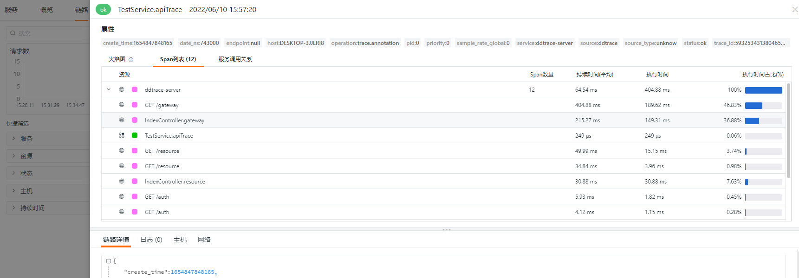
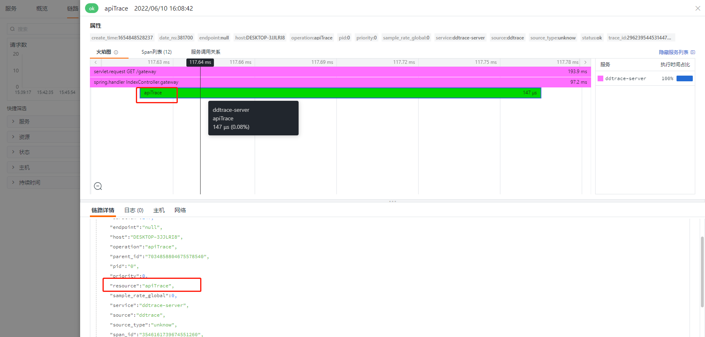
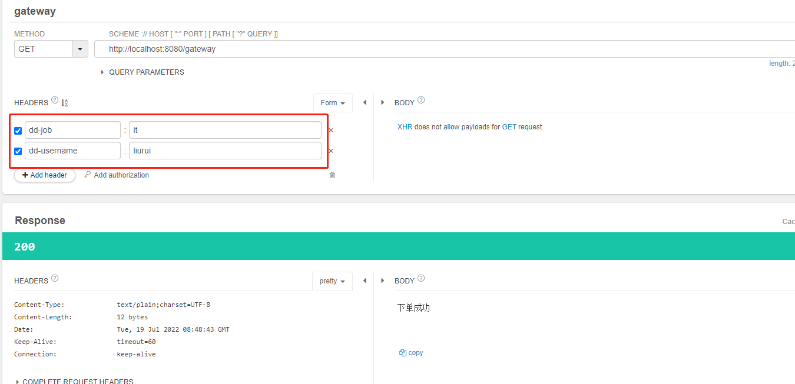
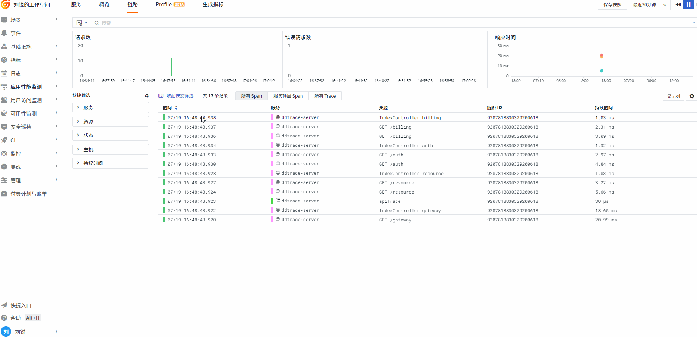
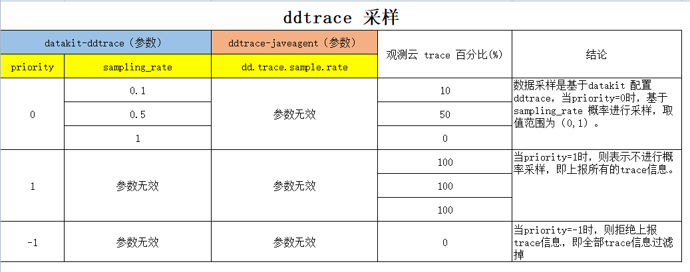
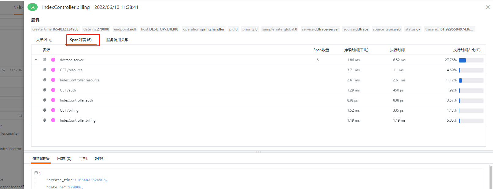
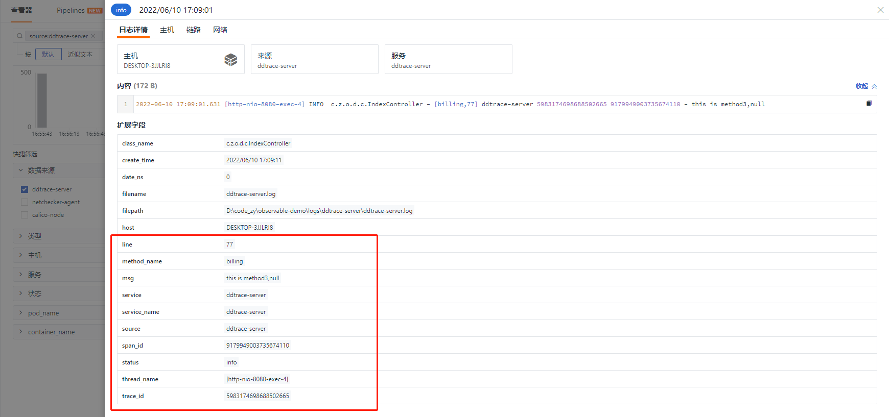
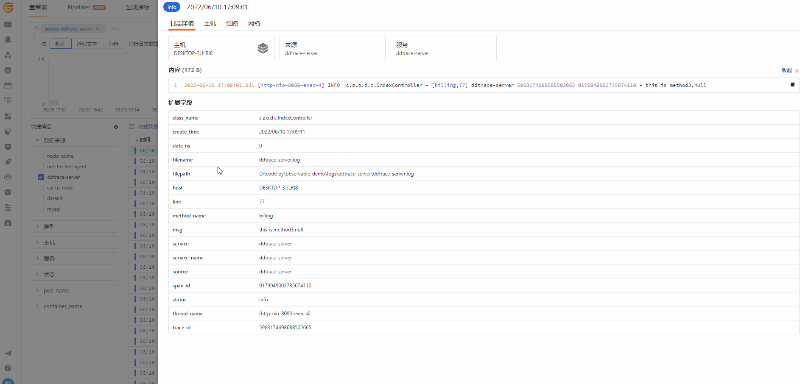

# ddtrace 高级用法

---

> *作者： 刘锐*

[ddtrace java 文档 ](https://docs.datadoghq.com/tracing/setup_overview/setup/java/)

当前案例使用 ddtrace 版本`0.78.3`和 `0.97.0`（最新版本）进行测试


## 准备 Shell

```shell
java -javaagent:D:/ddtrace/dd-java-agent-0.97.0.jar \
-Ddd.service=ddtrace-server \
-Ddd.agent.port=9529 \
-jar springboot-ddtrace-server.jar
```

## 开启 query 参数

开启 query 参数，可以更直观方便的让用户看到当前请求携带了哪些参数，更直观的还原客户真实操作流程，但 query 开启参数只能采集到 url 上的参数，request Body 里面的参数目前尚不支持。默认为 false，表示为默认不开启。

> -Ddd.http.server.tag.query-string=TRUE


## 配置远程采集链接

`dd.agent.host` 默认值是`localhost`，所以默认推送的是本地的 DataKit ，如果想推送远程 DataKit ，则需要配置 `dd.agent.host`。

>  -Ddd.agent.host=192.168.91.11


## 类或方法注入 Trace

ddtrace 支持给方法注入 Trace ，默认情况下，ddtrace 会对所有的 API 接口动态注入 Trace，如果想对非 API 类（方法）——一些重要的类和方法需要重点标记，可以通过 `dd.trace.methods`参数配置。

> **Environment Variable**: DD_TRACE_METHODS<br />**Default**: null<br />**Example**: package.ClassName[method1,method2,...];AnonymousClass$1[call];package.ClassName[*]<br />List of class/interface and methods to trace. Similar to adding @Trace, but without changing code. **Note:** The wildcard method support ([*]) does not accommodate constructors, getters, setters, synthetic, toString, equals, hashcode, or finalizer method calls

如对`com.zy.observable.ddtrace.service.TestService` 类的`getDemo`方法需要添加 Trace。

> -Ddd.trace.methods="com.zy.observable.ddtrace.service.TestService[getDemo]"

部分代码所示：

```java
    @Autowired
    private TestService testService;

    @GetMapping("/gateway")
    @ResponseBody
    public String gateway(String tag) {
        String userId = "user-" + System.currentTimeMillis();
        MDC.put(ConstantsUtils.MDC_USER_ID, userId);
        logger.info("this is tag");
        sleep();
        testService.getDemo();
        httpTemplate.getForEntity(apiUrl + "/resource", String.class).getBody();
        httpTemplate.getForEntity(apiUrl + "/auth", String.class).getBody();
        if (client) {
            httpTemplate.getForEntity("http://"+extraHost+":8081/client", String.class).getBody();
        }
        return httpTemplate.getForEntity(apiUrl + "/billing?tag=" + tag, String.class).getBody();
    }
```

未添加`dd.trace.methods`参数，上报 11 个 span ，效果如下：


## 忽略 Trace（实测无效）

通过配置`dd.trace.classes.exclude`可以忽略我们不愿意上报的 trace 数据，在实际生产环境中，比如注册中心的心跳。

> **Environment Variable**: DD_TRACE_CLASSES_EXCLUDE<br />**Default**: null<br />**Example**: package.ClassName,package.ClassName$Nested,package.Foo*,package.other.*<br />A list of fully qualified classes (that may end with a wildcard to denote a prefix) which will be ignored (not modified) by the tracer. Must use the jvm internal representation for names (eg package.ClassName$Nested and not package.ClassName.Nested)

忽略 `IndexController`产生的 trace，配置入下：

> -Ddd.trace.classes.exclude="com.zy.observable.ddtrace.controller.IndexController"

然而并没有达到既定的效果。


## 入侵式埋点

与前面件Tag有差异，前面是通过 javaagent方式配置埋点，相对来说方便管理和动态埋点，不会因为想要对特殊的请求做一些埋点而调整代码。但同时配置会比较繁琐，入侵式埋点能够很好的跟业务结合，对业务进行埋点，则需要用 `dd-trace-api`的方式。

以java为例
```xml
        <dependency>
            <groupId>com.datadoghq</groupId>
            <artifactId>dd-trace-api</artifactId>
            <version>0.102.0</version>
        </dependency>
```
在对应需要埋点的方法添加注解  `@Trace`

```java
    @Trace
    public String apiTrace(){
        return "apiTrace";
    }
```

然后在 `gateway`方法调用这个
```java
...
testService.apiTrace();
...
```
重启，访问 gateway



注意：入侵式埋点不代表应用启动的时候不需要 agent ，如果没有agent， `@Trace` 也将失效。`@Trace` 注释具有默认操作名称 `trace.annotation`，而跟踪的方法默认具有资源。

可以修改对应的名称
```java
    @Trace(resourceName = "apiTrace",operationName = "apiTrace")
    public String apiTrace(){
        return "apiTrace";
    }
```
修改后，效果如下：



## 两种添加 Tag 方式

ddtrace 提供两种添加 tag 方式，效果一样。但还是推荐使用 dd.tags 方式

### dd.trace.span.tags

将 `projectName:observable-demo` 添加到每个 span 的示例：

> -Ddd.trace.span.tags=projectName:observable-demo 


### dd.tags

> -Ddd.tags=user_name:joy


两种方式都能生成 tag，效果一样，都会在`meta`里面展示数据。

如果确实想要把 `dd.tags`标记的 tag 作为观测云的 标签 ，则需要在 ddtrace.conf 配置 `customer_tags`

```yaml
    [[inputs.ddtrace]]
      endpoints = ["/v0.3/traces", "/v0.4/traces", "/v0.5/traces"]
      customer_tags = ["projectName","user_name"]
```

效果如图<br />

> 注意：如果自定义tag 包含了 [tag 关键字](/datakit/ddtrace/#tags)，则会当成标签显示。

## 使用 Baggage 让业务关键 tag 在后端链路进行传递

ddtrace 提供了`Baggage` 方式，准确的说，应该是 ddtrace 使用 opentracing 提供的`Baggage` 功能，让指定的 tag 在链路上进行传递。比如用户名、岗位等信息，方便分析用户行为。

> span.setBaggageItem("username","liurui");

### 引用 opentracing 依赖

``` 
    <dependency>
        <groupId>com.datadoghq</groupId>
        <artifactId>dd-trace-api</artifactId>
        <version>0.102.0</version>
    </dependency>
    <dependency>
        <groupId>io.opentracing</groupId>
        <artifactId>opentracing-api</artifactId>
        <version>0.33.0</version>
    </dependency>
    <dependency>
        <groupId>io.opentracing</groupId>
        <artifactId>opentracing-util</artifactId>
        <version>0.33.0</version>
    </dependency>
```

### 编写 TraceBaggageFilter  

通过 TraceBaggageFilter 方式拦截请求，并将 request header 相关参数通过 baggage 方式进行传递。

``` java
package com.zy.observable.ddtrace;


import io.opentracing.Span;
import io.opentracing.util.GlobalTracer;
import org.apache.commons.lang3.StringUtils;
import org.springframework.stereotype.Component;

import javax.servlet.*;
import javax.servlet.http.HttpServletRequest;
import java.io.IOException;
import java.util.Enumeration;

/**
 * Baggage 可以让 tag 在链路之间进行传递，通过获取当前请求header，将指定前缀的header设置为Baggage
 * @author liurui
 * @date 2022/7/19 14:59
 */
@Component
public class TraceBaggageFilter implements Filter {

    /**
     * 指定前缀的 header 进行链路传递
     */
    private static final String PREFIX = "dd-";

    @Override
    public void doFilter(ServletRequest servletRequest, ServletResponse servletResponse, FilterChain filterChain) throws IOException, ServletException {
        final Span span = GlobalTracer.get().activeSpan();
        if (span != null) {
            HttpServletRequest request = (HttpServletRequest)servletRequest;
            Enumeration<String> headerNames = request.getHeaderNames();
            while (headerNames.hasMoreElements()) {
                final String header = headerNames.nextElement();
                String value = request.getHeader(header);
                if (StringUtils.startsWith(header,PREFIX) && StringUtils.isNotBlank(value)){
                    //Baggage 可以在链路之间进行传递，而普通的tag不行
                    span.setBaggageItem(header.replace(PREFIX,""),value);
                }
            }

        }
        filterChain.doFilter(servletRequest,servletResponse);
    }
}
```

### datakit 配置  

这里需要配合 datakit 的 ddtrace 采集器配置一起使用，需要通过`customer_tags`方式新增自定义 tag ，否则这部分数据只存在`meta`里面。

```toml
customer_tags = ["username", "job"]
```

### 发起一个请求

发起一个 gateway 请求，携带两个 header ：dd-username、dd-job，系统会识别`dd`开头的 header 参数并在当前所有的链路 span 进行传递。



### 在观测云上的效果




## [使用 extract + TextMapAdapter 实现了自定义 traceId](ddtrace-custom-traceId.md)


## 显示数据库实例名称

显示数据库的名称，默认显示数据库的类型，如需要显示数据库名称，将值设置成`TRUE`

> -Ddd.trace.db.client.split-by-instance=TRUE

以上 demo 并没有加载数据库，所以想要达到这个效果，可以选择一个引入数据库的应用添加参数 `dd.trace.db.client.split-by-instance=TRUE`

效果图：


## 采样

### ddtrace.conf 采样部分配置

```toml
  ## Sampler config uses to set global sampling strategy.
  ## priority uses to set tracing data propagation level, the valid values are -1, 0, 1
  ##  -1: always reject any tracing data send to datakit
  ##   0: accept tracing data and calculate with sampling_rate
  ##   1: always send to data center and do not consider sampling_rate
  ## sampling_rate used to set global sampling rate
  [inputs.ddtrace.sampler]
    priority = 0
    sampling_rate = 0.1
```

### 测试脚本
```shell
for ((i=1;i<=100;i++)); 
do
	curl http://localhost:8080/counter
done
```

### priority = 0

`sampling_rate`范围 (0,1)，不在范围内，trace丢弃。如果需要全采，则不需要配置`[inputs.ddtrace.sampler]`

应用不配置`dd.trace.sample.rate`

`sampling_rate = 0.1`

| 请求序号 | 次数 | 观测云traceId数 |
| --- | --- | --- |
| 1 | 100 | 7 |
| 2 | 100 | 12 |
| 3 | 1000 | 101 |


`-Ddd.trace.sample.rate=0.10` & `sampling_rate = 0.1`

| 请求序号 | 次数 | 观测云traceId数 |
| --- | --- | --- |
| 1 | 1000 | 103 |
| 2 | 1000 | 104 |
| 3 | 2000 | 204 |
| 4 | 2000 | 203 |


`-Ddd.trace.sample.rate=0.10` 对结果不影响，可以删除。

`sampling_rate = 0.5`

| 请求序号 | 次数 | 观测云traceId数 |
| --- | --- | --- |
| 1 | 1000 | 505 |
| 2 | 1000 | 505 |
| 3 | 2000 | 998 |
| 4 | 2000 | 1006 |


datakit `sampling_rate = 1`

| 请求序号 | 次数 | 观测云traceId数 |
| --- | --- | --- |
| 1 | 500 | 0 |
| 2 | 500 | 0 |


### priority =1
`sampling_rate`参数失效，应用层面如果不配置概率采样，则datakit会过滤所有的trace

应用配置概率 `-Ddd.trace.sample.rate=0.10`

| 请求序号 | 次数 | 观测云traceId数 |
| --- | --- | --- |
| 1 | 100 | 100 |
| 2 | 500 | 500 |


应用配置概率 `-Ddd.trace.sample.rate=1`

| 请求序号 | 次数 | 观测云traceId数 |
| --- | --- | --- |
| 1 | 100 | 100 |
| 2 | 500 | 500 |


应用配置概率 `-Ddd.trace.sample.rate=10`

| 请求序号 | 次数 | 观测云traceId数 |
| --- | --- | --- |
| 1 | 100 | 100 |
| 2 | 500 | 500 |


应用配置概率 `-Ddd.trace.sample.rate=0.5`

| 请求序号 | 次数 | 观测云traceId数 |
| --- | --- | --- |
| 1 | 100 | 100 |
| 2 | 100 | 100 |

### priority =-1  
无论其他参数怎么配置，都不会上报trace信息。

### 采样结论  


- 当priority=0时，基于sampling_rate 概率进行采样，取值范围为（0,1）。
- 当priority=1时，则表示不进行概率采样，即上报所有的trace信息。
- 当priority=-1时，则拒绝上报trace信息，即全部trace信息过滤掉。

同时也证明了 ddtrace-javagent 采样参数无效。

## 过滤 Resource

即过滤一些不需要的请求，减少trace的上报。比如过滤 nacos 数据中心相关的资源上报、eureka 数据中心相关的资源上报。

主要是通过datakit 的 `inputs.ddtrace.close_resource`标签配置进行过滤
```toml
  ## Ignore tracing resources map like service:[resources...].
  ## The service name is the full service name in current application.
  ## The resource list is regular expressions uses to block resource names.
  ## If you want to block some resources universally under all services, you can set the
  ## service name as "*". Note: double quotes "" cannot be omitted.
  # [inputs.ddtrace.close_resource]
    # service1 = ["resource1", "resource2", ...]
    # service2 = ["resource1", "resource2", ...]
    # "*" = ["close_resource_under_all_services"]
    # ...
```
比如过滤 resource 为 `counter`的请求。
```toml
  [inputs.ddtrace.close_resource]
	  ddtrace-server = ["counter"]
```
如果要过滤所有的 service `counter`请求，可以用通配符` "*" `代替 servicename，如：
```toml
  [inputs.ddtrace.close_resource]
	  "*" = ["counter"]
```
如果要过滤的 resource 存在多层级span链路，不会对当前链路上报有影响，只会影响被过滤的resource不能上报上来。如，过滤 `gateway`
```toml
  [inputs.ddtrace.close_resource]
	  "*" = ["gateway"]
```
通过请求` curl http://localhost:8080/gateway`,在观测云上查看链路情况，发现 resource为 `gateway`的请求已经过滤掉了。



## Log
trace与 log 关联，都是通过 MDC 方式进行埋点。以logback-spring.xml为例

### logback-spring.xml
```xml
<?xml version="1.0" encoding="UTF-8"?>
<configuration scan="true" scanPeriod="30 seconds">
    <!-- 部分参数需要来源于properties文件 -->
    <springProperty scope="context" name="logName" source="spring.application.name" defaultValue="localhost.log"/>
    <!-- 配置后可以动态修改日志级别-->
    <jmxConfigurator />
    <property name="log.pattern" value="%d{yyyy-MM-dd HH:mm:ss.SSS} [%thread] %-5level %logger{20} - [%method,%line] %X{dd.service} %X{dd.trace_id} %X{dd.span_id} - %msg%n" />

    <!-- %m输出的信息,%p日志级别,%t线程名,%d日期,%c类的全名,,,, -->
    <appender name="STDOUT" class="ch.qos.logback.core.ConsoleAppender">
        <encoder>
            <pattern>${log.pattern}</pattern>
            <charset>UTF-8</charset>
        </encoder>
    </appender>

    <appender name="FILE" class="ch.qos.logback.core.rolling.RollingFileAppender">
        <file>logs/${logName}/${logName}.log</file>    <!-- 使用方法 -->
        <append>true</append>
        <rollingPolicy class="ch.qos.logback.core.rolling.SizeAndTimeBasedRollingPolicy">
            <fileNamePattern>logs/${logName}/${logName}-%d{yyyy-MM-dd}.log.%i</fileNamePattern>
            <maxFileSize>64MB</maxFileSize>
            <maxHistory>30</maxHistory>
            <totalSizeCap>1GB</totalSizeCap>
        </rollingPolicy>
        <encoder>
            <pattern>${log.pattern}</pattern>
            <charset>UTF-8</charset>
        </encoder>
    </appender>

    <!-- 只打印error级别的内容 -->
    <logger name="com.netflix" level="ERROR" />
    <logger name="net.sf.json" level="ERROR" />
    <logger name="org.springframework" level="ERROR" />
    <logger name="springfox" level="ERROR" />

    <!-- sql 打印 配置-->
    <logger name="com.github.pagehelper.mapper" level="DEBUG" />
    <logger name="org.apache.ibatis" level="DEBUG" />

    <root level="info">
        <appender-ref ref="STDOUT" />
        <appender-ref ref="FILE" />
    </root>
</configuration>
```

主要是通过 pattern 配置日志格式，`%d{yyyy-MM-dd HH:mm:ss.SSS} [%thread] %-5level %logger{20} - [%method,%line] %X{dd.service} %X{dd.trace_id} %X{dd.span_id} - %msg%n `

```java
2022-06-10 17:07:45.257 [main] INFO  o.a.c.c.StandardEngine - [log,173] ddtrace-server   - Starting Servlet engine: [Apache Tomcat/9.0.56]
2022-06-10 17:07:45.369 [main] INFO  o.a.c.c.C.[.[.[/] - [log,173] ddtrace-server   - Initializing Spring embedded WebApplicationContext
2022-06-10 17:07:45.758 [main] INFO  o.a.c.h.Http11NioProtocol - [log,173] ddtrace-server   - Starting ProtocolHandler ["http-nio-8080"]
2022-06-10 17:07:45.786 [main] INFO  c.z.o.d.DdtraceApplication - [logStarted,61] ddtrace-server   - Started DdtraceApplication in 2.268 seconds (JVM running for 5.472)
2022-06-10 17:09:01.493 [http-nio-8080-exec-1] INFO  o.a.c.c.C.[.[.[/] - [log,173] ddtrace-server 5983174698688502665 5075189911231446778 - Initializing Spring DispatcherServlet 'dispatcherServlet'
2022-06-10 17:09:01.550 [http-nio-8080-exec-1] INFO  c.z.o.d.c.IndexController - [gateway,48] ddtrace-server 5983174698688502665 7355870844984555943 - this is tag
2022-06-10 17:09:01.625 [http-nio-8080-exec-3] INFO  c.z.o.d.c.IndexController - [auth,69] ddtrace-server 5983174698688502665 7209299453959523135 - this is auth
2022-06-10 17:09:01.631 [http-nio-8080-exec-4] INFO  c.z.o.d.c.IndexController - [billing,77] ddtrace-server 5983174698688502665 9179949003735674110 - this is method3,null
```
### datakit 采集日志

上述日志输出到文本后，datakit 可以从文本文件里面读取日志信息并上报到观测云。

#### 开启日志采集器
```toml
# {"version": "1.2.18", "desc": "do NOT edit this line"}

[[inputs.logging]]
  ## required
  logfiles = [
    "D:/code_zy/observable-demo/logs/ddtrace-server/*.log",
  ]
  # only two protocols are supported:TCP and UDP
  # sockets = [
  #	 "tcp://0.0.0.0:9530",
  #	 "udp://0.0.0.0:9531",
  # ]
  ## glob filteer
  ignore = [""]

  ## your logging source, if it's empty, use 'default'
  source = "ddtrace-server"

  ## add service tag, if it's empty, use $source.
  service = "ddtrace-server"

  ## grok pipeline script name
  pipeline = "log-ddtrace.p"

  ## optional status:
  ##   "emerg","alert","critical","error","warning","info","debug","OK"
  ignore_status = []

  ## optional encodings:
  ##    "utf-8", "utf-16le", "utf-16le", "gbk", "gb18030" or ""
  character_encoding = ""

  ## datakit read text from Files or Socket , default max_textline is 32k
  ## If your log text line exceeds 32Kb, please configure the length of your text, 
  ## but the maximum length cannot exceed 32Mb 
  # maximum_length = 32766

  ## The pattern should be a regexp. Note the use of '''this regexp'''
  ## regexp link: https://golang.org/pkg/regexp/syntax/#hdr-Syntax
  # multiline_match = '''^\S'''

  ## removes ANSI escape codes from text strings
  remove_ansi_escape_codes = false

  ## if file is inactive, it is ignored
  ## time units are "ms", "s", "m", "h"
  ignore_dead_log = "10m"

  [inputs.logging.tags]
  # some_tag = "some_value"
  # more_tag = "some_other_value"

```
#### 配置 pipeline
目的是为了将日志进行切割，将一些关键的字段作为tag，用于过滤、筛选和数据分析。
```toml
#日志样式
#2022-06-10 17:09:01.625 [http-nio-8080-exec-3] INFO  c.z.o.d.c.IndexController - [auth,69] ddtrace-server 5983174698688502665 7209299453959523135 - this is auth

grok(_, "%{TIMESTAMP_ISO8601:time} %{NOTSPACE:thread_name} %{LOGLEVEL:status}%{SPACE}%{NOTSPACE:class_name} - \\[%{NOTSPACE:method_name},%{NUMBER:line}\\] %{DATA:service_name} %{DATA:trace_id} %{DATA:span_id} - %{GREEDYDATA:msg}")

default_time(time,"Asia/Shanghai")

```
切割后的日志，已经产生了很多tag



观测云也支持其他的日志方式采集，比如socket，更多日志采集参考：[日志](../cloud-native/k8s-logs.md)

当我们从日志里面把 traceId 和 spanId 切出来后，观测云上可以直接从日志关联到对应的链路信息，实现了日志链路的互通行为。




demo 源码地址 [https://github.com/lrwh/observable-demo/tree/main/springboot-ddtrace-server](https://github.com/lrwh/observable-demo/tree/main/springboot-ddtrace-server)
