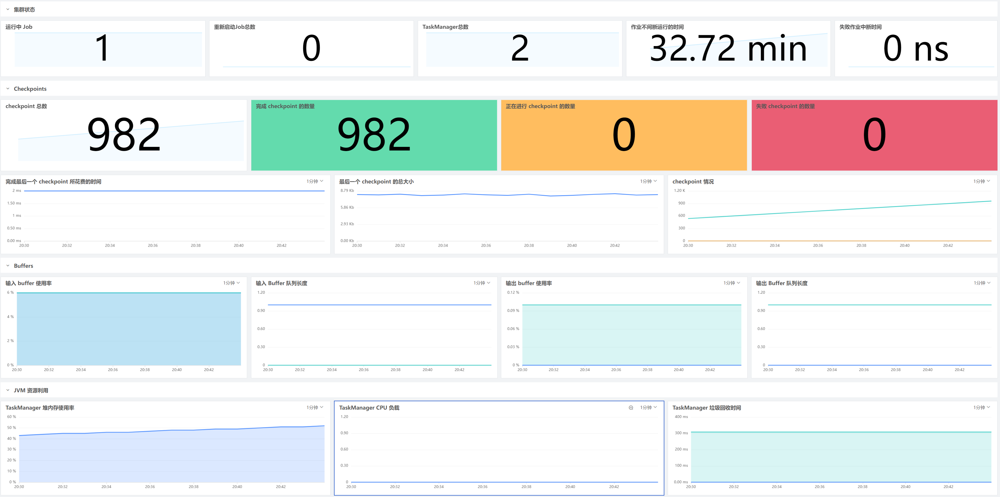
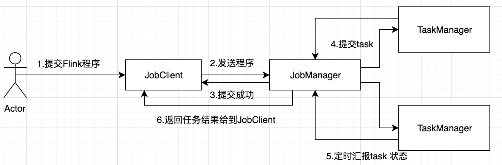
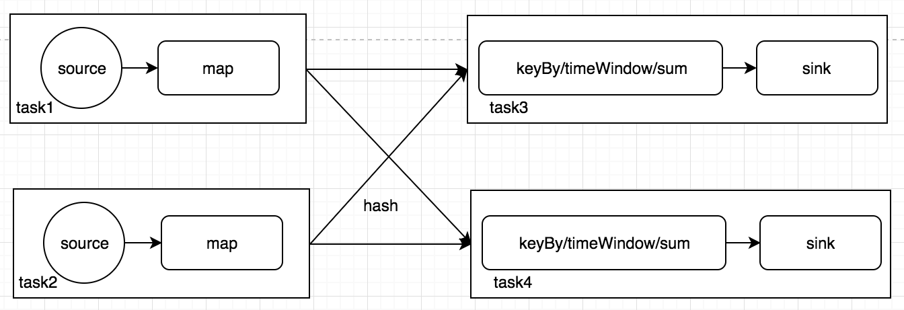
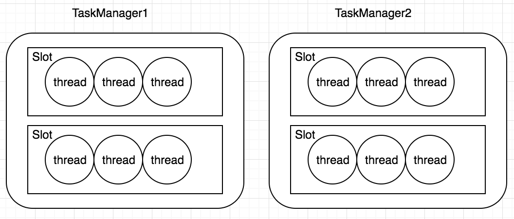
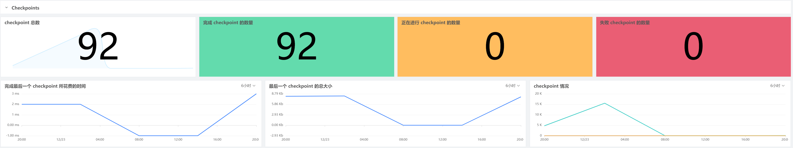
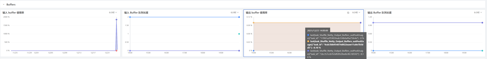
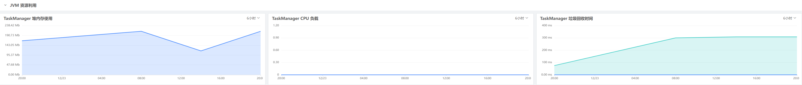

# 利用观测云观测 Apache Flink
---

Apache Flink 是一个开源框架，用 Java 和 Scala 编写，用于实时和批量数据流的有状态处理。Flink 提供了强大的类库和 rest API 帮助建立数据分析、数据处理可扩展性、事件驱动的应用程序等的能力。我们可以将 Flink 作为独立集群运行，也可以使用 Mesos 和 Kubernetes 等基础设施管理。

深入了解 Flink 部署对于确保 Flink 应用程序能够顺利运行至关重要，只要配置了 Flink 采集器来收集指标，就可以开始在开箱即用的仪表板中可视化所有数据，例如作业正常运行时间、Buffer 使用情况和 checkpoint 计数等等。

## Flink 是如何工作的

Flink 是新的 stream 计算引擎，用 java 实现。既可以处理 stream data 也可以处理 batch data，可以同时兼顾 Spark 以及 Spark streaming 的功能，与 Spark 不同的是，Flink 本质上只有 stream 的概念，batch 被认为是special stream。Flink 在运行中主要有三个组件组成，JobClient，JobManager 和 TaskManager。主要工作原理如下图

用户首先提交 Flink 程序到 JobClient，经过 JobClient 的处理、解析、优化提交到 JobManager，最后由 TaskManager 运行 task。

### JobClient

JobClient 是 Flink 程序和 JobManager 交互的桥梁，主要负责接收程序、解析程序的执行计划、优化程序的执行计划，然后提交执行计划到 JobManager。为了了解 Flink 的解析过程，在 Flink 主要有三类 Operator：

- Source Operator ，顾名思义这类操作一般是数据来源操作，比如文件、socket、kafka 等，一般存在于程序的最开始

- Transformation Operator 这类操作主要负责数据转换，map，flatMap，reduce 等算子都属于Transformation Operator，
- Sink Operator，意思是下沉操作，这类操作一般是数据落地，数据存储的过程，放在 Job 最后，比如数据落地到 Hdfs、Mysql、Kafka 等等。 

Flink 会将程序中每一个算计解析成 Operator，然后按照算子之间的关系，将 operator 组合起来，形成一个 Operator 组合成的 Graph。

### JobManager

JobManager 是一个进程，主要负责申请资源，协调以及控制整个 job 的执行过程，具体包括，调度任务、处理 checkpoint、容错等等，在接收到 JobClient 提交的执行计划之后，针对收到的执行计划，继续解析，因为 JobClient 只是形成一个 operaor 层面的执行计划，所以 JobManager 继续解析执行计划（根据算子的并发度，划分 task），形成一个可以被实际调度的由task组成的拓扑图，被解析之后形成下图的执行计划，最后向集群申请资源，一旦资源就绪，就调度 task 到 TaskManager。

## TaskManager

TaskManager 是一个进程，及一个 JVM（Flink 用 java 实现）。主要作用是接收并执行 JobManager 发送的 task，并且与 JobManager 通信，反馈任务状态信息，比如任务分执行中，执行完等状态，如果说 JobManager 是 master 的话，那么 TaskManager 就是 worker 主要用来执行任务。在 TaskManager 内可以运行多个 task。TaskManager 并不是最细粒度的概念，每个 TaskManager 像一个容器一样，包含一个多或多个 Slot.

## 保持您的 Flink 应用程序正常运行

流处理的一个基本概念就是状态，这是保留过去信息以影响未来输入的处理方式的能力。Flink 通过创建实现容错的 checkpoint 在发生故障时回滚到以前的状态和流处理位置。观测成功和失败的 checkpoint 数量，以及完成 checkpoint 所需的时间，可以确保 Flink 应用程序是始终可用的。

默认情况下，Flink 只允许在任何时间里创建一个 checkpoint。如果 Flink 无法在配置的时间间隔内完成一个 checkpoint，例如当状态的大小大幅增长时，它不会触发下一个 checkpoint，直到正在进行的 checkpoint 完成。随着 checkpoint 队列的增长，该进程开始与常规数据处理竞争资源，从而降低应用程序性能。因此，如果观察到checkpoint 完成时间 ( flink_jobmanager_job_lastCheckpointDuration) 始终高于配置的间隔时间，可能需要考虑增加 checkpoint 之间的最短持续时间以管理排队 checkpoint 的数量并减少容错开销。

## 有效处理背压，确保高性能

Flink 会将数据处理任务拆分为一个或多个并行处理的子任务，Flink 不会单独发送来自每个子任务的事件，而是把它们放在缓冲区中在分批发送之前以减少开销。

背压是当生成数据的速度快于下游使用数据的速度时，就会发生这种情况。由于垃圾收集停滞或资源不足等问题，接收器可能正在以较慢的速度进行处理，或者网络可能由于负载激增而被超额订阅的状态。

观测云的 flink overview 提供了 Flink 子任务缓冲池使用情况的概览，以帮助确定子任务是否背压。例如，如果看到位于发送方子任务的输出缓冲池中的所有缓冲区都已满 ( flink_taskmanager_task_Shuffle_Netty_Output_Buffers_outPoolUsage)，假如上图中的的利用率为 100% 利用率，则意味着该子任务处于背压状态。或者接收器子任务的输入缓冲池完全耗尽 ( flink_taskmanager_task_Shuffle_Netty_Input_Buffers_inPoolUsage)，则意味着所有缓冲区都在使用中，背压可能会扩展到上游并影响发送器的性能。要修复该问题就要首先检查它是否可能是由 Flink 建议的这些[根本原因](https://flink.apache.org/2019/07/23/flink-network-stack-2.html#system-resources)之一引起的，以便您可以采取适当的措施。

## 对高 JVM 资源使用率发出告警并解决瓶颈

每个 Flink 集群都至少有一个 JobManager 和 TaskManager。JobManager 的作用是协调作业调度和管理资源，而 TaskManager 将执行 Flink 作业中的每一个单独的任务。观测云的 flink overview 提供了 JobManager 和 TaskManager 的 JVM 资源使用情况的高级概述，以帮助识别和诊断性能瓶颈。

## 开始观测 Flink

通过观测云与 Apache Flink 的集成，可以全面了解流处理作业以及 Apache 生态系统的其他组件（如 HDFS、Kafka 和 YARN 以及 200 多种其他技术）

[<Flink 集成>](/integrations/flinkv1)

