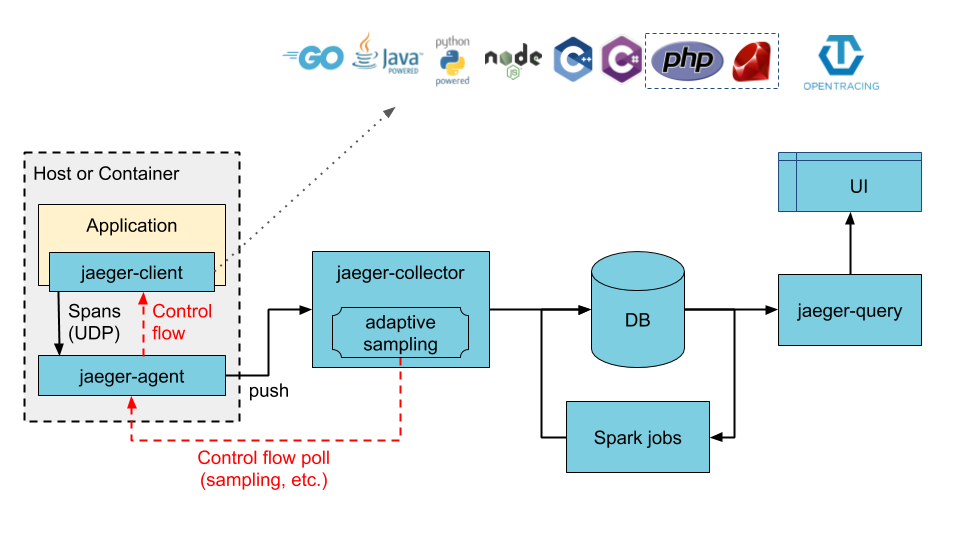
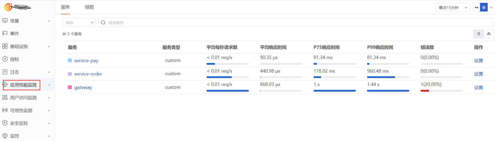
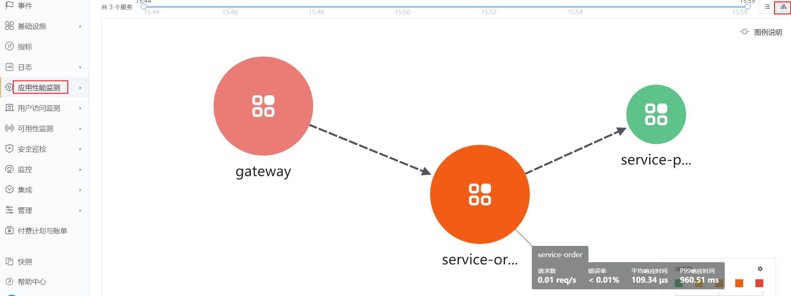
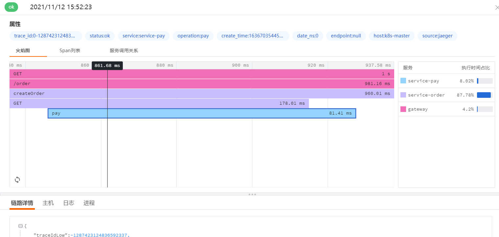

# Jaeger 链路数据接入最佳实践
---

## 简介
Jaeger 是由 Uber Technologies 开源发布的分布式跟踪系统，兼容 OpenTracing API。它用于监控和故障排除基于微服务的分布式系统，包括：

- 分布式上下文传播

- 分布式事务监控
- 根本原因分析
- 服务依赖分析
- 性能/延迟优化

## 架构图



## 组件

- jaeger-client:  Jaeger 客户端，是 OpenTracing API 的具体语言实现。

- jaeger-agent: 用于接收 jaeger-client 发送过来的追踪数据，并将数据批量发送到 jaeger-collector。
- jaeger-collector: 负责接收 jaeger-client 或者 jaeger-agent 上报来的调用链数据，并做一下校验，最终异步写入后端存储。
- jaeger-query: 用于接收查询请求，从数据库检索数据并通过 UI 展示。
- UI: 展示 jaeger-query 检索出的数据。
- spark job: 基于 spark 的运算任务。

## 前置条件

### 安装 DataKit

- <[安装 DataKit](/datakit/datakit-install.md)>

## 数据接入

### 开启 Input

1、 开启 jaeger 插件，复制 Sample 文件
```
cd /usr/local/datakit/conf.d/jaeger
cp jaeger.conf.sample jaeger.conf
```

2、 修改 jaeger.conf 文件

增加 address = "127.0.0.1:6832"，请确保 6832 端口未被占用。
```
[[inputs.jaeger]]
  # Jaeger endpoint for receiving tracing span over HTTP.
	# Default value set as below. DO NOT MODIFY THE ENDPOINT if not necessary.
  endpoint = "/apis/traces"

  # Jaeger agent host:port address for UDP transport.
  address = "127.0.0.1:6832"

  # [inputs.jaeger.tags]
    # tag1 = "val1"
    #	tag2 = "val2"
    # ...

```
参数说明

- endpoint：接收 jaeger 链路数据的 endpoint
- address: 链路数据推送的 datakit udp 地址

3、 重启 DataKit
```
systemctl restart datakit
```
## Spring Cloud 链路数据接入
### 增加依赖
```
<dependency>
    <groupId>io.opentracing.contrib</groupId>
    <artifactId>opentracing-spring-jaeger-web-starter</artifactId>
    <version>3.3.1</version>
</dependency>
```
### 增加配置
application.yaml 增加如下配置
```
opentracing:
  jaeger:
    udp-sender:           
      host: 127.0.0.1      
      port: 6832           
    probabilistic-sampler:
      sampling-rate: 1    
```
参数说明

- host：dataki 地址
- port:  datakit 的 jaeger udp 端口
- sampling-rate:  采样频率，1 表示 100%


## 链路数据

前往<[观测云](https://console.guance.com/)>，进入应用性能监测。

- 服务



- 拓扑图



- 火焰图



