# JVM 可观测最佳实践

---

## 前置条件
前往官方网站 [观测云](https://guance.com/) 注册账号，使用已注册的账号/密码登录。
## 安装 DataKit

### 获取命令

点击 [**集成**] 模块， [**DataKit**]，根据您的操作系统和系统类型选择合适的安装命令。

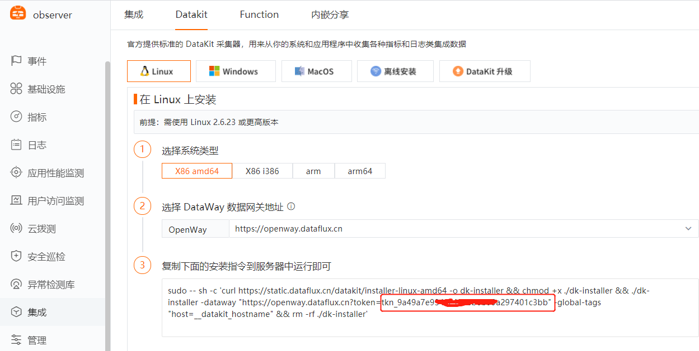

### 执行安装

复制 Datakit 安装命令在需要被监控的服务器上直接运行。

- 安装目录 `/usr/local/datakit/`
- 日志目录 `/var/log/datakit/`
- 主配置文件 `/usr/local/datakit/conf.d/datakit.conf`
- 插件配置目录 `/usr/local/datakit/conf.d/`

### DataKit 默认已安装如下插件

DataKit 安装完成后，已经默认开启 Linux 主机常用插件，可以在DF——基础设施——内置视图查看。

| 采集器名称 | 说明 |
| --- | --- |
| cpu | 采集主机的 CPU 使用情况 |
| disk | 采集磁盘占用情况 |
| diskio | 采集主机的磁盘 IO 情况 |
| mem | 采集主机的内存使用情况 |
| swap | 采集 Swap 内存使用情况 |
| system | 采集主机操作系统负载 |
| net | 采集主机网络流量情况 |
| host_process | 采集主机上常驻（存活 10min 以上）进程列表 |
| hostobject | 采集主机基础信息（如操作系统信息、硬件信息等） |
| docker | 采集主机上可能的容器对象以及容器日志 |

### 内置视图

点击 [**基础设施**] 模块，查看所有已安装 DataKit 的主机列表以及基础信息，如主机名、CPU、内存等。

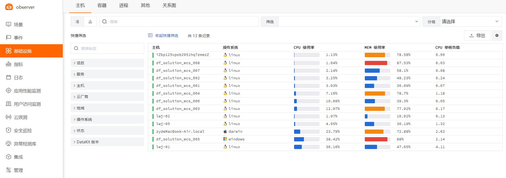

## JVM 采集相关配置：
###  JAVA_OPTS 声明
 本示例使用 ddtrace 采集 Java 应用的 jvm 指标，先根据您的需求定义 JAVA_OPTS，在启动应用的时候替换JAVA_OPTS，启动 jar 方式如下：

```java
java  ${JAVA_OPTS} -jar your-app.jar
```

完整 JAVA_OPTS 如下：

```java
-javaagent:/usr/local/datakit/data/dd-java-agent.jar \
 -XX:FlightRecorderOptions=stackdepth=256 \
 -Ddd.profiling.enabled=true  \
 -Ddd.logs.injection=true   \
 -Ddd.trace.sample.rate=1   \
 -Ddd.service=your-app-name   \
 -Ddd.env=dev  \ 
 -Ddd.agent.port=9529   \
 -Ddd.jmxfetch.enabled=true   \
 -Ddd.jmxfetch.check-period=1000   \
 -Ddd.jmxfetch.statsd.port=8125   \
 -Ddd.trace.health.metrics.enabled=true   \
 -Ddd.trace.health.metrics.statsd.port=8125   \
 
```

详细说明：

```
-Ddd.env：应用的环境类型，选填 
-Ddd.tags：自定义标签，选填    
-Ddd.service：JVM数据来源的应用名称，必填  
-Ddd.agent.host=localhost    DataKit地址，选填  
-Ddd.agent.port=9529         DataKit端口，必填  
-Ddd.version:版本，选填 
-Ddd.jmxfetch.check-period 表示采集频率，单位为毫秒，默认true，选填   
-Ddd.jmxfetch.statsd.host=127.0.0.1 statsd 采集器的连接地址同DataKit地址，选填  
-Ddd.jmxfetch.statsd.port=8125 表示DataKit上statsd采集器的UDP连接端口，默认为 8125，选填   
-Ddd.trace.health.metrics.statsd.host=127.0.0.1  自身指标数据采集发送地址同DataKit地址，选填 
-Ddd.trace.health.metrics.statsd.port=8125  自身指标数据采集发送端口，选填   
-Ddd.service.mapping:应用调用的redis、mysql等别名，选填 
```
如需详细了解 JVM，请参考 [JVM](../../datakit/jvm.md) 采集器
### 1. jar 使用方式

开启 statsd

```shell
$ cd /usr/local/datakit/conf.d/statsd
$ cp statsd.conf.sample statsd.conf
```

开启 ddtrace

```shell
$ cd /usr/local/datakit/conf.d/ddtrace
$ cp ddtrace.conf.sample  ddtrace.conf
```

重启 datakit

```shell
$ datakit --restart
```

启动 jar，请用您的应用名替换下面的 your-app，如果应用未连接 mysql，请去掉 -Ddd.service.mapping=mysql:mysql01，其中 mysql01 是 dataflux 应用性能监控看到的 mysql 的别名

```shell
nohup java -Dfile.encoding=utf-8  \
 -javaagent:/usr/local/datakit/data/dd-java-agent.jar \
 -Ddd.service=your-app   \
 -Ddd.service.mapping=mysql:mysql01   \
 -Ddd.env=dev  \
 -Ddd.agent.port=9529   \
 -jar your-app.jar > logs/your-app.log  2>&1 & 
```

### 2. Docker 使用方式

按照 jar 使用方式开启 statsd，开启 ddtrace

开放外网访问端口

编辑 `/usr/local/datakit/conf.d/vim datakit.conf` 文件，修改 listen = "0.0.0.0:9529"


重启 datakit

```shell
$ datakit --restart
```

请在您的 Dockerfile 中的 ENTRYPOINT 启动参数使用环境变量 JAVA_OPTS，Dockerfile 文件示例如下：

```bash
FROM openjdk:8u292-jdk

ENV jar your-app.jar
ENV workdir /data/app/
RUN mkdir -p ${workdir}
COPY ${jar} ${workdir}
WORKDIR ${workdir}

ENTRYPOINT ["sh", "-ec", "exec java  ${JAVA_OPTS} -jar ${jar} "]
```

制作镜像

把上面的内容保存到 `/usr/local/java/Dockerfile` 文件中

```shell
$ cd /usr/local/java
$ docker build -t your-app-image:v1 .
```
拷贝 `/usr/local/datakit/data/dd-java-agent.jar` 放到 `/tmp/work` 目录

**Docker run 启动**，请修改 172.16.0.215 为您的服务器的内网 ip 地址，替换 9299 为您应用的端口，替换 your-app 为您的应用名，替换 your-app-image:v1 为您的镜像名

```shell
docker run  -v /tmp/work:/tmp/work -e JAVA_OPTS="-javaagent:/tmp/work/dd-java-agent.jar -Ddd.service=your-app  -Ddd.service.mapping=mysql:mysql01 -Ddd.env=dev  -Ddd.agent.host=172.16.0.215 -Ddd.agent.port=9529  -Ddd.jmxfetch.statsd.host=172.16.0.215  " --name your-app -d -p 9299:9299 your-app-image:v1

```
**Docker compose 启动**

Dockerfile 需要声明 ARG 参数来接收 docker-compose 传过来的参数，示例如下：

```bash
FROM openjdk:8u292-jdk

ARG JAVA_ARG
ENV JAVA_OPTS=$JAVA_ARG
ENV jar your-app.jar
ENV workdir /data/app/
RUN mkdir -p ${workdir}
COPY ${jar} ${workdir}
WORKDIR ${workdir}

ENTRYPOINT ["sh", "-ec", "exec java  ${JAVA_OPTS} -jar ${jar} "]
```

把上面的内容保存到 `/usr/local/java/DockerfileTest` 文件中，在同目录新建 `docker-compose.yml` 文件，请修改 172.16.0.215 为您的服务器的内网 ip 地址，替换 9299 为您应用的端口，替换 your-app 为您的应用名，替换your-app-image:v1 为您的镜像名。`docker-compose.yml` 示例如下：

```bash
version: "3.9"
services:
  ruoyi-gateway:
    image: your-app-image:v1
    container_name: your-app
    volumes:
      - /tmp/work:/tmp/work
    build:
      dockerfile: DockerfileTest
      context: .
      args:
        - JAVA_ARG=-javaagent:/tmp/work/dd-java-agent.jar  -Ddd.service=your-app  -Ddd.service.mapping=mysql:mysql01 -Ddd.env=dev  -Ddd.agent.host=172.16.0.215 -Ddd.agent.port=9529  -Ddd.jmxfetch.statsd.host=172.16.0.215  
    ports:
      
    networks:
      - myNet
networks:
  myNet:
    driver: bridge
```

启动

```shell
$ cd /usr/local/java
#制作镜像
$ docker build -t your-app-image:v1 .
#启动
$ docker-compose up -d
```

### 3 Kubernetes 使用方式

#### 3.1 部署DataKit

在 Kubernetes 中使用 DaemonSet 方式部署 DataKit，请参考 <[Datakit DaemonSet安装](../../datakit/datakit-daemonset-deploy.md)> 

采集 JVM 指标需要开通 ddtrace 和 statsd 采集器，通过 DaemonSet 方式部署的 DataKit，是在 yaml 文件的ENV_DEFAULT_ENABLED_INPUTS环境变量中增加 statsd, ddtrace。

```yaml
- name: ENV_DEFAULT_ENABLED_INPUTS
  value: cpu,disk,diskio,mem,swap,system,hostobject,net,host_processes,kubernetes,container,statsd,ddtrace
        
```

本示例的部署文件是 `/usr/local/k8s/datakit-default.yaml` ，内容如下：

```yaml
apiVersion: v1
kind: Namespace
metadata:
  name: datakit
---
apiVersion: rbac.authorization.k8s.io/v1
kind: ClusterRole
metadata:
  name: datakit
rules:
- apiGroups:
  - rbac.authorization.k8s.io
  resources:
  - clusterroles
  verbs:
  - get
  - list
  - watch
- apiGroups:
  - ""
  resources:
  - nodes
  - nodes/proxy
  - namespaces
  - pods
  - pods/log
  - events
  - services
  - endpoints
  - ingresses
  verbs:
  - get
  - list
  - watch
- apiGroups:
  - apps
  resources:
  - deployments
  - daemonsets
  - statefulsets
  - replicasets
  verbs:
  - get
  - list
  - watch
- apiGroups:
  - batch
  resources:
  - jobs
  - cronjobs
  verbs:
  - get
  - list
  - watch
- apiGroups:
  - metrics.k8s.io
  resources:
  - pods
  - nodes
  verbs:
  - get
  - list
- nonResourceURLs: ["/metrics"]
  verbs: ["get"]

---

apiVersion: v1
kind: ServiceAccount
metadata:
  name: datakit
  namespace: datakit

---

apiVersion: v1
kind: Service
metadata:
  name: datakit-service
  namespace: datakit
spec:
  selector:
    app: daemonset-datakit
  ports:
    - protocol: TCP
      port: 9529
      targetPort: 9529

---

apiVersion: rbac.authorization.k8s.io/v1
kind: ClusterRoleBinding
metadata:
  name: datakit
roleRef:
  apiGroup: rbac.authorization.k8s.io
  kind: ClusterRole
  name: datakit
subjects:
- kind: ServiceAccount
  name: datakit
  namespace: datakit

---

apiVersion: apps/v1
kind: DaemonSet
metadata:
  labels:
    app: daemonset-datakit
  name: datakit
  namespace: datakit
spec:
  revisionHistoryLimit: 10
  selector:
    matchLabels:
      app: daemonset-datakit
  template:
    metadata:
      labels:
        app: daemonset-datakit
    spec:
      hostNetwork: true
      dnsPolicy: ClusterFirstWithHostNet
      containers:
      - env:
        - name: HOST_IP
          valueFrom:
            fieldRef:
              apiVersion: v1
              fieldPath: status.hostIP
        - name: NODE_NAME
          valueFrom:
            fieldRef:
              apiVersion: v1
              fieldPath: spec.nodeName
        - name: ENV_DATAWAY
          value: https://openway.guance.com?token=<your-token>
        - name: ENV_GLOBAL_TAGS
          value: host=__datakit_hostname,host_ip=__datakit_ip,cluster_name_k8s=k8s-prod
        - name: ENV_DEFAULT_ENABLED_INPUTS
          value: cpu,disk,diskio,mem,swap,system,hostobject,net,host_processes,kubernetes,container,statsd,ddtrace
        - name: ENV_ENABLE_ELECTION
          value: enable
        - name: ENV_HTTP_LISTEN
          value: 0.0.0.0:9529
        - name: ENV_LOG_LEVEL
          value: info
        image: pubrepo.jiagouyun.com/datakit/datakit:1.2.1
        imagePullPolicy: IfNotPresent
        name: datakit
        ports:
        - containerPort: 9529
          hostPort: 9529
          name: port
          protocol: TCP
        securityContext:
          privileged: true
        volumeMounts:
        - mountPath: /var/run/docker.sock
          name: docker-socket
          readOnly: true
        - mountPath: /usr/local/datakit/conf.d/container/container.conf
          name: datakit-conf
          subPath: container.conf
        - mountPath: /usr/local/datakit/conf.d/log/logging.conf
          name: datakit-conf
          subPath: logging.conf
        - mountPath: /host/proc
          name: proc
          readOnly: true
        - mountPath: /host/dev
          name: dev
          readOnly: true
        - mountPath: /host/sys
          name: sys
          readOnly: true
        - mountPath: /rootfs
          name: rootfs
        - mountPath: /sys/kernel/debug
          name: debugfs
        workingDir: /usr/local/datakit
      hostIPC: true
      hostPID: true
      restartPolicy: Always
      serviceAccount: datakit
      serviceAccountName: datakit
      volumes:
      - configMap:
          name: datakit-conf
        name: datakit-conf
      - hostPath:
          path: /var/run/docker.sock
        name: docker-socket
      - hostPath:
          path: /proc
          type: ""
        name: proc
      - hostPath:
          path: /dev
          type: ""
        name: dev
      - hostPath:
          path: /sys
          type: ""
        name: sys
      - hostPath:
          path: /
          type: ""
        name: rootfs
      - hostPath:
          path: /sys/kernel/debug
          type: ""
        name: debugfs
  updateStrategy:
    rollingUpdate:
      maxUnavailable: 1
    type: RollingUpdate
---
apiVersion: v1
kind: ConfigMap
metadata:
  name: datakit-conf
  namespace: datakit
data:
    #### container
    container.conf: |- 
      [inputs.container]
        endpoint = "unix:///var/run/docker.sock"

        ## Containers metrics to include and exclude, default not collect. Globs accepted.
        container_include_metric = []
        container_exclude_metric = ["image:*"]

        ## Containers logs to include and exclude, default collect all containers. Globs accepted.
        container_include_log = ["image:*"]
        container_exclude_log = []

        exclude_pause_container = true

        ## Removes ANSI escape codes from text strings
        logging_remove_ansi_escape_codes = false
  
        kubernetes_url = "https://kubernetes.default:443"

        ## Authorization level:
        ##   bearer_token -> bearer_token_string -> TLS
        ## Use bearer token for authorization. ('bearer_token' takes priority)
        ## linux at:   /run/secrets/kubernetes.io/serviceaccount/token
        ## windows at: C:\var\run\secrets\kubernetes.io\serviceaccount\token
        bearer_token = "/run/secrets/kubernetes.io/serviceaccount/token"
        # bearer_token_string = "<your-token-string>"

        [inputs.container.tags]
          # some_tag = "some_value"
          # more_tag = "some_other_value"
           

          
    #### logging
    logging.conf: |-
        [[inputs.logging]]
          ## required
          logfiles = [
            "/rootfs/var/log/k8s/demo-system/info.log",
            "/rootfs/var/log/k8s/demo-system/error.log",
          ]

          ## glob filteer
          ignore = [""]

          ## your logging source, if it's empty, use 'default'
          source = "k8s-demo-system"

          ## add service tag, if it's empty, use $source.
          service = "k8s-demo-system"

          ## grok pipeline script path
          #pipeline = ""

          ## optional status:
          ##   "emerg","alert","critical","error","warning","info","debug","OK"
          ignore_status = []

          ## optional encodings:
          ##    "utf-8", "utf-16le", "utf-16le", "gbk", "gb18030" or ""
          character_encoding = ""

          ## The pattern should be a regexp. Note the use of '''this regexp'''
          ## regexp link: https://golang.org/pkg/regexp/syntax/#hdr-Syntax
          match = '''^\d{4}-\d{2}-\d{2}'''

          [inputs.logging.tags]
          # some_tag = "some_value"
          # more_tag = "some_other_value"
          
```

在 [https://console.guance.com/](https://console.guance.com/) 找到 openway 地址，如下图所示，替换 `datakit-default.yaml` 中的  ENV_DATAWAY 的值

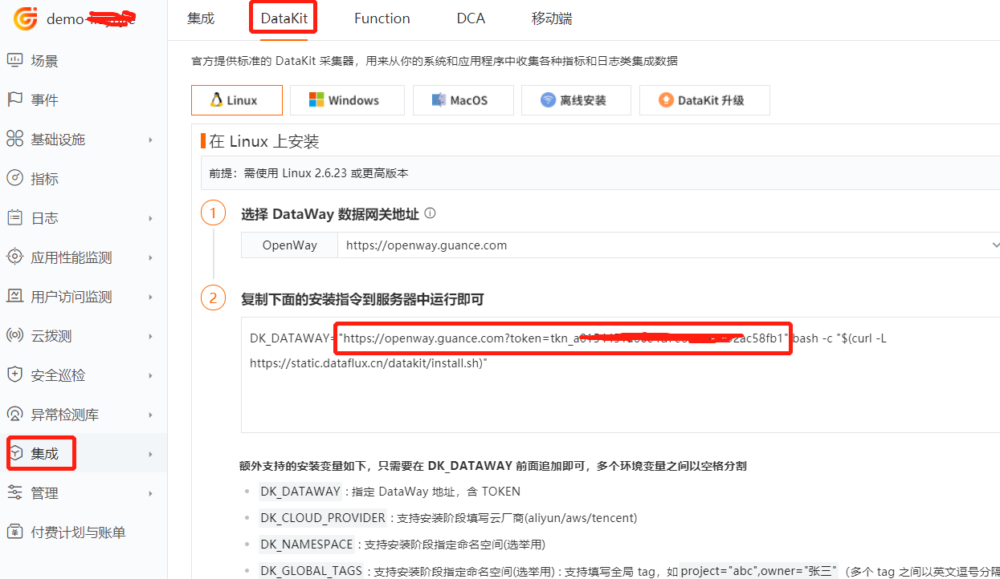

部署 Datakit

```shell
$ cd /usr/local/k8s
$ kubectl apply -f datakit-default.yaml
$ kubectl get pod -n datakit
```


本示例如果采集系统日志，请参考下面的内容：

```yaml
#- mountPath: /usr/local/datakit/conf.d/log/demo-system.conf
#  name: datakit-conf
#  subPath: demo-system.conf
```

```yaml
    #### kubernetes
    demo-system.conf: |-
        [[inputs.logging]]
          ## required
          logfiles = [
            "/rootfs/var/log/k8s/demo-system/info.log",
            "/rootfs/var/log/k8s/demo-system/error.log",
          ]

          ## glob filteer
          ignore = [""]

          ## your logging source, if it's empty, use 'default'
          source = "k8s-demo-system"

          ## add service tag, if it's empty, use $source.
          service = "k8s-demo-system"

          ## grok pipeline script path
          pipeline = ""

          ## optional status:
          ##   "emerg","alert","critical","error","warning","info","debug","OK"
          ignore_status = []

          ## optional encodings:
          ##    "utf-8", "utf-16le", "utf-16le", "gbk", "gb18030" or ""
          character_encoding = ""

          ## The pattern should be a regexp. Note the use of '''this regexp'''
          ## regexp link: https://golang.org/pkg/regexp/syntax/#hdr-Syntax
          match = '''^\S'''

          [inputs.logging.tags]
          # some_tag = "some_value"
          # more_tag = "some_other_value"
```

#### 3.2 sidecar 镜像

在jar使用方式中使用到了 dd-java-agent.jar，而在用户的镜像中并不一定存在这个 jar，为了不侵入客户的业务镜像，我们需要制作一个包含 dd-java-agent.jar 的镜像，再以 sidecar 的方式先于业务容器启动，以共享存储的方式提供 dd-java-agent.jar。

```
pubrepo.jiagouyun.com/datakit/dk-sidecar:1.0
```

#### 3.3 编写 Java 应用的 Dockerfile
请在您的 Dockerfile 中的 ENTRYPOINT 启动参数使用环境变量 JAVA_OPTS，Dockerfile 文件示例如下：

```bash
FROM openjdk:8u292

ENV jar your-app.jar
ENV workdir /data/app/
RUN mkdir -p ${workdir}
COPY ${jar} ${workdir}
WORKDIR ${workdir}
ENTRYPOINT ["sh", "-ec", "exec java ${JAVA_OPTS} -jar ${jar}"]
```

制作镜像并上传到 harbor 仓库，请用您的镜像仓库替换下面的 172.16.0.215:5000/dk

```shell
$ cd /usr/local/k8s/agent
$ docker build -t 172.16.0.215:5000/dk/your-app-image:v1 . 
$ docker push 172.16.0.215:5000/dk/your-app-image:v1  
```

#### 3.4 编写 deployment

新建 `/usr/local/k8s/your-app-deployment-yaml` 文件，内容如下：

```yaml
apiVersion: v1
kind: Service
metadata:
  name: your-app-name
  labels:
    app: your-app-name
spec:
  selector:
    app: your-app-name
  ports:
    - protocol: TCP
      port: 9299
      nodePort: 30001
      targetPort: 9299
  type: NodePort
---
apiVersion: apps/v1
kind: Deployment
metadata:
  name: your-app-name
  labels:
    app: your-app-name
spec:
  replicas: 1
  selector:
    matchLabels:
      app: your-app-name
  template:
    metadata:
      labels:
        app: your-app-name
    spec:
      containers:
      - env:
        - name: PODE_NAME
          valueFrom:
            fieldRef:
              fieldPath: metadata.name
        - name: JAVA_OPTS
          value: |-
            -javaagent:/usr/dd-java-agent/agent/dd-java-agent.jar -Ddd.service=<your-app-name> -Ddd.tags=container_host:$(PODE_NAME)  -Ddd.env=dev  -Ddd.agent.port=9529   
        - name: DD_AGENT_HOST
          valueFrom:
            fieldRef:
              apiVersion: v1
              fieldPath: status.hostIP
        name: your-app-name
        image: 172.16.0.215:5000/dk/your-app-image:v1    
        #command: ["sh","-c"]
        ports:
        - containerPort: 9299
          protocol: TCP
        volumeMounts:
        - mountPath: /usr/dd-java-agent/agent
          name: ddagent
      initContainers:
      - command:
        - sh
        - -c
        - set -ex;mkdir -p /ddtrace/agent;cp -r /usr/dd-java-agent/agent/* /ddtrace/agent;
        image: pubrepo.jiagouyun.com/datakit/dk-sidecar:1.0
        imagePullPolicy: Always
        name: ddtrace-agent-sidecar
        volumeMounts:
        - mountPath: /ddtrace/agent
          name: ddagent
      restartPolicy: Always
      volumes:
      - emptyDir: {}
        name: ddagent
      

```

说明 JAVA_OPTS 中的 -Ddd.tags=container_host:$(PODE_NAME) 是把环境变量 PODE_NAME 的值，传到标签 container_host 中，请替换 9299 为您应用的端口，替换 your-app-name 为您的服务名，替换 30001 为您的应用对外暴露的端口，替换 172.16.0.215:5000/dk/your-app-image:v1 为您的镜像名

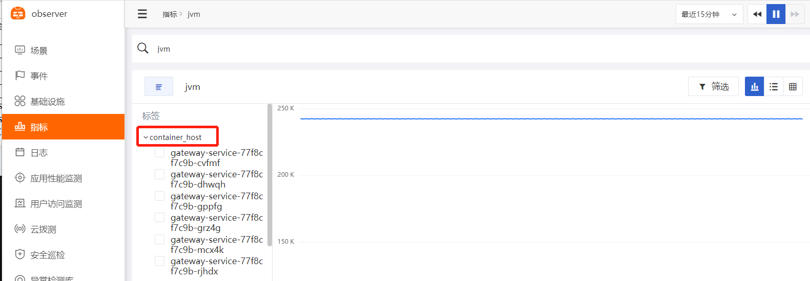

启动

```shell
$ cd /usr/local/k8s/
$ kubectl apply -f your-app-deployment-yaml
```

###  新建 JVM 可观测场景：

登录[观测云](https://guance.com/)进入空间，点击【新建场景】

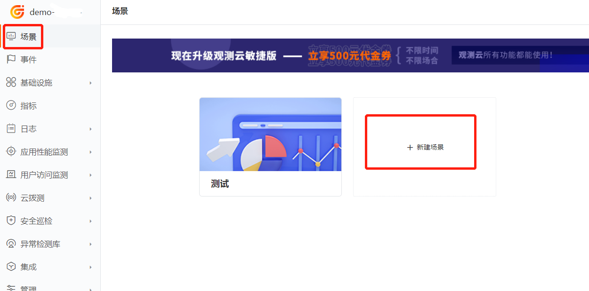

点击【JVM监控场景】

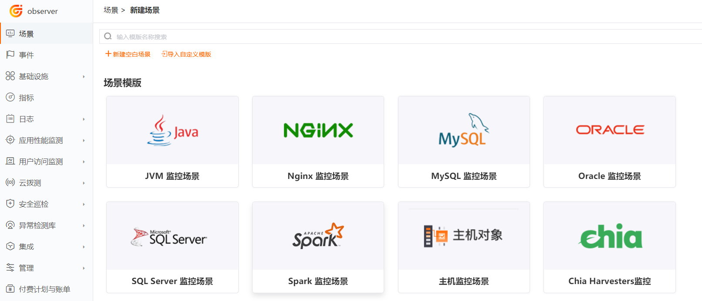

输入场景名称【JVM监控场景】，点击确定

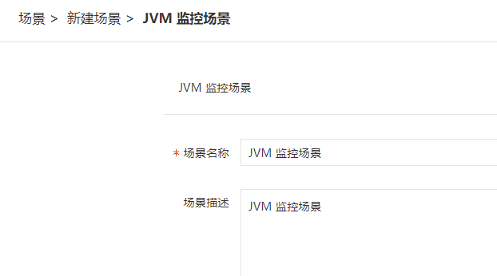

找到上图中的 JVM 监控视图，鼠标移到上面，点击创建

JVM 监控视图如下：

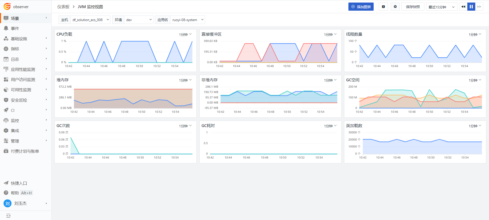


## JVM 及相关指标介绍
### 1 JVM 概述
#### 1.1 什么是 JVM
JVM 是 Java Virtual Machine 的简称，是运行在操作系统之上，用来执行 java 字节码的虚拟计算机。
#### 1.2 类的加载机制
首先 java 源文件会被 java 编译器编译成字节码，然后由 JVM 中的类加载器加载字节码，加载完成交给JVM 执行引擎执行。
#### 1.3 类的生命周期
一个 Java 类从开始到结束整个生命周期会经历7个阶段：加载（Loading）、验证（Verification）、准备（Preparation）、解析（Resolution）、初始化（Initialization）、使用（Using）和卸载（Unloading）。其中验证、准备、解析三个部分又统称为连接（Linking）。

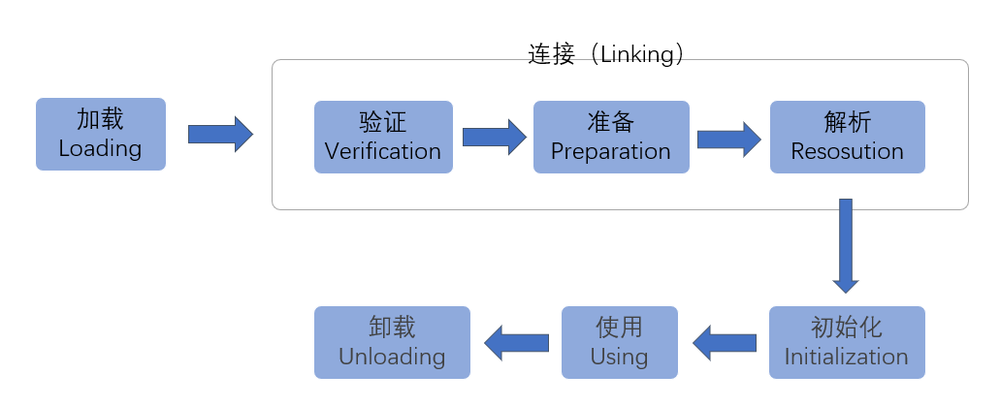

#### 1.4 JVM 内存结构
在整个类的加载过程中，JVM 会用一段空间来存储数据和相关信息，这段空间就是我们常说的 JVM 内存。根据 JVM 规范，JVM 内存共分为：

- 执行引擎

Java 是一种跨平台的编程语言，执行引擎就是把字节码解析成对应平台能识别的机器指令。

- 程序计数器

程序计数器是一块较小的内存空间，它的作用可以看作是当前线程所执行的字节码的行号指示器。在虚拟机的概念模型里字节码解释器工作时就是通过改变这个计数器的值来选取下一条需要执行的字节码指令，分支、循环、跳转、异常处理、线程恢复等基础功能都需要依赖这个计数器来完成。

特点：占用内存很小，可忽略不计；线程隔离；执行 native 本地方法时，程序计数器的值为空；此内存区域是唯一一个在 Java 虚拟机规范中没有规定任何 OutOfMemoryError 情况的区域。

- 虚拟机栈

描述 Java 方法执行的内存模型，每个方法在执行时都会创建一个“栈帧 (Stack Frame)”，即线程私有，生命周期和线程一致。栈帧的结构分为局部变量表、操作数栈、动态链接、方法出口几个部分。

我们常说的“堆内存、栈内存”中的“栈内存”指的便是虚拟机栈，确切地说，指的是虚拟机栈的栈帧中的局部变量表，因为这里存放了一个方法的所有局部变量。方法调用时，创建栈帧，并压入虚拟机栈；方法执行完毕，栈帧出栈并被销毁。

JVM 会为每个线程的虚拟机栈分配一定的内存大小（-Xss参数），若单个线程请求的栈深度大于虚拟机允许的深度，则会抛出 StackOverflowError（栈溢出错误）。当整个虚拟机栈内存耗尽，并且无法再申请到新的内存时抛出 OutOfMemoryError 异常。

- 本地方法栈

本地方法栈的功能和特点类似于虚拟机栈，均具有线程隔离的特点以及都能抛出 StackOverflowError 和OutOfMemoryError 异常。

不同的是，本地方法栈服务的对象是 JVM 执行的 native 方法，而虚拟机栈服务的是 JVM 执行的 Java 方法。如何去服务 native 方法？native 方法使用什么语言实现？怎么组织像栈帧这种为了服务方法的数据结构？虚拟机规范并未给出强制规定，因此不同的虚拟机可以进行自由实现，我们常用的 HotSpot 虚拟机选择合并了虚拟机栈和本地方法栈。

- 方法区

JDK8 废弃永久代，每个类的运行时常量池、编译后的代码移到了另一块与堆不相连的本地内存--元空间。

元空间（Metaspace）：元空间是方法区的在 HotSpot JVM 中的实现，方法区主要用于存储类信息、常量池、方法数据、方法代码、符号引用等。元空间的本质和永久代类似，都是对 JVM 规范中方法区的实现。不过元空间与永久代之间最大的区别在于：元空间并不在虚拟机中，而是使用本地内存。理论上取决于32位/64位系统内存大小，可以通过 -XX:MetaspaceSize 和 -XX:MaxMetaspaceSize 配置内存大小。

元空间有两个参数：MetaspaceSize ：初始化元空间大小，控制发生GC阈值。MaxMetaspaceSize ： 限制元空间大小上限，防止异常占用过多物理内存。

- 堆

堆区由所有线程共享，主要是存放对象实例和数组。可以位于物理上不连续的空间，但是逻辑上要连续。

堆内存分为年轻代（Young Generation）、老年代（Old Generation）。年轻代又分为 Eden 和 Survivor 区。Survivor 区由 FromSpace 和 ToSpace 组成。Eden 区占大容量，Survivor 两个区占小容量，默认比例是8:1:1。

如果在 Java 堆中没有内存完成实例分配，并且堆也无法再扩展时，Java 虚拟机将会抛出 OutOfMemoryError 异常。

JVM 堆内存常用参数

| **参数** | **描述** |
| --- | --- |
| -Xms | 堆内存初始大小，单位m、g |
| -Xmx（MaxHeapSize） | 堆内存最大允许大小，一般不要大于物理内存的80% |
| -XX:PermSize | 非堆内存初始大小，一般应用设置初始化 200m，最大 1024m 就够了 |
| -XX:MaxPermSize | 非堆内存最大允许大小 |
| -XX:NewSize（-Xns） | 年轻代内存初始大小 |
| -XX:MaxNewSize（-Xmn） | 年轻代内存最大允许大小，也可以缩写 |
| -XX:SurvivorRatio=8 | 年轻代中 Eden 区与 Survivor 区的容量比例值，默认为 8，即 8:1 |
| -Xss | 堆栈内存大小 |

- 运行时数据区

Java 虚拟机在执行 Java 程序的过程中会把它所管理的内存划分为若干个不同的数据区域。这些区域都各有各自的用途，以及创建和销毁的时间，有的区域随着虚拟机进程的启动而存在，有些区域则依赖用户线程的启动和结束而建立和销毁。

根据《 Java 虚拟机规范（Java SE 8版）》的规定，Java 虚拟机所管理的内存将会包括以下几个运行时数据区域：程序计数器、Java 虚拟机栈、本地方法栈、Java 堆、方法区。

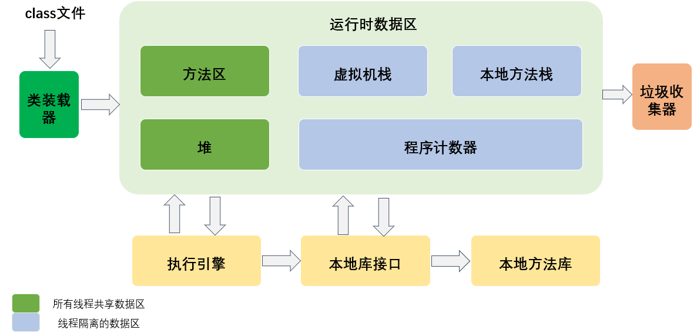

- 直接内存

直接内存并不是虚拟机运行时数据区的一部分，也不是 Java 虚拟机规范中定义的内存区域。不会受到 Java 堆大小的限制，受到本机总内存大小限制。

直接内存也用 -XX:MaxDirectMemorySize 指定，直接内存申请空间耗费更高的性能，直接内存 IO 读写的性能要优于普通的堆内存，耗尽内存抛出 OutOfMemoryError 异常。

- 垃圾回收

程序计数器、虚拟机栈、本地方法栈 3 个区域随线程生灭(因为是线程私有)，栈中的栈帧随着方法的进入和退出而有条不紊地执行着出栈和入栈操作。而 Java 堆和方法区则不一样，一个接口中的多个实现类需要的内存可能不一样，一个方法中的多个分支需要的内存也可能不一样，我们只有在程序处于运行期才知道那些对象会创建，这部分内存的分配和回收都是动态的，垃圾回收期所关注的就是这部分内存。

垃圾收集器:

串行收集器（Serial）

并行收集器（Parallel）

CMS收集器（Concurrent Mark Sweep）

G1收集器（Garbage First）

垃圾回收算法（GC，Garbage Collection）：

标记-清除（Mark-Sweep）

复制（Copy）

标记-整理（Mark-Compact）
#### 1.5 GC、Full GC
为了分代垃圾回收，Java 堆内存分为 3 代：年轻代，老年代和永久代。永久代是否执行 GC，取决于采用的 JVM。新生成的对象优先放到年轻代 Eden 区，大对象直接进入老年代，当 Eden 区没有足够空间时，会发起一次 Minor GC，存活下来的对象移动到 Survivor0 区，Survivor0 区满后触发执行 Minor GC，Survivor0 区存活对象移动到 Suvivor1 区，这样保证了一段时间内总有一个 survivor 区为空。经过多次Minor GC (默认 15 次) 仍然存活的对象移动到老年代。老年代存储长期存活的对象，当升到老年代的对象大于老年代剩余空间时会发生 Major GC，当老年代空间不足时会引发 Full GC。发生 Major GC 时用户线程会暂停，会降低系统性能和吞吐量。所以对响应要求高的应用尽量减少发生 Major GC，避免响应超时。如果 GC 后，还是无法存放从 Survivor 区复制过来的对象，就会出现 OOM（Out of Memory）。
#### 1.6 引发 OutOfMemoryError 原因
OOM（Out of Memory）异常常见有以下几个原因：

1）老年代内存不足：java.lang.OutOfMemoryError:Javaheapspace

2）永久代内存不足：java.lang.OutOfMemoryError:PermGenspace

3）代码bug，占用内存无法及时回收。OOM 在这几个内存区都有可能出现，实际遇到 OOM 时，能根据异常信息定位到哪个区的内存溢出。可以通过添加个参数 -XX:+HeapDumpOnOutMemoryError，让虚拟机在出现内存溢出异常时 Dump 出当前的内存堆转储快照以便事后分析。
#### 1.7 JVM 调优
熟悉了 JAVA 内存管理机制及配置参数，下面是对 JAVA 应用启动选项调优配置：

1 设置堆内存最小 -Xms 和最大值 -Xmx 相等，避免每次垃圾回收后重新分配内存

2 设置 GC 垃圾收集器为 G1， -XX:+UseG1GC

3 启用 GC 日志，方便后期分析 -Xloggc:../logs/gc.log
## 2 内置视图
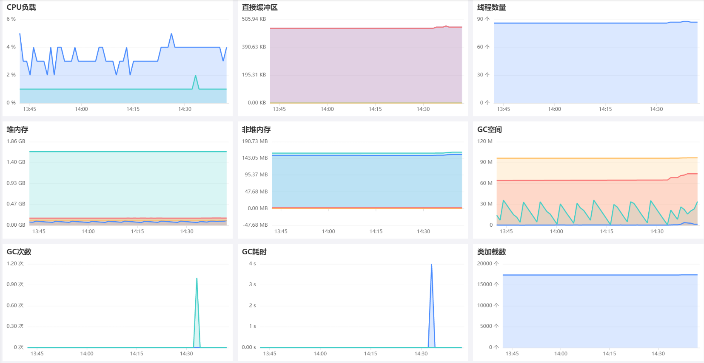
## 3 性能指标
| 指标 | 描述 | 数据类型 | 单位 |
| --- | --- | --- | --- |
| buffer_pool_direct_capacity | 直接缓冲区总大小 | int | Byte |
| buffer_pool_direct_count | 直接缓冲区计数 | int | count |
| buffer_pool_direct_used | 直接缓冲区已使用大小 | int | Byte |
| buffer_pool_mapped_capacity | 内存映射缓冲区总大小 | int | Byte |
| buffer_pool_mapped_count | 内存映射缓冲区计数 | int | count |
| buffer_pool_mapped_used | 内存映射缓冲区使用大小 | int | Byte |
| cpu_load_process | 进程占 cpu 百分比 | 小数 | 百分比 |
| cpu_load_system | 系统占 cpu 百分比 | 小数 | 百分比 |
| gc_eden_size | 新生代 eden 区大小 | int | Byte |
| gc_survivor_size | 新生代 survivor 区大小 | int | Byte |
| gc_old_gen_size | 老年代大小 | int | Byte |
| gc_metaspace_size | 元空间大小 | int | Byte |
| gc_major_collection_count | 老年代 GC 次数 | int | count |
| gc_major_collection_time | 老年代 GC 耗时 | int | 秒 |
| gc_minor_collection_count | 新生代 GC 次数 | int | count |
| gc_minor_collection_time | 新生代 GC 耗时 | int | 秒 |
| heap_memory_committed | 堆内存提交字节数 | int | Byte |
| heap_memory_init | 堆内存初始字节数 | int | Byte |
| heap_memory_max | 堆内存最大字节数 | int | Byte |
| heap_memory | 堆内存使用字节数 | int | Byte |
| loaded_classes | 类加载数 | int | count |
| non_heap_memory_committed | 非堆内存提交字节数 | int | Byte |
| non_heap_memory_init | 非堆内存初始字节数 | int | Byte |
| non_heap_memory_max | 非堆内存最大字节数 | int | Byte |
| non_heap_memory | 非堆内存使用字节数 | int | Byte |
| os_open_file_descriptors | 打开文件描述 | int | count |
| thread_count | 线程总数量 | int | count |

## 更多请关注：

- [如何利用观测云采集JVM指标](../../datakit/jvm.md)
