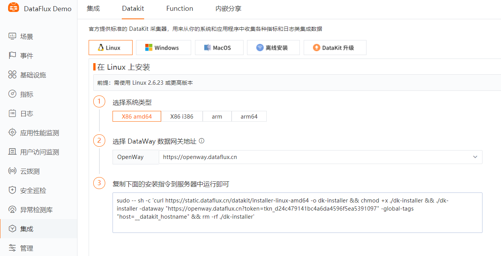
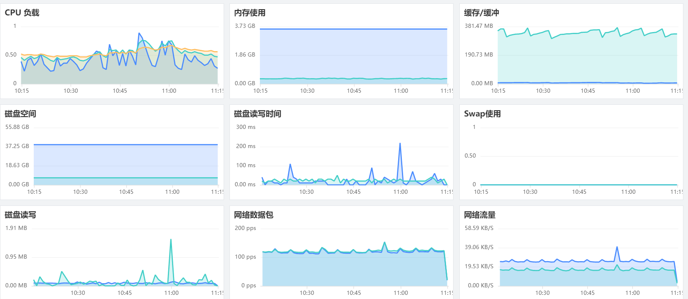

# Prometheus 体系数据接入最佳实践
---

## 前置条件

### 安装 Datakit

1. 点击 [**集成**] 模块， [_Datakit_]，根据您的操作系统和系统类型选择合适的安装命令。



2. 复制 Datakit 

- 安装目录 /usr/local/datakit/

- 日志目录 /var/log/datakit/
- 主配置文件 /usr/local/datakit/conf.d/datakit.conf
- 插件配置目录 /usr/local/datakit/conf.d/

## 服务配置
### Node_Exporter

1、 以 CentOS为例，下载 [[官方 node_exporter](https://github.com/prometheus/node_exporter/releases)]

2、 解压缩并运行 node_exporter (默认端口 9100)

```
tar xf node_exporter-1.2.0.linux-amd64.tar.gz
cd node_exporter-1.2.0.linux-amd64
nohup ./node_exporter &
```

3、 修改 DataKit 插件配置文件

```
cd /usr/local/datakit/conf.d/prom
cp prom.conf.sample prom.conf
vi prom.conf
```
配置参数说明：

- url：exporter 地址，建议填写内网地址，远程采集可使用公网
- source：采集器别名
- metrics_types：默认只采集 counter 和 gauge 类型的指标
- interval：采集频率
- host：被采集对象的主机名 (会覆盖 datakit 的自身默认的主机名)
```
[[inputs.prom]]
  url = "http://10.10.10.10:9100/metrics"
  source = "prom"
  metric_types = ["counter", "gauge"]
  interval = "60s"
  [inputs.prom.tags]
    host = "hostname"
```

4、 重启 DataKit
```
systemctl restart datakit
```

5、 视图预览 (场景模板 - Prometheus_Node_Exporter)



