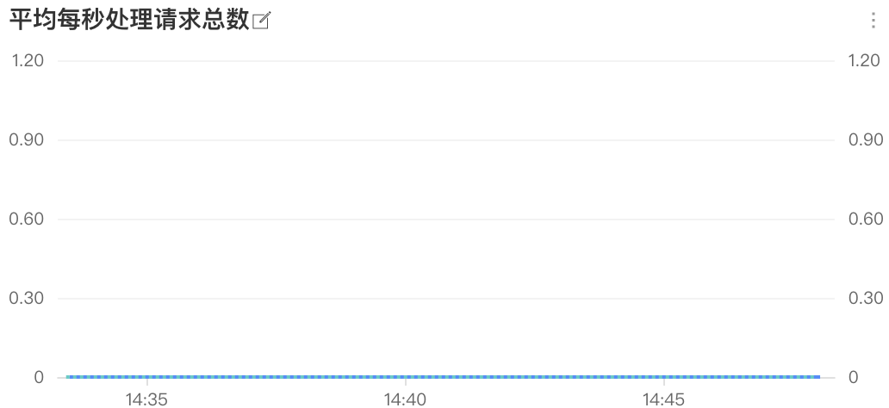
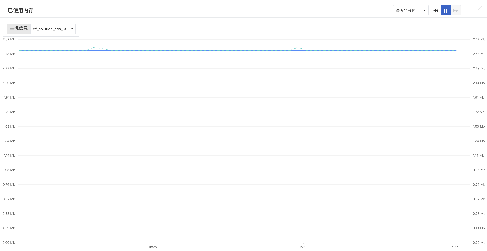
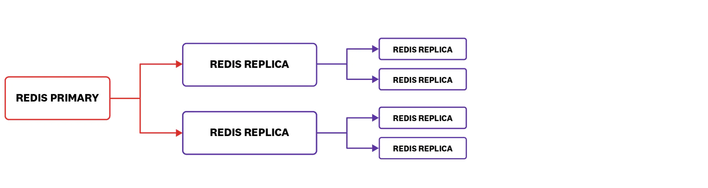
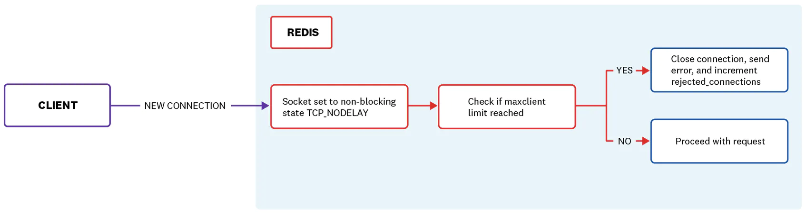

# Redis 可观测最佳实践
---

## 什么是 Redis

Redis 是一种流行的内存键/值数据存储。 Redis 以其出色的性能和简单的入门而闻名，已在各个行业中找到了用途，包括：

- **数据库**：尽管可以使用异步磁盘持久性，但 Redis 可以用持久性来换取速度，而不是传统的基于磁盘的数据库。 Redis 提供了丰富的数据原语集和异常丰富的命令列表。

- **邮件队列**：Redis 的阻止列表命令和低延迟使其成为邮件代理服务的良好后端。
- **内存缓存**：可配置的密钥收回策略，包括流行的“最近最少使用”策略以及从 Redis 4.0 开始的“最少经常使用”策略，使 Redis 成为缓存服务器的绝佳选择。 与传统的缓存不同，Redis 还允许持久化磁盘以提高可靠性。

Redis 是免费的开放源代码产品。 提供商业支持，以及完全托管的Redis即服务。

Redis 被许多高流量的网站和应用程序所采用，例如 Twitter，GitHub，Docker，Pinterest，Datadog 和 Stack Overflow。

## 关键 Redis 指标

监视 Redis 可以帮助您在两个方面发现问题：Redis 本身的资源问题以及支持基础架构中其他地方出现的问题。

在本文中，我们详细介绍了以下每个类别中最重要的Redis指标：

- **性能指标**

- **内存指标**
- **基本活动指标**
- **持续性指标**
- **错误指标**

### 性能指标

除低错误率外，良好的性能是系统运行状况的最佳顶级指标之一。 如内存部分中所述，性能不佳通常是由内存问题引起的。

| **名称** | **描述** | Metric Type |
| --- | --- | --- |
| latency | Redis服务器平均响应请求的时间 | Work: Performance |
| Instantaneous_ops_per_sec | 每秒处理的命令总数 | Work: Throughput |
| hit rate (calculated） | keyspace_hits /（keyspace_hits + keyspace_misses） | Work: Success |

#### 告警指标：latency
延迟是对客户端请求和实际服务器响应之间的时间的度量。 跟踪延迟是检测Redis性能变化的最直接方法。 由于 Redis 具有单线程特性，因此延迟分布中的异常值可能会导致严重的瓶颈。 一个请求的响应时间过长会增加所有后续请求的等待时间。一旦确定延迟是一个问题，就可以采取多种措施来诊断和解决性能问题。



#### 观测指标：Instantaneous_ops_per_sec

跟踪已处理命令的吞吐量对于诊断 Redis 实例中高延迟的原因至关重要。 高延迟可能是由许多问题引起的，从积压的命令队列到速度慢的命令，再到网络链路过度使用。 您可以通过测量每秒处理的命令数来进行调查-如果该命令几乎保持不变，则原因不是计算密集型命令。 如果一个或多个慢速命令引起延迟问题，您将看到每秒的命令数量下降或完全停止。与历史规范相比，每秒处理的命令数量下降可能是低命令量或阻塞系统的慢命令的迹象。 低命令量可能是正常现象，或者可能表明上游出现问题。

#### 指标：hit rate

将 Redis 用作缓存时，监视缓存命中率可以告诉您缓存是否得到有效使用。命中率低意味着客户端正在寻找不再存在的密钥。Redis 不直接提供命中率指标。我们仍然可以这样计算：

```
hit rate = keyspace_hits / (keyspace_hits + keyspace_misses)
```

高速缓存命中率低可能是由多种因素引起的，包括数据到期和分配给Redis的内存不足（这可能会导致键退出）。 低命中率可能会导致应用程序延迟增加，因为它们必须从较慢的备用资源中获取数据。

### 内存指标
| **名称** | 描述 | Metric Type |
| --- | --- | --- |
| used_memory | Redis使用的内存量（以字节为单位） | Resource: Utilization |
| mem_fragmentation_ratio | 操作系统分配的内存与Redis请求的内存的比率 | Resource: Saturation |
| evicted_keys | 由于达到最大内存限制而删除的键数 | Resource: Saturation |
| blocked_clients | 客户端在等待BLPOP，BRPOP或BRPOPLPUSH时被阻止 | Other |

#### 观测指标：used_memory
内存使用率是 Redis 性能的关键组成部分。 如果 used_memory 超出了可用的系统总内存，则操作系统将开始交换内存的旧/未使用部分。 每个交换的部分都写入磁盘，从而严重影响性能。 从磁盘写入或读取比从内存写入或读取要慢 5 个数量级（100,000x！）（内存为 0.1 µs，磁盘为 10 ms）。

您可以将 Redis 配置为限制在指定的内存量内。 在 redis.conf 文件中设置 maxmemory 指令可以直接控制Redis的内存使用情况。 启用 maxmemory 要求您为 Redis 配置驱逐策略，以确定释放内存的方式。 在 evicted_keys 部分中了解有关配置 maxmemory-policy 指令的更多信息。



#### 警报指标：mem_fragmentation_ratio
mem_fragmentation_ratio 度量标准提供了操作系统（used_memory_rss）所使用的内存与 Redis 分配的内存（used_memory）的比率。
```
mem_fragmentation_ratio = used_memory_rss / used_memory
```
操作系统负责为每个进程分配物理内存。操作系统的虚拟内存管理器处理由内存分配器介导的实际映射。

这是什么意思？如果您的 Redis 实例的内存占用为 1GB，则内存分配器将首先尝试查找连续的内存段来存储数据。如果找不到连续的段，则分配器必须将进程的数据划分为多个段，从而增加内存开销。

跟踪碎片率对于了解 Redis 实例的性能非常重要。碎片率大于 1 表示正在发生碎片。比率超过 1.5 表示碎片过多，您的 Redis 实例消耗了其请求的物理内存的 150％。小于1的碎片率告诉您 Redis 需要的内存多于系统上可用的内存，这导致交换。交换到磁盘将导致延迟显着增加（请参阅已用内存）。理想情况下，操作系统将在物理内存中分配一个连续的段，其碎片率等于1或更大。

如果服务器的碎片率超过1.5，重新启动 Redis 实例将允许操作系统恢复以前由于碎片而无法使用的内存。在这种情况下，将警报作为通知可能就足够了。

但是，如果您的 Redis 服务器的碎片率低于1，则可能需要作为页面发出警报，以便您可以快速增加可用内存或减少内存使用量。

从 Redis 4开始，将 Redis 配置为使用随附的 jemalloc 副本时，可以使用新的主动碎片整理功能。可以将该工具配置为在碎片达到一定级别时启动，并开始将值复制到连续的内存区域中并释放旧副本，从而减少服务器运行时的碎片。

#### 警报指标：evicted_keys（仅高速缓存）

如果您将 Redis 用作缓存，则可能需要将其配置为在达到最大内存限制时自动清除密钥。 如果您将 Redis 用作数据库或队列，则最好将其替换为逐出，在这种情况下，您可以跳过此指标。

跟踪密钥移出很重要，因为 Redis 会顺序处理每个操作，这意味着逐出大量密钥会导致较低的命中率，从而导致更长的延迟时间。 如果您使用的是TTL，则可能不会希望退出按键。 在这种情况下，如果该指标始终大于零，则您的实例中的延迟可能会增加。 其他大多数不使用TTL的配置最终都会耗尽内存，并开始逐出密钥。 只要您的响应时间是可以接受的，稳定的驱逐率是可以接受的。

您可以使用以下命令配置密钥到期策略：

```
redis-cli CONFIG SET maxmemory-policy <policy>
```

其中`policy`是下列之一：

- **noeviction：**当达到内存限制并且用户尝试添加其他键时，返回一个错误

- **volatile-lru：**删除具有到期集的密钥中最近最少使用的密钥
- **volatile-ttl：**从具有到期集的密钥中删除剩余生存时间最短的密钥
- **volatile-random：**从具有到期集的密钥中删除一个随机密钥
- **allkeys-lru：**从所有密钥集中删除最近最少使用的密钥
- **allkeys-random：**从所有密钥集中删除一个随机密钥
- **volatile-lfu：**在 Redis 4 中添加、删除具有到期集的密钥中最不常用的密钥
- **allkeys-lfu：**在 Redis 4 中添加、从所有密钥集中删除最不常用的密钥

注意：由于性能原因，在使用 LRU，TTL 或 Redis 4（从 LUF 开始）策略时，Redis 实际上不会从整个键空间中进行采样。 Redis 首先对密钥空间的一个随机子集进行采样，然后将逐出策略应用于该样本。 通常，较新的（> = 3）版本的 Redis 采用 LRU 采样策略，该策略更接近于真实 LRU。 LFU 策略可以通过设置例如以下内容来调整：设置项目必须经过多少时间才能访问级别降低的项目。 有关更多详细信息，请参见 Redis 的文档。
#### 观测指标：blocked_clients
Redis 提供了许多对列表进行操作的阻止命令。 BLPOP，BRPOP 和 BRPOPLPUSH 分别是命令 LPOP，RPOP 和 RPOPLPUSH 的阻塞变体。 当源列表为非空时，命令将按预期执行。 但是，当源列表为空时，阻止命令将等待，直到源被填充或达到超时为止。

等待数据的被阻止客户端的数量增加可能是问题的征兆。 延迟或其他问题可能会阻止源列表的填写。 尽管阻止的客户端本身并不会引起警报，但是，如果您看到此指标始终为非零值，则应进行调查。
### 基本活动指标
注意：本节包括使用术语“主”和“从”的度量。 除了引用特定的度量标准名称外，本文将其替换为 “primary” 和 “replica"。

| **名称** | **描述** | Metric Type |
| --- | --- | --- |
| connected_clients | 连接到 Redis 的客户端数量 | Resource: Utilization |
| connected_slaves | 连接到当前主实例的副本数 | Other |
| master_last_io_seconds_ago | 自副本和主实例之间最后一次交互以来的时间（以秒为单位） | Other |
| keyspace | 数据库中的键总数 | Resource: Utilization |

#### 告警指标：connected_clients
由于对 Redis 的访问通常是由应用程序介导的（用户通常不直接访问数据库），因此在大多数情况下，所连接客户端的数量会有合理的上限和下限。 如果数字超出正常范围，则可能表明存在问题。 如果它太低，则上游连接可能已丢失；如果它太高，则大量并发客户端连接可能会使服务器处理请求的能力不堪重负。

无论如何，客户端连接的最大数量始终是有限的资源-无论是受操作系统，Redis 的配置还是网络限制。 监视客户端连接可帮助您确保有足够的可用资源可用于新客户端或管理会话。
#### 告警指标：connected_slaves
如果您的数据库是读取型数据库，则可能是在使用Redis中可用的主副本数据库复制功能。 在这种情况下，监视连接副本的数量是关键。 如果连接的副本数量意外更改，则可能表明主机已关闭或副本实例出现问题。



注意：在上图中，Redis 主数据库将显示其具有两个连接的副本，并且第一个子节点将各自报告它们也具有两个连接的副本。 由于辅助副本未直接连接到 Redis 主副本，因此它们不包括在连接到主副本的副本计数中。

#### 告警指标：master_last_io_seconds_ago

使用 Redis 的复制功能时，副本实例会定期使用其主实例进行检入。长时间没有通信可能表明您的主 Redis 服务器，副本服务器或两者之间存在问题。您还冒着副本提供自上次同步以来可能已更改的旧数据的风险。由于 Redis 执行同步的方式，因此最小化主副本通信的中断至关重要。当副本在中断后重新连接到主数据库时，它将发送 SYNC 命令以尝试仅对中断期间丢失的命令进行部分同步。如果无法做到这一点，则副本将请求完整的 SYNC，这将导致主副本立即开始将数据库后台保存到磁盘，同时缓冲收到的所有将修改数据集的新命令。后台保存完成后，数据将与缓冲的命令一起发送到客户端。副本每次执行一次 SYNC 时，都会导致主实例的延迟显着增加。

#### 值得关注的指标：keyspace

跟踪数据库中键的数量通常是一个好主意。作为内存数据存储，键空间越大，Redis 需要更多的物理内存来确保最佳性能。 Redis 将继续添加密钥，直到达到最大内存限制为止，此时，Redis 开始以新密钥以相同的速率逐出密钥。

如果您将 Redis 用作缓存，并且看到键空间饱和（如上图所示）以及较低的命中率，则您的客户端可能会请求旧数据或收回的数据。随着时间的推移跟踪您的 keyspace_misses 数量将有助于您查明原因。

另外，如果您将 Redis 用作数据库或队列，则可能不建议使用易失性键。随着键空间的增长，如果可能的话，您可能需要考虑在框内添加内存或在主机之间拆分数据集。添加更多的内存是一种简单有效的解决方案。当需要的资源超过一个框所能提供的资源时，可以通过对数据进行分区或分片来组合多台计算机的资源。有了分区计划，Redis 可以存储更多密钥而无需逐出或交换。但是，应用分区计划比在几个记忆棒中交换更具挑战性。

### **持续性指标**

| **名称** | **描述** | Metric Type |
| --- | --- | --- |
| rdb_last_save_time | 上次保存到磁盘的Unix时间戳 | Other |
| rdb_changes_since_last_save | 自上次转储以来对数据库所做的更改数 | Other |

启用持久性可能是必要的，尤其是在使用 Redis 的复制功能的情况下。 由于副本会盲目复制对主实例所做的任何更改，因此，如果要重新启动主实例（无持久性），则与其连接的所有副本都将复制其现在为空的数据集。<br />如果您将 Redis 用作缓存或在用例中数据丢失将不那么重要，则可能不需要持久性。

#### 重要监视的指标：rdb_last_save_time和rdb_changes_since_last_save

通常，最好注意数据集的波动性。 如果服务器发生故障，两次写入磁盘之间的时间间隔过长可能会导致数据丢失。 在上次保存时间和故障时间之间对数据集所做的任何更改都将丢失。<br />监视`rdb_changes_since_last_save`可让您更深入地了解数据的波动性。 如果您的数据集在该间隔内没有太大变化，则两次写入之间的长时间间隔不成问题。 跟踪两个指标可以使您很好地了解如果在给定的时间点发生故障，您将丢失多少数据。

### 错误指标

注意：本节包括使用术语“主”和“从”的指标。 除了引用特定的度量标准名称外，本文将其替换为“primary” 和 “replica"。<br />Redis错误指标可以提醒您异常情况。 以下指标跟踪常见错误：

| **名称** | **描述** | Metric Type |
| --- | --- | --- |
| rejected_connections | 由于达到maxclient限制而被拒绝的连接数 | Resource: Saturation |
| keyspace_misses | 失败的键查找次数 | Resource: Errors / Other |
| master_link_down_since_seconds | 主服务器和副本服务器之间的链接断开的时间（以秒为单位） | Resource: Errors |

#### 告警指标：rejected_connections
Redis能够处理许多活动连接，默认情况下有 10,000 个客户端连接可用。 通过更改 redis.conf 中的 maxclient 指令，可以将最大连接数设置为其他值。 如果您的 Redis 实例当前处于最大连接数，则任何新的连接尝试都将断开。



请注意，您的系统可能不支持您使用 maxclient 指令请求的连接数。 Redis 与内核核对以确定可用文件描述符的数量。 如果可用文件描述符的数量小于`maxclient + 32`（Redis 保留 32 个文件描述符供自己使用），则将忽略`maxclient`指令，并使用可用文件描述符的数量。

#### 告警指标：keyspace_misses
每次 Redis 查找密钥时，只有两种可能的结果：密钥存在，或者密钥不存在。 查找不存在的键会导致 keyspace_misses 计数器增加。 此度量标准始终为非零值表示客户端正在尝试在数据库中查找不存在的键。 如果未将 Redis 用作缓存，则`keyspace_misses`应该为零或接近零。 请注意，对空键调用的任何阻止操作（BLPOP，BRPOP和BRPOPLPUSH）都将导致`keyspace_misses`递增。
#### 告警指标：master_link_down_since_seconds
仅当主节点及其副本之间的连接丢失时，此指标才可用。 理想情况下，该值应永远不超过零-主数据库和副本数据库应保持持续通信，以确保副本数据库不提供过时的数据。 连接之间的较大时间间隔应得到解决。 请记住，重新连接后，您的主要 Redis 实例将需要投入资源来更新副本上的数据，这可能会导致延迟增加。
## 结论
在本文中，我们提到了一些最有用的指标，您可以对其进行监控以在 Redis 服务器上保留标签。 如果您刚开始使用 Redis，那么监视下面的列表中的指标将使您可以很好地了解数据库基础架构的运行状况和性能：

- **Number of commands processed per second**

- **Latency**
- **Memory fragmentation ratio**
- **Evictions**
- **Rejected clients**

最终，您将认识到与您自己的基础结构和用例特别相关的其他指标。 当然，您要监视的内容将取决于您拥有的工具和可用的指标。
