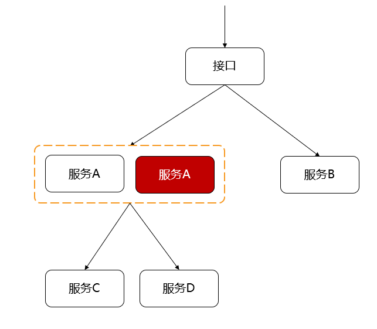
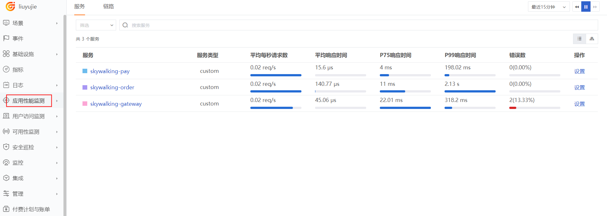
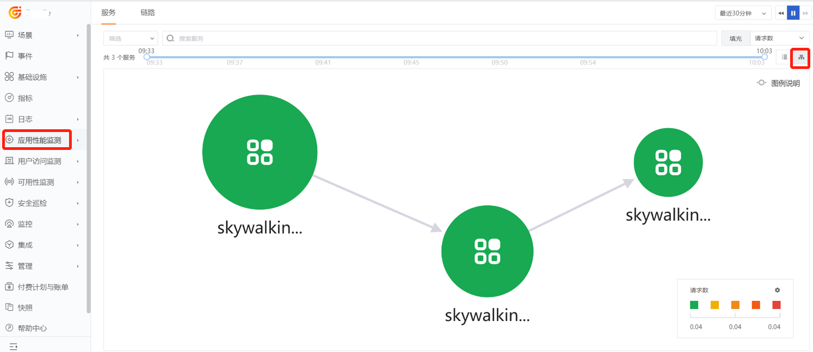
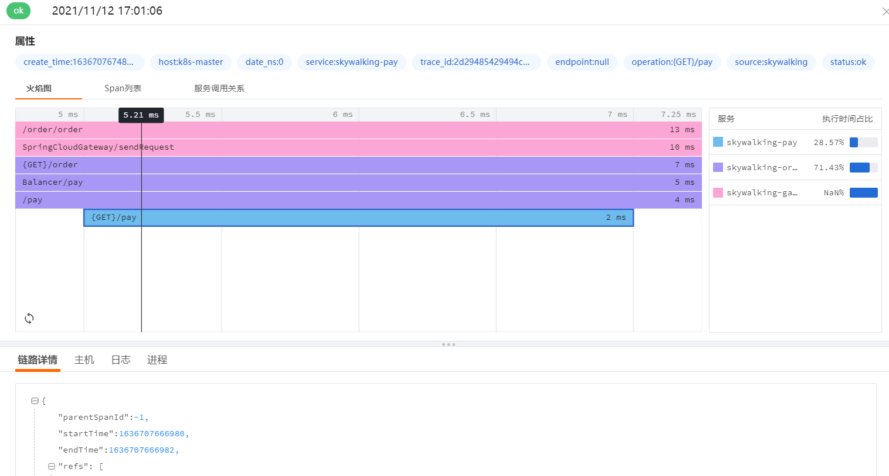

# SkyWalking 链路数据接入最佳实践
---

## 简介

微服务架构下，一个请求会涉及多个服务，一个服务也可能依赖其它服务，这样一个请求下来就构成了一个调用链。如果服务部署成高可用，就会有多个节点。如果其中一个节点出现异常，整个请求就会受到到影响，在这种情况下就需要一个工具来帮助我们分析问题、定位问题和解决问题。<br />        Skywalking 是一个开源的可观察性平台，用于收集、分析、聚合和可视化来自服务和云原生基础设施的数据。Skywalking 提供了基于分布式跟踪的应用程序性能监控系统的解决方案，支持 Java、C#、Node.js、Go、PHP 等。



DataKit 只需开启 Skywalking Input，即可采集 Skywalking Agent上报来的链路数据。

## 前置条件
### 安装 DataKit

- <[安装 DataKit](/datakit/datakit-install.md)>

本文datakit版本1.2.11，skywalking agent版本为v8.6.0。
## 数据接入
### 开启 Input

1、 开启 SkyWalking 插件，复制 Sample 文件
```
cd /usr/local/datakit/conf.d/skywalking
cp skywalking.conf.sample skywalking.conf
```

2、 修改 skywalking.conf 文件
```

[[inputs.skywalking]]
  ## skywalking grpc server listening on address
  address = "localhost:13800"

  ## customer_tags is a list of keys contains keys set by client code like span.SetTag(key, value)
  ## that want to send to data center. Those keys set by client code will take precedence over
  ## keys in [inputs.skywalking.tags]. DOT(.) IN KEY WILL BE REPLACED BY DASH(_) WHEN SENDING.
  # customer_tags = ["key1", "key2", ...]

  ## Keep rare tracing resources list switch.
  ## If some resources are rare enough(not presend in 1 hour), those resource will always send
  ## to data center and do not consider samplers and filters.
  # keep_rare_resource = false

  ## Ignore tracing resources map like service:[resources...].
  ## The service name is the full service name in current application.
  ## The resource list is regular expressions uses to block resource names.
  # [inputs.skywalking.close_resource]
    # service1 = ["resource1", "resource2", ...]
    # service2 = ["resource1", "resource2", ...]
    # ...

  ## Sampler config uses to set global sampling strategy.
  ## priority uses to set tracing data propagation level, the valid values are -1, 0, 1
  ##   -1: always reject any tracing data send to datakit
  ##    0: accept tracing data and calculate with sampling_rate
  ##    1: always send to data center and do not consider sampling_rate
  ## sampling_rate used to set global sampling rate
  # [inputs.skywalking.sampler]
    # priority = 0
    # sampling_rate = 1.0

  # [inputs.skywalking.tags]
    # key1 = "value1"
    # key2 = "value2"
    # ...
```
参数说明

- address：接收 skywalking 链路数据的地址

3、 重启 DataKit
```
systemctl restart datakit
```
### Java 链路数据接入
#### 下载 Skywalking Java Agent

1、 下载
- skywalking-java agent [下载](https://archive.apache.org/dist/skywalking/8.6.0/apache-skywalking-apm-8.6.0.tar.gz)

   **注意**： skywalking agent v8.8.3 目前存在不兼容问题无法使用。目前已支持 v8.5.0 v8.6.0 v8.7.0

2、 解压
```
tar -zxvf /usr/local/java/apache-skywalking-apm-8.6.0.tar.gz 
```

3、 <font color="red" >复制插件</font>

本示例使用了 Spring Cloud Gateway，由于 Gateway 是基于 Webflux 实现的，必须把 skywalking-agent/optional-plugins/ 目录下的 apm-spring-cloud-gateway-2.1.x-plugin-8.6.0.jar 和 apm-spring-webflux-5.x-plugin-8.6.0.jar 复制到 skywalking-agent/plugins/ 目录下。

```
cp /usr/local/java/skywalking-agent/optional-plugins/apm-spring-cloud-gateway-2.1.x-plugin-8.6.0.jar /usr/local/java/skywalking-agent/plugins/
cp /usr/local/java/skywalking-agent/optional-plugins/apm-spring-webflux-5.x-plugin-8.6.0.jar /usr/local/java/skywalking-agent/plugins/
```

#### 启动 Java 应用

本示例部署 3 个微服务，pay、orde 和 gateway。

```
java -javaagent:/usr/local/java/skywalking-agent/skywalking-agent.jar \
-Dskywalking.agent.service_name=skywalking-pay   \
-Dskywalking.collector.backend_service=localhost:13800  \
-jar cloud-service-pay-1.0-SNAPSHOT.jar 
```

```
java -javaagent:/usr/local/java/skywalking-agent/skywalking-agent.jar \
-Dskywalking.agent.service_name=skywalking-order   \
-Dskywalking.collector.backend_service=localhost:13800  \
-jar cloud-service-order-1.0-SNAPSHOT.jar
```

```
java -javaagent:/usr/local/java/skywalking-agent/skywalking-agent.jar \
-Dskywalking.agent.service_name=skywalking-gateway   \
-Dskywalking.collector.backend_service=localhost:13800  \
-jar   gateway-1.0-SNAPSHOT.jar
```

参数说明

- Dskywalking.agent.service_name：微服务别名

- Dskywalking.collector.backend_service：链路数据上报地址
#### 链路数据
前往<[观测云](https://console.guance.com/)>，进入应用性能监测。

- 服务



- 拓扑图



- 火焰图



