# 阿里云 DTS 增量数据迁移最佳实践 (Function)

---

## 前置条件

### 安装 Datakit

1、 点击 [**集成**] 模块， [_Datakit_]，根据您的操作系统和系统类型选择合适的安装命令。


2、 复制 Datakit 安装命令在需要被监控的服务器上直接运行。
- 安装目录 /usr/local/datakit/
- 日志目录 /var/log/datakit/
- 主配置文件 /usr/local/datakit/conf.d/datakit.conf
- 插件配置目录 /usr/local/datakit/conf.d/
### 安装 Function

1、 点击 [**集成**] 模块， [_Funciton_]，下载安装包并执行安装命令


2、 安装完成后，使用浏览器访问 http://服务器IP地址:8088 进行初始化操作界面


3、 使用默认用户名/密码 admin 登录系统


### RAM 访问控制

1、 登录 RAM 控制台  [https://ram.console.aliyun.com/users](https://ram.console.aliyun.com/users)

2、 新建用户：人员管理 - 用户 - 创建用户


3、 保存或下载 AccessKey ID 和 AccessKey Secret 的 CSV 文件 (配置文件会用到)

4、 用户授权 (只读访问数据传输服务( DTS )权限)

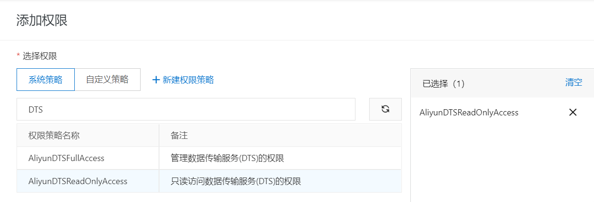

## 脚本开发

### 阿里云 DTS 增量数据迁移

1、 访问 [[阿里云 DTS 产品文档 - 新版 API - 查询 DTS 任务详情](https://help.aliyun.com/document_detail/209702.html?spm=a2c4g.11186623.6.1002.d97c6436S5LXrz)]，进入调试模式

2、 找到 SDK 依赖信息 - 新版 SDK，复制 SDK 安装命令

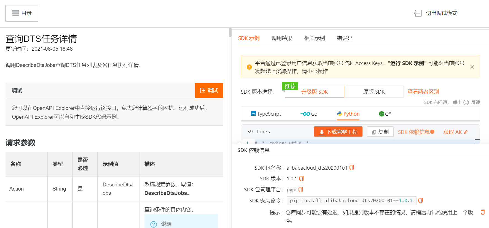

3、 管理 - 实验性功能 - 开启 PIP 工具模块

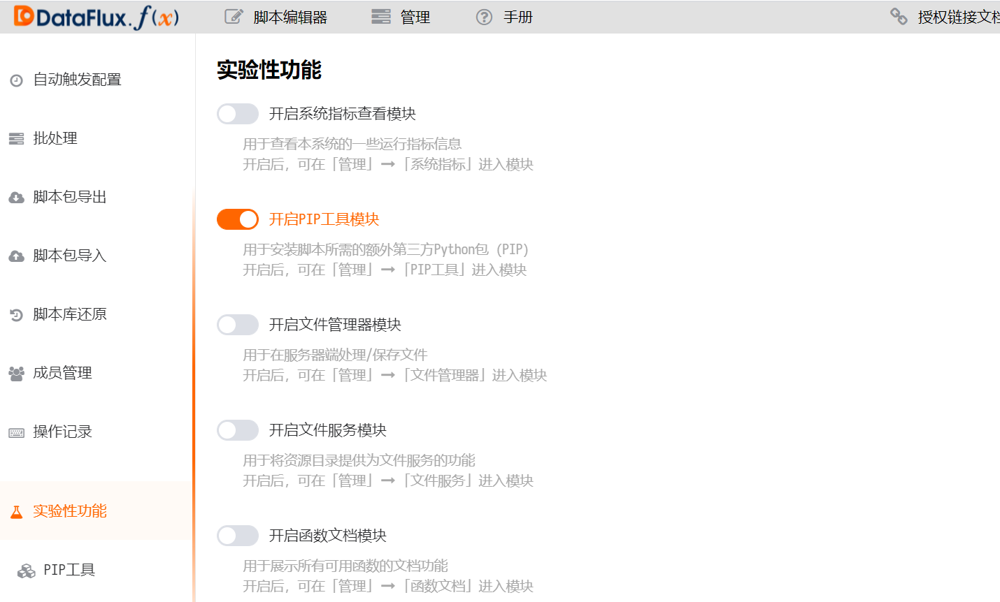

4、 安装阿里云 SDK 依赖包

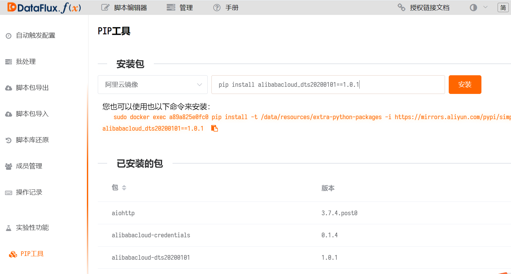

5、 新建脚本集，添加脚本

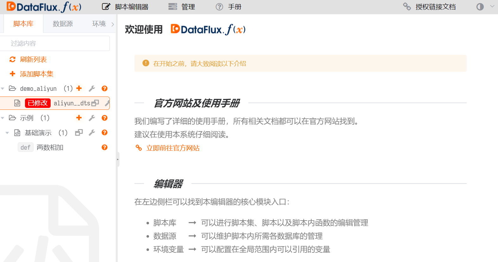

6、 编写代码，需要填入 AccessKey ID，AccessKey Secret，Region

参考文档 ：

- [阿里云 DTS 产品文档 - 新版 API - 查询 DTS 任务详情](https://help.aliyun.com/document_detail/209702.html?spm=a2c4g.11186623.6.1002.d97c6436S5LXrz)

- [Function DataKit 数据对接](/dataflux-func/development-guide/)

```python
# -*- coding: utf-8 -*-

import sys
import json
from typing import List

from alibabacloud_dts20200101.client import Client as Dts20200101Client
from alibabacloud_tea_openapi import models as open_api_models
from alibabacloud_dts20200101 import models as dts_20200101_models

# 阿里云 sdk
class Sample:
    def __init__(self):
        pass

    @staticmethod
    def create_client(
        access_key_id: str,
        access_key_secret: str,
    ) -> Dts20200101Client:
        """
        使用AK&SK初始化账号Client
        @param access_key_id:
        @param access_key_secret:
        @return: Client
        @throws Exception
        """
        config = open_api_models.Config(
            # 您的AccessKey ID,
            access_key_id=access_key_id,
            # 您的AccessKey Secret,
            access_key_secret=access_key_secret
        )
        # 访问的域名
        config.endpoint = 'dts.cn-hangzhou.aliyuncs.com'
        return Dts20200101Client(config)

    @staticmethod
    def main(
        args: List[str],
    ) -> None:
        client = Sample.create_client('accessKeyId', 'accessKeySecret')
        describe_dts_jobs_request = dts_20200101_models.DescribeDtsJobsRequest(region='cn-hangzhou')
        client.describe_dts_jobs(describe_dts_jobs_request)

@DFF.API('dts_demo', timeout=300)
def dts_demo():
    # 实例化sample
    sample = Sample()
    client = sample.create_client(
        access_key_id="AccessKey ID",
        access_key_secret="AccessKey Secret"
    )
    describe_dts_jobs_request = dts_20200101_models.DescribeDtsJobsRequest(
    # DTS实例的任务类型。MIGRATION；SYNC；SUBSCRIBE。
            region='region',job_type='MIGRATION'
        )
    response = client.describe_dts_jobs(describe_dts_jobs_request).to_map()
    dtsjoblist = response['body']['DtsJobList'][0]
    dts_instanceid = dtsjoblist['DtsInstanceID']
    dts_jobname = dtsjoblist['DtsJobName']
    # 增量数据迁移或同步的状态指标
    datasynchronization = response['body']['DtsJobList'][0]['DataSynchronizationStatus']
    dts_status = datasynchronization['Status']
    dts_percent = datasynchronization['Percent']

    # 行协议数据
    points = [
        {'measurement': 'aliyun_api_dts',
         'tags': {'instanceId': dts_instanceid,'jobname': dts_jobname}, 
         'fields': {'dts_status': dts_status,'dts_percent':dts_percent}
        }
    ]
    write_metrics(points)

def write_metrics(points: list):
    datakit = DFF.SRC('datakit')
    res = datakit.write_metric_many(points)
```

7. 主函数前添加装饰器 (导出函数为 HTTP API 接口) 

```python
@DFF.API('名称', timeout=300)
```

8、 发布脚本

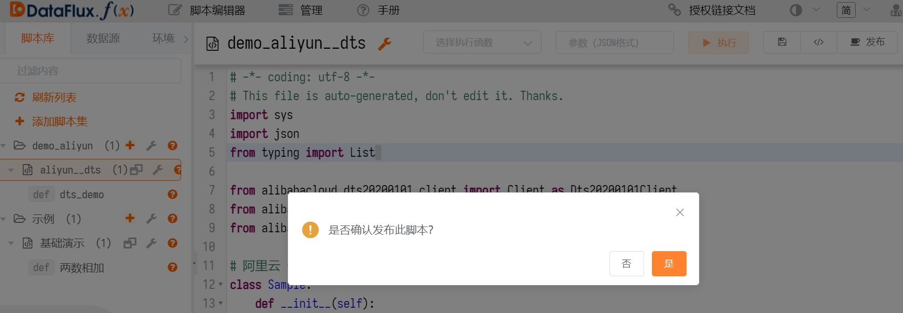

9、 添加定时任务 (数据采集频率)，管理 - 自动触发配置 - 选择定时时间

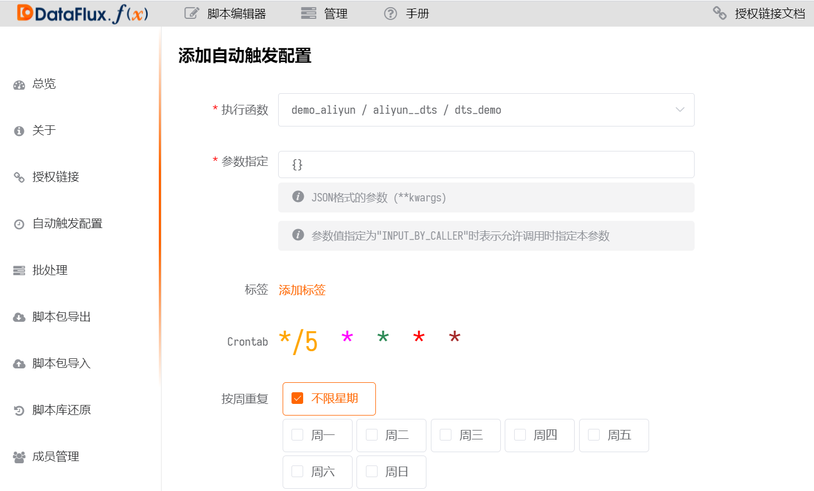

10、 添加完成后可以看到所有定时任务

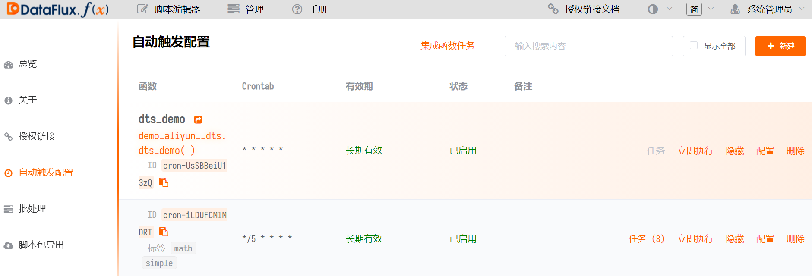

11、 查看数据指标 - DataFlux - [_指标_]

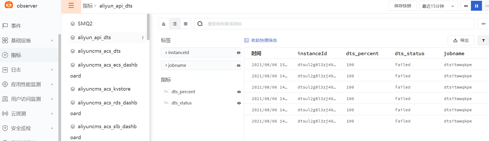

12、 添加_[异常检测库]_ - DTS 迁移异常规则

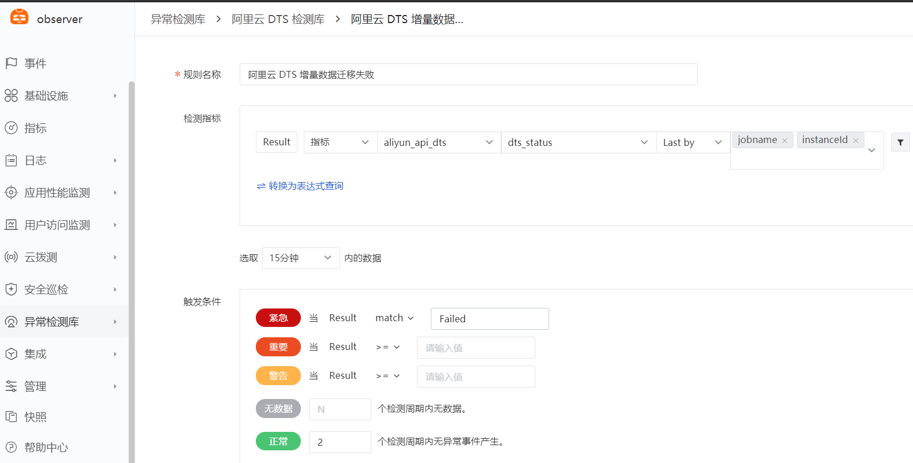

13、 阿里云 DTS 增量数据迁移失败触发异常事件

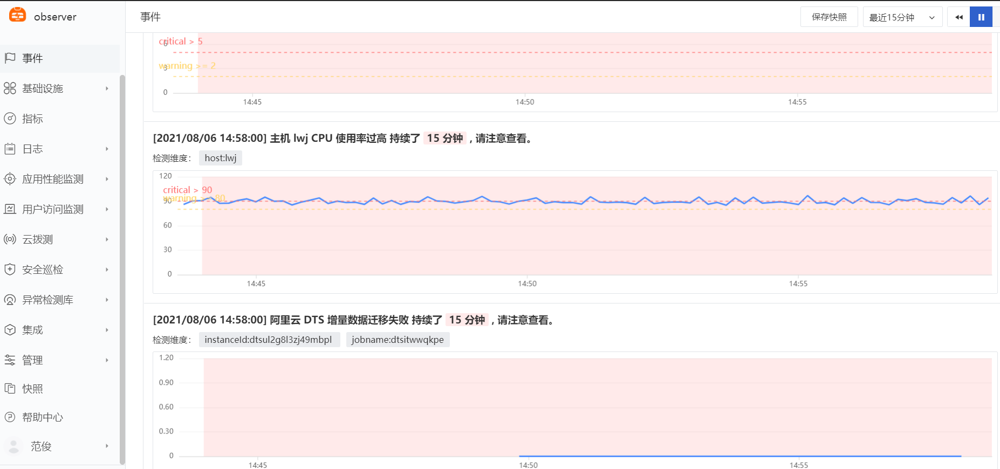
