# 基于阿里云 ASM 实现微服务可观测最佳实践

---


## 简介

随着以 Istio 为代表的服务网格的流行，阿里云也推出了全托管式的服务网格平台-阿里云服务网格（Alibaba Cloud Service Mesh，简称ASM），ASM 兼容社区 Istio 开源服务网格，用于简化服务的治理，包括服务调用之间的流量路由与拆分管理、服务间通信的认证安全以及网格可观测性能力。
ASM 的可观测能力是一种开放式的设计，既可以通过阿里的 arms + sls，也可以通过开源的 zipkin，因为观测云是兼容 zipkin 的， 所以观测云可以一站式的把 ASM 相关的指标链路日志，关联起来放在一起观测。而且观测云的 DataKit 既可以通过 daemonSet 的方式部署，也可以作为集群内的 Service，自身具有强大的处理能力，比如自动关联指标日志链路，对 tracing 的数据进行上报之前的预处理， 相对阿里自身的方案和开源的方案，具有更强的灵活性和功能。
本文以阿里云 ASM 可观测最佳实践 [https://help.aliyun.com/document_detail/176527.html](https://help.aliyun.com/document_detail/176527.html) 为参照，开源项目 BookInfo 为例，换用观测云来实现部署在 ASM 平台的 BookInfo 微服务的可观测。

## 前置条件

- 已创建一个 ACK 集群。如果没有创建，请参见[创建 Kubernetes 专有版集群](https://help.aliyun.com/document_detail/86488.htm#task-skz-qwk-qfb)和[创建 Kubernetes 托管版集群](https://help.aliyun.com/document_detail/95108.htm#task-skz-qwk-qfb)。
- 已创建一个 ASM 实例。如果没有创建，请参见[创建 ASM 实例](https://help.aliyun.com/document_detail/147793.htm#task-2370657)。**注意**，创建新网格时，请选择**自行搭建 Zipkin**。

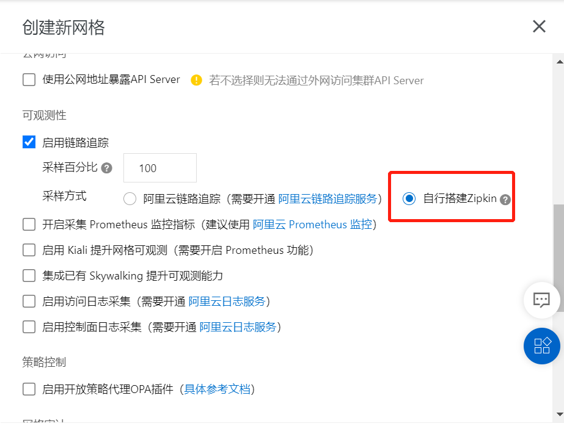

## 操作步骤

## 步骤一 添加集群到 ASM 

1、 登录 [ASM 控制台](https://servicemesh.console.aliyun.com/)。
2、 在左侧导航栏，选择**服务网格 > 网格管理**。
3、 在**网格管理**页面，找到待配置的实例，单击实例的名称或在**操作**列中单击**管理**。

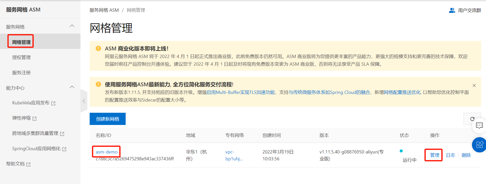

4、 在网格详情页面左侧导航栏选择**集群与工作负载管理 > Kubernetes 集群**，然后在右侧页面单击**添加**。
5、 在**添加集群**面板，选中需要添加的集群，然后单击**确定**。

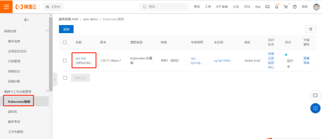

## 步骤二 创建入口网关

1. 登录 [ASM 控制台](https://servicemesh.console.aliyun.com/)。
2. 在左侧导航栏，选择**服务网格 > 网格管理**。
3. 在**网格管理**页面，找到待配置的实例，单击实例的名称或在**操作**列中单击**管理**。
4. 在网格详情页面左侧导航栏单击 **ASM 网关**，然后在右侧页面单击**创建**。

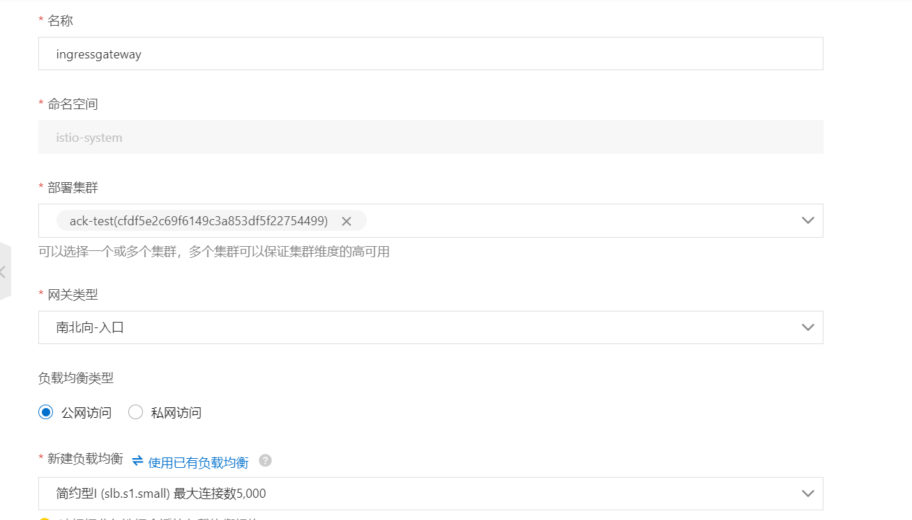


输入上述信息后，点击**创建**，需要耐心等待几分钟，创建完成后界面如下图，其中 IP 地址 [120.55.180.137](https://cs.console.aliyun.com/?spm=5176.13895322.0.0.3bbf5fcf9WxLGC#/k8s/cluster/cfdf5e2c69f6149c3a853df5f22754499/v2/service/detail/istio-system/istio-ingressgateway?ns=istio-system) 就是应用的入口地址，后面会使用到。
		 
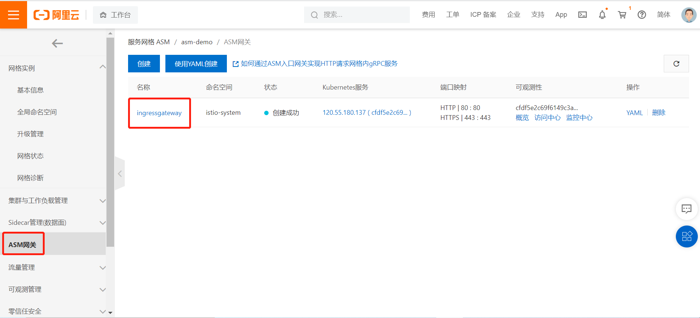

## 步骤三  开通 Sidecar 注入 

1. 登录[容器服务管理控制台](https://cs.console.aliyun.com/?spm=a2c4g.11186623.0.0.1b483e068AVz8k)。
2. 在控制台左侧导航栏中，单击**集群**。
3. 在**集群列表**页面中，单击目标集群名称或者目标集群右侧**操作**列下的**详情**。
4. 在集群管理页左侧导航栏单击**命名空间与配额**。
5. 在**命名空间**页面，找到 default，单机**编辑**。
   1. 在**变量名称**文本框中输入 istio-injection。
   2. 在**变量值**文本框中输入 enabled。

点击**添加**后，再点**确定**。
		
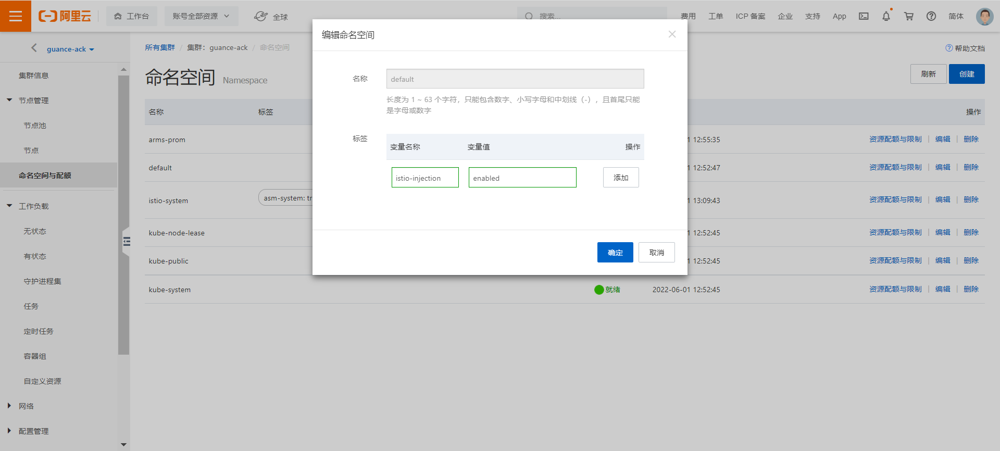

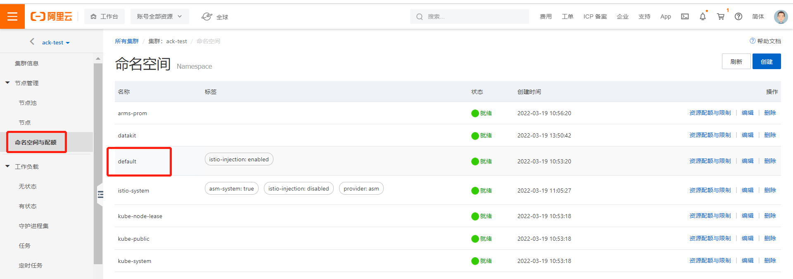

**说明** 您也可以通过 kubectl 执行以下命令为命名空间添加标签。

```shell
kubectl label namespace default istio-injection=enabled
```

## 步骤四  部署 BookInfo 

在 Kubernetes 集群部署的 DataKit，会采集添加了 annotations 注解的 POD 的指标数据。

```yaml
annotations:
        datakit/prom.instances: |
          [[inputs.prom]]
            url = "http://$IP:15020/stats/prometheus"
            source = "ack-istio-product"
            metric_types = ["counter", "gauge"]
            interval = "60s"
            tags_ignore = ["cache","cluster_type","component","destination_app","destination_canonical_revision","destination_canonical_service","destination_cluster","destination_principal","group","grpc_code","grpc_method","grpc_service","grpc_type","reason","request_protocol","request_type","resource","responce_code_class","response_flags","source_app","source_canonical_revision","source_canonical-service","source_cluster","source_principal","source_version","wasm_filter"]
            metric_name_filter = ["istio_requests_total","pilot_k8s_cfg_events","istio_build","process_virtual_memory_bytes","process_resident_memory_bytes","process_cpu_seconds_total","envoy_cluster_assignment_stale","go_goroutines","pilot_xds_pushes","pilot_proxy_convergence_time_bucket","citadel_server_root_cert_expiry_timestamp","pilot_conflict_inbound_listener","pilot_conflict_outbound_listener_http_over_current_tcp","pilot_conflict_outbound_listener_tcp_over_current_tcp","pilot_conflict_outbound_listener_tcp_over_current_http","pilot_virt_services","galley_validation_failed","pilot_services","envoy_cluster_upstream_cx_total","envoy_cluster_upstream_cx_connect_fail","envoy_cluster_upstream_cx_active","envoy_cluster_upstream_cx_rx_bytes_total","envoy_cluster_upstream_cx_tx_bytes_total","istio_request_duration_milliseconds_bucket","istio_request_duration_seconds_bucket","istio_request_bytes_bucket","istio_response_bytes_bucket"]
            #measurement_prefix = ""
            measurement_name = "prom_asm_istio"
            #[[inputs.prom.measurements]]
            # prefix = "cpu_"
            # name = "cpu"         
            [inputs.prom.tags]
            namespace = "$NAMESPACE"
```

参数说明

- url：Exporter 地址
- source：采集器名称
- metric_types：指标类型过滤
- measurement_name：采集后的指标集名称
- interval：采集指标频率，s秒
- $IP：通配 Pod 的内网 IP
- $NAMESPACE：Pod所在命名空间
- tags_ignore:  忽略的 tag。

更改后的 [bookinfo.yaml](https://github.com/istio/istio/blob/master/samples/bookinfo/platform/kube/bookinfo.yaml) 文件如下：

```yaml
apiVersion: v1
kind: Service
metadata:
  name: details
  labels:
    app: details
    service: details
spec:
  ports:
  - port: 9080
    name: http
  selector:
    app: details
---
apiVersion: v1
kind: ServiceAccount
metadata:
  name: bookinfo-details
  labels:
    account: details
---
apiVersion: apps/v1
kind: Deployment
metadata:
  name: details-v1
  labels:
    app: details
    version: v1
spec:
  replicas: 1
  selector:
    matchLabels:
      app: details
      version: v1
  template:
    metadata:
      labels:
        app: details
        version: v1
      annotations:
        datakit/prom.instances: |
          [[inputs.prom]]
            url = "http://$IP:15020/stats/prometheus"
            source = "ack-istio-details"
            metric_types = ["counter", "gauge"]
            interval = "60s"
			tags_ignore = ["cache","cluster_type","component","destination_app","destination_canonical_revision","destination_canonical_service","destination_cluster","destination_principal","group","grpc_code","grpc_method","grpc_service","grpc_type","reason","request_protocol","request_type","resource","responce_code_class","response_flags","source_app","source_canonical_revision","source_canonical-service","source_cluster","source_principal","source_version","wasm_filter"]
            metric_name_filter = ["istio_requests_total","pilot_k8s_cfg_events","istio_build","process_virtual_memory_bytes","process_resident_memory_bytes","process_cpu_seconds_total","envoy_cluster_assignment_stale","go_goroutines","pilot_xds_pushes","pilot_proxy_convergence_time_bucket","citadel_server_root_cert_expiry_timestamp","pilot_conflict_inbound_listener","pilot_conflict_outbound_listener_http_over_current_tcp","pilot_conflict_outbound_listener_tcp_over_current_tcp","pilot_conflict_outbound_listener_tcp_over_current_http","pilot_virt_services","galley_validation_failed","pilot_services","envoy_cluster_upstream_cx_total","envoy_cluster_upstream_cx_connect_fail","envoy_cluster_upstream_cx_active","envoy_cluster_upstream_cx_rx_bytes_total","envoy_cluster_upstream_cx_tx_bytes_total","istio_request_duration_milliseconds_bucket","istio_request_duration_seconds_bucket","istio_request_bytes_bucket","istio_response_bytes_bucket"]
            #measurement_prefix = ""
            measurement_name = "prom_asm_istio"
            #[[inputs.prom.measurements]]
            # prefix = "cpu_"
            # name = "cpu"         
            [inputs.prom.tags]
            namespace = "$NAMESPACE"
    spec:
      serviceAccountName: bookinfo-details
      containers:
      - name: details
        image: docker.io/istio/examples-bookinfo-details-v1:1.16.2
        imagePullPolicy: IfNotPresent
        ports:
        - containerPort: 9080
---
##################################################################################################
# Ratings service
##################################################################################################
apiVersion: v1
kind: Service
metadata:
  name: ratings
  labels:
    app: ratings
    service: ratings
spec:
  ports:
  - port: 9080
    name: http
  selector:
    app: ratings
---
apiVersion: v1
kind: ServiceAccount
metadata:
  name: bookinfo-ratings
  labels:
    account: ratings
---
apiVersion: apps/v1
kind: Deployment
metadata:
  name: ratings-v1
  labels:
    app: ratings
    version: v1
spec:
  replicas: 1
  selector:
    matchLabels:
      app: ratings
      version: v1
  template:
    metadata:
      labels:
        app: ratings
        version: v1
      annotations:
        datakit/prom.instances: |
          [[inputs.prom]]
            url = "http://$IP:15020/stats/prometheus"
            source = "ack-istio-ratings"
            metric_types = ["counter", "gauge"]
            interval = "60s"
			tags_ignore = ["cache","cluster_type","component","destination_app","destination_canonical_revision","destination_canonical_service","destination_cluster","destination_principal","group","grpc_code","grpc_method","grpc_service","grpc_type","reason","request_protocol","request_type","resource","responce_code_class","response_flags","source_app","source_canonical_revision","source_canonical-service","source_cluster","source_principal","source_version","wasm_filter"]
            metric_name_filter = ["istio_requests_total","pilot_k8s_cfg_events","istio_build","process_virtual_memory_bytes","process_resident_memory_bytes","process_cpu_seconds_total","envoy_cluster_assignment_stale","go_goroutines","pilot_xds_pushes","pilot_proxy_convergence_time_bucket","citadel_server_root_cert_expiry_timestamp","pilot_conflict_inbound_listener","pilot_conflict_outbound_listener_http_over_current_tcp","pilot_conflict_outbound_listener_tcp_over_current_tcp","pilot_conflict_outbound_listener_tcp_over_current_http","pilot_virt_services","galley_validation_failed","pilot_services","envoy_cluster_upstream_cx_total","envoy_cluster_upstream_cx_connect_fail","envoy_cluster_upstream_cx_active","envoy_cluster_upstream_cx_rx_bytes_total","envoy_cluster_upstream_cx_tx_bytes_total","istio_request_duration_milliseconds_bucket","istio_request_duration_seconds_bucket","istio_request_bytes_bucket","istio_response_bytes_bucket"]
            #measurement_prefix = ""
            measurement_name = "prom_asm_istio"
            #[[inputs.prom.measurements]]
            # prefix = "cpu_"
            # name = "cpu"         
            [inputs.prom.tags]
            namespace = "$NAMESPACE"
    spec:
      serviceAccountName: bookinfo-ratings
      containers:
      - name: ratings
        image: docker.io/istio/examples-bookinfo-ratings-v1:1.16.2
        imagePullPolicy: IfNotPresent
        ports:
        - containerPort: 9080
---
##################################################################################################
# Reviews service
##################################################################################################
apiVersion: v1
kind: Service
metadata:
  name: reviews
  labels:
    app: reviews
    service: reviews
spec:
  ports:
  - port: 9080
    name: http
  selector:
    app: reviews
---
apiVersion: v1
kind: ServiceAccount
metadata:
  name: bookinfo-reviews
  labels:
    account: reviews
---
apiVersion: apps/v1
kind: Deployment
metadata:
  name: reviews-v1
  labels:
    app: reviews
    version: v1
spec:
  replicas: 1
  selector:
    matchLabels:
      app: reviews
      version: v1
  template:
    metadata:
      labels:
        app: reviews
        version: v1
      annotations:
        datakit/prom.instances: |
          [[inputs.prom]]
            url = "http://$IP:15020/stats/prometheus"
            source = "ack-istio-review1"
            metric_types = ["counter", "gauge"]
            interval = "60s"
			tags_ignore = ["cache","cluster_type","component","destination_app","destination_canonical_revision","destination_canonical_service","destination_cluster","destination_principal","group","grpc_code","grpc_method","grpc_service","grpc_type","reason","request_protocol","request_type","resource","responce_code_class","response_flags","source_app","source_canonical_revision","source_canonical-service","source_cluster","source_principal","source_version","wasm_filter"]
            metric_name_filter = ["istio_requests_total","pilot_k8s_cfg_events","istio_build","process_virtual_memory_bytes","process_resident_memory_bytes","process_cpu_seconds_total","envoy_cluster_assignment_stale","go_goroutines","pilot_xds_pushes","pilot_proxy_convergence_time_bucket","citadel_server_root_cert_expiry_timestamp","pilot_conflict_inbound_listener","pilot_conflict_outbound_listener_http_over_current_tcp","pilot_conflict_outbound_listener_tcp_over_current_tcp","pilot_conflict_outbound_listener_tcp_over_current_http","pilot_virt_services","galley_validation_failed","pilot_services","envoy_cluster_upstream_cx_total","envoy_cluster_upstream_cx_connect_fail","envoy_cluster_upstream_cx_active","envoy_cluster_upstream_cx_rx_bytes_total","envoy_cluster_upstream_cx_tx_bytes_total","istio_request_duration_milliseconds_bucket","istio_request_duration_seconds_bucket","istio_request_bytes_bucket","istio_response_bytes_bucket"]
            #measurement_prefix = ""
            measurement_name = "prom_asm_istio"
            #[[inputs.prom.measurements]]
            # prefix = "cpu_"
            # name = "cpu"         
            [inputs.prom.tags]
            namespace = "$NAMESPACE"
    spec:
      serviceAccountName: bookinfo-reviews
      containers:
      - name: reviews
        image: docker.io/istio/examples-bookinfo-reviews-v1:1.16.2
        imagePullPolicy: IfNotPresent
        env:
        - name: LOG_DIR
          value: "/tmp/logs"
        ports:
        - containerPort: 9080
        volumeMounts:
        - name: tmp
          mountPath: /tmp
        - name: wlp-output
          mountPath: /opt/ibm/wlp/output
      volumes:
      - name: wlp-output
        emptyDir: {}
      - name: tmp
        emptyDir: {}
---
apiVersion: apps/v1
kind: Deployment
metadata:
  name: reviews-v2
  labels:
    app: reviews
    version: v2
spec:
  replicas: 1
  selector:
    matchLabels:
      app: reviews
      version: v2
  template:
    metadata:
      labels:
        app: reviews
        version: v2
      annotations:
        datakit/prom.instances: |
          [[inputs.prom]]
            url = "http://$IP:15020/stats/prometheus"
            source = "ack-istio-review2"
            metric_types = ["counter", "gauge"]
            interval = "60s"
			tags_ignore = ["cache","cluster_type","component","destination_app","destination_canonical_revision","destination_canonical_service","destination_cluster","destination_principal","group","grpc_code","grpc_method","grpc_service","grpc_type","reason","request_protocol","request_type","resource","responce_code_class","response_flags","source_app","source_canonical_revision","source_canonical-service","source_cluster","source_principal","source_version","wasm_filter"]
            metric_name_filter = ["istio_requests_total","pilot_k8s_cfg_events","istio_build","process_virtual_memory_bytes","process_resident_memory_bytes","process_cpu_seconds_total","envoy_cluster_assignment_stale","go_goroutines","pilot_xds_pushes","pilot_proxy_convergence_time_bucket","citadel_server_root_cert_expiry_timestamp","pilot_conflict_inbound_listener","pilot_conflict_outbound_listener_http_over_current_tcp","pilot_conflict_outbound_listener_tcp_over_current_tcp","pilot_conflict_outbound_listener_tcp_over_current_http","pilot_virt_services","galley_validation_failed","pilot_services","envoy_cluster_upstream_cx_total","envoy_cluster_upstream_cx_connect_fail","envoy_cluster_upstream_cx_active","envoy_cluster_upstream_cx_rx_bytes_total","envoy_cluster_upstream_cx_tx_bytes_total","istio_request_duration_milliseconds_bucket","istio_request_duration_seconds_bucket","istio_request_bytes_bucket","istio_response_bytes_bucket"]
            #measurement_prefix = ""
            measurement_name = "prom_asm_istio"
            #[[inputs.prom.measurements]]
            # prefix = "cpu_"
            # name = "cpu"         
            [inputs.prom.tags]
            namespace = "$NAMESPACE"
    spec:
      serviceAccountName: bookinfo-reviews
      containers:
      - name: reviews
        image: docker.io/istio/examples-bookinfo-reviews-v2:1.16.2
        imagePullPolicy: IfNotPresent
        env:
        - name: LOG_DIR
          value: "/tmp/logs"
        ports:
        - containerPort: 9080
        volumeMounts:
        - name: tmp
          mountPath: /tmp
        - name: wlp-output
          mountPath: /opt/ibm/wlp/output
      volumes:
      - name: wlp-output
        emptyDir: {}
      - name: tmp
        emptyDir: {}
---
apiVersion: apps/v1
kind: Deployment
metadata:
  name: reviews-v3
  labels:
    app: reviews
    version: v3
spec:
  replicas: 1
  selector:
    matchLabels:
      app: reviews
      version: v3
  template:
    metadata:
      labels:
        app: reviews
        version: v3
      annotations:
        datakit/prom.instances: |
          [[inputs.prom]]
            url = "http://$IP:15020/stats/prometheus"
            source = "ack-istio-review3"
            metric_types = ["counter", "gauge"]
            interval = "60s"
			tags_ignore = ["cache","cluster_type","component","destination_app","destination_canonical_revision","destination_canonical_service","destination_cluster","destination_principal","group","grpc_code","grpc_method","grpc_service","grpc_type","reason","request_protocol","request_type","resource","responce_code_class","response_flags","source_app","source_canonical_revision","source_canonical-service","source_cluster","source_principal","source_version","wasm_filter"]
            metric_name_filter = ["istio_requests_total","pilot_k8s_cfg_events","istio_build","process_virtual_memory_bytes","process_resident_memory_bytes","process_cpu_seconds_total","envoy_cluster_assignment_stale","go_goroutines","pilot_xds_pushes","pilot_proxy_convergence_time_bucket","citadel_server_root_cert_expiry_timestamp","pilot_conflict_inbound_listener","pilot_conflict_outbound_listener_http_over_current_tcp","pilot_conflict_outbound_listener_tcp_over_current_tcp","pilot_conflict_outbound_listener_tcp_over_current_http","pilot_virt_services","galley_validation_failed","pilot_services","envoy_cluster_upstream_cx_total","envoy_cluster_upstream_cx_connect_fail","envoy_cluster_upstream_cx_active","envoy_cluster_upstream_cx_rx_bytes_total","envoy_cluster_upstream_cx_tx_bytes_total","istio_request_duration_milliseconds_bucket","istio_request_duration_seconds_bucket","istio_request_bytes_bucket","istio_response_bytes_bucket"]
            #measurement_prefix = ""
            measurement_name = "prom_asm_istio"
            #[[inputs.prom.measurements]]
            # prefix = "cpu_"
            # name = "cpu"         
            [inputs.prom.tags]
            namespace = "$NAMESPACE"
    spec:
      serviceAccountName: bookinfo-reviews
      containers:
      - name: reviews
        image: docker.io/istio/examples-bookinfo-reviews-v3:1.16.2
        imagePullPolicy: IfNotPresent
        env:
        - name: LOG_DIR
          value: "/tmp/logs"
        ports:
        - containerPort: 9080
        volumeMounts:
        - name: tmp
          mountPath: /tmp
        - name: wlp-output
          mountPath: /opt/ibm/wlp/output
      volumes:
      - name: wlp-output
        emptyDir: {}
      - name: tmp
        emptyDir: {}
---
##################################################################################################
# Productpage services
##################################################################################################
apiVersion: v1
kind: Service
metadata:
  name: productpage
  labels:
    app: productpage
    service: productpage
spec:
  ports:
  - port: 9080
    name: http
  selector:
    app: productpage
---
apiVersion: v1
kind: ServiceAccount
metadata:
  name: bookinfo-productpage
  labels:
    account: productpage
---
apiVersion: apps/v1
kind: Deployment
metadata:
  name: productpage-v1
  labels:
    app: productpage
    version: v1
spec:
  replicas: 1
  selector:
    matchLabels:
      app: productpage
      version: v1
  template:
    metadata:
      labels:
        app: productpage
        version: v1
      annotations:
        datakit/prom.instances: |
          [[inputs.prom]]
            url = "http://$IP:15020/stats/prometheus"
            source = "ack-istio-product"
            metric_types = ["counter", "gauge"]
            interval = "60s"
			tags_ignore = ["cache","cluster_type","component","destination_app","destination_canonical_revision","destination_canonical_service","destination_cluster","destination_principal","group","grpc_code","grpc_method","grpc_service","grpc_type","reason","request_protocol","request_type","resource","responce_code_class","response_flags","source_app","source_canonical_revision","source_canonical-service","source_cluster","source_principal","source_version","wasm_filter"]
            metric_name_filter = ["istio_requests_total","pilot_k8s_cfg_events","istio_build","process_virtual_memory_bytes","process_resident_memory_bytes","process_cpu_seconds_total","envoy_cluster_assignment_stale","go_goroutines","pilot_xds_pushes","pilot_proxy_convergence_time_bucket","citadel_server_root_cert_expiry_timestamp","pilot_conflict_inbound_listener","pilot_conflict_outbound_listener_http_over_current_tcp","pilot_conflict_outbound_listener_tcp_over_current_tcp","pilot_conflict_outbound_listener_tcp_over_current_http","pilot_virt_services","galley_validation_failed","pilot_services","envoy_cluster_upstream_cx_total","envoy_cluster_upstream_cx_connect_fail","envoy_cluster_upstream_cx_active","envoy_cluster_upstream_cx_rx_bytes_total","envoy_cluster_upstream_cx_tx_bytes_total","istio_request_duration_milliseconds_bucket","istio_request_duration_seconds_bucket","istio_request_bytes_bucket","istio_response_bytes_bucket"]
            #measurement_prefix = ""
            measurement_name = "prom_asm_istio"
            #[[inputs.prom.measurements]]
            # prefix = "cpu_"
            # name = "cpu"         
            [inputs.prom.tags]
            namespace = "$NAMESPACE"
    spec:
      serviceAccountName: bookinfo-productpage
      containers:
      - name: productpage
        image: docker.io/istio/examples-bookinfo-productpage-v1:1.16.2
        imagePullPolicy: IfNotPresent
        ports:
        - containerPort: 9080
        volumeMounts:
        - name: tmp
          mountPath: /tmp
      volumes:
      - name: tmp
        emptyDir: {}
```

部署步骤：

1. 登录[容器服务管理控制台](https://cs.console.aliyun.com/?spm=a2c4g.11186623.0.0.1b483e068AVz8k)。
2. 在控制台左侧导航栏中，单击**集群**。
3. 在**集群列表**页面中，单击目标集群名称或者目标集群右侧**操作**列下的**详情**。
4. 在集群管理页左侧导航栏单击**工作负载 **> **无状态**，然后在右侧页面单击**使用 YAML 创建**。
- 选择相应的命名空间。本文以选择 **default **命名空间为例。
- 在示例模板中，选择自定义。把上文的 bookinfo.yaml 贴入模板中。

点击创建后，在列表中可以看到部署的无状态 Deployment 和服务。

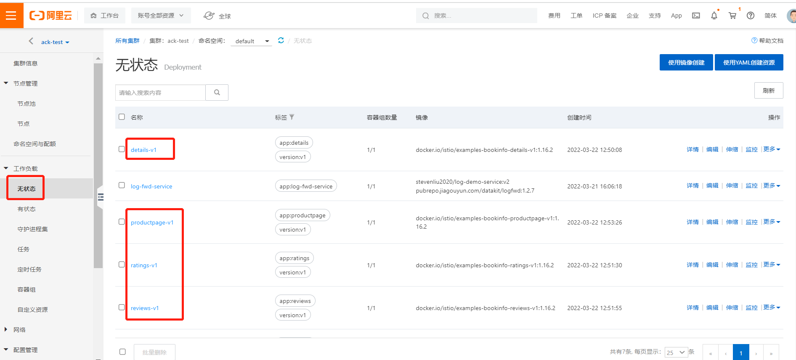

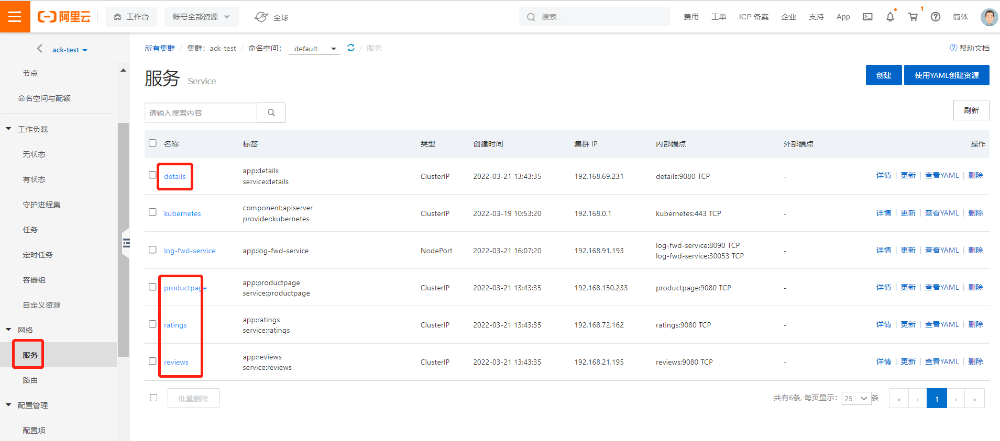

## 步骤五  定义 Gateway 资源

1. 登录 [ASM 控制台](https://servicemesh.console.aliyun.com/)。
2. 在左侧导航栏，选择**服务网格 > 网格管理**。
3. 在**网格管理**页面，找到待配置的实例，单击实例的名称或在**操作**列中单击**管理**。

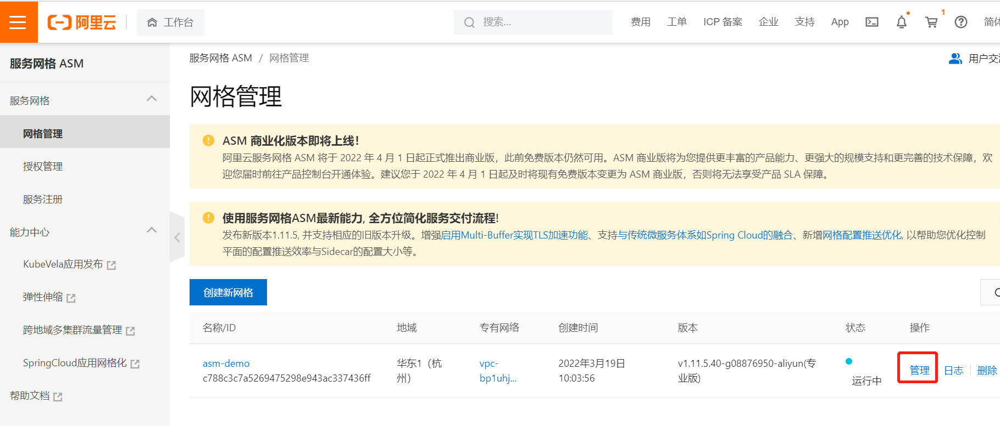

4. 在网格详情页面左侧导航栏选择**流量管理 > 网关规则**，然后在右侧页面单击**使用 YAML 创建**。
- 选择相应的命名空间。本文以选择 **default **命名空间为例。
- 在文本框中，定义服务网关。可参考以下YAML定义，详情请参见 [Istio官方示例](https://github.com/istio/istio/blob/master/samples/bookinfo/networking/bookinfo-gateway.yaml)。

```yaml
apiVersion: networking.istio.io/v1alpha3
kind: Gateway
metadata:
  name: bookinfo-gateway
spec:
  selector:
    istio: ingressgateway # use istio default controller
  servers:
  - port:
      number: 80
      name: http
      protocol: HTTP
    hosts:
    - "*"
```

点击**创建**后，在**网关规则**页面可以看到新建的 bookinfo-gateway 网关。
		
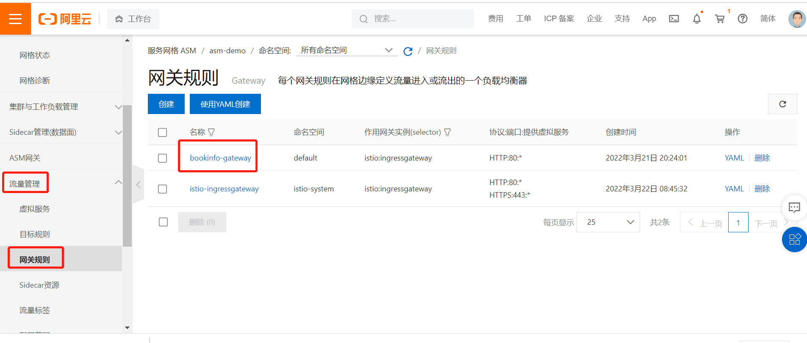

## 步骤六 定义虚拟服务

1. 登录 [ASM 控制台](https://servicemesh.console.aliyun.com/)。
2. 在左侧导航栏，选择**服务网格 > 网格管理**。
3. 在**网格管理**页面，找到待配置的实例，单击实例的名称或在**操作**列中单击**管理**。
4. 在网格详情页面左侧导航栏选择**流量管理 > 虚拟服务**，然后在右侧页面单击**使用 YAML 创建**。
5. 按以下步骤定义虚拟服务，然后单击**确定**。
   a. 选择相应的命名空间。本文以选择 **default **命名空间为例。
   b. 在文本框中，定义 Istio 虚拟服务。可参考以下 YAML 定义，详情请参见 [Istio 官方示例](https://github.com/istio/istio/blob/master/samples/bookinfo/networking/bookinfo-gateway.yaml#L16)。

```yaml
apiVersion: networking.istio.io/v1alpha3
kind: VirtualService
metadata:
  name: bookinfo
spec:
  hosts:
  - "*"
  gateways:
  - bookinfo-gateway
  http:
  - match:
    - uri:
        exact: /productpage
    - uri:
        prefix: /static
    - uri:
        exact: /login
    - uri:
        exact: /logout
    - uri:
        prefix: /api/v1/products
    route:
    - destination:
        host: productpage
        port:
          number: 9080
```
点击**创建**后，在**虚拟服务**页面可以看到新建的bookinfo服务。

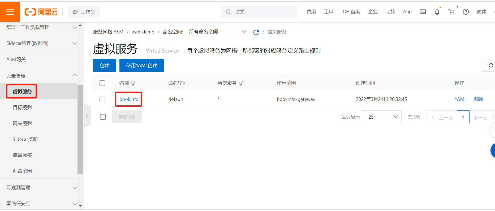

## 步骤七 部署 DataKit

登录 [观测云](https://console.guance.com/)，【集成】->【Datakit】-> 【Kubernetes】，请按照指引在 Kubernetes 集群中安装 DataKit ，其中部署使用的 datakit.yaml 文件，在接下来的操作中会使用到。
在观测云的一个工作空间中，可能收到多个集群的采集数据，为了区分集群，使用全局 Tag 为这个集群增加 **k8s-ac**k 的 Tag。

```yaml
        - name: ENV_GLOBAL_TAGS
          value: host=__datakit_hostname,host_ip=__datakit_ip,cluster_name_k8s=k8s-ack
```

收集 ASM 的链路数据，需要开通 Zipkin 采集器，即在 ConfigMap 中增加：

```yaml
    zipkin.conf: |-
      [[inputs.zipkin]]
        pathV1 = "/api/v1/spans"
        pathV2 = "/api/v2/spans"
```

然后再把 zipkin.conf 挂载到 DataKit 的 /usr/local/datakit/conf.d/zipkin 目录：

```
        - mountPath: /usr/local/datakit/conf.d/zipkin/zipkin.conf
          name: datakit-conf
          subPath: zipkin.conf
```
开通 istiod、ingressgateway 和 egressgateway 指标采集，需要 Service 支持。

1. 登录[容器服务管理控制台](https://cs.console.aliyun.com/?spm=a2c4g.11186623.0.0.1b483e068AVz8k)。
2. 在控制台左侧导航栏中，单击**集群**。
3. 在**集群列表**页面中，单击目标集群名称或者目标集群右侧**操作**列下的**详情**。
4. 在集群管理页左侧导航栏单击**网络** > **服务**，然后在右侧页面单击**使用 YAML 创建**。
   - 选择相应的命名空间。选择**所有名称空间**。
   - 在示例模板中，选择自定义。把下面的内容贴入模板中， 点击创建。

```yaml
apiVersion: v1
kind: Service
metadata:
  name: istiod-ext
  namespace: istio-system
spec:
  ports:
  - name: http-monitoring
    port: 15014
    protocol: TCP
    targetPort: 15014
  selector:
    app: istiod
    istio: pilot
  type: ClusterIP
---
apiVersion: v1
kind: Service
metadata:
  name: istio-ingressgateway-ext
  namespace: istio-system
spec:
  ports:
  - name: http-monitoring
    port: 15020
    protocol: TCP
    targetPort: 15020
  selector:
    app: istio-ingressgateway
    istio: ingressgateway
  type: ClusterIP
---
apiVersion: v1
kind: Service
metadata:
  name: istio-egressgateway-ext
  namespace: istio-system
spec:
  ports:
  - name: http-monitoring
    port: 15020
    protocol: TCP
    targetPort: 15020
  selector:
    app: istio-egressgateway
    istio: egressgateway
  type: ClusterIP  
```

在 ConfigMap 中增加：

```yaml
     prom_istiod.conf: |-    
      [[inputs.prom]] 
        url = "http://istiod.istio-system.svc.cluster.local:15014/metrics"
        source = "prom-istiod"
        metric_types = ["counter", "gauge"]
        interval = "60s"
        tags_ignore = ["cache","cluster_type","component","destination_app","destination_canonical_revision","destination_canonical_service","destination_cluster","destination_principal","group","grpc_code","grpc_method","grpc_service","grpc_type","reason","request_protocol","request_type","resource","responce_code_class","response_flags","source_app","source_canonical_revision","source_canonical-service","source_cluster","source_principal","source_version","wasm_filter"]
        metric_name_filter = ["istio_requests_total","pilot_k8s_cfg_events","istio_build","process_virtual_memory_bytes","process_resident_memory_bytes","process_cpu_seconds_total","envoy_cluster_assignment_stale","go_goroutines","pilot_xds_pushes","pilot_proxy_convergence_time_bucket","citadel_server_root_cert_expiry_timestamp","pilot_conflict_inbound_listener","pilot_conflict_outbound_listener_http_over_current_tcp","pilot_conflict_outbound_listener_tcp_over_current_tcp","pilot_conflict_outbound_listener_tcp_over_current_http","pilot_virt_services","galley_validation_failed","pilot_services","envoy_cluster_upstream_cx_total","envoy_cluster_upstream_cx_connect_fail","envoy_cluster_upstream_cx_active","envoy_cluster_upstream_cx_rx_bytes_total","envoy_cluster_upstream_cx_tx_bytes_total","istio_request_duration_milliseconds_bucket","istio_request_duration_seconds_bucket","istio_request_bytes_bucket","istio_response_bytes_bucket"]
        #measurement_prefix = ""
        measurement_name = "istio_prom"
        #[[inputs.prom.measurements]]
        # prefix = "cpu_"
        # name ="cpu"
        [inputs.prom.tags]
          app_id="istiod"

    prom-ingressgateway.conf: |- 
        [[inputs.prom]] 
          url = "http://istio-ingressgateway-ext.istio-system.svc.cluster.local:15020/stats/prometheus"
          source = "prom-ingressgateway"
          metric_types = ["counter", "gauge"]
          interval = "60s"
          tags_ignore = ["cache","cluster_type","component","destination_app","destination_canonical_revision","destination_canonical_service","destination_cluster","destination_principal","group","grpc_code","grpc_method","grpc_service","grpc_type","reason","request_protocol","request_type","resource","responce_code_class","response_flags","source_app","source_canonical_revision","source_canonical-service","source_cluster","source_principal","source_version","wasm_filter"]
          metric_name_filter = ["istio_requests_total","pilot_k8s_cfg_events","istio_build","process_virtual_memory_bytes","process_resident_memory_bytes","process_cpu_seconds_total","envoy_cluster_assignment_stale","go_goroutines","pilot_xds_pushes","pilot_proxy_convergence_time_bucket","citadel_server_root_cert_expiry_timestamp","pilot_conflict_inbound_listener","pilot_conflict_outbound_listener_http_over_current_tcp","pilot_conflict_outbound_listener_tcp_over_current_tcp","pilot_conflict_outbound_listener_tcp_over_current_http","pilot_virt_services","galley_validation_failed","pilot_services","envoy_cluster_upstream_cx_total","envoy_cluster_upstream_cx_connect_fail","envoy_cluster_upstream_cx_active","envoy_cluster_upstream_cx_rx_bytes_total","envoy_cluster_upstream_cx_tx_bytes_total","istio_request_duration_milliseconds_bucket","istio_request_duration_seconds_bucket","istio_request_bytes_bucket","istio_response_bytes_bucket"]
          #measurement_prefix = ""
          measurement_name = "istio_prom"
          #[[inputs.prom.measurements]]
          # prefix = "cpu_"
          # name ="cpu"

    prom-egressgateway.conf: |- 
        [[inputs.prom]] 
          url = "http://istio-egressgateway-ext.istio-system.svc.cluster.local:15020/stats/prometheus"
          source = "prom-egressgateway"
          metric_types = ["counter", "gauge"]
          interval = "60s"
          tags_ignore = ["cache","cluster_type","component","destination_app","destination_canonical_revision","destination_canonical_service","destination_cluster","destination_principal","group","grpc_code","grpc_method","grpc_service","grpc_type","reason","request_protocol","request_type","resource","responce_code_class","response_flags","source_app","source_canonical_revision","source_canonical-service","source_cluster","source_principal","source_version","wasm_filter"]
          metric_name_filter = ["istio_requests_total","pilot_k8s_cfg_events","istio_build","process_virtual_memory_bytes","process_resident_memory_bytes","process_cpu_seconds_total","envoy_cluster_assignment_stale","go_goroutines","pilot_xds_pushes","pilot_proxy_convergence_time_bucket","citadel_server_root_cert_expiry_timestamp","pilot_conflict_inbound_listener","pilot_conflict_outbound_listener_http_over_current_tcp","pilot_conflict_outbound_listener_tcp_over_current_tcp","pilot_conflict_outbound_listener_tcp_over_current_http","pilot_virt_services","galley_validation_failed","pilot_services","envoy_cluster_upstream_cx_total","envoy_cluster_upstream_cx_connect_fail","envoy_cluster_upstream_cx_active","envoy_cluster_upstream_cx_rx_bytes_total","envoy_cluster_upstream_cx_tx_bytes_total","istio_request_duration_milliseconds_bucket","istio_request_duration_seconds_bucket","istio_request_bytes_bucket","istio_response_bytes_bucket"]
          #measurement_prefix = ""
          measurement_name = "istio_prom"
          #[[inputs.prom.measurements]]
          # prefix = "cpu_"
          # name ="cpu"
```

然后再挂载 prom_istiod.conf、prom-ingressgateway.conf 和 prom-egressgateway.conf：

```yaml
        - mountPath: /usr/local/datakit/conf.d/prom/prom_istiod.conf
          name: datakit-conf
          subPath: prom_istiod.conf        
        - mountPath: /usr/local/datakit/conf.d/prom/prom-ingressgateway.conf
          name: datakit-conf
          subPath: prom-ingressgateway.conf
        - mountPath: /usr/local/datakit/conf.d/prom/prom-egressgateway.conf
          name: datakit-conf
          subPath: prom-egressgateway.conf
```

本次使用的完整 datakit.yaml，您在使用时请使用最新的 datakit.yaml 做适当替换。  

```yaml
apiVersion: v1
kind: Namespace
metadata:
  name: datakit
---
apiVersion: rbac.authorization.k8s.io/v1
kind: ClusterRole
metadata:
  name: datakit
rules:
- apiGroups:
  - rbac.authorization.k8s.io
  resources:
  - clusterroles
  verbs:
  - get
  - list
  - watch
- apiGroups:
  - ""
  resources:
  - nodes
  - nodes/proxy
  - namespaces
  - pods
  - pods/log
  - events
  - services
  - endpoints
  verbs:
  - get
  - list
  - watch
- apiGroups:
  - apps
  resources:
  - deployments
  - daemonsets
  - statefulsets
  - replicasets
  verbs:
  - get
  - list
  - watch
- apiGroups:
  - batch
  resources:
  - jobs
  - cronjobs
  verbs:
  - get
  - list
  - watch
- apiGroups:
  - metrics.k8s.io
  resources:
  - pods
  - nodes
  verbs:
  - get
  - list
- nonResourceURLs: ["/metrics"]
  verbs: ["get"]

---

apiVersion: v1
kind: ServiceAccount
metadata:
  name: datakit
  namespace: datakit

---

apiVersion: v1
kind: Service
metadata:
  name: datakit-service
  namespace: datakit
spec:
  selector:
    app: daemonset-datakit
  ports:
    - protocol: TCP
      port: 9529
      targetPort: 9529

---

apiVersion: rbac.authorization.k8s.io/v1
kind: ClusterRoleBinding
metadata:
  name: datakit
roleRef:
  apiGroup: rbac.authorization.k8s.io
  kind: ClusterRole
  name: datakit
subjects:
- kind: ServiceAccount
  name: datakit
  namespace: datakit

---

apiVersion: apps/v1
kind: DaemonSet
metadata:
  labels:
    app: daemonset-datakit
  name: datakit
  namespace: datakit
spec:
  revisionHistoryLimit: 10
  selector:
    matchLabels:
      app: daemonset-datakit
  template:
    metadata:
      labels:
        app: daemonset-datakit

    spec:
      hostNetwork: true
      dnsPolicy: ClusterFirstWithHostNet
      containers:
      - env:
        - name: HOST_IP
          valueFrom:
            fieldRef:
              apiVersion: v1
              fieldPath: status.hostIP
        - name: ENV_K8S_NODE_NAME
          valueFrom:
            fieldRef:
              apiVersion: v1
              fieldPath: spec.nodeName
        - name: ENV_DATAWAY
          value: https://openway.guance.com?token=<your-token>
        - name: ENV_GLOBAL_TAGS
          value: host=__datakit_hostname,host_ip=__datakit_ip,cluster_name_k8s=k8s-ack
        - name: ENV_DEFAULT_ENABLED_INPUTS
          value: cpu,disk,diskio,mem,swap,system,hostobject,net,host_processes,container,statsd
        - name: ENV_ENABLE_ELECTION
          value: enable
        #- name: ENV_LOG
        #  value: stdout
        - name: ENV_HTTP_LISTEN
          value: 0.0.0.0:9529
        - name: ENV_NAMESPACE
          value: guance-ack
        image: pubrepo.jiagouyun.com/datakit/datakit:1.4.1
        imagePullPolicy: Always
        name: datakit
        ports:
        - containerPort: 9529
          hostPort: 9529
          name: port
          protocol: TCP
        securityContext:
          privileged: true
        volumeMounts:
        - mountPath: /var/run
          name: run
        - mountPath: /var/lib
          name: lib
        - mountPath: /var/log
          name: log
        - mountPath: /usr/local/datakit/conf.d/container/container.conf
          name: datakit-conf
          subPath: container.conf
        - mountPath: /usr/local/datakit/conf.d/log/logfwdserver.conf
          name: datakit-conf
          subPath: logfwdserver.conf  
        - mountPath: /usr/local/datakit/conf.d/zipkin/zipkin.conf
          name: datakit-conf
          subPath: zipkin.conf
        - mountPath: /usr/local/datakit/conf.d/prom/prom_istiod.conf
          name: datakit-conf
          subPath: prom_istiod.conf        
        - mountPath: /usr/local/datakit/conf.d/prom/prom-ingressgateway.conf
          name: datakit-conf
          subPath: prom-ingressgateway.conf
        - mountPath: /usr/local/datakit/conf.d/prom/prom-egressgateway.conf
          name: datakit-conf
          subPath: prom-egressgateway.conf
        - mountPath: /host/proc
          name: proc
          readOnly: true
        - mountPath: /host/dev
          name: dev
          readOnly: true
        - mountPath: /host/sys
          name: sys
          readOnly: true
        - mountPath: /rootfs
          name: rootfs
        - mountPath: /sys/kernel/debug
          name: debugfs
        workingDir: /usr/local/datakit
      hostIPC: true
      hostPID: true
      restartPolicy: Always
      serviceAccount: datakit
      serviceAccountName: datakit
      tolerations:
      - operator: Exists
      volumes:
      - configMap:
          name: datakit-conf
        name: datakit-conf
      - hostPath:
          path: /var/run
        name: run
      - hostPath:
          path: /var/lib
        name: lib
      - hostPath:
          path: /var/log
        name: log
      - hostPath:
          path: /proc
          type: ""
        name: proc
      - hostPath:
          path: /dev
          type: ""
        name: dev
      - hostPath:
          path: /sys
          type: ""
        name: sys
      - hostPath:
          path: /
          type: ""
        name: rootfs
      - hostPath:
          path: /sys/kernel/debug
          type: ""
        name: debugfs
  updateStrategy:
    rollingUpdate:
      maxUnavailable: 1
    type: RollingUpdate
---
apiVersion: v1
kind: ConfigMap
metadata:
  name: datakit-conf
  namespace: datakit
data:
    #### container
    container.conf: |-  
      [inputs.container]
        docker_endpoint = "unix:///var/run/docker.sock"
        containerd_address = "/var/run/containerd/containerd.sock"

        enable_container_metric = true
        enable_k8s_metric = true
        enable_pod_metric = true

        ## Containers logs to include and exclude, default collect all containers. Globs accepted.
        container_include_log = []
        container_exclude_log = ["image:pubrepo.jiagouyun.com/datakit/logfwd*", "image:pubrepo.jiagouyun.com/datakit/datakit*"]

        exclude_pause_container = true

        ## Removes ANSI escape codes from text strings
        logging_remove_ansi_escape_codes = false

        kubernetes_url = "https://kubernetes.default:443"

        ## Authorization level:
        ##   bearer_token -> bearer_token_string -> TLS
        ## Use bearer token for authorization. ('bearer_token' takes priority)
        ## linux at:   /run/secrets/kubernetes.io/serviceaccount/token
        ## windows at: C:\var\run\secrets\kubernetes.io\serviceaccount\token
        bearer_token = "/run/secrets/kubernetes.io/serviceaccount/token"
        # bearer_token_string = "<your-token-string>"

        [inputs.container.tags]
          # some_tag = "some_value"
          # more_tag = "some_other_value"
    #### log-socket
    logging-socket.conf: |-
      [[inputs.logging]]
        # only two protocols are supported:TCP and UDP
        sockets = [
          "tcp://0.0.0.0:9542",
        #"udp://0.0.0.0:9531",                  
        ]
        ignore = [""]
        source = "ack-log-socket-source"
        service = "ack-log-socket-service"
        pipeline = ""
        ignore_status = []
        character_encoding = ""
        # multiline_match = '''^\S'''
        remove_ansi_escape_codes = false

        [inputs.logging.tags]
        # some_tag = "some_value"
        # more_tag = "some_other_value"
        
    zipkin.conf: |-
      [[inputs.zipkin]]
        pathV1 = "/api/v1/spans"
        pathV2 = "/api/v2/spans"
    prom_istiod.conf: |-    
      [[inputs.prom]] 
        url = "http://istiod.istio-system.svc.cluster.local:15014/metrics"
        source = "prom-istiod"
        metric_types = ["counter", "gauge"]
        interval = "60s"
        tags_ignore = ["cache","cluster_type","component","destination_app","destination_canonical_revision","destination_canonical_service","destination_cluster","destination_principal","group","grpc_code","grpc_method","grpc_service","grpc_type","reason","request_protocol","request_type","resource","responce_code_class","response_flags","source_app","source_canonical_revision","source_canonical-service","source_cluster","source_principal","source_version","wasm_filter"]
        metric_name_filter = ["istio_requests_total","pilot_k8s_cfg_events","istio_build","process_virtual_memory_bytes","process_resident_memory_bytes","process_cpu_seconds_total","envoy_cluster_assignment_stale","go_goroutines","pilot_xds_pushes","pilot_proxy_convergence_time_bucket","citadel_server_root_cert_expiry_timestamp","pilot_conflict_inbound_listener","pilot_conflict_outbound_listener_http_over_current_tcp","pilot_conflict_outbound_listener_tcp_over_current_tcp","pilot_conflict_outbound_listener_tcp_over_current_http","pilot_virt_services","galley_validation_failed","pilot_services","envoy_cluster_upstream_cx_total","envoy_cluster_upstream_cx_connect_fail","envoy_cluster_upstream_cx_active","envoy_cluster_upstream_cx_rx_bytes_total","envoy_cluster_upstream_cx_tx_bytes_total","istio_request_duration_milliseconds_bucket","istio_request_duration_seconds_bucket","istio_request_bytes_bucket","istio_response_bytes_bucket"]
        #measurement_prefix = ""
        measurement_name = "istio_prom"
        #[[inputs.prom.measurements]]
        # prefix = "cpu_"
        # name ="cpu"
        [inputs.prom.tags]
          app_id="istiod"

    prom-ingressgateway.conf: |- 
        [[inputs.prom]] 
          url = "http://istio-ingressgateway-ext.istio-system.svc.cluster.local:15020/stats/prometheus"
          source = "prom-ingressgateway"
          metric_types = ["counter", "gauge"]
          interval = "60s"
          tags_ignore = ["cache","cluster_type","component","destination_app","destination_canonical_revision","destination_canonical_service","destination_cluster","destination_principal","group","grpc_code","grpc_method","grpc_service","grpc_type","reason","request_protocol","request_type","resource","responce_code_class","response_flags","source_app","source_canonical_revision","source_canonical-service","source_cluster","source_principal","source_version","wasm_filter"]
          metric_name_filter = ["istio_requests_total","pilot_k8s_cfg_events","istio_build","process_virtual_memory_bytes","process_resident_memory_bytes","process_cpu_seconds_total","envoy_cluster_assignment_stale","go_goroutines","pilot_xds_pushes","pilot_proxy_convergence_time_bucket","citadel_server_root_cert_expiry_timestamp","pilot_conflict_inbound_listener","pilot_conflict_outbound_listener_http_over_current_tcp","pilot_conflict_outbound_listener_tcp_over_current_tcp","pilot_conflict_outbound_listener_tcp_over_current_http","pilot_virt_services","galley_validation_failed","pilot_services","envoy_cluster_upstream_cx_total","envoy_cluster_upstream_cx_connect_fail","envoy_cluster_upstream_cx_active","envoy_cluster_upstream_cx_rx_bytes_total","envoy_cluster_upstream_cx_tx_bytes_total","istio_request_duration_milliseconds_bucket","istio_request_duration_seconds_bucket","istio_request_bytes_bucket","istio_response_bytes_bucket"]
          #measurement_prefix = ""
          measurement_name = "istio_prom"
          #[[inputs.prom.measurements]]
          # prefix = "cpu_"
          # name ="cpu"

    prom-egressgateway.conf: |- 
        [[inputs.prom]] 
          url = "http://istio-egressgateway-ext.istio-system.svc.cluster.local:15020/stats/prometheus"
          source = "prom-egressgateway"
          metric_types = ["counter", "gauge"]
          interval = "60s"
          tags_ignore = ["cache","cluster_type","component","destination_app","destination_canonical_revision","destination_canonical_service","destination_cluster","destination_principal","group","grpc_code","grpc_method","grpc_service","grpc_type","reason","request_protocol","request_type","resource","responce_code_class","response_flags","source_app","source_canonical_revision","source_canonical-service","source_cluster","source_principal","source_version","wasm_filter"]
          metric_name_filter = ["istio_requests_total","pilot_k8s_cfg_events","istio_build","process_virtual_memory_bytes","process_resident_memory_bytes","process_cpu_seconds_total","envoy_cluster_assignment_stale","go_goroutines","pilot_xds_pushes","pilot_proxy_convergence_time_bucket","citadel_server_root_cert_expiry_timestamp","pilot_conflict_inbound_listener","pilot_conflict_outbound_listener_http_over_current_tcp","pilot_conflict_outbound_listener_tcp_over_current_tcp","pilot_conflict_outbound_listener_tcp_over_current_http","pilot_virt_services","galley_validation_failed","pilot_services","envoy_cluster_upstream_cx_total","envoy_cluster_upstream_cx_connect_fail","envoy_cluster_upstream_cx_active","envoy_cluster_upstream_cx_rx_bytes_total","envoy_cluster_upstream_cx_tx_bytes_total","istio_request_duration_milliseconds_bucket","istio_request_duration_seconds_bucket","istio_request_bytes_bucket","istio_response_bytes_bucket"]
          #measurement_prefix = ""
          measurement_name = "istio_prom"
          #[[inputs.prom.measurements]]
          # prefix = "cpu_"
          # name ="cpu"
```

部署步骤：

1. 登录[容器服务管理控制台](https://cs.console.aliyun.com/?spm=a2c4g.11186623.0.0.1b483e068AVz8k)。
2. 在控制台左侧导航栏中，单击**集群**。
3. 在**集群列表**页面中，单击目标集群名称或者目标集群右侧**操作**列下的**详情**。
4. 在集群管理页左侧导航栏单击**工作负载** > **守护进程集**，然后在右侧页面单击**使用 YAML 创建**。
    - 选择相应的命名空间。选择**所有名称空间**。
    - 在示例模板中，选择自定义。把上文的 datakit-ack.yaml 贴入模板中。

点击创建后，在列表中可以看到部署的守护进程集、服务和配置项。
		
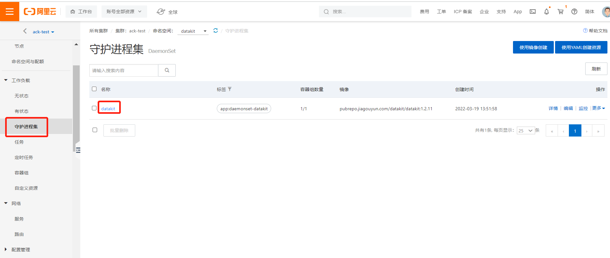

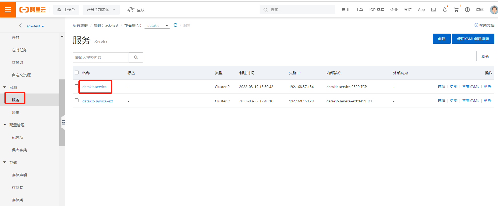

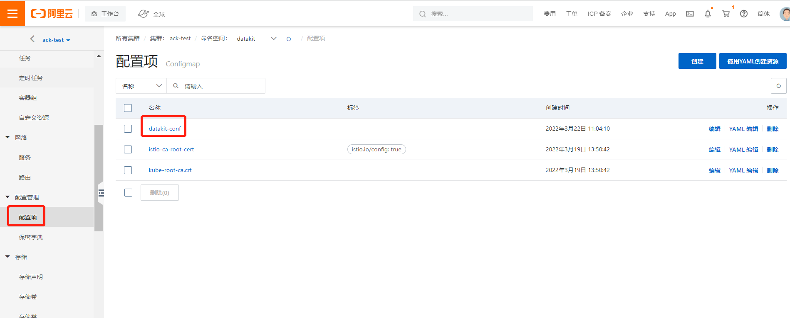

## 步骤八 映射 DataKit 服务

新增 ASM 时，如果选择了**自行搭建 Zipkin**，则链路数据会被打到 **zipkin.istio-system** 的 Service上，且上报端口是 9411，由于 DataKit 服务的名称空间是 datakit，端口是 9529，所以这里需要做一下转换，详情请参考[Kubernetes 集群使用 ExternalName 映射 DataKit 服务](../cloud-native/kubernetes-external-name)。创建后的 Service 如下图：


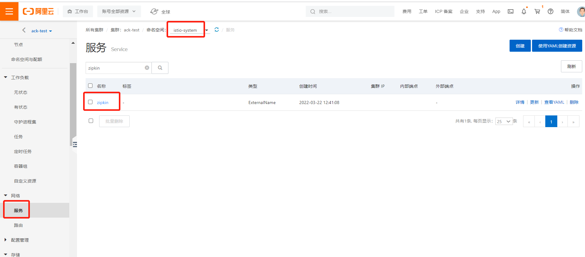

**说明** 如果不使用 ExternalName 映射 DataKit 服务，也可以使用在 POD 上增加 annotations 的方式，即使用下面的方式指定 DataKit 的服务地址。

```yaml
      annotations:
        proxy.istio.io/config: |
          tracing:
            zipkin:
              address: datakit-service.datakit.svc.cluster.local:9529
```

完整的 productpage 部署文件如下，仅供参考。

```yaml
apiVersion: apps/v1
kind: Deployment
metadata:
  name: productpage-v1
  namespace: default
spec:
  progressDeadlineSeconds: 600
  replicas: 1
  revisionHistoryLimit: 10
  selector:
    matchLabels:
      app: productpage
      version: v1
  strategy:
    rollingUpdate:
      maxSurge: 25%
      maxUnavailable: 25%
    type: RollingUpdate
  template:
    metadata:
      annotations:
        proxy.istio.io/config: |
          tracing:
            zipkin:
              address: datakit-service.datakit.svc.cluster.local:9529
      labels:
        app: productpage
        version: v1
    spec:
      containers:
        - image: 'docker.io/istio/examples-bookinfo-productpage-v1:1.16.2'
          imagePullPolicy: IfNotPresent
          name: productpage
          ports:
            - containerPort: 9080
              protocol: TCP
          resources: {}
          securityContext:
            runAsUser: 1000
          terminationMessagePath: /dev/termination-log
          terminationMessagePolicy: File
          volumeMounts:
            - mountPath: /tmp
              name: tmp
      dnsPolicy: ClusterFirst
      restartPolicy: Always
      schedulerName: default-scheduler
      securityContext: {}
      serviceAccount: bookinfo-productpage
      serviceAccountName: bookinfo-productpage
      terminationGracePeriodSeconds: 30
      volumes:
        - emptyDir: {}
          name: tmp
```

## 步骤九 访问应用

在第二步配置入口网关时，有一个入口 IP，使用 [http://120.55.180.137/productpage](http://120.55.180.137/productpage) 就可以访问应用了。

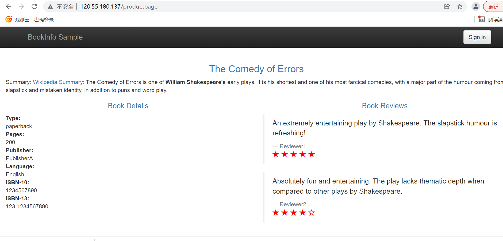

## 步骤十 开启 RUM

上述的部署中应用是可以启动的，如果想使用观测云的用户访问监测，需要重新制作 productpage 镜像。 

##### 1 新建应用  

登录 [观测云](https://console.guance.com/)，【用户访问监测】-> 新建应用 **ack-productpage** 。
		 
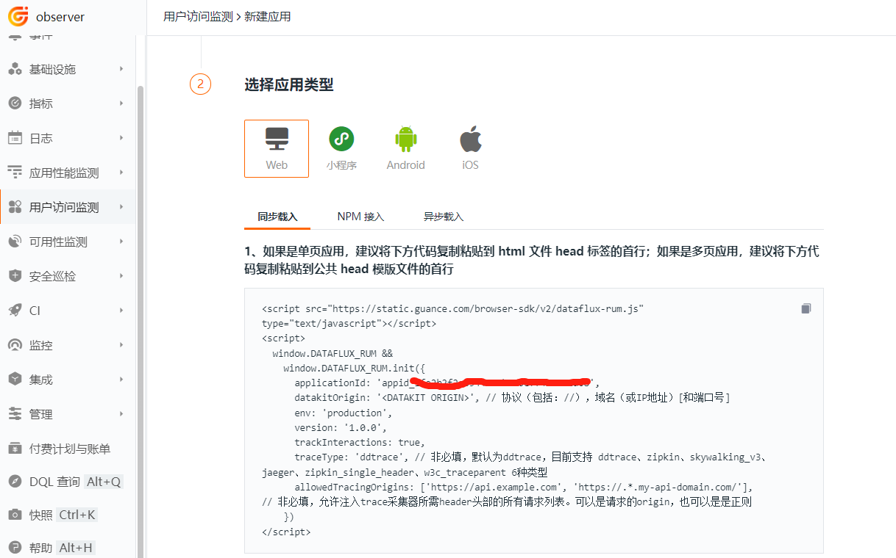

##### 2 制作 productpage 镜像 

下载 [istio-1.13.2.zip](https://github.com/istio/istio/releases)。解压后，把上面的 JS 复制到 **istio-1.13.2\samples\bookinfo\src\productpage\templates\productpage.html** 文件中，并修改<DATAKIT ORIGIN> 为外网可访问的 DataKit 地址。
		


参数说明

- applicationId：应用 id。
- datakitOrigin：是用户可访问到的 datakit 的地址或域名。
- env：必填，应用所属环境，是 test 或 product 或其他字段。
- version：必填，应用所属版本号。
- allowedDDTracingOrigins：RUM 与 APM 打通，配置后端服务器地址或域名。
- trackInteractions：用户行为统计，例如点击按钮，提交信息等动作。
- traceType：非必填，默认为ddtrace，目前支持 ddtrace、zipkin、skywalking_v3、jaeger、zipkin_single_header、w3c_traceparent 6种类型。

##### 3 推送镜像到镜像仓库

修改完成后，执行下面命令推送镜像到镜像仓库，您在使用时请换成自己的镜像仓库。

```
cd istio-1.13.2\samples\bookinfo\src\productpage\Dockerfile 
docker build -t 172.168.3.28/product-page:v1  .
docker push 172.168.3.28/product-page:v1
```

##### 4 替换 productpage 镜像

登录[容器服务管理控制台](https://cs.console.aliyun.com/?spm=a2c4g.11186623.0.0.1b483e068AVz8k)，进入集群，单击**工作负载 > 无状态**，找到 productpage，单击**编辑，**替换镜像，点击**更新**。

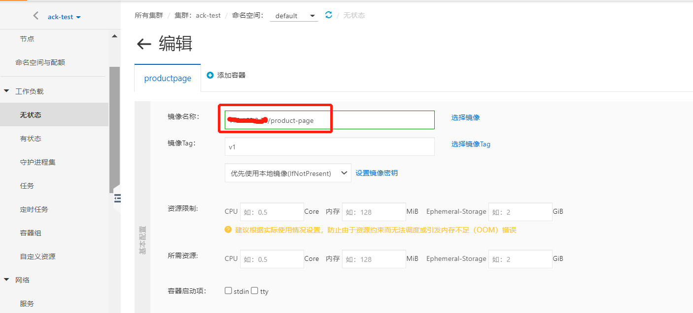

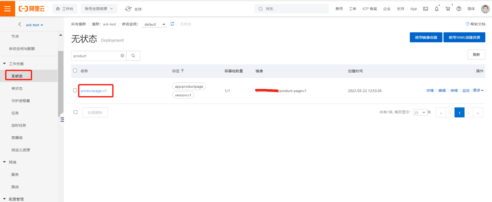

## 步骤十一 可观测

#### 场景

登录 [观测云](https://console.guance.com/)，【场景】->【新建仪表板】-> 选择 **阿里云 ASM Workload 监控视图**
**阿里云 ASM Mesh 监控视图**
**阿里云 ASM Control Plane 监控视图**
		  
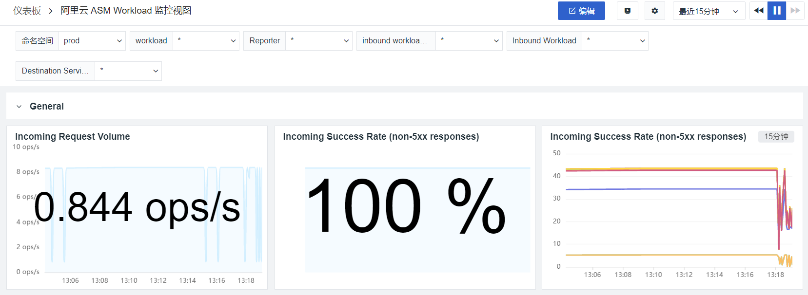

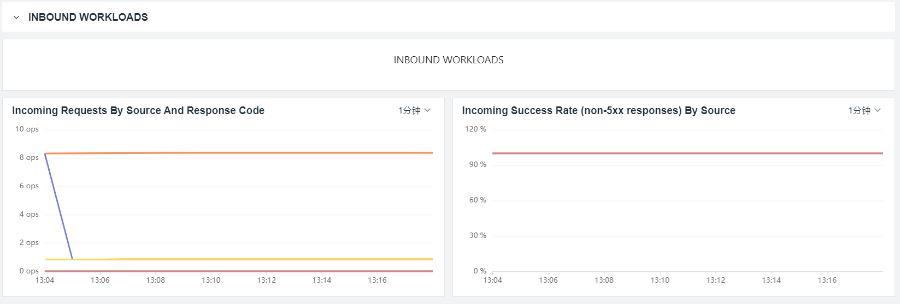


#### 链路

##### APM

登录 [观测云](https://console.guance.com/)，进入**应用性能监测**。
		  
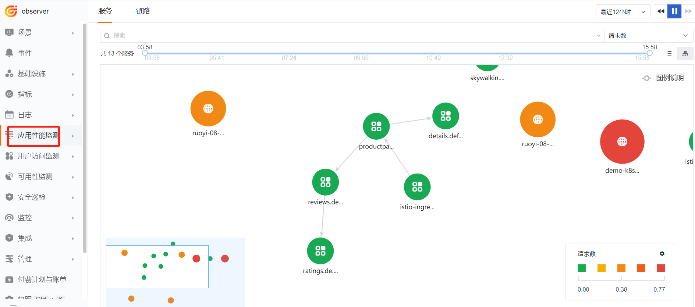

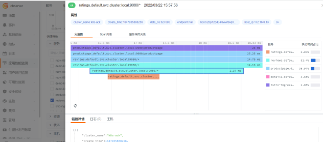

##### RUM

登录 [观测云](https://console.guance.com/)，**用户访问监测**。
		
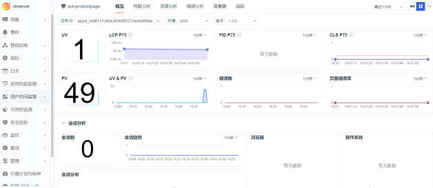

## 日志

本次部署未涉及到日志，如您的应用需要采集日志，请参考：

[Pod 日志采集最佳实践](../cloud-native/pod-log)

[Kubernetes 集群中日志采集的几种玩法](../cloud-native/k8s-logs)

参考文献：<br />[https://help.aliyun.com/document_detail/149552.html](https://help.aliyun.com/document_detail/149552.html)


