# 腾讯云产品可观测最佳实践 (Function)

---

> *作者： 范俊*

## 基本概述

腾讯云产品众多，通常使用腾讯云-云监控对腾讯云资源和互联网应用进行监控，但是云监控的指标数据有限，更多内容需要通过编写代码的方式才能够获取。观测云使用 DataFlux Func 脚本市场可以非常快速的接入腾讯云数据 (腾讯云-云监控 API + 腾讯云产品 API )，更为丰富的指标数据，为系统稳定、定位问题提供技术支撑。

## 前置条件

1、 服务器 <[安装 DataKit](/datakit/datakit-install.md)>

登录观测云，点击 **集成** - **Datakit**，复制安装命令至服务器运行即可 (其中 token 为该工作空间唯一标识)

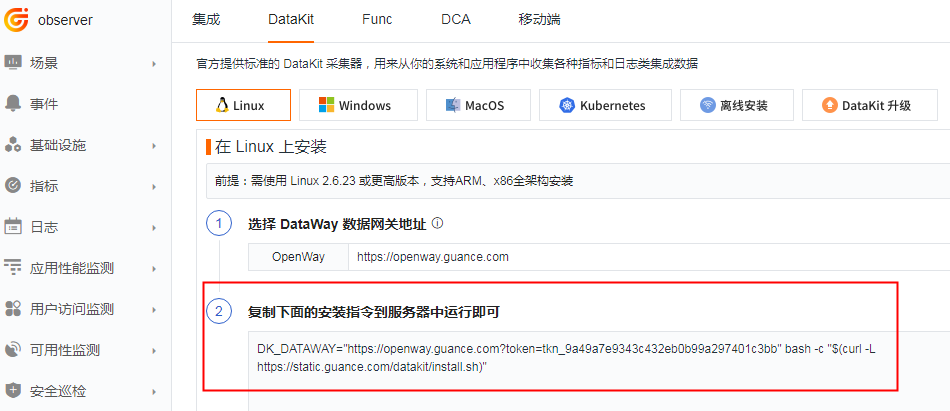

2、 服务器 <[安装 Func 携带版](/dataflux-func/quick-start.md)>

登录观测云，点击 **集成** - **Func**，下载脚本并执行安装命令即可

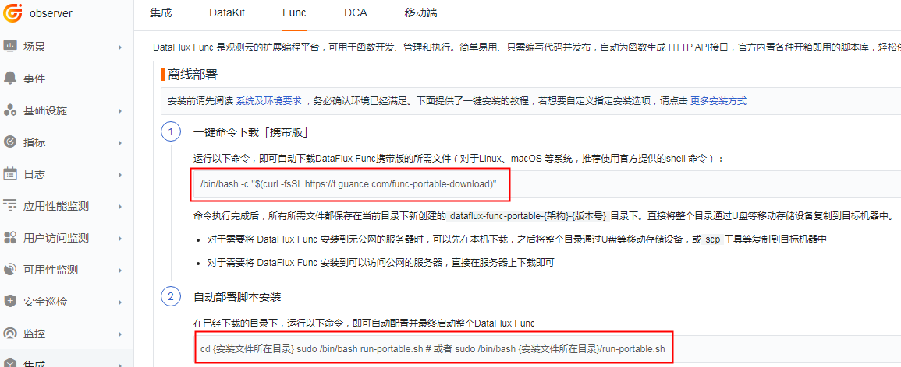

3、 腾讯云访问管理进行授权

1. 登录访问授权控制台 [https://console.cloud.tencent.com/cam ](https://console.cloud.tencent.com/cam)
2. 新建用户：用户 - 用户列表 - 新建用户
       ⅰ. 访问方式：控制台访问 & 编程访问
       ⅱ. 用户权限：ReadOnlyAccess

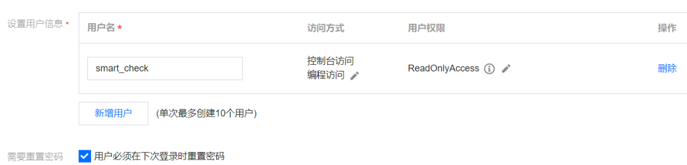

4、 新建秘钥：选择该用户 - API 秘钥 - 新建秘钥 (SecretId 和 SecretKey 配置文件会用到)
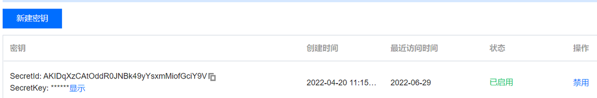

## 安装配置

### 脚本市场

1、 登录 DataFlux Func，地址 http://ip:8088 (默认密码 admin/admin，请自行修改)
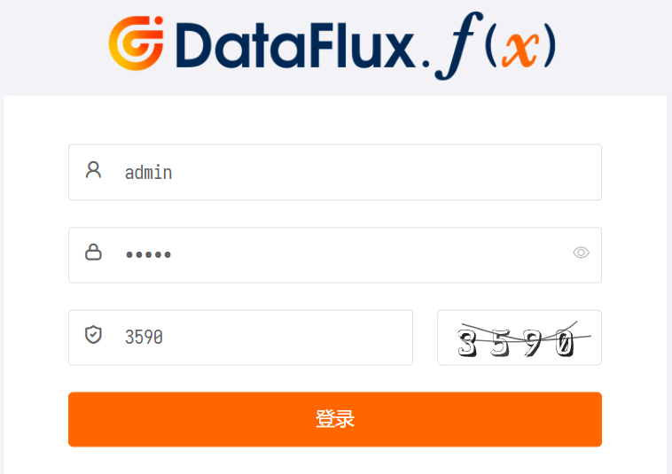  
2、 开启脚本市场，**管理** - **实验性功能** - **开启脚本市场模块**
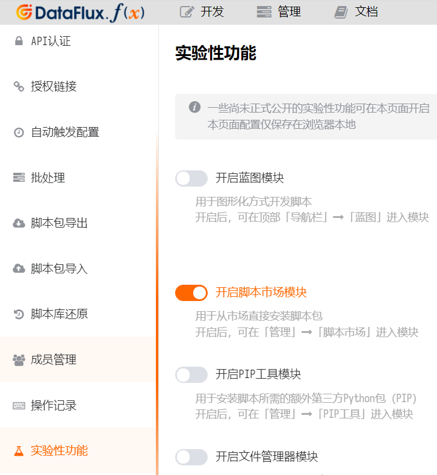  
3、 依次添加脚本集

   1. 观测云集成 (核心包)
   1. 观测云集成 (腾讯云-云监控)
   1. 观测云集成 (腾讯云-产品xxx)

_注：在安装「核心包」后，系统会提示安装第三方依赖包 pip，按照正常步骤点击安装即可_

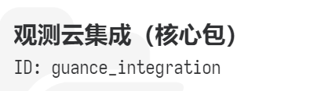

4、 脚本安装完成后，可以在脚本库中看到所有脚本集

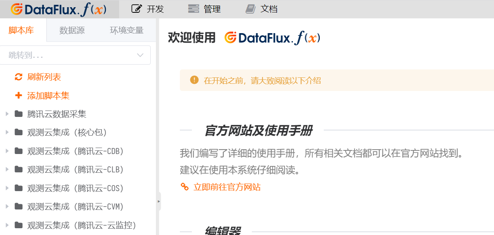

## 编写代码

1、 **开发** - **脚本库** - **添加脚本集**


2、 点击该脚本集 - **添加脚本**

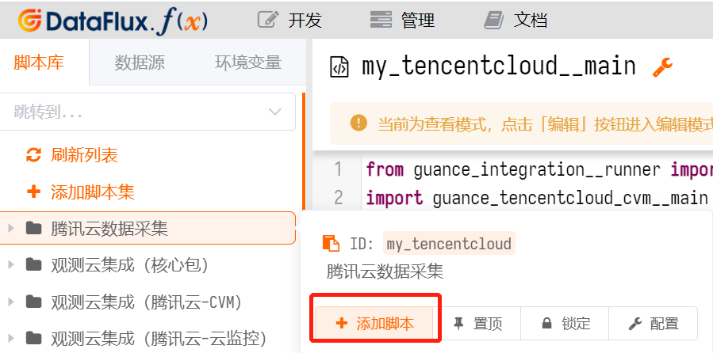

3、 创建 ID 为 main 的脚本

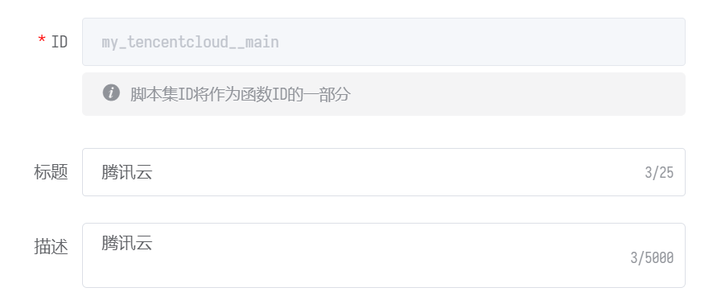

4、 添加数据采集代码 

主要参数说明：

- import guance_aliyun_xxx：引入脚本市场里的脚本集
- ak_id：访问管理里的 SecretId
- ak_secret：访问管理里的 SecretKey
- account_name：自定义的账号名称 (最终会作为指标标签 tag，用于筛选)
- regions：腾讯云产品对应的 [地域](https://cloud.tencent.com/document/api/248/30346) (可以填写多个地域)
- namespace：腾讯云-云监控官方定义，用于区分产品
- metrics：腾讯云-云监控指标 (可以填写 ALL，或者自定义指标)
- collectors：对象采集器 (腾讯云产品 API 获取)

_注：腾讯云-云监控采集器必须写在末尾 (tencentcloud_monitor.DataCollector)_

``` bash
from guance_integration__runner import Runner                      # 引入启动器
import guance_tencentcloud_clb__main as tencentcloud_clb           # 引入腾讯云clb采集器
import guance_tencentcloud_cvm__main as tencentcloud_cvm           # 引入腾讯云cvm采集器
import guance_tencentcloud_cdb__main as tencentcloud_cdb           # 引入腾讯云cdb采集器
import guance_tencentcloud_cos__main as tencentcloud_cos           # 引入腾讯云cos采集器
import guance_tencentcloud_monitor__main as tencentcloud_monitor   # 引入腾讯云云监控采集器

# 账号配置
account = {
    'ak_id'     : 'AccessKey ID',
    'ak_secret' : 'AccessKey Secret',
    'extra_tags': {
        'account_name': 'Account Name',
    }
}

# 由于采集数据较多，此处需要为函数指定更大的超时时间（单位秒）
@DFF.API('执行云资产同步', timeout=300)
def run():
    regions = ['ap-shanghai']
    
    # 采集器配置
    common_tencentcloud_configs = {
        'regions': regions,
    }

    monitor_collector_configs = {
        'regions': regions,
        'targets': [
            {
                'namespace': 'QCE/CVM',
                'metrics'  : 'ALL',
            },
            {
                'namespace': 'QCE/CDB',
                'metrics'  : 'ALL',
            },
            {
                'namespace': 'QCE/LB_PUBLIC',
                'metrics'  : 'ALL',
            },
            {
                'namespace': 'QCE/LB_PRIVATE',
                'metrics'  : 'ALL',
            },
            {
                'namespace': 'QCE/COS',
                'metrics'  : 'ALL',
            },
        ],
    }

    # 创建采集器
    collectors = [
        tencentcloud_clb.DataCollector(account, common_tencentcloud_configs),
        tencentcloud_cvm.DataCollector(account, common_tencentcloud_configs),
        tencentcloud_cos.DataCollector(account, common_tencentcloud_configs),
        tencentcloud_cdb.DataCollector(account, common_tencentcloud_configs),
        tencentcloud_monitor.DataCollector(account, monitor_collector_configs),
    ]

    # 启动执行
    Runner(collectors).run()
```

5、 点击** 保存 **配置并 **发布** (发布后才能添加定时任务)

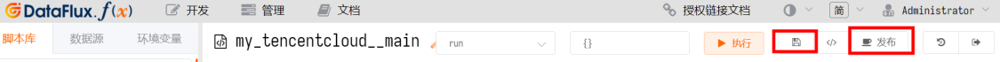
## 定时任务

1、添加自动触发任务，**管理** - **自动触发配置** - **新建任务**

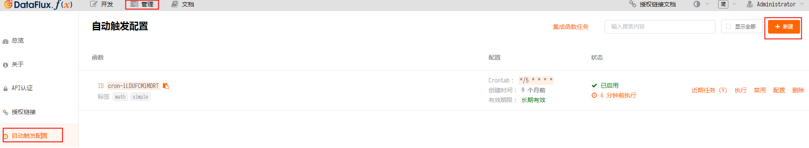

2、自动触发配置，执行函数中添加此脚本，执行频率默认为 **五分钟 */5 * * * ***

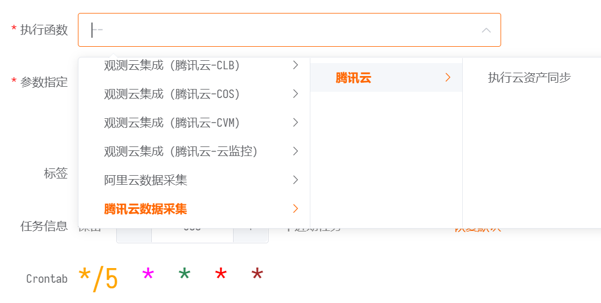

3、数据验证，登录观测云，通过 **指标** 查看数据是否已正常上报

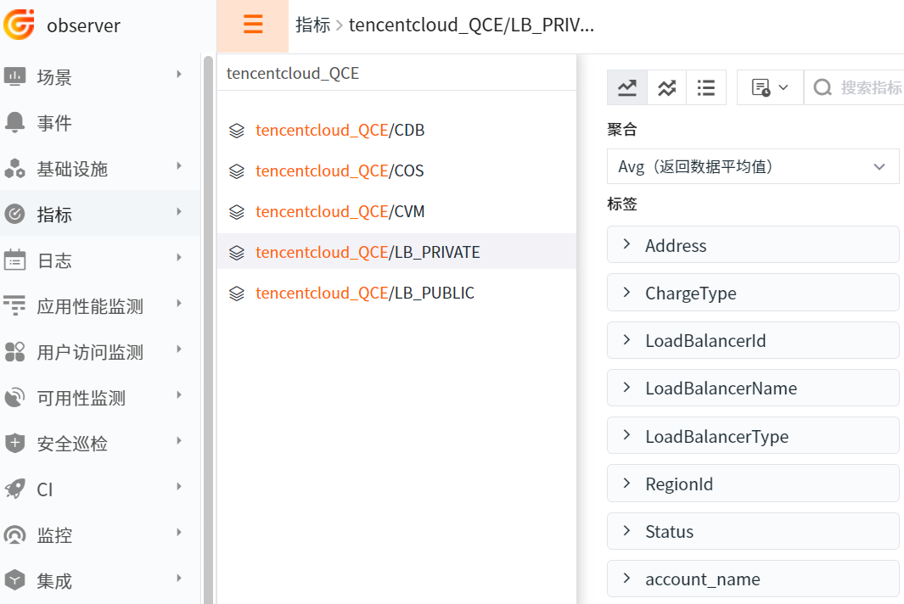

## 场景视图
登录观测云，**场景** - **新建仪表板 **- **内置模板库** - **腾讯云产品 xxx，**即可查看对应视图模板

示例为 腾讯云 CVM

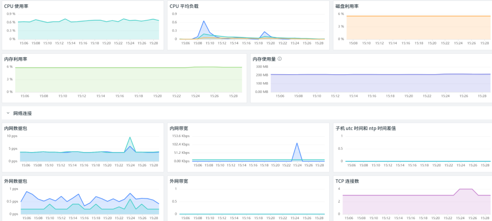

## 监控规则
登录观测云，**监控** - **模板新建** - **腾讯云产品 xxx 检测库**，即可添加对应规则模板

示例为 腾讯云 CDB 检测库

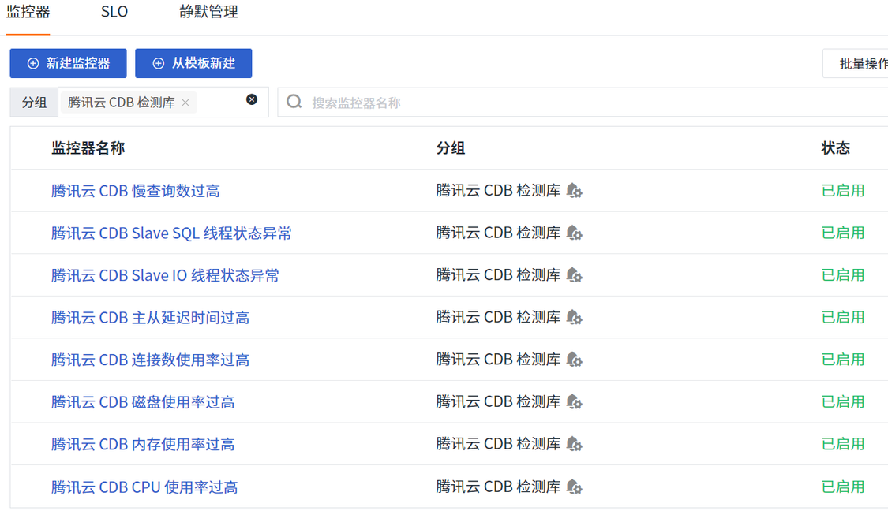

## 进一步阅读

- [腾讯云-云监控指标概览](https://cloud.tencent.com/document/product/248/6843)

- [DataFlux Func 观测云集成简介](/dataflux-func/script-market-guance-integration/)

- [DataFlux Func 腾讯云-云监控配置手册](/dataflux-func/script-market-guance-tencentcloud-monitor/)
