# 观测云 VS ELK、EFK

---

## ELK、EFK和观测云概述

随着现在各种软件系统的复杂度越来越高，通常日志由服务器生成，输出到不同的文件中，一般会有系统日志、 应用日志、安全日志。这些日志分散地存储在不同的机器上。通常当系统发生故障时，工程师需要登录到各个服务器上，使用 grep / sed / awk 等 Linux 脚本工具去日志里查找故障原因。在没有日志系统的情况下，首先需要定位处理请求的服务器，如果这台服务器部署了多个实例，则需要去每个应用实例的日志目录下去找日志文件。每个应用实例还会设置日志滚动策略（如：每天生成一个文件），还有日志压缩归档策略等。这样一系列流程下来，对于我们排查故障以及及时找到故障原因，造成了比较大的麻烦。

当部署到云上时，再想登录各个节点上查看各个模块的 log，基本是不可行了。因为不仅效率低下，而且有时由于安全性，不可能让工程师直接访问各个物理节点。而且现在大规模的软件系统基本都采用集群的部署方式，意味着对每个 service，会启动多个完全一样的 POD 对外提供服务，每个 container 都会产生自己的 log，仅从产生的 log 来看，你根本不知道是哪个 POD 产生的，这样对查看分布式的日志更加困难。

因此，如果我们能把这些日志集中管理，并提供集中检索功能，不仅可以提高诊断的效率，同时对系统情况有个全面的理解，避免事后救火的被动。

## ELK

那么，ELK 到底是什么呢？ “ELK”是三个开源项目的首字母缩写，这三个项目分别是：Elasticsearch、Logstash 和 Kibana。Elasticsearch 是一个搜索和分析引擎。Logstash 是服务器端数据处理管道，能够同时从多个来源采集数据，转换数据，然后将数据发送到诸如 Elasticsearch 等“存储库”中。Kibana 则可以让用户在 Elasticsearch 中使用图形和图表对数据进行可视化。

### Elasticsearch

Elasticsearch 是一个基于JSON的分布式搜索和分析引擎。它可以从RESTful Web服务接口访问，并使用模式少JSON(JavaScript对象符号)文档来存储数据。它是基于Java编程语言，这使Elasticsearch能够在不同的平台上运行。使用户能够以非常快的速度来搜索非常大的数据量。

#### 主要特点 

- 分布式的实时文件存储，每个字段都被索引并可被搜索
- 分布式的实时分析搜索引擎
- 可以扩展到上百台服务器，处理PB级结构化或非结构化数据

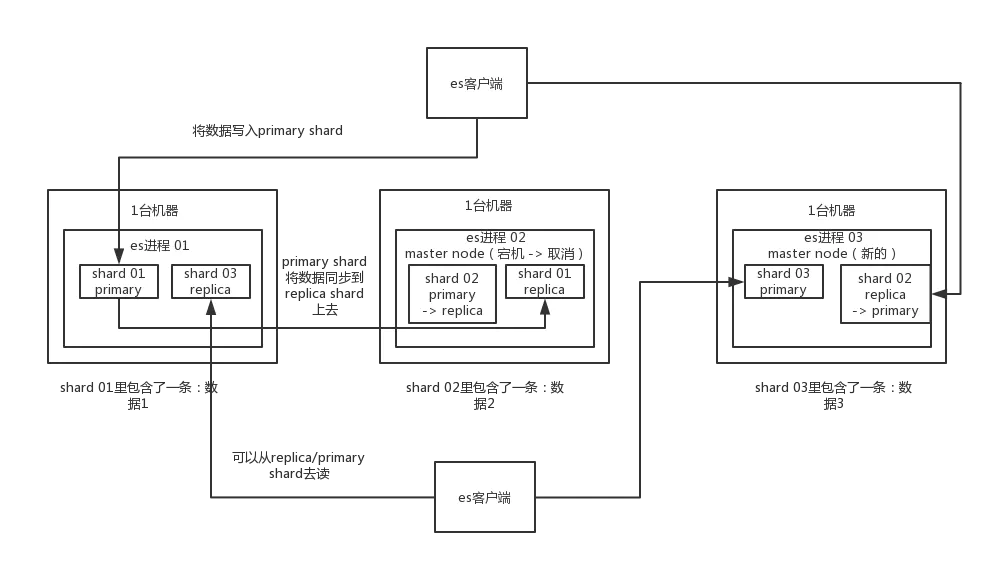

### Logstash

它是用于数据流的开源流式ETL引擎,在几分钟内建立数据流管道,具有水平可扩展及韧性且具有自适应缓冲,具有200多个集成和处理器的插件生态系统,使用Elastic Stack监视和管理部署。

#### 主要特点

- 几乎可以访问任何数据
- 可以和多种外部应用结合
- 支持弹性扩展

#### Logstash组成

- **输入(inputs): **inputs主要用来提供接收数据的规则，比如使用采集文件内容；

- **过滤器(filters):** filters主要是对传输的数据进行过滤，比如使用grok规则进行数据过滤；

- **输出(outputs)：**outputs主要是将接收的数据根据定义的输出模式来进行输出数据，比如输出到ElasticSearch中；

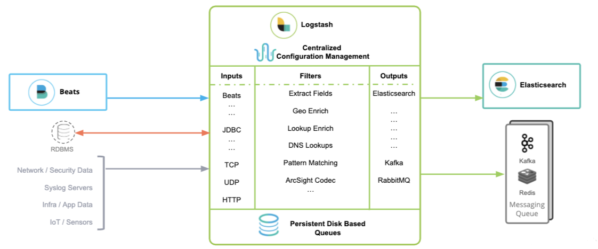
### Kibana

Kibana 是一款开源的数据分析和可视化平台，它是 Elastic Stack 成员之一，设计用于和 Elasticsearch 协作。您可以使用 Kibana 对 Elasticsearch 索引中的数据进行搜索、查看、交互操作。您可以很方便的利用图表、表格及地图对数据进行多元化的分析和呈现。

Kibana 可以使大数据通俗易懂。它很简单，基于浏览器的界面便于您快速创建和分享动态数据仪表板来追踪 Elasticsearch 的实时数据变化。

## EFK

EFK 不是一个软件，而是一套解决方案。EFK 是三个开源软件的缩写，Elasticsearch，Fluentd，Kibana 或 Elasticsearch，Filebeat，Kibana。其中 Elasticsearch 负责日志分析和存储，Fluentd 和 Filebeat 负责日志收集，Kibana 负责界面展示。它们之间互相配合使用，完美衔接，高效的满足了很多场合的应用，是目前主流的一种日志分析系统解决方案。

### Fluentd

fluentd是一个开源的数据收集器，专为处理数据流设计，使用JSON作为数据格式。它采用了插件式的架构，具有高可扩展性高可用性，同时还实现了高可靠的信息转发。在使用上，我们可以把各种不同来源的信息，首先发送给Fluentd，接着Fluentd根据配置通过不同的插件把信息转发到不同的地方，比如文件、SaaS Platform、数据库，甚至可以转发到另一个Fluentd。

#### 主要特点

- 安装方便
- 占用空间小
- 半结构化数据日志记录
- 灵活的插件机制
- 可靠的缓冲
- 日志转发

#### Fluentd组成

Fluentd的Input／Buffer／Output非常类似于Flume的Source／Channel／Sink。

- **Input：**Input负责接收数据或者主动抓取数据。支持syslog，http，file tail等。

- **Buffer：**Buffer负责数据获取的性能和可靠性，也有文件或内存等不同类型的Buffer可以配置。

- **Output：**Output负责输出数据到目的地例如文件，AWS S3或者其它的Fluentd。

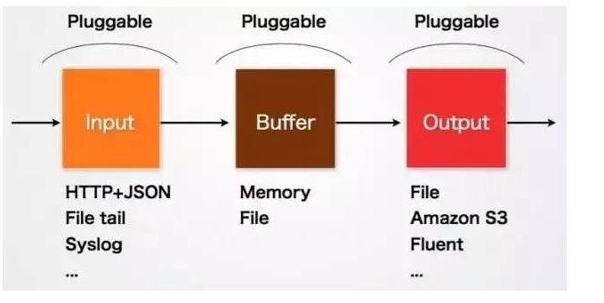
### Filebeat

Filebeat 是使用 Golang 实现的轻量型日志采集器，也是 Elasticsearch stack 里面的一员。本质上是一个 agent ，可以安装在各个节点上，根据配置读取对应位置的日志，并上报到相应的地方去。
	
Filebeat 的可靠性很强，可以保证日志 At least once 的上报，同时也考虑了日志搜集中的各类问题，例如日志断点续读、文件名更改、日志 Truncated 等。

Filebeat 并不依赖于 ElasticSearch，可以单独存在。我们可以单独使用Filebeat进行日志的上报和搜集。filebeat 内置了常用的 Output 组件, 例如 kafka、ElasticSearch、redis 等，出于调试考虑，也可以输出到 console 和 file 。我们可以利用现有的 Output 组件，将日志进行上报。当然，我们也可以自定义 Output 组件，让 Filebeat 将日志转发到我们想要的地方。

filebeat 其实是 elastic/beats 的一员，除了 filebeat 外，还有 HeartBeat、PacketBeat。这些 beat 的实现都是基于 libbeat 框架。

#### Filebeat 组成

- **采集器harvester：** 采集器 harvester 的主要职责是读取单个文件的内容。读取每个文件，并将内容发送到 the output。 每个文件启动一个 harvester，harvester 负责打开和关闭文件，这意味着在运行时文件描述符保持打开状态。如果文件在读取时被删除或重命名，Filebeat 将继续读取文件。

- **查找器prospector：** 查找器 prospector 的主要职责是管理 harvester 并找到所有要读取的文件来源。如果输入类型为日志，则查找器将查找路径匹配的所有文件，并为每个文件启动一个 harvester。每个 prospector 都在自己的 Go 协程中运行。

> 注：Filebeat prospector只能读取本地文件， 没有功能可以连接到远程主机来读取存储的文件或日志。因为Filebeat 的应用范围十分有限所以在本文中不对Filebeat做过多对比。

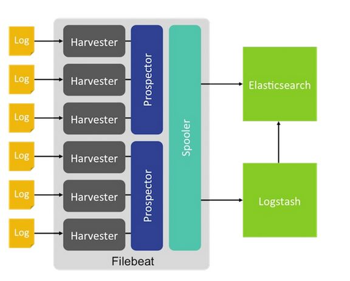

## 观测云

### DataKit

Datakit 是运行在用户本地机器上的一种基础数据采集工具，主要用于采集系统运行的各种指标、日志等数据，将它们汇总给 [观测云](https://guance.com)，在观测云中，用户可以查看并分析自己的各种指标、日志等数据。DataKit 是观测云中至关重要的一个数据采集组件，所有观测云中的数据都是来源于 DataKit。

1. DataKit 主要通过定期采集的方式，采集各种不同的指标，然后定时、定量通过 HTTP(s) 将数据发送给 DataWay。每个 DataKit 都会配置对应的 token，用于标识不同的用户

2. DataWay 收到数据后，转发给观测云，在发给观测云的数据中，带有 API 签名

3. 观测云收到合法的数据后，根据不同的数据类型，分别写入不同的存储中

对于采集类的数据业务，一般情况下，允许部分数据丢失（因为本身数据就是间歇采集的，间歇期内的数据，可视为一种数据丢失），目前整个数据传输链路做了如下丢失保护：

1. DataKit 因为某些网络原因，发送 DataWay 失败，此时 DataKit 会缓存最大一千个点的数据。当缓存的数据超过这个量，这个缓存会被清理掉

2. DataWay 可能因为某些原因，发送观测云失败，或者因为流量较大，来不及发送给观测云，DataWay 会将这些数据持久化到磁盘。后续待流量降低或网络恢复时，再将这些数据发送给观测云。延迟发送的数据，不影响时效性，时间戳是附着在缓存的数据中的。

在 DataWay 上，为保护磁盘，这个磁盘的最大用量也是可以配置的，以免将所在节点的存储撑爆。对于超过用量的数据，DataWay 也是选择丢弃数据。不过这个容量一般设置得比较大。

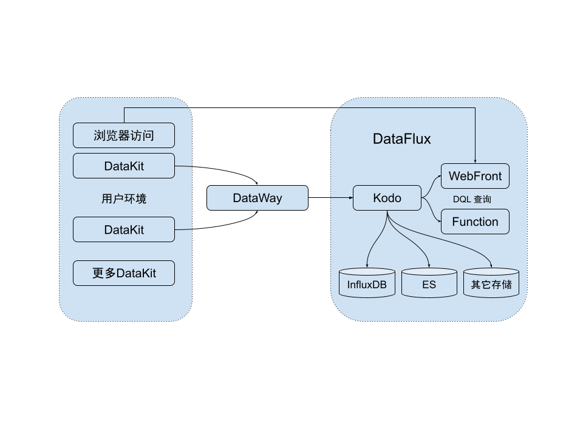

#### DataKit组成

自上往下，DataKit 内部主要分成三层：

-  顶层：包括程序入口模块以及一些公共模块
   - 配置加载模块：DataKit 除了自己的主配置（即 `conf.d/datakit.conf`）之外，各个采集器的配置都是分开配置的，如果放一起，这个配置文件可能非常大，不便于编辑
   - 服务管理模块：主要负责整个 DataKit 服务的管理
   - 工具链模块：DataKit 作为一个客户端程序，除了采集数据之外，还提供了很多其它的周边功能，这些都是在工具链模块实现的，如查看文档、重启服务、更新等
   - Pipeline 模块：在日志处理中，通过 Pipeline 脚本(Grok语法)，实现对日志的切割，将非结构的日志数据，转换成结构化数据。在其它非日志类数据中，也可以进行对应的数据处理
   - 选举模块：当部署的 DataKit 特别多时，用户可以将所有 DataKit 的配置做成一样，然后通过自动化批量部署将配置下发给各个 DataKit。选举模块的意义在于，在一个集群中，某些数据的采集（如 Kubernets 集群指标），**只应有一个** DataKit 实施采集（不然数据重复，且给被采集方造成压力）。在集群中所有 DataKit 配置都一样的情况下，通过选举模块，即可实现任意时间，最多只会有一个 DataKit 实施采集
   - 文档模块：DataKit 的文档随带安装，用户可以访问 http://localhost:9529/man 页面访问文档列表；也可以在命令行浏览文档
-  传输层：负责几乎所有数据的输入输出 
   - HTTP 服务模块：DataKit 支持第三方数据的接入，比如 Telegraf/Prometheus，后续还可以接入更多的数据源。目前这些数据都是通过 HTTP 接入
   - IO 模块：各个数据采集插件，每次采集完成后，都会将数据发送给 IO 模块。IO 模块封装了统一的数据构建、处理和发送接口，便于接入各个采集器插件采集的数据。另外，IO 模块会以一定的节奏（定期、定量），通过 HTTP(s) 将数据发送给 DataWay
-  采集层：负责各种数据的采集。按照采集的类型，分成两类： 
   - 主动采集型：这类采集器按照配置的固定频率来采集，比如 CPU、网卡流量、云拨测等
   - 被动采集型：这类采集器通常是以外部数据输入来实现采集，比如 RUM、Tracing等。它们一般运行在 DataKit 之外，可通过 DataKit 开放的数据上传 API，对数据经过一定的标准化处理，然后再上传到观测云

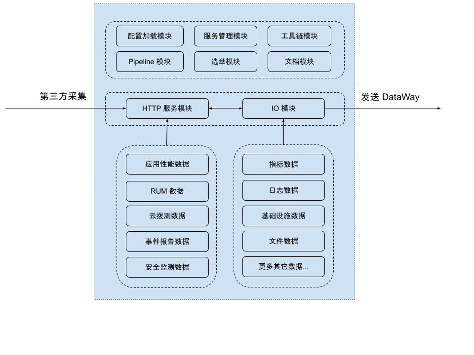
### 观测云平台
基于强大的数据采集能力，“观测云”构建了从基础设施，容器，中间件，数据库，消息队列，应用链路，前端访问，系统安全，网络访问性能全链路的可观测性，基于观测云标准产品，在用户正确的配置了Datakit采集以后，可以很快的实现自己项目的完整可观测性的构建，同时基于行协议（Line Protocol），以及观测云的场景构建能力，用户还可以自定义所需观测的指标方便的整合在一起，实现进一步的可观测性。

“观测云”整体作为一个面向可观测性的完整技术产品，本身存在着非常多的技术门槛，相较于开源的各种方案，观测云从一开始就非常强调整如何有效的降低用户使用产品的学习成本以及提升用户的易用性。因此从DataKit的安装部署，包括所有的可配置能力，“观测云”尽量选择降低用户的配置难度，以符合大部分程序员和运维工程师的习惯，同时提升整个UI的易用度和专业度，让使用者能很快了解产品的用户和其所带来的价值。

## 运行平台比较

Logstash 的原始优势之一是它是用 JRuby 编写的，因此它可以在 Windows 上运行；

Fluentd 直到最近才支持 Windows，因为它不再依赖于以 Linux 平台为中心的事件库，Fluentd 现在支持 Windows。您还可以输入这个in_windows_eventlog 插件来跟踪 Windows 事件日志；

DataKit是由观测云产品官方提供的数据采集器，本身内置多种数据源采集脚本，支持多种数据接入并且支持Windows、Linux、Mac 操作系统，ARM、X86 多系统类型对于日志收集更是做到全平台兼容。

### Logstash

Linux and Windows

### Fluentd

Linux and Windows

### DataKit

全平台支持，并且支持客户端可视化的对配置进行管理，大大降低了安装部署和复杂配置的学习成本

## 事件路由比较

对于事件路由配置来说，Fluentd的方法更具声明性，而Logstash的方法是程序性的。因此接受过过程编程培训的开发人员可能会认为 Logstash 的配置更容易入门。另外Fluentd基于标签的路由允许清晰的表达复杂的路由。但是观测云可以基于完善的产品逻辑及强大产品组件可以做的不需要依赖其他的产品来进行事件告警或数据浏览等功能真正的做到观测闭环，既保证了数据安全又避免了复杂的配置带来了绝佳的用户体验。

## Logstash 事件路由

Logstash将所有数据路由到一个流中，然后使用if-then语句将它们发送到期望的目的地。以下是将生产中的错误事件发送到PagerDuty的示例：

```go
output {
if [loglevel] == "ERROR" and [deployment] == "production" {
pagerduty {
...
}
}
}
```

## Fluentd 事件路由

Fluentd 依赖标签来路由事件。每个Fluentd事件都有一个标签告诉Fluentd要路由到哪里。如果在生产中将错误事件发送到PagerDuty，配置如下:

```go
<source>
  @type forward
</source>

<filter app.**>
  @type record_transformer
  <record>
    hostname "#{Socket.gethostname}"
  </record>
</filter>

<match app.**>
  @type file
  # ...
</match>
```

## DataKit 代理

DataKit 作为观测云强大的产品组件中的一环数据直接将上报至云端观测云平台进行观测分析无需像 LogStash 和 Fluentd 一样还要提供事件路由将数据传送给其他工具进行分析、缓存等等操作，当然 DataKit 为了保障用户数据的安全性同时解决 DataKit 部署在无法访问 Internet 的内部网络环境需要使用代理服务器访问 Internet的情况，DataKit 的代理配置十分简单仅需要开启代理选项即可，通过简单的配置就可以体验丰富的产品功能。

```go
[[inputs.proxy]]
  ## default bind ip address
  bind = "0.0.0.0"
  ## default bind port
  port = 9530
```

## 插件生态系统比较

Logstash、Fluentd和 DataKit都有丰富的插件生态系统，涵盖许多输入系统（文件和TCP/UDP 等）、过滤器（按字段进行切分和过滤）

### [Logstash 插件](https://www.elastic.co/guide/en/logstash/current/input-plugins.html)

Logstash 在 GitHub repo 下管理其所有插件，inputs、filter、output插件总共 200+，由用户共同维护缺乏官方维护托管。


### [Fluentd 插件](https://www.fluentd.org/plugins/all)

Fluentd 中包含 8 种类型的插件--输入，解析器，过滤器，输出，格式化器，存储，服务发现和缓冲区共包含 500+个插件，但是官方只托管其中的 10 个插件，其余的由用户共同维护缺乏官方维护托管和技术栈支持。

### 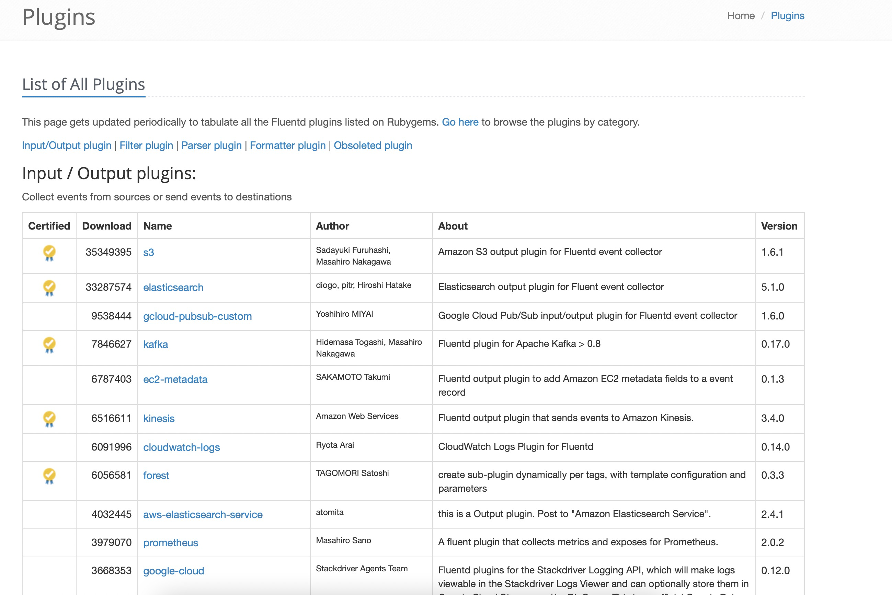

### [DataKit 插件](https://www.yuque.com/dataflux/integrations)

DataKit 中包含强大的内置功能--动态 grok 语法查询调试、基于自研语法 DQL 的快速数据查询、实时的 inputs 采集运行观测、边缘计算能力和可视化客户端方式配置、部署采集源等，同时支持 200+ 官方维护数据源接入和技术栈支持更兼容Telefraf、Beats、Logstash、Fluentd 等多种外部数据接入，对用户来说更友好的是支持客户端可视化的进行插件和 agent 管理并且能实时查看数据收集情况。

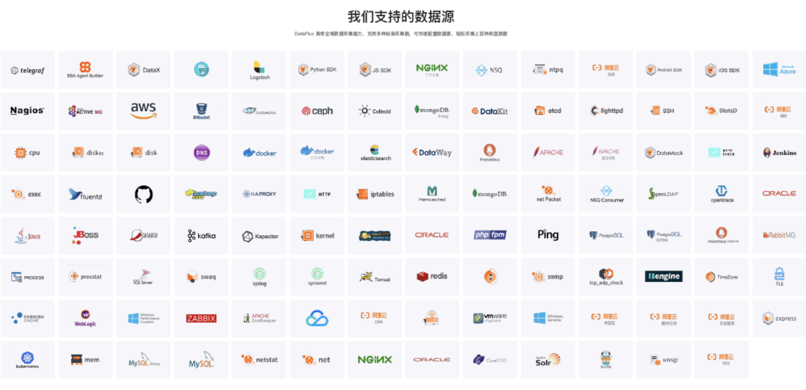

## 队列比较

Logstash缺乏持久性内部消息队列：目前，Logstash有一个内存队列，可以容纳20个事件（固定大小），并依赖Redis等外部队列在重新启动时进行持久化存储。Fluentd 有可以配置的缓冲系统，它可以是内存中的，也可以是磁盘上的，但是配置其可靠性会比较复杂。DataKit 内置缓存机制，可以根据服务器配置仅更改简单的参数从而达到数据缓存的效果。 

### Logstash 队列

由于 Logstash 缺乏内置持久性的消息队列，内置的队列模型十分简单需要外置 Redis 等外部队列来保障持久化

### [Fluentd 队列](https://docs.fluentd.org/buffer/file)

相对于 Logstash 来讲 Fluentd内置可靠性，但配置比较复杂，用户学习成本较为高昂。

### Datakit队列

DataKit内置缓存机制，当部署 DataKit 的服务器因为某些网络原因发送至 DataWay 失败，此时 DataKit 会默认缓存最大一千个点的数据来防止数据丢失，也可以通过需改 DataKit 配置文件来控制最大缓存量，配置简单并且使用门槛底，几乎 0 学习成本。

## 日志解析比较

日志分析在企业内部是一项很基础的核心技术，不光运用在安全团队中，还运用在IT研发团队、业务团队中。从安全来看，安全团队提取日志分析主要是为了发现未知安全事件、对已知的安全事件进行溯源分析。还有另外一个很重要的目的是国家层面的监管合规要求；从IT研发来看，企业内部的非安全技术团队做日志分析主要也是为了发现位置问题、分析已知问题，主要集中在：系统监控、APM(APM包含了研发团队关注的所有监控项)；从业务来看，业务团队对于日志分析的需求，更多集中在风险控制、运营推广、用户画像、网站画像等方面。所以说日志躺在硬盘中毫无价值，通过日志分析技术能实现日志信息的价值化。日志价值体现程度越高，也能变相反映公司的技术实力。

常用的 Logstash 包含grok解析并构造任意文本、mutate对事件字段执行常规转换、drop完全删除事件、clone制作事件的副本、geoip添加有关IP地址的地理位置的信息等常用解析器；Fluentd 日志解析常用操作则是通过搜索一个或多个字段的值来过滤事件、通过添加新字段来丰富事件、删除或屏蔽某些字段以保护隐私和合规性。而插件相对来说就少了一些仅有五个插件分别是record_transformer、filter_stdout、filter_grep、parser、filter_geoip；DataKit 日志解析包含了 Pipeline 用于切割非结构化的文本数据，或者用于从结构化的文本中(如 JSON)提取部分信息、使用 glob 规则更方便地指定日志文件，以及自动发现和文件过滤、易用的交互式 Grok 匹配工具降低 grok 使用门槛、并且支持大量脚本函数可以让数据格式变得更加灵动等更多功能。

### [Logstash 日志解析](https://www.elastic.co/guide/en/logstash/current/filter-plugins.html)
Grok 是目前 Logstash 中将非结构化日志数据解析为结构化和可查询内容的最佳方式，目前 Logstash 内置了 120 种 grok 解析模板但是 Logstash 在 GitHub repo 下管理的 grok 解析模板由用户共同维护，缺乏官方技术支持，包括 grok 模板性能调优等诸多业务需求都需要用户自己来探索。

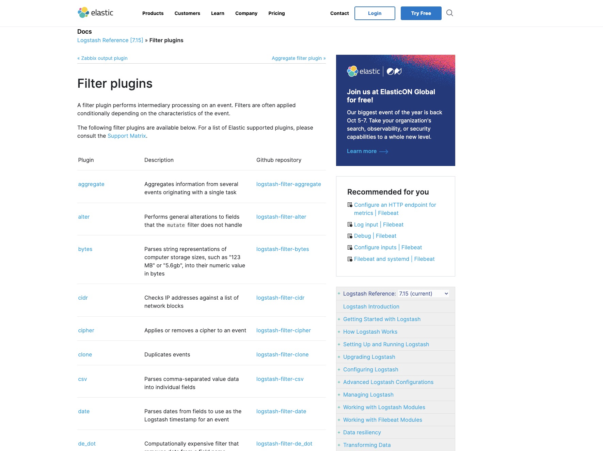

### Fluentd 日志解析

Fluentd 的日志解析形式跟 Logstash 类似但是配置方式更加灵活，但是没有提供相应的 grok 解析模板而是仅仅提供了一些配置示例，还是要用户自己根据文档示例来进行解析功能的自主配置使用相对来说门槛较高，对于配置过程中存在的问题缺乏相应的技术支持更多的可能需要用户自己 Google 解决。

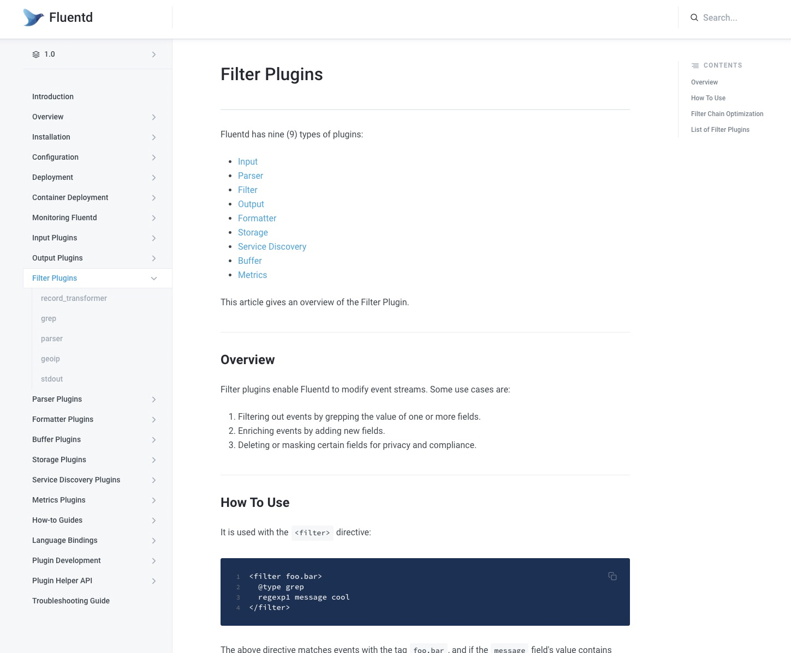

样配置的服务器环境中，以Nginx的access log为样例，如下一条日志365字节，结构化成14个字段：


在接下来的测试中，将模拟不同的压力将该日志重复写入文件，每条日志的time字段取当前系统时间，其它13个字段相同。

相比于实际场景，模拟场景在日志解析上并无差异，有一点区别是：较高的数据压缩率会减少网络写出流量。

### logstash

logstash-7.1.0版本，通过grok解析日志并写出到kafka（内置插件，开启gzip压缩）。

日志解析配置：
```
grok { 
patterns_dir=> "/home/admin/workspace/survey/logstash/patterns"
 
match=>{ "message"=>"%{IPORHOST:ip} %{USERNAME:rt} -
\"%{WORD:method} %{DATA:url}\" %{NUMBER:status} %{NUMBER:size} \"%{DATA:ref}\" \"%{DATA:agent}\" \"%{DATA:cookie_unb}\" \"%{DATA:cookie_cookie2}\" \"%{DATA:monitor_traceid}\" %{WORD:cell} %{WORD:ups} %{BASE10NUM:remote_port}" }
 
remove_field=>[ "message"]
}

```
测试结果：

| **写入TPS** | **写入流量 (KB/s)** | **CPU使用率 (%)** | **内存使用 (MB)** |
| --- | --- | --- | --- |
| 500 | 178.89 | 25.3 | 432 |
| 1000 | 346.65 | 46.9 | 476 |
| 5000 | 1882.23 | 231.1 | 489 |
| 10000 | 3564.45 | 511.2 | 512 |

### fluentd

td-agent-4.1.0 版本，通过正则表达式解析日志并写入kafka（第三方插件fluent-plugin-kafka，开启gzip压缩）。

日志解析配置：

```
<source>
type tail
format /^(? <ip>\S+)\s(?<rt>\d+)\s-\s\[(?<time>[^\]]*)\]\s"(?<url>[^\"]+)"\s(?<status>\d+)\s(?<size>\d+)\s"(?<ref>[^\"]+)"\s"(?<agent>[^\"]+)"\s"(?<cookie_unb>\d+)"\s"(?<cookie_cookie2>\w+)"\s"(?
<monitor_traceid>\w+)"\s(?<cell>\w+)\s(?<ups>\w+)\s(?<remote_port>\d+).*$/
time_format %d/%b/%Y:%H:%M:%S %z
path /home/admin/workspace/temp/mock_log/access.log 
pos_file /home/admin/workspace/temp/mock_log/nginx_access.pos
tag nginx.access 
</source>

```
测试结果：

| **写入TPS** | **写入流量 (KB/s)** | **CPU使用率 (%)** | **内存使用 (MB)** |
| --- | --- | --- | --- |
| 500 | 174.272 | 13.8 | 58 |
| 1000 | 336.85 | 24.4 | 61 |
| 5000 | 1771.43 | 95.3 | 103 |
| 10000 | 3522.45 | 140.2 | 140 |

### DataKit

**DataKit-**1.1.8-rc3，通过 Pipeline 切割非结构化的文本数据。
```
# access log
grok(_, "%{NOTSPACE:ip} %{NOTSPACE:rt} - "%{NOTSPACE:method} %{NOTSPACE:url}\" %{NOTSPACE:status} %{NOTSPACE:size} \"%{NOTSPACE:ref}\" \"%{NOTSPACE:agent}\" \"%{NOTSPACE:cookie_unb}\" \"%{NOTSPACE:cookie_cookie2}\" \"%{NOTSPACE:monitor_traceid}\" %{NOTSPACE:cell} %{NOTSPACE:ups} %{NOTSPACE:remote_port}"）

cast(status_code, "int")
cast(bytes, "int")

default_time(time)
```
测试结果：

| **写入TPS** | **写入流量 (KB/s)** | **CPU使用率 (%)** | **内存使用 (MB)** |
| --- | --- | --- | --- |
| 500 | 178.24 | 8.5 | 41 |
| 1000 | 356.45 | 13.8 | 45 |
| 5000 | 1782.23 | 71.1 | 76 |
| 10000 | 3522.45 | 101.2 | 88 |

## 日志收集架构对比
### ELK 方案
#### 方案一
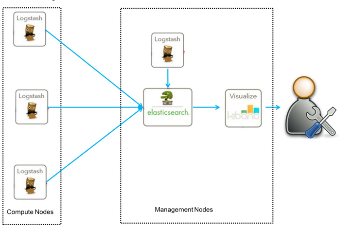

这是最简单的一种ELK架构方式。优点是搭建简单，易于上手。缺点是Logstash耗资源较大，运行占用CPU和内存高。另外没有消息队列缓存，存在数据丢失隐患。需要使用人员对 Logstash 、 ElasticSearch 和 Kibana足够精通，才可以进行熟练的运用解决各种复杂的业务问题，并且 LogStash 集群和 ElasticSearch 集群的维护人员也要对集群的性能优化以及资源管理足够精通才能保障我们的业务可以正常运行。

此架构由Logstash分布于各个节点上搜集相关日志、数据，并经过分析、过滤后发送给远端服务器上的Elasticsearch进行存储。Elasticsearch将数据以分片的形式压缩存储并提供多种API供用户查询，操作。用户亦可以更直观的通过配置Kibana Web方便的对日志查询，并根据数据生成报表。

#### 方案二
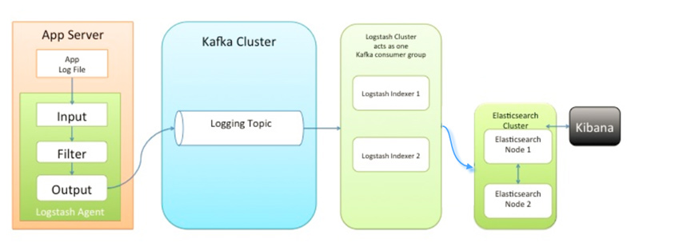

这是一种相对成熟的 ELK架构。优点是引入了 Kafka 即使远端 Logstash 集群因为故障停止运行的情况下，数据也会先被存储下来，从而避免数据的丢失。缺点是搭建复杂，技术栈复杂相对难以快速上手，且Logstash耗资源较大，运行占用CPU和内存高。需要额外维护一套 Kafka 集群大型场景可能还需要额外维护一套 Zookeeper 集群。需要使用人员对 Logstash 、 ElasticSearch 、Kafka 和 Kibana足够精通，才可以进行熟练的运用并解决各种复杂的业务问题，并且 LogStash 集群、Kafka 集群和 ElasticSearch 集群的维护人员也要对集群的性能优化以及资源管理足够精通才能保障我们的业务可以正常运行。

此种架构引入了消息队列机制，位于各个节点上的Logstash Agent先将数据/日志传递给Kafka（或者Redis），并将队列中消息或数据间接传递给Logstash，Logstash过滤、分析后将数据传递给Elasticsearch存储。最后由Kibana将日志和数据呈现给用户。因为引入了Kafka（或者Redis）,所以即使远端Logstash server因故障停止运行，数据将会先被存储下来，从而避免数据丢失。

### EFK 方案

#### 方案一

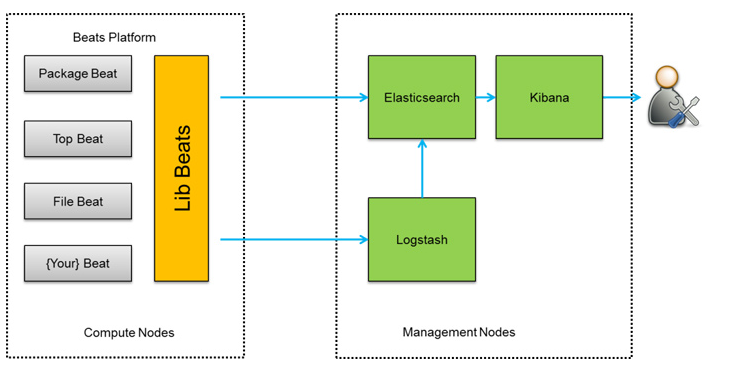

这是一种更加灵活的EFK 架构。 优点是更加灵活，资源消耗相对于 Logstash 更少，扩展性更强。缺点是日志上报至 LogStash 集群进行集中处理需要庞大的 LogStash 集群提供算力支持，而且需要使用人员对 Logstash 、 ElasticSearch 和 Kibana足够精通，才可以进行熟练的运用解决各种复杂的业务问题，并且 LogStash 集群和 ElasticSearch 集群的维护人员也要对集群的性能优化以及资源管理足够精通才能保障我们的业务可以正常运行。

此种架构将收集端logstash替换为Filebeats，同时可配置Logstash 和Elasticsearch 集群用于支持大集群系统的运维日志数据监控和查询。

#### 方案二


在ELK的基础之上，采用Filebeat做日志采集端。优点是如果像ELK中的架构，Logstash作为日志采集端，那么每台服务器都需要安装JAVA环境，因为Logstash是基于Java环境，才能正常使用。而我们采用的 Filebeat 不需要任何依赖，直接安装后修改配置文件，启动服务即可。缺点是技术栈复杂相对难以快速上手，且Logstash耗资源较大，运行占用CPU和内存高。需要额外维护一套 Kafka 集群大型场景可能还需要额外维护一套 Zookeeper 集群。需要使用人员对 FileBeats、Logstash 、 ElasticSearch 、Kafka 和 Kibana足够精通，才可以进行熟练的运用并解决各种复杂的业务问题，并且 LogStash 集群、Kafka 集群和 ElasticSearch 集群的维护人员也要对集群的性能优化以及资源管理足够精通才能保障我们的业务可以正常运行。

此种架构当收集端采集到日志文件时，在 Filebeat 的input 中我们需要在Filebeat中定义一个 fields，定义一个log_topic的字段，将指定路径下的日志文件分为一类。在 Output 中，我们指定 Output 输入至Kafka。Kafka作为一个消息队列，接收来自Filebeat客户端采集上来的所有日志，并根据不同类型的日志（例如nginx、php、system）分类转发。在Kafka中，我们根据 inout中自定义的日志类型，在kafka中创建不同的topic。Logstash接收来自Kafka消息队列的消息，根据Kafka中不同的topic，将日志分类写入Elasticsearch中；Kibana匹配Elasticsearch中的索引，可以对日志内容分析、检索、出图展示（当然需要自己设计出图了）。

#### 方案三
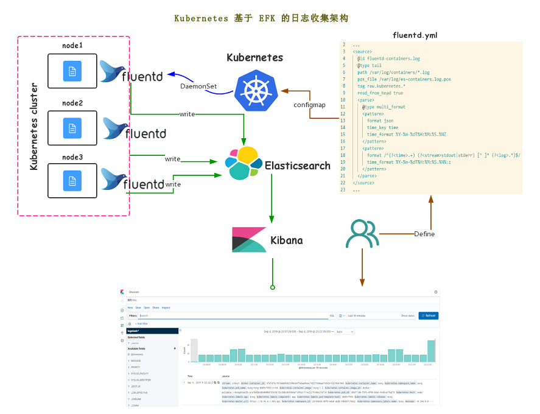 

采用Fluentd做日志采集端。优点是Fluentd 资源占用远小于 LogStash 集群可以让架构变得更为简单灵活。缺点 Fluentd 配置相对复杂使用门槛相对较高难以快速上手，配置文件相对复杂修改起来比较麻烦。需要使用人员对 Fluentd 、 ElasticSearch  和 Kibana足够精通，才可以进行熟练的运用并解决各种复杂的业务问题，并且  ElasticSearch 集群的维护人员也要对集群的性能优化以及资源管理足够精通才能保障我们的业务可以正常运行。

此种架构通过fluentd收集程序的日志，然后将日志存储到elasticsearch集群，最后在kibana上关联elasticsearch，实现日志的查询。

### 观测云架构
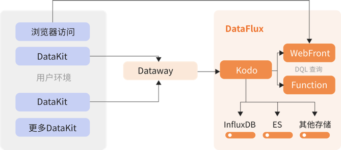

采集 Datakit 作为基础数据采集工具，主要用于采集系统运行的各种指标、日志等数据，通过 Dataway 将它们汇总给观测云，在观测云中，用户可以查看并分析自己的各种指标、日志等数据。DataKit 是观测云中至关重要的一个数据采集组件，所有观测云中的数据都是来源于 DataKit。

DataKit 部署配置极为简单明了并且可以通过可视化的客户端帮助用户管理 DataKit。DataKit 不仅仅可以收集日志数据更包含了 APM 数据、基础设施、容器、中间件、网络性能等等。DataKit 不需要像 LogStash 和 Fluentd 一样依赖如 ElasticSearch，Kafka 等组件来做业务功能补足，观测云完全不需要考虑这些问题用户可以真正的做到只关心自己的业务优化。DataKit 不需要使用人员掌握庞杂的技术栈付出高昂的学习成本，仅需要简单配置就可以搭配观测云来解决各种复杂的业务问题了。ELK 和 EFK 整体运维成本巨大，光 ElasticSearch 集群就需要大量的费用，如果同时考虑冷热数据以节约成本也会令人头痛，使用观测云则无需考虑这些问题只要把注意力都集中到业务上就可以了。

## 硬件成本对比

价格是大家都非常关心的一个因素，我们采用云服务来对比ELK、EFK、和观测云之间的成本。

### ELK 成本

Elastic的基本组件都是开源的，主要的费用来源于硬件成本，我们以不同的架构组成采集10台服务器的日志，每台每天1G日志量来统计成本。

LogStash 集群 + Kafka 集群 + ElasticSearch 集群 + Kibana

   - LogStash 集群

| **计费项目** | **值** | **单价** | **费用（元）** |
| --- | --- | --- | --- |
| 服务器 | 1台2核4GB  | 包年包月费用：216.7元/Month | 216.7 |
| 存储 | 50G | ESSD：0.5元/GB | 25 |
| 总计 | <br /> | <br /> | 241.7 |

   - Kafka 集群

| **计费项目** | **值** | **单价** | **费用（元）** |
| --- | --- | --- | --- |
| 服务器 | 3台4核16GB  | 包年包月费用：788元/Month | 2364 |
| 存储 |  200GB | ESSD：0.5元/GB | 300 |
| 总计 | <br /> | <br /> | 2664 |

   - ElasticSearch 集群

| **计费项目** | **值** | **单价** | **费用（元）** |
| --- | --- | --- | --- |
| 服务器 | 3台2 核 8GB | 包年包月费用：383元/Month | 1149 |
| 存储 |  500GB | ESSD：0.5元/GB | 750 |
| 总计 | <br /> | <br /> | 1899 |

   - Kibana 节点

| **计费项目** | **值** | **单价** | **费用（元）** |
| --- | --- | --- | --- |
| 服务器 | 1台1 核 2GB | 包年包月费用：104元/Month | 104 |
| 存储 | 50 GB | ESSD：0.5元/GB | 25 |
| 总计 | <br /> | <br /> | 129 |

按业务规模不大的存储和服务器配置来计价 LogStash + Kafka + ElasticSearch + Kibana 一个月总费用为 5175.4 (元) 。

按简单架构不使用 Kafka 集群 LogStash + ElasticSearch + Kibana 一个月总费用为 2511.4 (元)。

### EFK 成本

Elastic的基本组件都是开源的，主要的费用来源于硬件成本，我们以不同的架构组成采集10台服务器的日志，每台每天1G日志量来计算成本。

Fluentd  + ElasticSearch 集群 + Kibana 

   - Fluentd 

Fluentd 可以不单独作为集群部署顾不考虑 Fluentd 成本，仅计算 ElasticSearch + Kibana

   - ElasticSearch 集群

| **计费项目** | **值** | **单价** | **费用（元）** |
| --- | --- | --- | --- |
| 服务器 | 3台2 核 8GB | 包年包月费用：383元/Month | 1149 |
| 存储 |  500GB | ESSD：0.5元/GB | 750 |
| 总计 | <br /> | <br /> | 1899 |

   - Kibana 节点

| **计费项目** | **值** | **单价** | **费用（元）** |
| --- | --- | --- | --- |
| 服务器 | 1台1 核 2GB | 包年包月费用：104元/Month | 104 |
| 存储 | 50 GB | ESSD：0.5元/GB | 25 |
| 总计 | <br /> | <br /> | 129 |

同样按照相同业务规模来计算存储和服务器配置计价 Fluentd + ElasticSearch + Kibana 一个月总费用为 2028 (元)。

### 观测云成本

观测云本身不收取产品费用仅按照存储使用量进行收费，DataKit 采集器数量、日志类数据数量、备份日志数据数量、每日任务调度次数、单台DataKit时间线、用户访问监测每日session数量、应用性能监测trace数量进行价格统计。同样以采集10台服务器的日志，每台每天1G日志量来计算成本。

| **计费项目／版本** | **体验版** | **敏捷版** |
| --- | --- | --- |
| Datakit 数量 | 不限制数量 | 5元/天 |
| 时间线 | 总时间线<500 | 单台Datakit时间线<500，datakit费用=datakit数量 × 基础单价<br />单台Datakit时间线>500，则datakit数量按如下计算公式获得：<br />- datakit数量=当前工作空间时间线总数量 / 500（最终结果值向上取整）<br />- datakit费用=datakit数量 × 基础单价<br /> |
| 日志类数据数量 | 200万条 | 0.5元/天（每 1 百万条）

 |
| 备份日志数据数量 | 无 | 0.2元/天（每 1 百万条） |
| Trace 数量 | 1万个 | 1元/天（每 1 百万条） |
| Session 数量/ PV 数量 | 100个 Session | 1元/天（每 1 百Session 或 每 1 千个 PV）<br />注意：取上述两个维度实际产生的费用低的那个作为最终费用 |
| 云拨测 API 任务次数 | 5个 | 1 元 / 天 （每 1 千次）<br />注意：统计不包含自建节点产生的API拨测的数据 |
| 云拨测 Browser 任务次数 |  | 15 元 / 天 （每 1 千次）<br />注意：统计不包含自建节点产生的Browser拨测的数据 |
| 任务调度次数 | 5000次 | 1 元 / 天 （每 1 万次） |
| 短信发送次数 | 无 | 0.1 元 / 天 （每次） |

10台服务器安装DataKit，日志采集每台1G每天按照4K每条计算。

| **计费项目** | **值** | **单价** | **费用（元）** |
| --- | --- | --- | --- |
| 服务器 | DataKit 10个 | 包年包月费用：150元/Month | 1500 |
| 存储 | 1g 每天  | 0.5元/天（每 1 百万条） | 325 |
| 总计 | <br /> | <br /> | 1825 |

同样按照相同业务规模来计算观测云一个月总费用为 1825 (元)。

## 运维成本对比

说到运维成本，我们都知道为了保障集群的完整性相关的运维需要时必不可少的，那么我们一起来分析一下不同方案之间的成本差异。

### ELK 运维成本

由于Elastic的基本组件都是开源的，需要自行搭建集群来进行运维管理，针对于复杂架构的ELK可能会包括 LogStash 集群 + Kafka 集群 + ElasticSearch 集群 + Kibana 节点组成，首先如果用户业务日志量大且计算逻辑复杂，那么对于 LogStash 集群、Kafka 集群、ElasticSearch 集群规模和配置要求就很高。其次对于不同规模下的集群对于运维人员的素质要求也很高，规模庞大的集群可能会有各种各样的问题出现并且要对资源利用率达到最大化还要有足够的经验进行性能调优。最后对于运维人员的技术栈要求是必不可少的。

###  EFK 运维成本

跟 ELK 一样 EFK 也是基于开源组件，需要用户自行来搭建集群进行管理，比 ELK 好一点的是 EFK 采用 Fluentd 作为采集器收集数据时可以省去 LogStash 集群而且资源占用更少，但是依然需要根据业务规模来对 ElasticSearch 集群规模进行动态的扩容，同样面临大规模集群下对运维人员的素质要求很高，而且优化困难的问题，并且 Fluentd 的配置相对 LogStash 更加困难只能依靠运维人员的经验来进行配置，如果脚本优化没有做好再进行日志解析时还会对服务器上原有的业务造成冲击，为了保障线上业务的稳定运行对运维人员的要求可能会更高一些。

### 观测云运维成本

观测云是 SaaS 化的可观测平台，对于用户只需要在想要收集数据的服务器上部署一个 DataKit，开启可视化管理功能就可以实现远程可视化的方式来完成对采集端的配置管理，观测云平台可以提供最优的日志解析模板，来帮助用户在保障对服务器压力最小的情况下性能利用可以达到最大的同时通过简单的配置就可以解析好业务日志来让用户可以更专注于业务的优化和扩展，不必再把精力投入到对采集端和日志解析集群的优化上。并且观测云线上提供完整的可观测功能从基础设施，容器，中间件，数据库，消息队列，应用链路，前端访问，系统安全，网络访问性能全链路都可以观测并可以基于业务需求来实现自己的观测场景，不必再将精力放在去研究或者改造不成熟的开源产品，真正做到0运维成本专注于业务发展的效果。

## 学习成本对比

对于日志分析系统的搭建或是使用，其中的学习成本是不可或缺的一环想要用好就得先学好，那么我们看一下不同方案直接上手难度要有多大。

### ELK 学习成本

由于 Elastic 的组件都是开源的，需要自行搭建集群，那么首先对于使用ELK体系对日志进行分析处理时，对于 ELK 的环境准备和ELK的组件配置使用的学习是必不可少的， 比如要先建立起对 ELasticsearch 的认知、掌握 ELasticsearch 基础、掌握 ELasticsearch 索引操作、能对 ELasticsearch 集群做好规划，还要对开源版本的 LogStash、ElasticSearch 要进行一些性能配置上的优化等等。

### EFK 学习成本

跟 ELK 一样 EFK 同样要学习这些内容，而且 Fluentd 相对 LogStash 配置更为灵活相应的学习成本会更高，针对性能的优化也变得更加依赖使用经验，相对于 LogStash 还提供 120+ 的 grok 模板而言，Fluentd 则需要用户参照文档多做一些学习才能真正的运用起来了。

### 观测云学习成本

观测云对于用户来说只有 DataKit 会部署到环境中进行数据采集，用户所需数据采集的配置官方基本都有提供配置参考和使用指导(目前涵盖 200+ 技术栈支持)，用户想要做日志分析、业务观测或者链路追踪等仅仅学习一些观测云平台相应模块的产品使用，并且搭配 DataKit 采集项的开启即可完成业务的追踪等需求，避免了搭建开源集群去实现日志分析等需求，需要学习繁多的技术，可以实现让用户有更多的精力是在处理业务上的问题而不是花费那么多时间学习那么多技术为了来保障开源集群的运行。

## 使用体验对比

对于产品使用体验的对比也很重要，想实现同样的功能给用户带来的观念有什么不一样的呢？

### ELK使用体验

想使用 ELK 进行日志分析，首先要搭建 LogStash 、Kafka、ElasticSearch 集群和 Kibana 展示节点，其次要想实现某些组件的数据采集和解析要先查看现有的120+的解析模板中是否有自己能用得到的，如果没有话可能需要经过一番测试才能实现数据的采集和解析，当发现采集时性能消耗过大或是解析处理太慢调试起来又是一个繁琐的过程，同时如果日志增量过多又要面临 ElasticSearch 查询索引的优化和集群的频繁扩容，最后想要去展示某项业务时又要去学习Kibana的KQL进行数据查询展示，要想进一步的对数据进行实时跟踪告警可能还要依赖一些其他的开源组件来实现需求。在使用过程中从需求提出到解决80%以上的时间都去用来出来开源组件各种各样的问题，最终只有少一部分的时间真正的用来进行业务分析优化上。

### EFK使用体验

使用 EFK 进行日志分析同样逃不过去搭建 ElasticSearch 集群和 Kibana 展示节点，对于 Fluentd 更加灵活的配置用户可能需要更多的时间来配置和调试，才能顺利的完成对数据的收集和解析，同样使用了 ElasticSearch 集群也不能避免要对 ElasticSearch 的索引优化以及集群的扩容，最后又需要去学习 Kibana 进行数据查询展示。同样用户在使用过程中从需求提出到解决80%以上的时间都去用来出来开源组件各种各样的问题，最终只有少一部分的时间真正的用来进行业务分析优化上。

### 观测云使用体验

使用观测云进行日志分析等需求的实现就显得十分友好了，首先观测云的数据采集端 DataKit 安装配置十分简单仅仅需要一条命令就可以完成安装配置，其次对于用户的组件日志或数据收集需求观测云支持 200+ 的主流技术栈的支持，从基础设施，容器，中间件，数据库，消息队列，应用链路，前端访问，系统安全，网络访问性能等提供全方位的支持，并拥有完善的文档体系，所有的用户使用需求都可以依托于文档得到，并且对于采集器 DataKit 提供可视化客户端方式来帮助用户降低使用困难。同时观测云平台提供大量官方的场景视图来帮助用户更好的观测自身业务的健康状况。

观测云构建了基础设施，容器，中间件，数据库，消息队列，应用链路，前端访问，系统安全，网络访问性能全链路的可观测性，基于观测云的标准产品，当用户正确的配置了Datakit以后，可以很快的实现自己项目的完整可观测性的构建，同时基于行协议（Line Protocol），以及观测云的场景构建能力，用户还可以自定义所需观测的指标方便的整合在一起，实现进一步的可观测性。

#### 简单的DataKit安装

仅仅一条命令就可以完成DataKIt的安装。

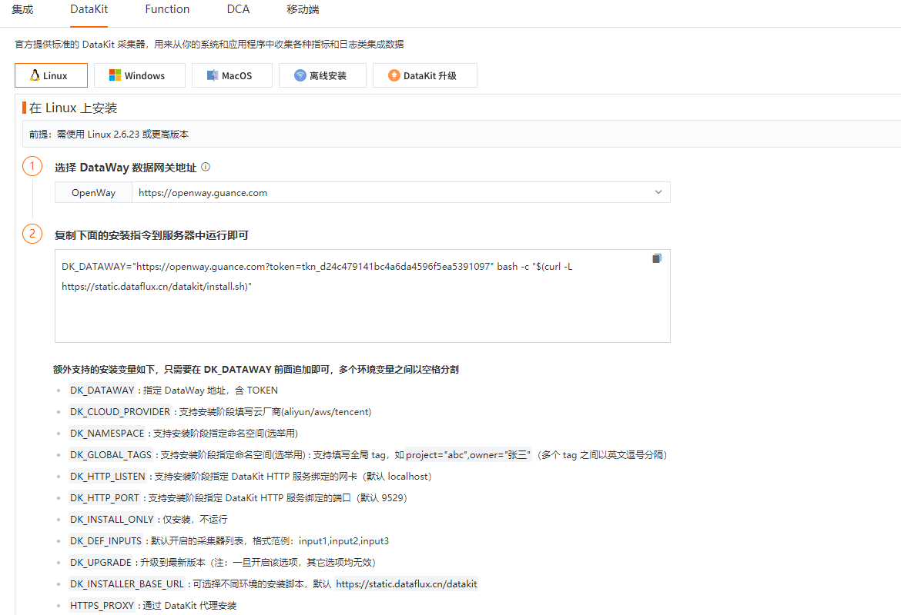

#### 便捷的采集项管理

在开启DataKit客户端访问都，就可以在DataKit客户端对采集项进行修改了，同时内置了大量模板只需要用户根据自己想要采集的内容开启对应配置即可完成数据收集。

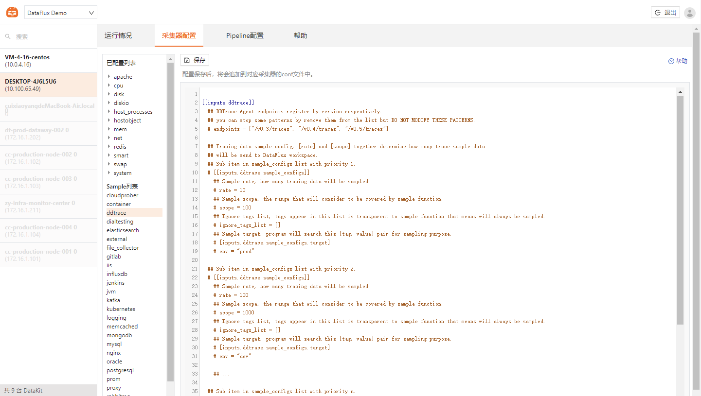

#### 丰富的官方组件支持

DataKit 中包含强大的内置功能--动态 grok 语法查询调试、基于自研语法 DQL 的快速数据查询、实时的 inputs 采集运行观测、边缘计算能力和可视化客户端方式配置、部署采集源等，同时支持 200+ 官方维护数据源接入和技术栈支持更兼容Telefraf、Beats、Logstash、Fluentd 等多种外部数据接入。


#### 更强大的产品能力

观测云构建了基础设施，容器，中间件，数据库，消息队列，应用链路，前端访问，日志，系统安全，网络访问性能全链路的可观测性，基于观测云的标准产品，当用户正确的配置了Datakit以后，可以很快的实现自己项目的完整可观测性的构建，同时支持多技术栈的异常检测库等功能让用户对于复杂的业务问题有着更多的选择。

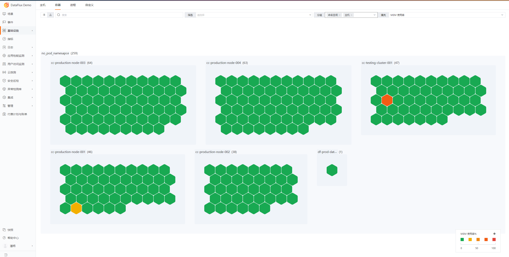
