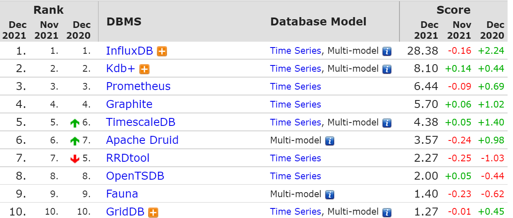
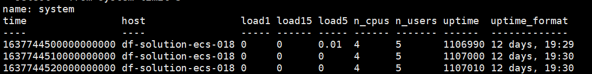
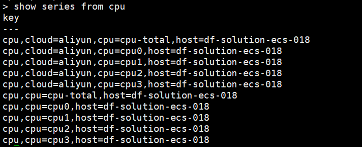
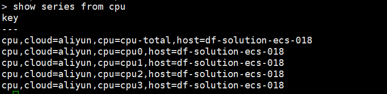
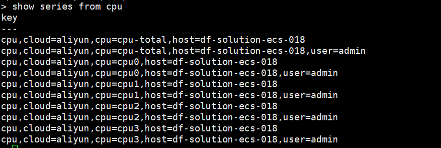

# InfluxDB 时间线简析

---

## 软件简介

InfluxDB 是一个开源分布式时序和指标数据库，使用 Go 语言编写。  
## 行业地位

InfluxDB 常年霸占榜一位置，最新的时序数据库排行，InfluxDB 甩了第二名 Kdb+ 三个 Prometheus 的距离。



## 基本概念

- Database：数据库

- Measurement：数据表，可以理解为 mysql 里的 table
- Field：InfluxDB 中记录真实数据的键值对 (在 Influxdb 中是必须的，不会被索引)
- Field Set：Field 键值对的集合
   - Field Key：组成 Field 键值对里的键
   - Field Value：组成 Field 键值对里的值 (真正的数据)
- Tag：用来描述 Field 的键值对 (在 Influxdb 中是可选的，会被索引)
- Tag Set：Tag 键值对的集合
   - Tag Key：组成 Tag 键值对里的键
   - Tag Value：组成 Tag 键值对里的值
- TimeStamp：数据点关联的日期和时间 

## 高级概念

- Retention Policy：数据存储时间 (默认是 autogen，永久保存)

- Series：时间线由 Retention Policy、Measurement、Tag Set 三部分组成

| **Series Number** | **Retention Policy** | **Measurement** | **Tag Set** |
| --- | --- | --- | --- |
| 时间线 1 | autogen | 天气 | 省份=浙江，城市=温州 |
| 时间线 2 | autogen | 天气 | 省份=浙江，城市=绍兴 |
| 时间线 3 | autogen | 天气 | 省份=江苏，城市=常州 |
| 时间线 4 | autogen | 天气 | 省份=江苏，城市=无锡 |

- Point：在一个 Series 中有相同 TimeStamp 的 Field Set，也可以理解为表里的一行数据

| **TimeStamp** | **Measurement** | **Tag Set** | **Field Set** |  |
| --- | --- | --- | --- | --- |
| 2021-12-12T00:00:00Z | disk | host=a，path=/ | free = 40836976 | used = 20836976 |

- Line Protocol：一种写入数据点到 InfluxDB 的文本格式

```
# 将上述表格里的 Point 转换为行协议
disk,host=a,path=/ free=40836976,used=20836976 1639238400000000000
```

## 实践操作

### 1. 软件安装

添加 Influxdata 的 yum 源

```
cat <<EOF | tee /etc/yum.repos.d/influxdb.repo
[influxdb]
name = InfluxDB Repository - RHEL \$releasever
baseurl = https://repos.influxdata.com/rhel/\$releasever/\$basearch/stable
enabled = 1
gpgcheck = 1
gpgkey = https://repos.influxdata.com/influxdb.key
EOF
```
安装 Telegraf / Influxdb
```
yum -y install telegraf influxdb
```
启动软件
```
systemctl start influxdb
systemctl start telegraf
```
### 2. 数据查询

由于本地安装，使用 influx 命令直接进入数据库 (更多参数详见 influx -h)

```
influx
```

选择数据表 telegraf ，使用 select 命令查询数据 (查询语言为 InfluxQL)

```
use telegraf
select * from system limit 3
```

图中可以看到 3 个 Point，由 4 部分组成 (measurement，timeStamp，tag set，field set)



Measurement** **

- name = system

TimeStamp

- time = 1637744500000000000 (纳秒)

Tag Set 

- host = df-solution-ecs-018

Field Set 

- load = 0,load15 = 0,load5 = 0.01,n_cpus = 4,n_users = 5,uptime = 1106990,uptime_format = 12days,19:29

### 3. 查看时间线

使用 show series 命令查看时间线

```
show series from cpu
```

可以看到 measurement 为 cpu 的时间线为 5 条 (cpu-total，cpu0，cpu1，cpu2，cpu3，host 都一样)


### 4. 时间线测试
#### 4.1 添加 inputs.tags (插件标签)
主配置文件 /etc/telegraf/telegraf.conf，添加 inputs.cpu.tags
```
[[inputs.cpu]]
  percpu = true
  totalcpu = true
  collect_cpu_time = false
  report_active = false
[inputs.cpu.tags]
  cloud = 'aliyun'
```
重启 telegraf
```
systemctl restart telegraf
```
使用 show series 命令查看时间线
```
show series from cpu
```
可以看到 measurement 为 cpu 的时间线由 5 => 10 条



#### 4.2 删除 measurement

使用 drop 命令删除 measurement

```
drop measurement cpu
```

再次使用 show series 命令查看时间线

```
show series from cpu
```

可以看到 measurement 为 cpu 的时间线变为 5 条 (cpu-total，cpu0，cpu1，cpu2，cpu3，host/cloud 都一样)



#### 4.3 添加 global_tags (全局标签)

主配置文件 /etc/telegraf/telegraf.conf，添加 global_tags

```
[global_tags]
  user = 'admin'
```

重启 telegraf

```
systemctl restart telegraf
```

使用 show series 命令查看时间线

```
show series from cpu
```

可以看到 measurement 为 cpu 的时间线又由 5 => 10 条



使用 show series 命令查看其他 measurement 的时间线

```
show series from mem
```

可以看到 measurement 为 mem 的时间线由 1 => 2 条


## 简单解析

- retention policy 不变
   - 使用插件标签，该 measurement 的时间线会翻倍
   - 使用全局标签，该 database 的时间线会翻倍
   - 如果 measurement 也不变，tag 排列组合越多，时间线越多
   
- measurement 
   - 一旦被删除，会清理该 measurement 下的所有时间线
   
- tag 
   - 通常是可以被枚举的，例如 hostname，status
   - 不能为随机数，否则会造成大量时间线，例如 container id，source ip

