# 阿里云账号结算
---

本文将介绍注册观测云免费版后，如何开通阿里云账号结算。关于直接注册商业版，可参考文档 [注册商业版](../../billing/commercial-version.md) 。

## 注册账号

1.打开 [观测云官网](https://www.guance.com/) ，点击右上角「[免费注册](https://auth.guance.com/register)」，或者在登录页面点击注册。选择免费版，点击“立即注册”。

2.在观测云注册页面，依据使用云服务资源的地域，选择注册站点，如“中国区1（杭州）”，输入需要注册的信息。

注意：若您选择注册“中国区2（宁夏）”，但需要选择阿里云账号结算，需联系观测云客户经理开通“选择任意结算方式”。

3.注册完成后，登录观测云，进入工作空间新手引导页面，可以根据新手引导安装配置第一个 DataKit 。

## 升级商业版

1.注册完成后，登录到观测云工作空间，在「付费计划与账单」，点击「升级」，进入版本升级页面。

2.在套餐升级页面，点击「升级」。观测云支持按需购买，按量计费。更多版本计费逻辑可参考文档 [计费方式](../../billing/billing-method/index.md) 。

3.输入已经在观测云费用中心注册的账号进行绑定，此处会对“用户名”进行校验，请输入已开通观测云费用中心账号的“用户名”。

或点击“注册新账号”进行注册新的观测云计费平台账号后再绑定，此处会对“用户名”进行校验唯一性。

注意：观测云费用中心的用户名账号一旦注册不能修改。

4.查看开通协议并同意，协议同意后即可收到开通提醒邮件，该工作空间升级到商业版。

## 开通阿里云账户结算方式

1.协议同意后，商业版升级成功，默认使用观测云费用中心账号结算，点击“绑定结算云账号”。

2.选择“阿里云账号”。

3.免登进入观测云费用中心更改结算方式的“阿里云账号结算”。

4.在“更改结算方式”页面，点击“前往阿里云免费开通观测云服务”。

或者您也可以在观测云工作空间「付费计划与账单」，点击「进入费用中心」-「工作空间管理」，点击“更改结算方式”，在弹出的对话框，选择“阿里云账号结算”，点击“前往阿里云免费开通观测云服务”。

5.在阿里云心选平台，点击“立即开通”。

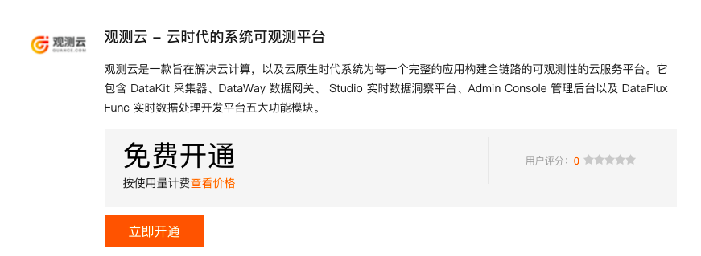

6.若您未登录到阿里云，提示账号登录。

7.登录到阿里云以后，返回阿里云心选，再次点击“立即开通”，提示“开通按量服务”，同意协议后，点击“开通”。

8.在提示“开通申请已提交”对话框，点击“确认”。

9.确认开通申请后，直接跳转到阿里云已购买的服务列表查看购买的观测云服务。

注意：阿里云账号需要实名认证才能购买观测云服务。

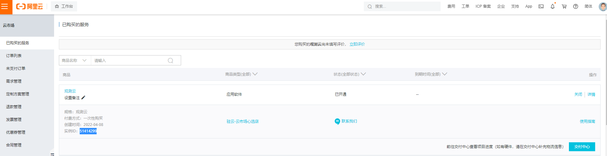

10.返回观测云费用中心，提示“确认开通”，点击确定。

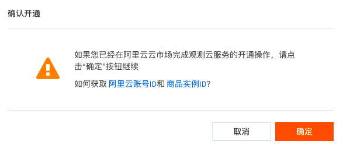

11.在更改结算方式对话框，输入 [阿里用户 ID](#uid) 和 [商品实例 ID](#entity-id) ，点击“确定”，即可开通阿里云账户结算方式。

## 选择存储方式

开通阿里云账号结算后，进入选择存储方式，存储方式支持 “默认存储” 和 “SLS 存储”。

- 默认存储：使用 ElasticSearch 存储日志类数据，InfluxDB / TDengine 存储指标类数据；
- SLS 存储：使用 Log Store 存储日志类数据，Metric Store 存储指标类数据，数据存放在自己的阿里云账号下。

### 选择默认存储

选择“默认存储”，点击下一步，直接跳转成功开通商业版。

### 选择 SLS 存储 {#sls}

???+ attention

    - SLS 存储方案仅支持 ”中国区-杭州“、”中国区-张家口“站点，一旦选择 SLS 数据存储方案后便不能更改；
    - 选择 SLS 存储方案的工作空间默认开启多索引，且不支持删除指标集；
    - SLS 存储使用的语言是 promql，存在部分函数无法使用的情况。更多关于 SLS 函数相关信息，可参考文档 [DQL 函数](../../dql/funcs.md#sls)。

选择 “SLS 存储” ，点击下一步，显示用户服务协议，同意后进入阿里云账号绑定页面。

在绑定阿里云账号页面，下载获取 SLS 授权文件，在 [阿里云控制台](https://www.aliyun.com/) 创建阿里云 RAM 账号，获取该账号的 AccessKey ID、AccessKey Secret 信息。关于使用 SLS 授权文件给 RAM 账号授权的具体操作，可参考文档 [RAM账号授权](../../billing/billing-method/sls-grant.md)。

填写 AccessKey ID、AccessKey Secret并进行验证，若验证通过，可以进行下一步；若验证未通过，提示 “该 AK 无效，请重新填写”。

验证通过后，点击“确认开通”，提示 “成功开通观测云商业版”。

## 如何获取阿里用户 ID {#uid}

### 阿里云主账号

通过主账号登录 [阿里云](https://www.aliyun.com) ，进入阿里云控制台，把鼠标悬停在右上角账号头像上，在下拉列表中复制“账号 ID”，填入到更改结算方式对话框的“阿里用户 ID”。

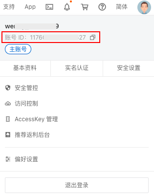

或者您也可以直接在控制台右侧“账号ID”获取阿里云主账号的 UID，填入到更改结算方式对话框的“阿里用户 ID”。

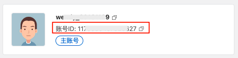

### 阿里云 RAM 子账号

通过 RAM 方式登录 [阿里云](https://www.aliyun.com) ，进入阿里云控制台，把鼠标悬停在右上角账号头像上，在下拉列表中复制 RAM 账号中@后面的主账号 UID ，填入到更改结算方式对话框的“阿里用户 ID”。

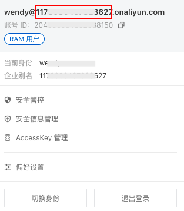

或者您也可以直接在控制台右侧 RAM 账号中获取阿里云主账号的 UID，填入到更改结算方式对话框的“阿里用户 ID”。

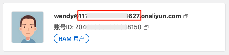

## 如何获取商品实例 ID {#entity-id}

观测云在阿里云心选确认开通申请后，直接跳转到阿里云已购买的服务列表，在已购买的观测云服务下方，可以查看到商品的“实例 ID”，复制此“实例 ID”，填入到更改结算方式对话框的“商品实例 ID”。

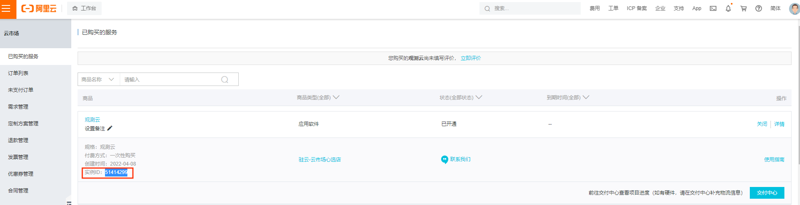

## 在阿里云取消订阅观测云

1.登录到阿里云，在阿里云控制台，打开左上角菜单，点击进入“云市场”-“已购买的服务”。

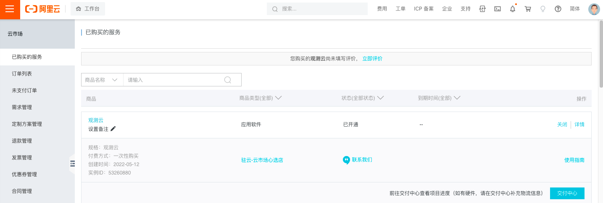

2.在“已购买的服务”可以查看到开通订阅的观测云实例，点击该实例右上角的“关闭”。

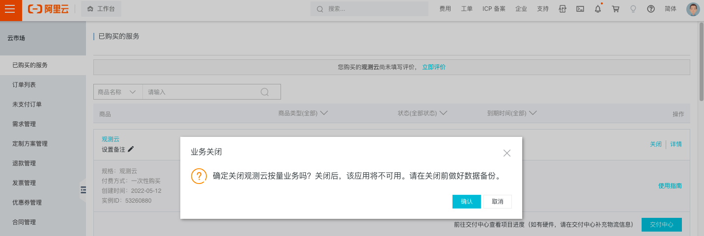

3.在弹出的“业务关闭”对话框，点击“确认”后，可以看到该实例已经是“已关闭”的状态，说明已经在阿里云取消订阅观测云。

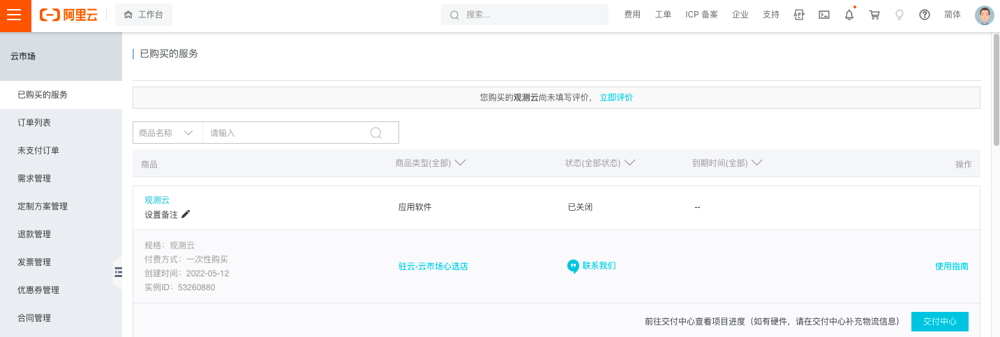

注意：在阿里云取消订阅观测云服务后，在观测云费用中心绑定该账号结算的所有工作空间，将删除关联的云账号，修改当前云账号结算为观测云费用中心企业账号结算，并通过邮件的方式通知到用户。

## 在阿里云一键开通观测云商业版 {#aliyun-register}

???+ attention

    - 若在阿里云市场购买的是观测云 SaaS 版，开通观测云商业版时，可按照上面的步骤选择存储方式；
    - 若在阿里云市场购买的是观测云 SLS 版，开通观测云商业版时，默认选择 SLS 存储。

1.登录到阿里云，在阿里云控制台，打开左上角菜单，点击进入“云市场”-“已购买的服务”。

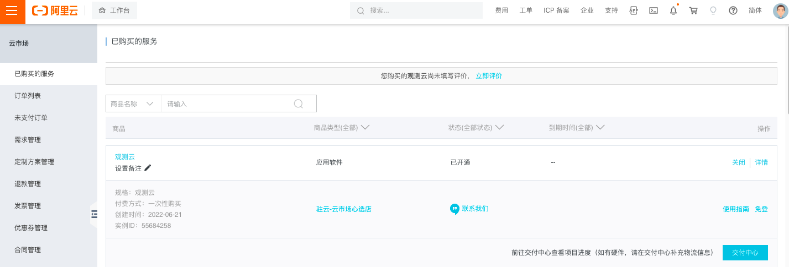

2.在“已购买的服务”可以查看到开通订阅的观测云实例，点击该实例右侧的“免登”。

3.在弹出的对话框，点击“确定”后，提示“绑定观测云工作空间”和“注册观测云商业版”。

4.若还未有观测云账号，可以点击“注册观测云商业版”。

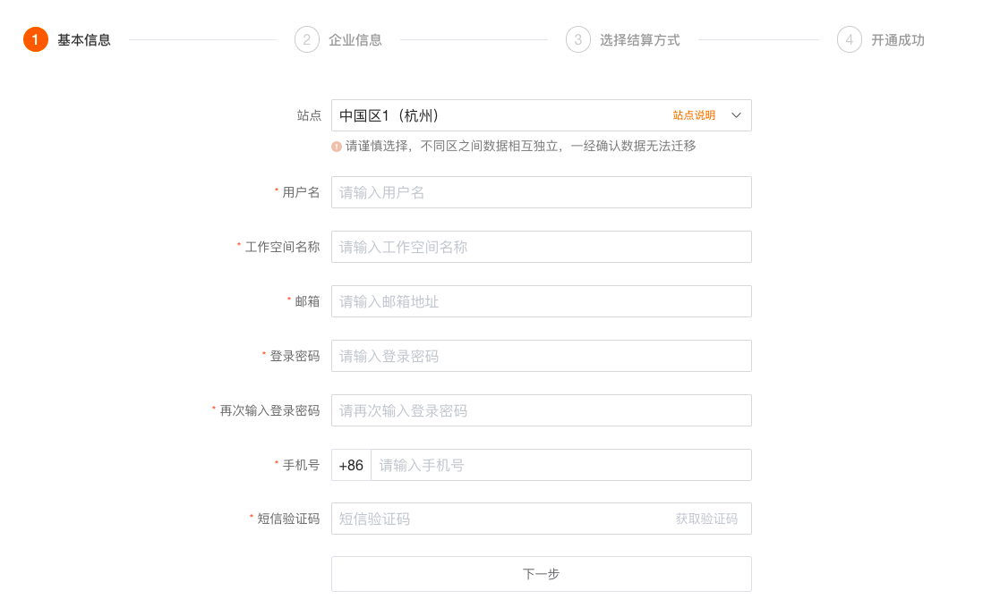

5.若已经有观测云账号，可以点击“绑定观测云工作空间”，提示“如何快速绑定阿里云账号结算”。

6.点击“知道了”，开始绑定观测云工作空间。在绑定工作空间之前需要先绑定观测云的企业账号，输入观测云企业账号“用户名”，通过邮箱验证进行绑定。

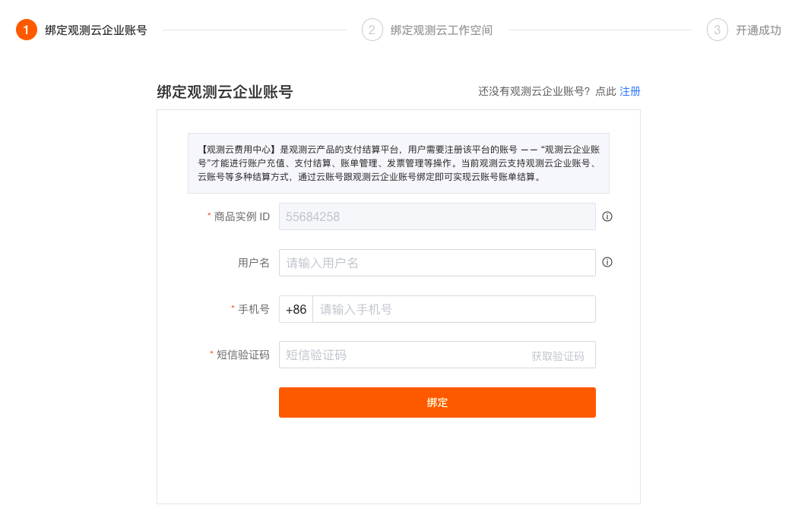

7.若还未有观测云企业账号，可在点击“注册”，注册新的观测云企业账号并绑定观测云工作空间。

