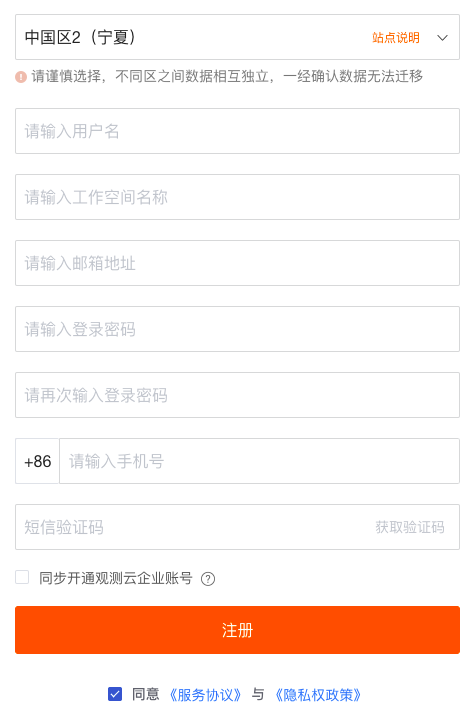

# AWS账号结算
---

观测云支持观测云企业账号、AWS账号、阿里云账号 3 种结算方式。

本文将介绍注册观测云免费版，如何开通AWS账号结算。关于直接注册商业版，可参考文档 [注册商业版](../../billing/commercial-version.md) 。

## 注册账号

1.打开 [观测云官网](https://www.guance.com/) ，点击右上角「[免费注册](https://auth.guance.com/register)」，或者在登录页面点击注册。选择免费版，点击“立即注册”。  2.在观测云注册页面，选择需要注册的站点，如中国区2（宁夏），输入需要注册的信息。 注意：

- 若您选择注册“中国区1（杭州）”，但需要选择AWS账号结算，需联系观测云客户经理开通“选择任意结算方式”。
- 若在注册时选择“同步开通观测云企业账号”，输入的“用户名”同时用来注册观测云费用中心的账号，费用中心的用户名账号会检查唯一性，一旦注册不能修改。

3.注册完成后，登录观测云，进入工作空间新手引导页面，可以根据新手引导安装配置第一个 DataKit 。 

## 升级商业版

1.注册完成后，登录到观测云工作空间，在「付费计划与账单」，点击「升级」，进入版本升级页面。  2.在套餐升级页面，点击「升级」。观测云支持按需购买，按量计费。更多版本计费逻辑可参考文档 [计费方式](../../billing/billing-method.md) 。  3.输入已经在观测云费用中心注册的账号进行绑定，此处会对“用户名”进行校验，请输入已开通观测云费用中心账号的“用户名”。 

或点击“注册新账号”进行注册新的观测云费用中心账号后再绑定，此处会对“用户名”进行校验唯一性。 注意：观测云费用中心的用户名账号一旦注册不能修改。 

4.查看开通协议并同意，协议同意后即可收到开通提醒邮件，该工作空间升级到商业版。 

## 选择结算方式（在AWS订阅观测云）

1.协议同意后，商业版升级成功，默认使用观测云费用中心账号结算，点击“绑定结算云账号”。  2.选择“AWS云账号”。 

3.免登进入观测云费用中心更改结算方式为“亚马逊云账号结算”。 
 

4.在“更改结算方式”页面，点击“前往亚马逊云市场订阅”，即可进入观测云在亚马逊云的主页，点击“继续订阅”。  5.在亚马逊云输入账户、用户名和密码进行登录。  6.登录后在观测云所属亚马逊云的页面点击“订阅”。  7.在弹出的对话框中，点击“建立您的账户”。  8.建立账户后，会自动跳转到观测云费用中心，选择工作空间后，点击“确认提交”。  9.选好工作空间，确认提交后，在观测云费用中心「账户管理」-「云账号」可查看已经订阅的云账号及关联结算的工作空间。  10.返回到观测云费用中心的管理工作空间，确认是否操作成功。  11.操作确认成功后，即可在管理工作空间查看已经更新的结算方式。  12.返回观测云付费计划与账单，在账单列表直接显示跳转到对应AWS云服务控制台查看账单信息。 

## 在AWS取消订阅观测云

1.登录到亚马逊云，在右上角账号选择“您的 Marketplace 软件”。  2.在管理订阅找到订阅的观测云服务，点击“管理”。  3.进入观测云服务管理页面，点击“操作”-"取消订阅"。  4.在弹出的对话框中，点击“是，取消订阅”。  5.取消订阅成功后，在亚马逊云管理订阅中取消了观测云服务。  注意：在亚马逊云取消订阅观测云服务后，在观测云费用中心绑定该账号结算的所有工作空间，将删除关联的云账号，修改当前云账号结算为观测云费用中心账号结算，并通过邮件的方式通知到用户。

---

