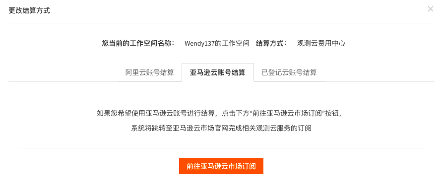
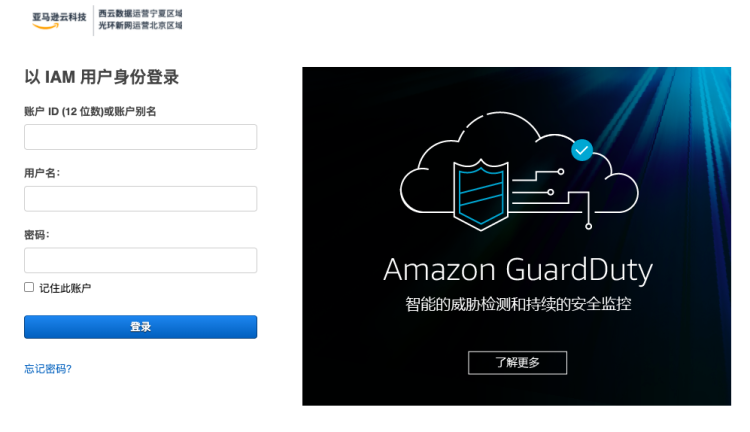
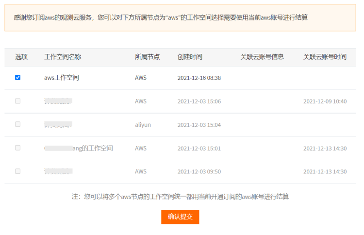
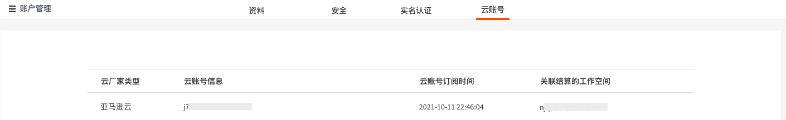
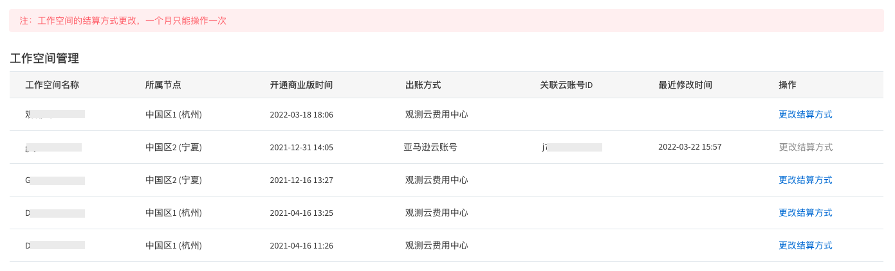
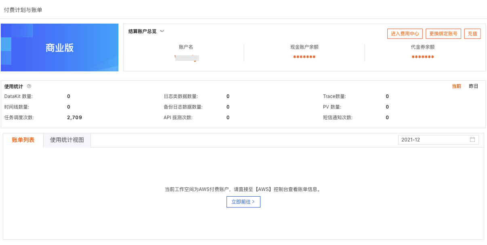
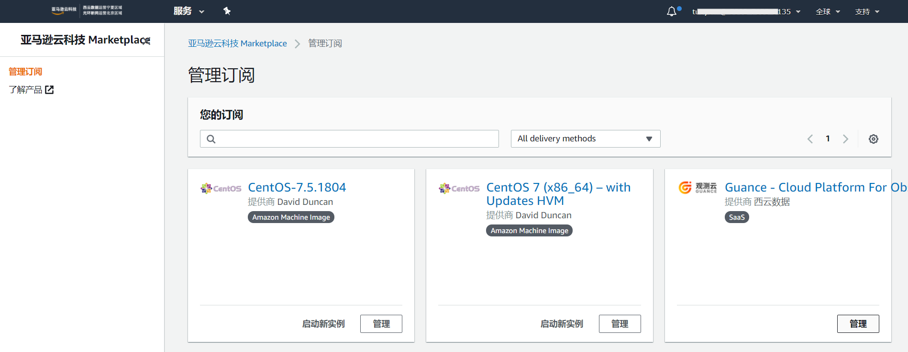
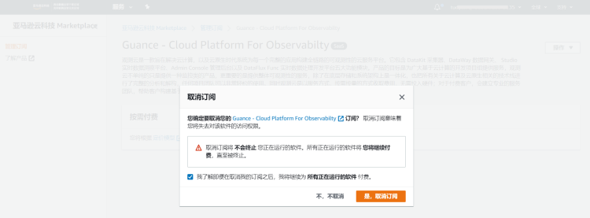
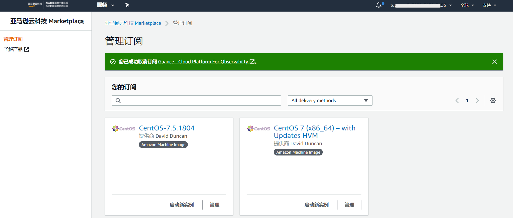

# AWS账号结算
---

AWS账号是指直接通过AWS账户进行充值结算，一个AWS账号支持关联多个工作空间、多个站点的工作空间进行费用结算。本文将介绍观测云商业版如何开通AWS账号结算。关于如何开通商业版，可参考文档 [注册商业版](../../billing/commercial-version.md) 。

## 选择AWS账号结算方式

在注册或者升级观测云商业版时，您可以选择“AWS账号结算”，或者您也可以在观测云工作空间「付费计划与账单」，点击「进入费用中心」-「工作空间管理」，点击“更改结算方式”，在弹出的对话框，选择“AWS账号结算”。

## 在亚马逊云市场订阅观测云

在“更改结算方式”页面，点击“前往亚马逊云市场订阅”，即可进入观测云在亚马逊云的主页，点击“继续订阅”。

在亚马逊云输入账户、用户名和密码进行登录。

登录后在观测云所属亚马逊云的页面点击“订阅”。

在弹出的对话框中，点击“建立您的账户”。

建立账户后，会自动跳转到观测云费用中心，选择工作空间后，点击“确认提交”。

选好工作空间，确认提交后，在观测云费用中心「账户管理」-「云账号」可查看已经订阅的云账号及关联结算的工作空间。

返回到观测云费用中心的管理工作空间，确认是否操作成功。

操作确认成功后，即可在管理工作空间查看已经更新的结算方式。

返回观测云付费计划与账单，在账单列表直接显示跳转到对应AWS云服务控制台查看账单信息。

## 在AWS取消订阅观测云

1.登录到亚马逊云，在右上角账号选择“您的 Marketplace 软件”。

2.在管理订阅找到订阅的观测云服务，点击“管理”。

3.进入观测云服务管理页面，点击“操作”-"取消订阅"。

4.在弹出的对话框中，点击“是，取消订阅”。

5.取消订阅成功后，在亚马逊云管理订阅中取消了观测云服务。

注意：在亚马逊云取消订阅观测云服务后，在观测云费用中心绑定该账号结算的所有工作空间，将删除关联的云账号，修改当前云账号结算为观测云费用中心账号结算，并通过邮件的方式通知到用户。

