# 观测云企业账号结算
---

观测云支持[注册体验版](https://www.yuque.com/dataflux/doc/sw61zm#K12aK)或直接[注册商业版](https://www.yuque.com/dataflux/doc/zaghkf#wwMNd)，商业版注册完成后，默认开通企业账号结算，可以根据需求选择云账号结算。体验版注册时有两种选择：一种是注册观测云账号的时候直接选择开通观测云企业账号；另外一种是注册完成后登录到工作空间，升级商业版的时候注册企业账号进行开通，若已有企业账号，可直接选择绑定已有账号。

本文将介绍注册观测云体验版，如何开通观测云企业账号结算。关于直接注册商业版如何开通企业账号结算，可参考文档 [注册商业版](https://www.yuque.com/dataflux/doc/zaghkf#wwMNd) 。

## 同步开通观测云企业账号

### 1.注册体验版账号

打开 [观测云官网](https://www.guance.com/) ，点击右上角「[免费注册](https://auth.guance.com/register)」，或者在登录页面点击注册。选择体验版，点击“立即注册”。  在观测云注册页面，依据使用云服务资源的类别，选择合适的站点，输入需要注册的信息并勾选“**同步开通观测云企业账号**”。 注意：

- 观测云提供多个注册登录站点，您可以根据使用资源的情况选择合适的站点进行注册登录。
- 注册时，“用户名”会校验唯一性，注册成功后，默认作为观测云费用中心的账号。费用中心的用户名账号一旦注册不能修改。

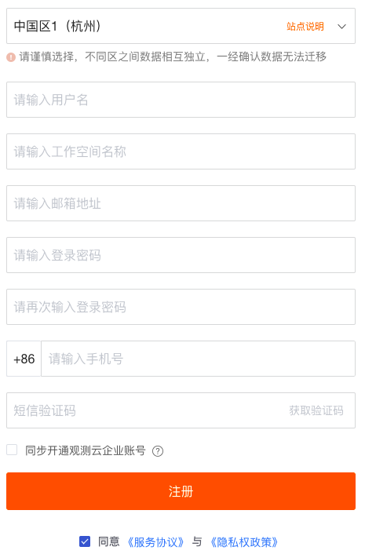 注册完成后，可观看观测云介绍小视频并加入到观测云社区。  看完观测云介绍以后，进入新手引导页面，可以根据新手引导安装配置第一个 DataKit 。 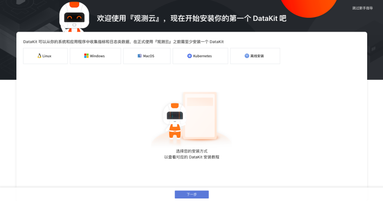

### 2.升级商业版

刚注册完的账号默认为体验版账号，在「付费计划与账单」，点击「升级」，进入套餐升级页面。 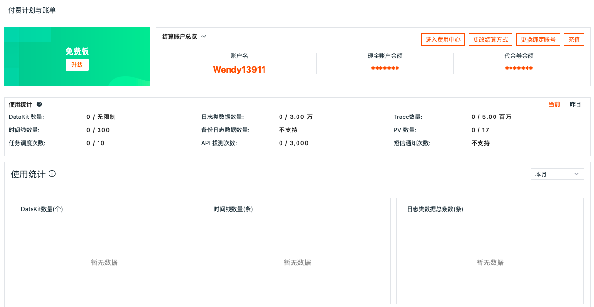 在套餐升级页面，点击「升级」。观测云支持按需购买，按量计费。更多版本计费逻辑可参考文档 [计费方式](https://www.yuque.com/dataflux/doc/ateans) 。 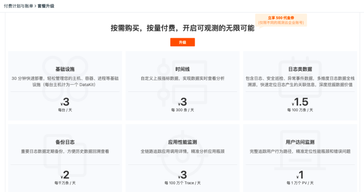 在套餐升级页面弹出的对话框，完善企业会员信息。  查看开通协议并同意，协议同意后即可收到开通提醒邮件，该工作空间升级到商业版。 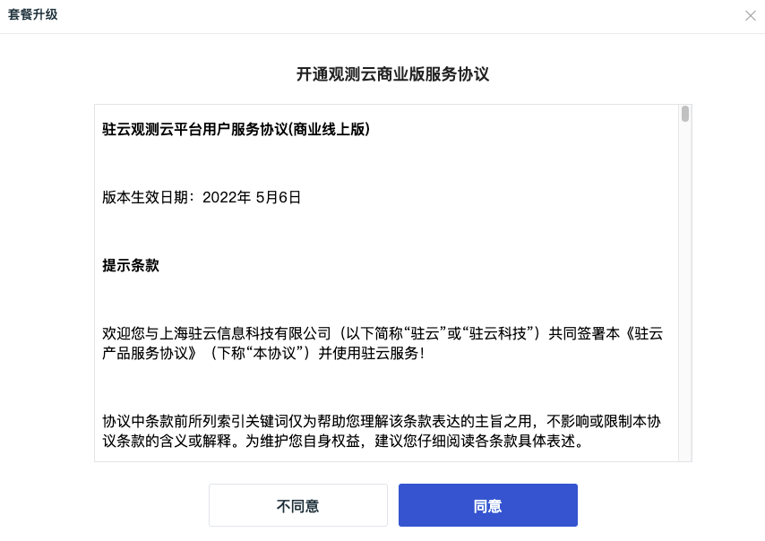

商业版升级成功，默认使用观测云企业账号结算，若需要更改其他结算方式，可以点击“绑定结算云账号”按钮。目前观测云支持三种结算方式：

- 观测云企业账号：直接在观测云费用中心进行充值结算；
- 阿里云账号：直接通过阿里云账号进行充值结算；
- AWS账号：直接通过AWS账号进行充值结算。

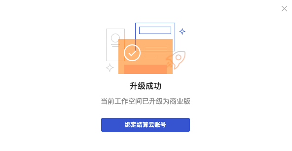 点击“绑定结算云账号”，选择结算云账号。这里支持四种场景：

- 已登记云账号结算，未开通“结算方式任意选择”：推荐使用“已登记云账号”，另外可选择当前站点所属的云平台账号，如“阿里云账号”；
- 已登记云账号结算，且开通“结算方式任意选择”：推荐使用“已登记云账号”，另外可选择所有站点所属的云平台账号，如“阿里云账号”或“AWS云账号”；
- 无登记云账号结算，开通“结算方式任意选择”：可选择所有站点所属的云平台账号，如“阿里云账号”或“AWS云账号”；
- 无登记云账号结算，未开通“结算方式任意选择”：可选择当前站点所属的云平台账号，如“阿里云账号”（见下图示例）。

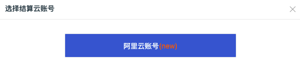 选择“阿里云账号”，在弹出的对话框中“前往阿里云免费开通观测云服务”，并填写“阿里用户 ID”和“商品实例 ID”，具体步骤可参考 [开通阿里云账号结算方式](https://www.yuque.com/dataflux/doc/vgdy2u#oL2g8) 。若是 AWS 云账号，可参考 [在 AWS 订阅观测云](https://www.yuque.com/dataflux/doc/zszq8p#VL6Qh) 。 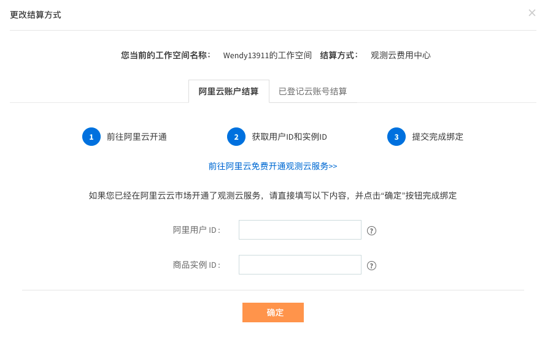 若选择使用费用中心账号结算，可直接关闭“更改结算方式”对话框。支持在观测云费用中心“工作空间管理”更改结算方式。  返回观测云付费计划与账单，可以看到当前工作空间已经升级到“商业版”。 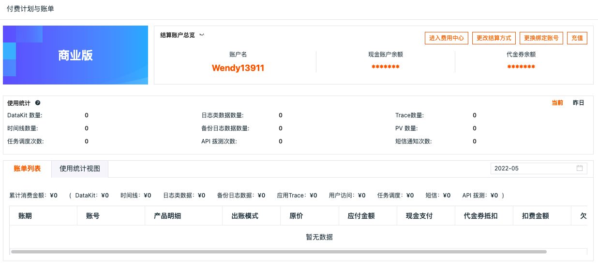

### 3.进入观测云费用中心

在观测云付费计划与账单，点击右上角的“进入费用中心”，即可自动跳转到观测云费用中心。 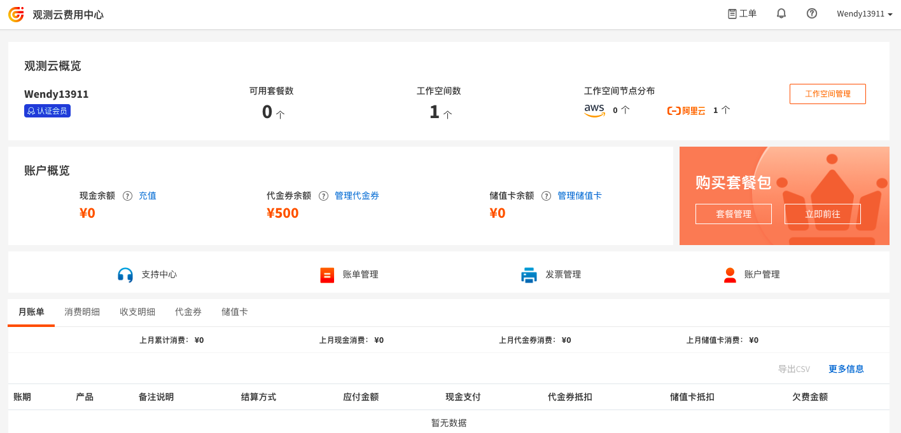

## 注册后升级开通观测云企业账号

### 1.注册体验版账号

在观测云账号注册页面，依据使用云服务资源的类别，选择合适的站点，输入需要注册的信息，并不勾选“**同步开通观测云企业账号**”。 注意：

- 观测云提供多个注册登录站点，您可以根据使用资源的情况选择合适的站点进行注册登录。
- 注册时，“用户名”作为观测云的账号，不会校验唯一性，邮箱和手机需要校验唯一性。

### 2.升级商业版

注册完成后，登录到观测云工作空间，在「付费计划与账单」，点击「升级」，进入套餐升级页面。 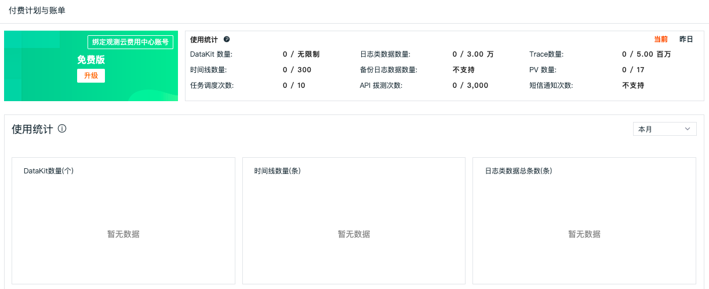 在套餐升级页面，点击「升级」。观测云支持按需购买，按量计费。更多版本计费逻辑可参考文档 [计费方式](https://www.yuque.com/dataflux/doc/ateans) 。 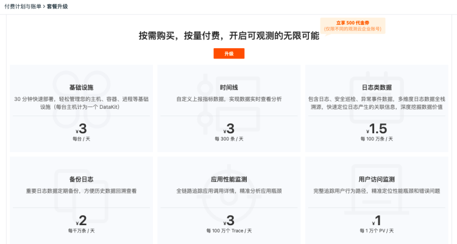 在弹出的对话框，输入已经在观测云费用中心注册账号进行绑定，此处会对“用户名”进行校验，请输入已开通观测云费用中心账号的“用户名”。 

或点击“注册新账号”进行注册新的观测云费用中心账号后再绑定，此处会对“用户名”进行校验唯一性。 注意：观测云费用中心的用户名账号一旦注册不能修改。 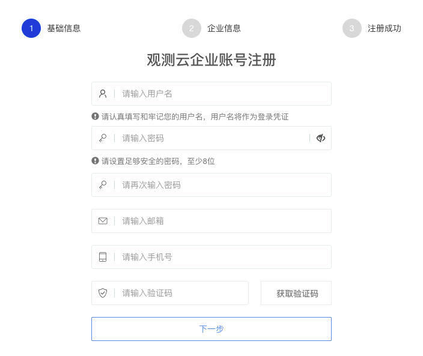 查看开通协议并同意，协议同意后即可收到开通提醒邮件，该工作空间升级到商业版。 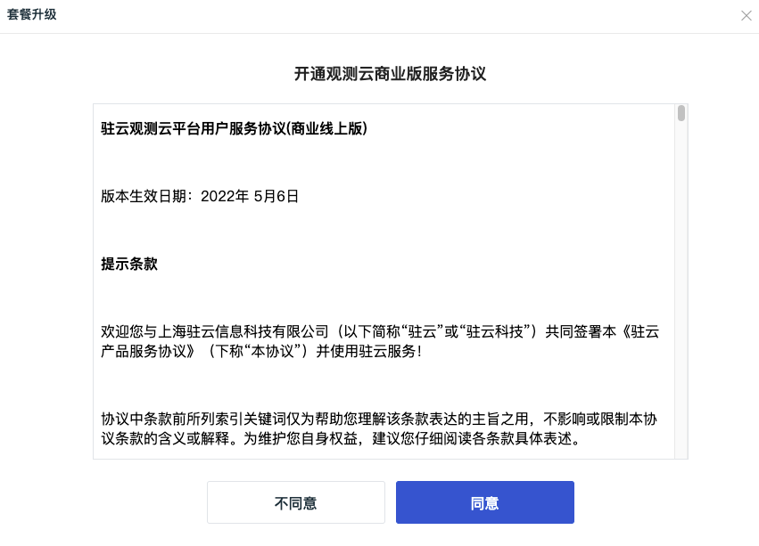 商业版升级成功，默认使用观测云费用中心账号结算，若需要更改其他结算方式，可以点击“绑定结算云账号”按钮。目前观测云支持三种结算方式：

- 观测云企业账号：直接在观测云费用中心账号进行充值结算；
- 阿里云账号：直接通过阿里云账号进行充值结算；
- AWS账号：直接通过AWS账号进行充值结算。

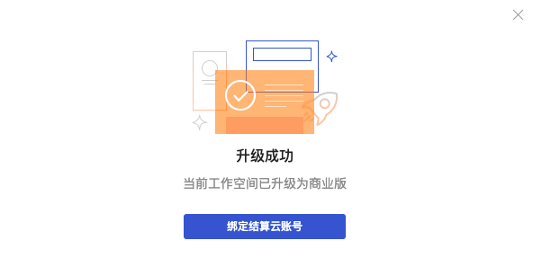 点击“绑定结算云账号”，选择结算云账号。这里支持四种场景：

- 已登记云账号结算，未开通“结算方式任意选择”：推荐使用“已登记云账号”，另外可选择当前站点所属的云平台账号，如“阿里云账号”；
- 已登记云账号结算，且开通“结算方式任意选择”：推荐使用“已登记云账号”，另外可选择所有站点所属的云平台账号，如“阿里云账号”或“AWS云账号”；
- 无登记云账号结算，开通“结算方式任意选择”：可选择所有站点所属的云平台账号，如“阿里云账号”或“AWS云账号”（见下图示例）；
- 无登记云账号结算，未开通“结算方式任意选择”：可选择当前站点所属的云平台账号，如“阿里云账号”。

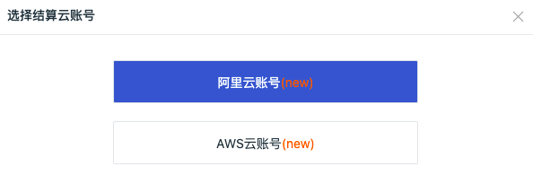 选择“阿里云账号”，在弹出的对话框中选择结算方式，具体步骤可参考 [开通阿里云账号结算方式](https://www.yuque.com/dataflux/doc/vgdy2u#oL2g8) 或 [在 AWS 订阅观测云](https://www.yuque.com/dataflux/doc/zszq8p#VL6Qh) 。 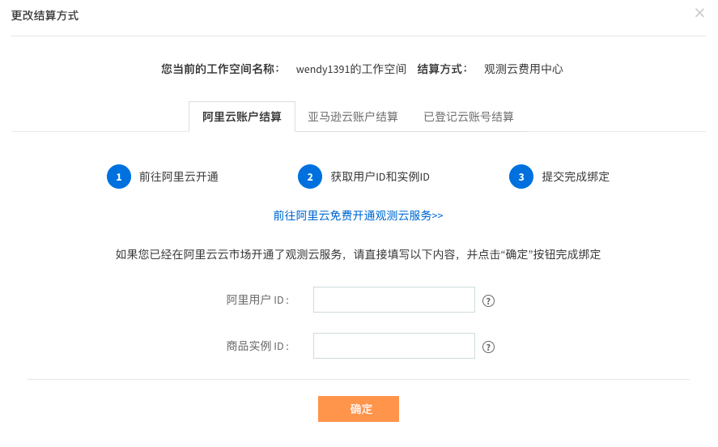 若选择使用费用中心账号结算，可直接关闭“更改结算方式”对话框。支持在观测云费用中心“工作空间管理”更改结算方式。  返回观测云付费计划与账单，可以看到当前工作空间已经升级到“商业版”。 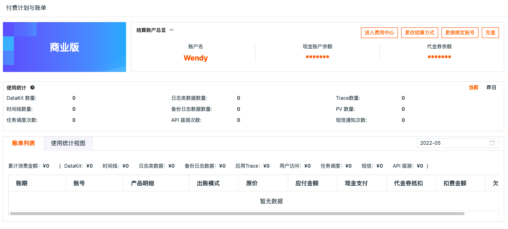

### 3.进入观测云费用中心

在观测云付费计划与账单，点击右上角的“进入费用中心”，即可自动跳转到观测云费用中心。

---

观测云是一款面向开发、运维、测试及业务团队的实时数据监测平台，能够统一满足云、云原生、应用及业务上的监测需求，快速实现系统可观测。**立即前往观测云，开启一站式可观测之旅：**[www.guance.com](https://www.guance.com) 
