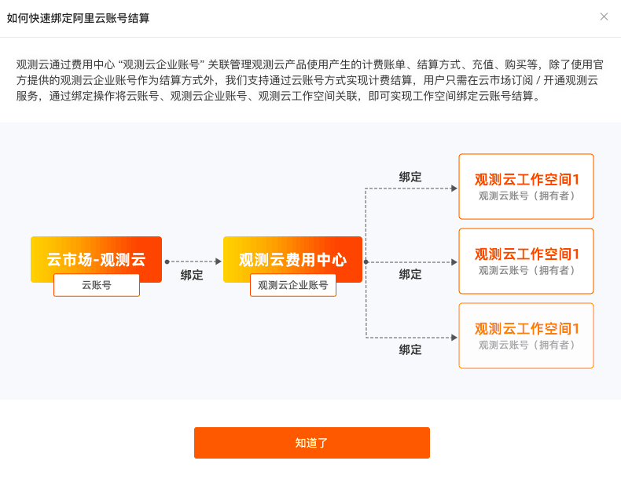
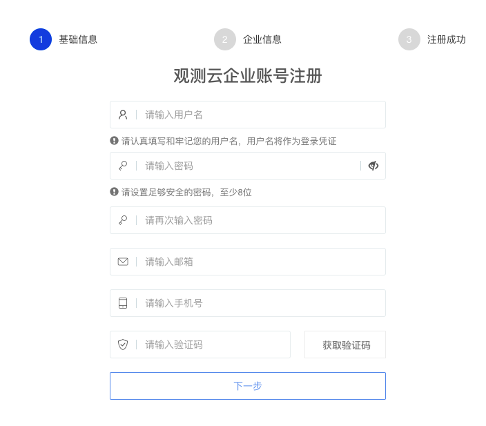

# 阿里云市场开通观测云专属版
---

本文将介绍在阿里云市场购买观测云专属版以后，如何开通使用。关于注册商业版，可参考文档 [注册商业版](../billing/commercial-version.md) 。

## 购买观测云专属版

打开 [阿里云市场观测云专属版](https://market.aliyun.com/products/56838014/cmgj00060481.html) ，点击“立即开通”。

### 登录阿里云账号

若您未登录到阿里云，提示账号登录。

### 开通观测云按量服务

登录到阿里云以后，返回阿里云心选，再次点击“立即开通”，提示“开通按量服务”，同意协议后，点击“开通”。

在提示“开通申请已提交”对话框，点击“确认”。

## 免登观测云专属版

确认开通申请后，直接跳转到阿里云已购买的服务列表查看购买的观测云专属版实例。

注意：阿里云账号需要实名认证才能购买观测云服务。

点击该实例右侧的“免登”。在弹出的对话框，点击“确定”。

提示“绑定观测云工作空间”和“注册观测云商业版”。

### 注册观测云商业版

若您从未有过观测云账号，您可以点击“注册观测云商业版”进行注册。

#### 输入基本信息

在基本信息页面，选择站点、输入注册信息，点击“下一步”。

???+ attention

    - 观测云、SLS 联合解决方案仅支持 ”中国区-杭州“、”中国区-张家口“站点，一旦选择 SLS 数据存储方案后便不能更改；
    - 输入的“用户名”同时用来注册观测云费用中心的账号，费用中心的用户名账号会检查唯一性，一旦注册不能修改；

#### 输入企业信息

在企业信息页面，输入企业信息，点击“注册”。

#### 选择结算方式

在选择结算方式页面选择“阿里云账号结算”，输入阿里用户 ID 和商品实例 ID，关于如何获取阿里用户 ID 和商品实例 ID，可参考文档 [阿里云账号结算](../billing/billing-account/aliyun-account.md)。 

点击“确定”，查看并同意观测云平台用户服务协议，点击“下一步”。

在绑定阿里云账号页面，下载获取 SLS 授权文件，在 [阿里云控制台](https://www.aliyun.com/) 创建阿里云 RAM 账号，获取该账号的 AccessKey ID、AccessKey Secret 信息。关于使用 SLS 授权文件给 RAM 账号授权的具体操作，可参考文档 [RAM账号授权](../billing/billing-method/sls-grant.md)。

填写 AccessKey ID、AccessKey Secret并进行验证，若验证通过，可以进行下一步；若验证未通过，提示 “该 AK 无效，请重新填写”。

#### 开通成功

验证通过后，点击“确认开通”，提示 “成功开通观测云商业版”。

### 绑定观测云工作空间

注册完成观测云账号后，可返回绑定观测云工作空间。点击“绑定观测云工作空间”。

提示“如何快速绑定阿里云账号结算”。

#### 绑定观测云企业账号

点击“知道了”，开始绑定观测云工作空间。在绑定工作空间之前需要先绑定观测云的企业账号，输入观测云企业账号“用户名”，通过邮箱验证进行绑定。

若还未有观测云企业账号，可再点击“注册”，注册新的观测云企业账号。

#### 绑定观测云工作空间

注册成功后进入绑定观测云工作空间页面。

##### 注册观测云账号

若未注册观测云账号，您可以点击“注册观测云账号”，输入相关信息，通过手机号验证进行注册。

##### 创建观测云工作空间

若未创建过工作空间，您可以点击“创建工作空间”，输入工作空间名称和注册观测云账号时使用的邮箱，进行创建。

##### 绑定已有工作空间

若已经创建过工作空间，您可以选择工作空间并点击右侧的“绑定”，在弹出的对话框中输入邮箱和验证码。

点击“确认”后，提示已绑定。

点击“确定”，提示绑定成功。

点击“确定”，返回登录观测云。

### 开始使用观测云

注册完成后，可观看观测云介绍小视频，或者您可以点击“从安装 DataKit 开始”即可安装配置第一个 DataKit 。

???+ attention

    - 观测云、SLS 联合解决方案的工作空间默认开启多索引，且不支持删除指标集；
    - SLS 存储使用的语言是 promql，存在部分函数无法使用的情况。更多关于 SLS 函数相关信息，可参考文档 [DQL 函数](../dql/funcs.md#sls)。

