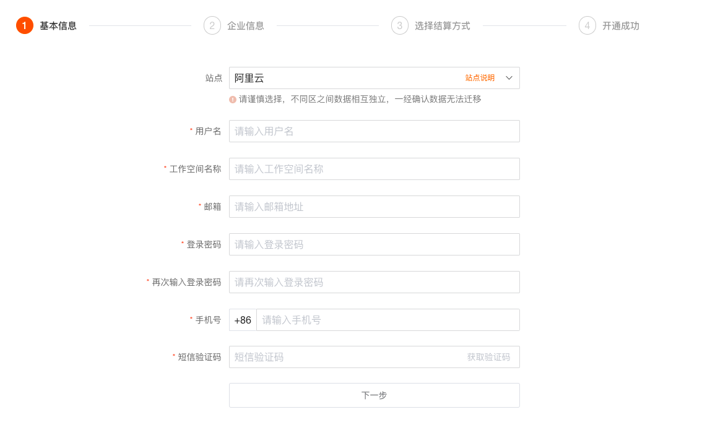
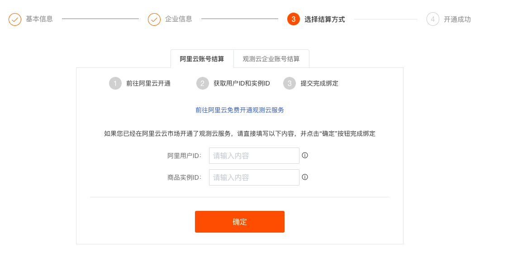
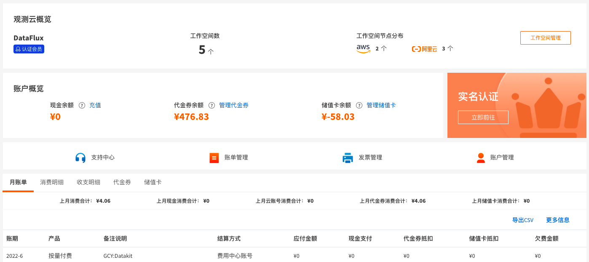

# 升级商业版
---


## 注册商业版
您可以在 [观测云官网](https://www.guance.com/) ，「[立即注册](https://auth.guance.com/register)」为观测云用户，观测云注册时，提供免费版和商业版注册选项。


### 输入基本信息

选择商业版，点击“立即注册”。在基本信息页面，选择站点、输入注册信息，点击“下一步”。

注意：

- 观测云提供多个注册登录站点，您可以根据使用资源的情况选择合适的站点进行注册登录。
- 若在注册商业版时，输入的“用户名”同时用来注册观测云费用中心的账号，费用中心的用户名账号会检查唯一性，一旦注册不能修改。



在企业信息页面，输入企业信息，点击“注册”。


### 选择结算方式

在选择结算方式页面，根据站点的选择会有两种结算方式组合：[阿里云账号结算](../billing/billing-account/aliyun-account.md) 和 [观测云企业账号结算](../billing/billing-account/enterprise-account.md) 、[AWS账号结算](../billing/billing-account/aws-account.md) 和 [观测云企业账号结算](../billing/billing-account/enterprise-account.md) 。您可以根据实际需求选择相应的结算方式，默认为观测云企业账号结算。

如果您选择阿里云站点登录注册，则支持阿里云账号结算和观测云企业账号结算。如果您选择阿里云账号结算，填写“阿里云用户 ID” 和“商品实例 ID” ，点击 确定，进入存储方式选择界面。



### SLS 存储方案

???+ attention

```
- SLS 存储方案仅支持 ”中国区-杭州“、”中国区-张家口“站点，一旦选择 SLS 数据存储方案后便不能更改；
- 选择 SLS 存储方案的工作空间默认开启多索引，且不支持删除指标集。
- SLS 存储使用的语言是 promql，存在部分函数无法使用的情况。更多关于 SLS 函数相关信息，可参考文档 [DQL 函数](../../dql/funcs.md#sls)。
```

在选择存储方式页面，默认选择 “默认存储” ，支持选择 “SLS 存储”。

- 当您选择“默认存储”时，点击下一步，直接跳转成功开通页面。
- 当您选择 “SLS 存储” 时，点击下一步，显示用户服务协议，同意后进入阿里云账号绑定页面。


同意用户使用协议，并点击下一步。


下载获取 SLS 授权文件，在 [阿里云控制台](https://www.aliyun.com/) 创建阿里云 RAM 账号，获取该账号的 AccessKey ID、AccessKey Secret 信息。

关于使用 SLS 授权文件给 RAM 账号授权的具体操作，可参考文档 [RAM账号授权](../../billing/billing-method/sls-grant.md)。


填写 AccessKey ID、AccessKey Secret并进行验证，若验证通过，可以进行下一步；若验证未通过，提示 “该 AK 无效，请重新填写”。


验证通过后，点击“确认开通”，提示 “成功开通观测云商业版”。


### 注册完成

注册完成后，可观看观测云介绍小视频并加入到观测云社区。


看完观测云介绍以后，点击“立即开始”即可进入新手引导页面，可以根据新手引导安装配置第一个 DataKit 。


在观测云付费计划与账单，可以看到当前工作空间为“商业版”。


在观测云付费计划与账单，点击右上角的“进入费用中心”，即可自动跳转到观测云费用中心。



## 升级商业版
若您是 [免费版](../billing/free-start.md) 用户，您可以在观测云工作空间「付费计划与账单」，点击「升级」，升级观测云为商业版。

注意：免费版成功升级到商业版以后，采集数据会继续上报到观测云工作空间，但是免费版时期采集的数据将无法查看。


### 进入升级页面

在套餐升级页面，点击「升级」。观测云支持按需购买，按量付费。更多版本计费逻辑可参考文档 [计费方式](../billing/billing-method/index.md) 。


### 输入基本信息

输入已经在观测云费用中心注册账号进行绑定，此处会对“用户名”进行校验，请输入已开通观测云费用中心账号的“用户名”。


或点击“注册新账号”进行注册新的观测云费用中心账户后再绑定，此处会对“用户名”进行校验，请输入注册观测云账号时的“用户名”。


查看开通协议并同意，协议同意后即可收到开通提醒邮件，该工作空间升级到商业版。


### 选择结算方式

商业版升级成功，默认使用观测云费用中心账号结算，若需要更改其他结算方式，可以点击“绑定结算云账号”按钮。目前观测云支持三种结算方式：

- 观测云企业账号：直接在观测云费用中心进行充值结算；
- 阿里云账号：直接通过阿里云账号进行充值结算；
- 亚马逊云账号：直接通过AWS账号进行充值结算。


点击“绑定结算云账号”，选择结算云账号。这里支持四种场景：

- 已登记云账号结算，未开通“结算方式任意选择”：推荐使用“已登记云账号”，另外可选择当前站点所属的云平台账号，如“阿里云账号”；
- 已登记云账号结算，且开通“结算方式任意选择”：推荐使用“已登记云账号”，另外可选择所有站点所属的云平台账号，如“阿里云账号”或“AWS云账号”；
- 无登记云账号结算，开通“结算方式任意选择”：可选择所有站点所属的云平台账号，如“阿里云账号”或“AWS云账号”（见下图示例）；
- 无登记云账号结算，未开通“结算方式任意选择”：可选择当前站点所属的云平台账号，如“阿里云账号”。


若选择“阿里云账号”或者“AWS云账号”，在弹出的对话框中选择结算方式，具体步骤可参考 [开通阿里云账号结算方式](../billing/billing-account/aliyun-account.md) 或 [在 AWS 订阅观测云](../billing/billing-account/aws-account.md) 。


若选择使用费用中心账号结算，可直接关闭“更改结算方式”对话框。支持在观测云费用中心“工作空间管理”更改结算方式。


### SLS 存储方案

在阿里云账号结算节点下，默认选择 “默认存储”，支持更改为 “ SLS 存储”。操作步骤可参见上文【注册商业版】—【SLS 存储方案】。


### 升级完成

返回观测云付费计划与账单，可以看到当前工作空间已经升级到“商业版”。


在观测云付费计划与账单，点击右上角的“进入费用中心”，即可自动跳转到观测云费用中心。


