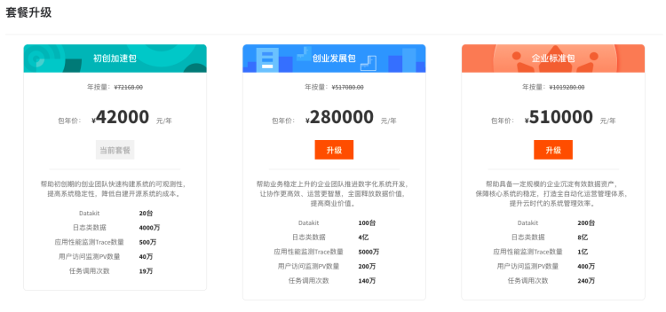
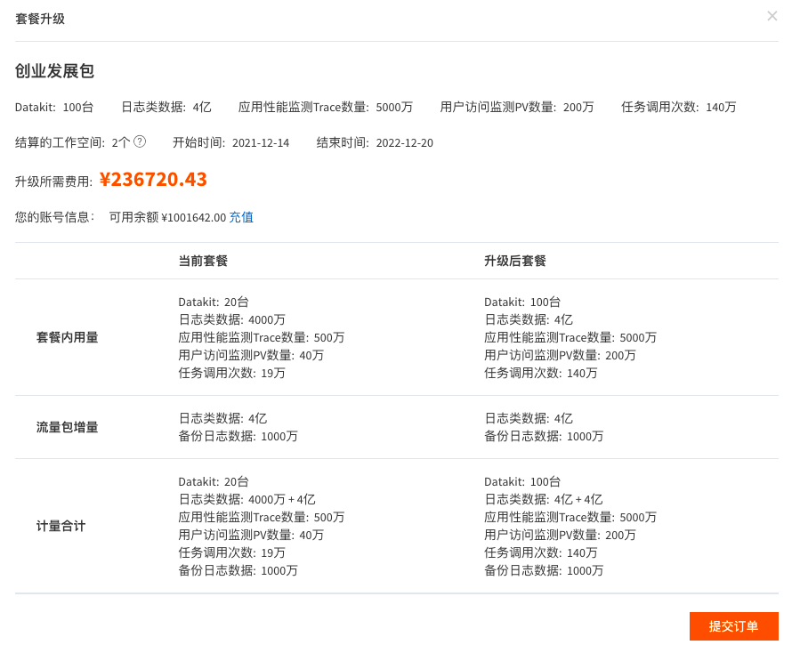

# 升级套餐
---

观测云提供初创加速包、创业发展包以及企业标准包三种包年套餐。若购买了初创加速包可升级套餐至创业发展包或者企业标准包。

1.在观测云费用中心，点击“套餐”，在套餐的操作下，点击“套餐升级”。  2.套餐升级页面，选择“创业发展包”，点击“升级”。  3.在套餐升级页面，确认升级后的套餐信息，点击“提交订单”。  4.套餐升级成功后，可在“套餐管理”查看升级后的套餐及内容。 

---

观测云是一款面向开发、运维、测试及业务团队的实时数据监测平台，能够统一满足云、云原生、应用及业务上的监测需求，快速实现系统可观测。**立即前往观测云，开启一站式可观测之旅：**[www.guance.com](https://www.guance.com) 
