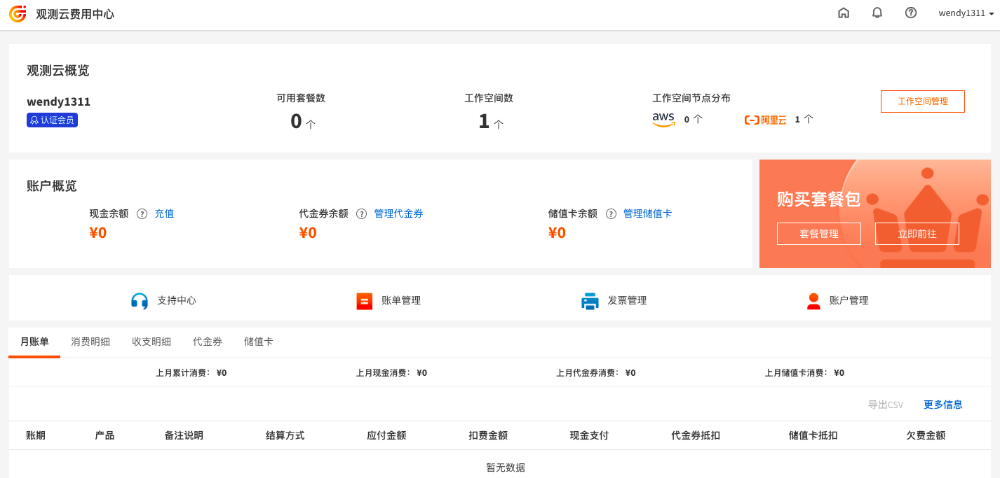
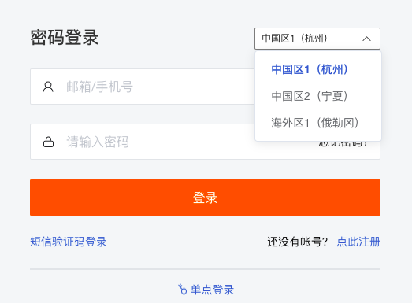
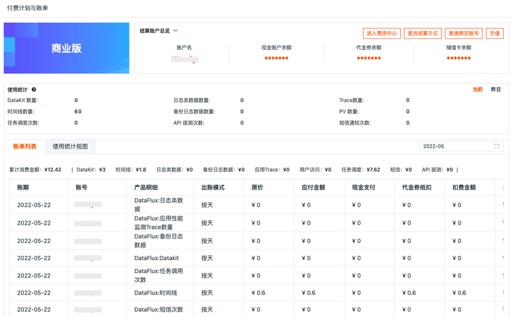

# 费用中心
---

在观测云费用中心可以对账户进行现金充值、管理代金券、管理储值卡、购买套餐包和流量包、更换结算方式等操作，同时通过费用中心还可管理账户、查看账单明细、账户余额、已购套餐、已绑工作空间等相关信息。 

## 名词解释

- 观测云企业账号：观测云企业账号是观测云费用中心专用于管理使用观测云产品产生的计费相关的独立账号，一个企业账号可以关联多个工作空间计费。
- 云账号：观测云费用中心支持亚马逊云账号、阿里云账号两种云账号。用户可以选择绑定的云账号来进行费用结算。
- 结算方式：观测云支持观测云企业账号、亚马逊云账号、阿里云账号 3 种结算方式。
- 工作空间：工作空间作为观测云SAAS产品的基本操作单元，用户可以通过创建/邀请的方式加入一个或多个工作空间。一个工作空间内，用户可以使用观测云提供的场景数据洞察、事件管理、指标管理、基础设施监测、日志监测、应用性能监测、用户访问监测、可用性监测、安全巡检、监控、工作空间管理等基本功能。
- 观测云站点：观测云支持在多个站点创建并使用工作空间，不同站点的成员账号和工作空间数据相互独立。
- 现金余额：通过线上充值或者线下汇款充值的剩余可用金额。
- 代金券余额：客户激活的有效期范围内的代金券，其累计剩余的可用余额。
- 储值卡余额：客户购买的有效期范围内的储值卡，其累计剩余的可用余额。
- 按量付费：按量付费也称后付费，结算时会根据用户当天工作空间内产生的实际数据数量收取费用。观测云按量付费以天维度生成账单。按量付费账单抵扣顺序为：普通代金券，满减代金券，储值卡，现金，储值卡余额（欠费负值）。
- 包年套餐：观测云基于 DataKit 数量、日志类数据数量、用户访问 PV 数量、应用性能 Trace 数量、任务调度次数等多个维度，提供固定优惠套餐，有效期为1年（372天）；用户可以依据自身产品使用需求购买套餐，观测云根据企业的不同发展阶段提供三种套餐包：初创加速包、创业发展包以及企业标准包。
- 流量包：除套餐外，观测云基于 DataKit 数量、日志类数据数量、备份日志数据数量、用户访问 PV 数量、应用性能 Trace 数量、API 拨测次数、任务调度次数、短信发送次数等多个维度，另外提供固定流量包购买方式，支持自定义选择单个或多个计费项。注意：流量包绑定套餐使用，不可单独购买。购买的流量包使用时长与已购买的套餐包的剩余使用时长一致。

## 主要功能

- 账户管理：观测云费用中心账户管理，包括账户资料变更、密码修改、实名认证以及云账号管理。
- 工作空间管理：观测云费用中心账户绑定的工作空间管理，一个账户可绑定多个观测云工作空间。在工作空间管理可修改观测云工作空间的结算方式，包括观测云企业账号、亚马逊云账号、阿里云账号 3 种结算方式。
- 账单管理：观测云费用中心账单管理，包括月账单、消费明细、收支明细、代金券明细和套餐明细管理。
- 支持中心：观测云的支持中心，用户可以在支持中心提交和管理工单，观测云技术专家团队收到工单后会及时联系用户解决问题。
- 发票管理：观测云费用中心发票管理，使用前需要先进行实名认证，认证完成后可以管理发票信息和寄送信息，支持为已生成的月账单索取发票。

## 登录方式

1. 打开[观测云](https://auth.guance.com/login/pwd)，选择登录站点，输入用户名和密码进行登录。

2. 在观测云工作空间「付费计划与账单」，点击右上角「进入费用中心」，即可进入观测云费用中心进行账户管理。或者你可以直接 [登录费用中心](https://boss.guance.com/) 。

注意：仅有工作空间拥有者才可通过观测云工作空间跳转免登录进入费用中心。 

---

