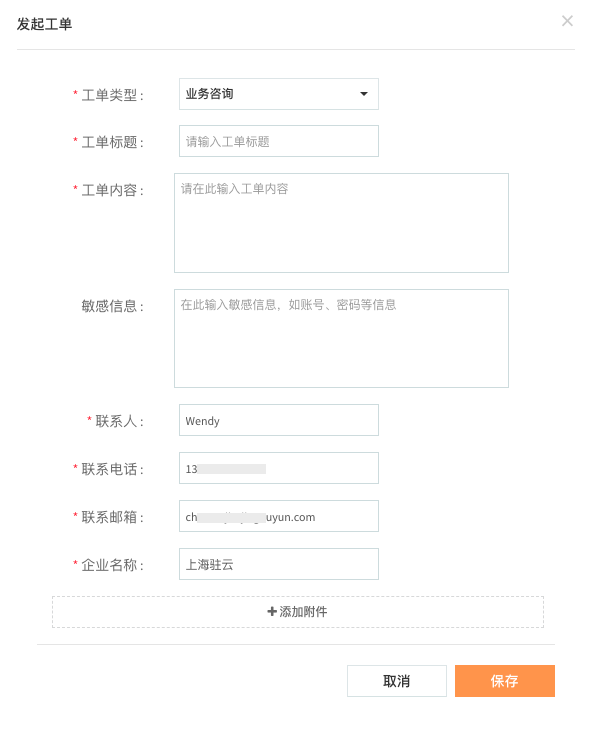
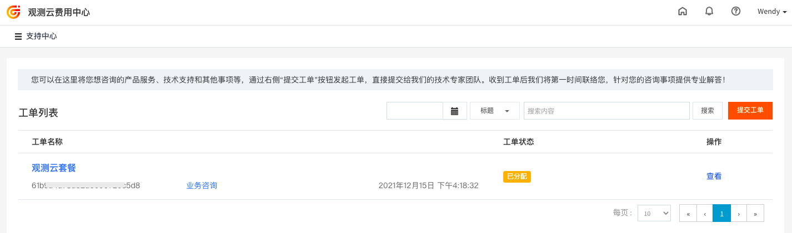
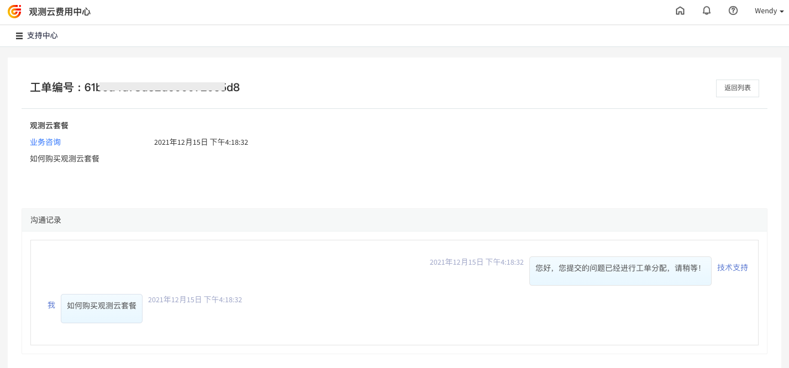

# 支持中心
---

用户可以在支持中心提交和管理工单，观测云技术专家团队收到工单后会及时联系用户解决问题。

## 工单提交

1.在观测云费用中心「支持中心」，点击“提交工单”。  2.在发起工单的页面，输入选择工单类型，并输入以下信息。  3.工单提交以后可在工单列表查看所有提交的工单。  4.点击工单右侧的“查看”，可查看技术支持专家对该工单回复的信息。 

## 工单管理

在支持中心的工单列表，可查看所有已经提交的工单，包括工单的状态、类型、时间，可通过选择日期和标题关键字筛选对应的工单。 

---

观测云是一款面向开发、运维、测试及业务团队的实时数据监测平台，能够统一满足云、云原生、应用及业务上的监测需求，快速实现系统可观测。**立即前往观测云，开启一站式可观测之旅：**[www.guance.com](https://www.guance.com) 
